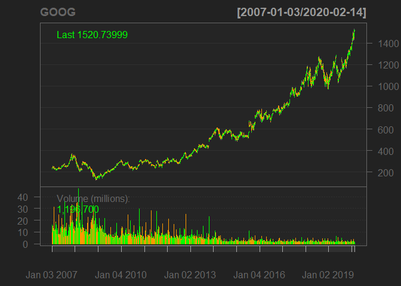
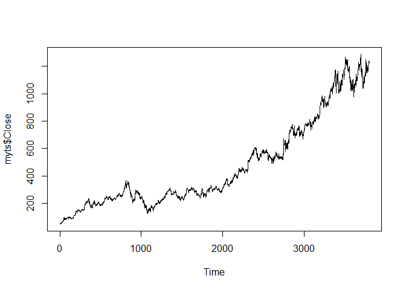
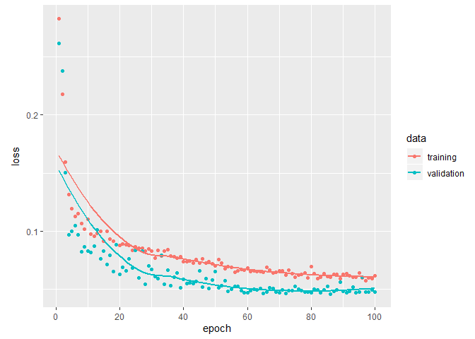

## Imports


```r
library(keras)
library(tensorflow)
library(tidyverse)
```

```
## Warning: package 'tidyverse' was built under R version 3.6.2
```

```
## -- Attaching packages ----------------------------------------------- tidyverse 1.3.0 --
```

```
## v ggplot2 3.2.1     v purrr   0.3.3
## v tibble  2.1.3     v dplyr   0.8.3
## v tidyr   1.0.0     v stringr 1.4.0
## v readr   1.3.1     v forcats 0.4.0
```

```
## -- Conflicts -------------------------------------------------- tidyverse_conflicts() --
## x dplyr::filter() masks stats::filter()
## x dplyr::lag()    masks stats::lag()
```

```r
library(quantmod)
```

```
## Warning: package 'quantmod' was built under R version 3.6.2
```

```
## Loading required package: xts
```

```
## Loading required package: zoo
```

```
## 
## Attaching package: 'zoo'
```

```
## The following objects are masked from 'package:base':
## 
##     as.Date, as.Date.numeric
```

```
## Registered S3 method overwritten by 'xts':
##   method     from
##   as.zoo.xts zoo
```

```
## 
## Attaching package: 'xts'
```

```
## The following objects are masked from 'package:dplyr':
## 
##     first, last
```

```
## Loading required package: TTR
```

```
## Registered S3 method overwritten by 'quantmod':
##   method            from
##   as.zoo.data.frame zoo
```

```
## Version 0.4-0 included new data defaults. See ?getSymbols.
```

```r
library(plotly)
```

```
## 
## Attaching package: 'plotly'
```

```
## The following object is masked from 'package:ggplot2':
## 
##     last_plot
```

```
## The following object is masked from 'package:stats':
## 
##     filter
```

```
## The following object is masked from 'package:graphics':
## 
##     layout
```

```r
library(Metrics)
```

```
## Warning: package 'Metrics' was built under R version 3.6.2
```

```r
getSymbols("GOOG")
```

```
## 'getSymbols' currently uses auto.assign=TRUE by default, but will
## use auto.assign=FALSE in 0.5-0. You will still be able to use
## 'loadSymbols' to automatically load data. getOption("getSymbols.env")
## and getOption("getSymbols.auto.assign") will still be checked for
## alternate defaults.
## 
## This message is shown once per session and may be disabled by setting 
## options("getSymbols.warning4.0"=FALSE). See ?getSymbols for details.
```

```
## [1] "GOOG"
```

```r
head(GOOG)
```

```
##            GOOG.Open GOOG.High GOOG.Low GOOG.Close GOOG.Volume GOOG.Adjusted
## 2007-01-03  232.1299  237.4400 229.6940   232.9220    15470700      232.9220
## 2007-01-04  233.6243  241.0714 233.3005   240.7277    15834200      240.7277
## 2007-01-05  240.3491  242.8398 238.1623   242.6853    13795600      242.6853
## 2007-01-08  242.9344  244.0204 240.1997   240.8871     9544400      240.8871
## 2007-01-09  241.8186  243.2134 239.7015   241.8435    10803000      241.8435
## 2007-01-10  241.3105  245.8535 240.1200   243.8161    11981700      243.8161
```

```r
data<-read.csv("GOOG.csv")
```

## Plots


<!-- --><!-- -->
## Standardisation of the data

```r
msd.open = c(mean(myts$Open), sd(myts$Open))
msd.low = c(mean(myts$Low), sd(myts$Low))
msd.close = c(mean(myts$Close), sd(myts$Close))
msd.high = c(mean(myts$High), sd(myts$High))
msd.vol = c(mean(myts$Volume), sd(myts$Volume))

myts$Close = (myts$Close - msd.close[1])/msd.close[2]
myts$Volume = (myts$Volume - msd.vol[1])/msd.vol[2]
myts$High = (myts$High-msd.high[1])/msd.high[2]
myts$Open=(myts$Open-msd.open[1])/msd.open[2]
myts$Low=(myts$Low-msd.low[1])/msd.low[2]
```
# Data preparation

```r
datalags = 10
train = myts[seq(2700 + datalags), ]
test = myts[2700 + datalags + seq(1100 + datalags), ]
batch.size = 50

x.train = array(data = lag(cbind(train$Close, train$Volume,train$High,train$Open,train$Low), datalags)[-(1:datalags), ], dim = c(nrow(train) - datalags,
                                                                                                                                 datalags, 5))
y.train = array(data = train$Close[-(1:datalags)], dim = c(nrow(train)-datalags, 1))


x.test = array(data = lag(cbind(test$Volume, test$Close, test$High,test$Open,test$Low),datalags)[-(1:datalags), ], dim = c(nrow(test) - datalags, datalags, 5))

y.test = array(data = test$Close[-(1:datalags)], dim = c(nrow(test) - datalags, 1))
```
#Model 

```r
model <- keras_model_sequential()

model %>%
  layer_lstm(units = 100,
             input_shape = c(datalags, 5),
             batch_size = batch.size,
             return_sequences = TRUE) %>%
  layer_dropout(rate = 0.5) %>%
  layer_lstm(units = 50,
             return_sequences = FALSE) %>%
  layer_dropout(rate = 0.5) %>%
  layer_dense(units = 1)
model %>%
  compile(loss = 'mae', optimizer = 'adam', validation_split="0.1")

model
```

```
## Model
## Model: "sequential"
## ________________________________________________________________________________
## Layer (type)                        Output Shape                    Param #     
## ================================================================================
## lstm (LSTM)                         (50, 10, 100)                   42400       
## ________________________________________________________________________________
## dropout (Dropout)                   (50, 10, 100)                   0           
## ________________________________________________________________________________
## lstm_1 (LSTM)                       (50, 50)                        30200       
## ________________________________________________________________________________
## dropout_1 (Dropout)                 (50, 50)                        0           
## ________________________________________________________________________________
## dense (Dense)                       (50, 1)                         51          
## ================================================================================
## Total params: 72,651
## Trainable params: 72,651
## Non-trainable params: 0
## ________________________________________________________________________________
```

```r
{
 history<- model %>% fit(x = x.train,
                y = y.train,
                batch_size = batch.size,
                repeats = 10,
                epochs = 100,
                verbose = 1,
                validation_split = 0.1,
                shuffle = FALSE)
}
```


```r
pred_out <- model %>% predict(x.test, batch_size = batch.size) %>% .[,1]

myts$index <- 1:nrow(myts) 

tsactual<-data[c(2701:3790),c(5)]

plot_ly(myts, x = ~index, y = ~Close, type = "scatter", mode = "markers", color = ~Volume) %>%
  add_trace(y = c(rep(NA, 2700), pred_out), x = myts$index, name = "LSTM prediction", mode = "lines")
```

```
## Warning: line.color doesn't (yet) support data arrays

## Warning: line.color doesn't (yet) support data arrays
```

<!--html_preserve--><div id="htmlwidget-0ee2b43992f5547730d5" style="width:672px;height:480px;" class="plotly html-widget"></div>
<script type="application/json" data-for="htmlwidget-0ee2b43992f5547730d5">{"x":{"visdat":{"7ca0fd7942":["function () ","plotlyVisDat"]},"cur_data":"7ca0fd7942","attrs":{"7ca0fd7942":{"x":{},"y":{},"mode":"markers","color":{},"alpha_stroke":1,"sizes":[10,100],"spans":[1,20],"type":"scatter"},"7ca0fd7942.1":{"x":[1,2,3,4,5,6,7,8,9,10,11,12,13,14,15,16,17,18,19,20,21,22,23,24,25,26,27,28,29,30,31,32,33,34,35,36,37,38,39,40,41,42,43,44,45,46,47,48,49,50,51,52,53,54,55,56,57,58,59,60,61,62,63,64,65,66,67,68,69,70,71,72,73,74,75,76,77,78,79,80,81,82,83,84,85,86,87,88,89,90,91,92,93,94,95,96,97,98,99,100,101,102,103,104,105,106,107,108,109,110,111,112,113,114,115,116,117,118,119,120,121,122,123,124,125,126,127,128,129,130,131,132,133,134,135,136,137,138,139,140,141,142,143,144,145,146,147,148,149,150,151,152,153,154,155,156,157,158,159,160,161,162,163,164,165,166,167,168,169,170,171,172,173,174,175,176,177,178,179,180,181,182,183,184,185,186,187,188,189,190,191,192,193,194,195,196,197,198,199,200,201,202,203,204,205,206,207,208,209,210,211,212,213,214,215,216,217,218,219,220,221,222,223,224,225,226,227,228,229,230,231,232,233,234,235,236,237,238,239,240,241,242,243,244,245,246,247,248,249,250,251,252,253,254,255,256,257,258,259,260,261,262,263,264,265,266,267,268,269,270,271,272,273,274,275,276,277,278,279,280,281,282,283,284,285,286,287,288,289,290,291,292,293,294,295,296,297,298,299,300,301,302,303,304,305,306,307,308,309,310,311,312,313,314,315,316,317,318,319,320,321,322,323,324,325,326,327,328,329,330,331,332,333,334,335,336,337,338,339,340,341,342,343,344,345,346,347,348,349,350,351,352,353,354,355,356,357,358,359,360,361,362,363,364,365,366,367,368,369,370,371,372,373,374,375,376,377,378,379,380,381,382,383,384,385,386,387,388,389,390,391,392,393,394,395,396,397,398,399,400,401,402,403,404,405,406,407,408,409,410,411,412,413,414,415,416,417,418,419,420,421,422,423,424,425,426,427,428,429,430,431,432,433,434,435,436,437,438,439,440,441,442,443,444,445,446,447,448,449,450,451,452,453,454,455,456,457,458,459,460,461,462,463,464,465,466,467,468,469,470,471,472,473,474,475,476,477,478,479,480,481,482,483,484,485,486,487,488,489,490,491,492,493,494,495,496,497,498,499,500,501,502,503,504,505,506,507,508,509,510,511,512,513,514,515,516,517,518,519,520,521,522,523,524,525,526,527,528,529,530,531,532,533,534,535,536,537,538,539,540,541,542,543,544,545,546,547,548,549,550,551,552,553,554,555,556,557,558,559,560,561,562,563,564,565,566,567,568,569,570,571,572,573,574,575,576,577,578,579,580,581,582,583,584,585,586,587,588,589,590,591,592,593,594,595,596,597,598,599,600,601,602,603,604,605,606,607,608,609,610,611,612,613,614,615,616,617,618,619,620,621,622,623,624,625,626,627,628,629,630,631,632,633,634,635,636,637,638,639,640,641,642,643,644,645,646,647,648,649,650,651,652,653,654,655,656,657,658,659,660,661,662,663,664,665,666,667,668,669,670,671,672,673,674,675,676,677,678,679,680,681,682,683,684,685,686,687,688,689,690,691,692,693,694,695,696,697,698,699,700,701,702,703,704,705,706,707,708,709,710,711,712,713,714,715,716,717,718,719,720,721,722,723,724,725,726,727,728,729,730,731,732,733,734,735,736,737,738,739,740,741,742,743,744,745,746,747,748,749,750,751,752,753,754,755,756,757,758,759,760,761,762,763,764,765,766,767,768,769,770,771,772,773,774,775,776,777,778,779,780,781,782,783,784,785,786,787,788,789,790,791,792,793,794,795,796,797,798,799,800,801,802,803,804,805,806,807,808,809,810,811,812,813,814,815,816,817,818,819,820,821,822,823,824,825,826,827,828,829,830,831,832,833,834,835,836,837,838,839,840,841,842,843,844,845,846,847,848,849,850,851,852,853,854,855,856,857,858,859,860,861,862,863,864,865,866,867,868,869,870,871,872,873,874,875,876,877,878,879,880,881,882,883,884,885,886,887,888,889,890,891,892,893,894,895,896,897,898,899,900,901,902,903,904,905,906,907,908,909,910,911,912,913,914,915,916,917,918,919,920,921,922,923,924,925,926,927,928,929,930,931,932,933,934,935,936,937,938,939,940,941,942,943,944,945,946,947,948,949,950,951,952,953,954,955,956,957,958,959,960,961,962,963,964,965,966,967,968,969,970,971,972,973,974,975,976,977,978,979,980,981,982,983,984,985,986,987,988,989,990,991,992,993,994,995,996,997,998,999,1000,1001,1002,1003,1004,1005,1006,1007,1008,1009,1010,1011,1012,1013,1014,1015,1016,1017,1018,1019,1020,1021,1022,1023,1024,1025,1026,1027,1028,1029,1030,1031,1032,1033,1034,1035,1036,1037,1038,1039,1040,1041,1042,1043,1044,1045,1046,1047,1048,1049,1050,1051,1052,1053,1054,1055,1056,1057,1058,1059,1060,1061,1062,1063,1064,1065,1066,1067,1068,1069,1070,1071,1072,1073,1074,1075,1076,1077,1078,1079,1080,1081,1082,1083,1084,1085,1086,1087,1088,1089,1090,1091,1092,1093,1094,1095,1096,1097,1098,1099,1100,1101,1102,1103,1104,1105,1106,1107,1108,1109,1110,1111,1112,1113,1114,1115,1116,1117,1118,1119,1120,1121,1122,1123,1124,1125,1126,1127,1128,1129,1130,1131,1132,1133,1134,1135,1136,1137,1138,1139,1140,1141,1142,1143,1144,1145,1146,1147,1148,1149,1150,1151,1152,1153,1154,1155,1156,1157,1158,1159,1160,1161,1162,1163,1164,1165,1166,1167,1168,1169,1170,1171,1172,1173,1174,1175,1176,1177,1178,1179,1180,1181,1182,1183,1184,1185,1186,1187,1188,1189,1190,1191,1192,1193,1194,1195,1196,1197,1198,1199,1200,1201,1202,1203,1204,1205,1206,1207,1208,1209,1210,1211,1212,1213,1214,1215,1216,1217,1218,1219,1220,1221,1222,1223,1224,1225,1226,1227,1228,1229,1230,1231,1232,1233,1234,1235,1236,1237,1238,1239,1240,1241,1242,1243,1244,1245,1246,1247,1248,1249,1250,1251,1252,1253,1254,1255,1256,1257,1258,1259,1260,1261,1262,1263,1264,1265,1266,1267,1268,1269,1270,1271,1272,1273,1274,1275,1276,1277,1278,1279,1280,1281,1282,1283,1284,1285,1286,1287,1288,1289,1290,1291,1292,1293,1294,1295,1296,1297,1298,1299,1300,1301,1302,1303,1304,1305,1306,1307,1308,1309,1310,1311,1312,1313,1314,1315,1316,1317,1318,1319,1320,1321,1322,1323,1324,1325,1326,1327,1328,1329,1330,1331,1332,1333,1334,1335,1336,1337,1338,1339,1340,1341,1342,1343,1344,1345,1346,1347,1348,1349,1350,1351,1352,1353,1354,1355,1356,1357,1358,1359,1360,1361,1362,1363,1364,1365,1366,1367,1368,1369,1370,1371,1372,1373,1374,1375,1376,1377,1378,1379,1380,1381,1382,1383,1384,1385,1386,1387,1388,1389,1390,1391,1392,1393,1394,1395,1396,1397,1398,1399,1400,1401,1402,1403,1404,1405,1406,1407,1408,1409,1410,1411,1412,1413,1414,1415,1416,1417,1418,1419,1420,1421,1422,1423,1424,1425,1426,1427,1428,1429,1430,1431,1432,1433,1434,1435,1436,1437,1438,1439,1440,1441,1442,1443,1444,1445,1446,1447,1448,1449,1450,1451,1452,1453,1454,1455,1456,1457,1458,1459,1460,1461,1462,1463,1464,1465,1466,1467,1468,1469,1470,1471,1472,1473,1474,1475,1476,1477,1478,1479,1480,1481,1482,1483,1484,1485,1486,1487,1488,1489,1490,1491,1492,1493,1494,1495,1496,1497,1498,1499,1500,1501,1502,1503,1504,1505,1506,1507,1508,1509,1510,1511,1512,1513,1514,1515,1516,1517,1518,1519,1520,1521,1522,1523,1524,1525,1526,1527,1528,1529,1530,1531,1532,1533,1534,1535,1536,1537,1538,1539,1540,1541,1542,1543,1544,1545,1546,1547,1548,1549,1550,1551,1552,1553,1554,1555,1556,1557,1558,1559,1560,1561,1562,1563,1564,1565,1566,1567,1568,1569,1570,1571,1572,1573,1574,1575,1576,1577,1578,1579,1580,1581,1582,1583,1584,1585,1586,1587,1588,1589,1590,1591,1592,1593,1594,1595,1596,1597,1598,1599,1600,1601,1602,1603,1604,1605,1606,1607,1608,1609,1610,1611,1612,1613,1614,1615,1616,1617,1618,1619,1620,1621,1622,1623,1624,1625,1626,1627,1628,1629,1630,1631,1632,1633,1634,1635,1636,1637,1638,1639,1640,1641,1642,1643,1644,1645,1646,1647,1648,1649,1650,1651,1652,1653,1654,1655,1656,1657,1658,1659,1660,1661,1662,1663,1664,1665,1666,1667,1668,1669,1670,1671,1672,1673,1674,1675,1676,1677,1678,1679,1680,1681,1682,1683,1684,1685,1686,1687,1688,1689,1690,1691,1692,1693,1694,1695,1696,1697,1698,1699,1700,1701,1702,1703,1704,1705,1706,1707,1708,1709,1710,1711,1712,1713,1714,1715,1716,1717,1718,1719,1720,1721,1722,1723,1724,1725,1726,1727,1728,1729,1730,1731,1732,1733,1734,1735,1736,1737,1738,1739,1740,1741,1742,1743,1744,1745,1746,1747,1748,1749,1750,1751,1752,1753,1754,1755,1756,1757,1758,1759,1760,1761,1762,1763,1764,1765,1766,1767,1768,1769,1770,1771,1772,1773,1774,1775,1776,1777,1778,1779,1780,1781,1782,1783,1784,1785,1786,1787,1788,1789,1790,1791,1792,1793,1794,1795,1796,1797,1798,1799,1800,1801,1802,1803,1804,1805,1806,1807,1808,1809,1810,1811,1812,1813,1814,1815,1816,1817,1818,1819,1820,1821,1822,1823,1824,1825,1826,1827,1828,1829,1830,1831,1832,1833,1834,1835,1836,1837,1838,1839,1840,1841,1842,1843,1844,1845,1846,1847,1848,1849,1850,1851,1852,1853,1854,1855,1856,1857,1858,1859,1860,1861,1862,1863,1864,1865,1866,1867,1868,1869,1870,1871,1872,1873,1874,1875,1876,1877,1878,1879,1880,1881,1882,1883,1884,1885,1886,1887,1888,1889,1890,1891,1892,1893,1894,1895,1896,1897,1898,1899,1900,1901,1902,1903,1904,1905,1906,1907,1908,1909,1910,1911,1912,1913,1914,1915,1916,1917,1918,1919,1920,1921,1922,1923,1924,1925,1926,1927,1928,1929,1930,1931,1932,1933,1934,1935,1936,1937,1938,1939,1940,1941,1942,1943,1944,1945,1946,1947,1948,1949,1950,1951,1952,1953,1954,1955,1956,1957,1958,1959,1960,1961,1962,1963,1964,1965,1966,1967,1968,1969,1970,1971,1972,1973,1974,1975,1976,1977,1978,1979,1980,1981,1982,1983,1984,1985,1986,1987,1988,1989,1990,1991,1992,1993,1994,1995,1996,1997,1998,1999,2000,2001,2002,2003,2004,2005,2006,2007,2008,2009,2010,2011,2012,2013,2014,2015,2016,2017,2018,2019,2020,2021,2022,2023,2024,2025,2026,2027,2028,2029,2030,2031,2032,2033,2034,2035,2036,2037,2038,2039,2040,2041,2042,2043,2044,2045,2046,2047,2048,2049,2050,2051,2052,2053,2054,2055,2056,2057,2058,2059,2060,2061,2062,2063,2064,2065,2066,2067,2068,2069,2070,2071,2072,2073,2074,2075,2076,2077,2078,2079,2080,2081,2082,2083,2084,2085,2086,2087,2088,2089,2090,2091,2092,2093,2094,2095,2096,2097,2098,2099,2100,2101,2102,2103,2104,2105,2106,2107,2108,2109,2110,2111,2112,2113,2114,2115,2116,2117,2118,2119,2120,2121,2122,2123,2124,2125,2126,2127,2128,2129,2130,2131,2132,2133,2134,2135,2136,2137,2138,2139,2140,2141,2142,2143,2144,2145,2146,2147,2148,2149,2150,2151,2152,2153,2154,2155,2156,2157,2158,2159,2160,2161,2162,2163,2164,2165,2166,2167,2168,2169,2170,2171,2172,2173,2174,2175,2176,2177,2178,2179,2180,2181,2182,2183,2184,2185,2186,2187,2188,2189,2190,2191,2192,2193,2194,2195,2196,2197,2198,2199,2200,2201,2202,2203,2204,2205,2206,2207,2208,2209,2210,2211,2212,2213,2214,2215,2216,2217,2218,2219,2220,2221,2222,2223,2224,2225,2226,2227,2228,2229,2230,2231,2232,2233,2234,2235,2236,2237,2238,2239,2240,2241,2242,2243,2244,2245,2246,2247,2248,2249,2250,2251,2252,2253,2254,2255,2256,2257,2258,2259,2260,2261,2262,2263,2264,2265,2266,2267,2268,2269,2270,2271,2272,2273,2274,2275,2276,2277,2278,2279,2280,2281,2282,2283,2284,2285,2286,2287,2288,2289,2290,2291,2292,2293,2294,2295,2296,2297,2298,2299,2300,2301,2302,2303,2304,2305,2306,2307,2308,2309,2310,2311,2312,2313,2314,2315,2316,2317,2318,2319,2320,2321,2322,2323,2324,2325,2326,2327,2328,2329,2330,2331,2332,2333,2334,2335,2336,2337,2338,2339,2340,2341,2342,2343,2344,2345,2346,2347,2348,2349,2350,2351,2352,2353,2354,2355,2356,2357,2358,2359,2360,2361,2362,2363,2364,2365,2366,2367,2368,2369,2370,2371,2372,2373,2374,2375,2376,2377,2378,2379,2380,2381,2382,2383,2384,2385,2386,2387,2388,2389,2390,2391,2392,2393,2394,2395,2396,2397,2398,2399,2400,2401,2402,2403,2404,2405,2406,2407,2408,2409,2410,2411,2412,2413,2414,2415,2416,2417,2418,2419,2420,2421,2422,2423,2424,2425,2426,2427,2428,2429,2430,2431,2432,2433,2434,2435,2436,2437,2438,2439,2440,2441,2442,2443,2444,2445,2446,2447,2448,2449,2450,2451,2452,2453,2454,2455,2456,2457,2458,2459,2460,2461,2462,2463,2464,2465,2466,2467,2468,2469,2470,2471,2472,2473,2474,2475,2476,2477,2478,2479,2480,2481,2482,2483,2484,2485,2486,2487,2488,2489,2490,2491,2492,2493,2494,2495,2496,2497,2498,2499,2500,2501,2502,2503,2504,2505,2506,2507,2508,2509,2510,2511,2512,2513,2514,2515,2516,2517,2518,2519,2520,2521,2522,2523,2524,2525,2526,2527,2528,2529,2530,2531,2532,2533,2534,2535,2536,2537,2538,2539,2540,2541,2542,2543,2544,2545,2546,2547,2548,2549,2550,2551,2552,2553,2554,2555,2556,2557,2558,2559,2560,2561,2562,2563,2564,2565,2566,2567,2568,2569,2570,2571,2572,2573,2574,2575,2576,2577,2578,2579,2580,2581,2582,2583,2584,2585,2586,2587,2588,2589,2590,2591,2592,2593,2594,2595,2596,2597,2598,2599,2600,2601,2602,2603,2604,2605,2606,2607,2608,2609,2610,2611,2612,2613,2614,2615,2616,2617,2618,2619,2620,2621,2622,2623,2624,2625,2626,2627,2628,2629,2630,2631,2632,2633,2634,2635,2636,2637,2638,2639,2640,2641,2642,2643,2644,2645,2646,2647,2648,2649,2650,2651,2652,2653,2654,2655,2656,2657,2658,2659,2660,2661,2662,2663,2664,2665,2666,2667,2668,2669,2670,2671,2672,2673,2674,2675,2676,2677,2678,2679,2680,2681,2682,2683,2684,2685,2686,2687,2688,2689,2690,2691,2692,2693,2694,2695,2696,2697,2698,2699,2700,2701,2702,2703,2704,2705,2706,2707,2708,2709,2710,2711,2712,2713,2714,2715,2716,2717,2718,2719,2720,2721,2722,2723,2724,2725,2726,2727,2728,2729,2730,2731,2732,2733,2734,2735,2736,2737,2738,2739,2740,2741,2742,2743,2744,2745,2746,2747,2748,2749,2750,2751,2752,2753,2754,2755,2756,2757,2758,2759,2760,2761,2762,2763,2764,2765,2766,2767,2768,2769,2770,2771,2772,2773,2774,2775,2776,2777,2778,2779,2780,2781,2782,2783,2784,2785,2786,2787,2788,2789,2790,2791,2792,2793,2794,2795,2796,2797,2798,2799,2800,2801,2802,2803,2804,2805,2806,2807,2808,2809,2810,2811,2812,2813,2814,2815,2816,2817,2818,2819,2820,2821,2822,2823,2824,2825,2826,2827,2828,2829,2830,2831,2832,2833,2834,2835,2836,2837,2838,2839,2840,2841,2842,2843,2844,2845,2846,2847,2848,2849,2850,2851,2852,2853,2854,2855,2856,2857,2858,2859,2860,2861,2862,2863,2864,2865,2866,2867,2868,2869,2870,2871,2872,2873,2874,2875,2876,2877,2878,2879,2880,2881,2882,2883,2884,2885,2886,2887,2888,2889,2890,2891,2892,2893,2894,2895,2896,2897,2898,2899,2900,2901,2902,2903,2904,2905,2906,2907,2908,2909,2910,2911,2912,2913,2914,2915,2916,2917,2918,2919,2920,2921,2922,2923,2924,2925,2926,2927,2928,2929,2930,2931,2932,2933,2934,2935,2936,2937,2938,2939,2940,2941,2942,2943,2944,2945,2946,2947,2948,2949,2950,2951,2952,2953,2954,2955,2956,2957,2958,2959,2960,2961,2962,2963,2964,2965,2966,2967,2968,2969,2970,2971,2972,2973,2974,2975,2976,2977,2978,2979,2980,2981,2982,2983,2984,2985,2986,2987,2988,2989,2990,2991,2992,2993,2994,2995,2996,2997,2998,2999,3000,3001,3002,3003,3004,3005,3006,3007,3008,3009,3010,3011,3012,3013,3014,3015,3016,3017,3018,3019,3020,3021,3022,3023,3024,3025,3026,3027,3028,3029,3030,3031,3032,3033,3034,3035,3036,3037,3038,3039,3040,3041,3042,3043,3044,3045,3046,3047,3048,3049,3050,3051,3052,3053,3054,3055,3056,3057,3058,3059,3060,3061,3062,3063,3064,3065,3066,3067,3068,3069,3070,3071,3072,3073,3074,3075,3076,3077,3078,3079,3080,3081,3082,3083,3084,3085,3086,3087,3088,3089,3090,3091,3092,3093,3094,3095,3096,3097,3098,3099,3100,3101,3102,3103,3104,3105,3106,3107,3108,3109,3110,3111,3112,3113,3114,3115,3116,3117,3118,3119,3120,3121,3122,3123,3124,3125,3126,3127,3128,3129,3130,3131,3132,3133,3134,3135,3136,3137,3138,3139,3140,3141,3142,3143,3144,3145,3146,3147,3148,3149,3150,3151,3152,3153,3154,3155,3156,3157,3158,3159,3160,3161,3162,3163,3164,3165,3166,3167,3168,3169,3170,3171,3172,3173,3174,3175,3176,3177,3178,3179,3180,3181,3182,3183,3184,3185,3186,3187,3188,3189,3190,3191,3192,3193,3194,3195,3196,3197,3198,3199,3200,3201,3202,3203,3204,3205,3206,3207,3208,3209,3210,3211,3212,3213,3214,3215,3216,3217,3218,3219,3220,3221,3222,3223,3224,3225,3226,3227,3228,3229,3230,3231,3232,3233,3234,3235,3236,3237,3238,3239,3240,3241,3242,3243,3244,3245,3246,3247,3248,3249,3250,3251,3252,3253,3254,3255,3256,3257,3258,3259,3260,3261,3262,3263,3264,3265,3266,3267,3268,3269,3270,3271,3272,3273,3274,3275,3276,3277,3278,3279,3280,3281,3282,3283,3284,3285,3286,3287,3288,3289,3290,3291,3292,3293,3294,3295,3296,3297,3298,3299,3300,3301,3302,3303,3304,3305,3306,3307,3308,3309,3310,3311,3312,3313,3314,3315,3316,3317,3318,3319,3320,3321,3322,3323,3324,3325,3326,3327,3328,3329,3330,3331,3332,3333,3334,3335,3336,3337,3338,3339,3340,3341,3342,3343,3344,3345,3346,3347,3348,3349,3350,3351,3352,3353,3354,3355,3356,3357,3358,3359,3360,3361,3362,3363,3364,3365,3366,3367,3368,3369,3370,3371,3372,3373,3374,3375,3376,3377,3378,3379,3380,3381,3382,3383,3384,3385,3386,3387,3388,3389,3390,3391,3392,3393,3394,3395,3396,3397,3398,3399,3400,3401,3402,3403,3404,3405,3406,3407,3408,3409,3410,3411,3412,3413,3414,3415,3416,3417,3418,3419,3420,3421,3422,3423,3424,3425,3426,3427,3428,3429,3430,3431,3432,3433,3434,3435,3436,3437,3438,3439,3440,3441,3442,3443,3444,3445,3446,3447,3448,3449,3450,3451,3452,3453,3454,3455,3456,3457,3458,3459,3460,3461,3462,3463,3464,3465,3466,3467,3468,3469,3470,3471,3472,3473,3474,3475,3476,3477,3478,3479,3480,3481,3482,3483,3484,3485,3486,3487,3488,3489,3490,3491,3492,3493,3494,3495,3496,3497,3498,3499,3500,3501,3502,3503,3504,3505,3506,3507,3508,3509,3510,3511,3512,3513,3514,3515,3516,3517,3518,3519,3520,3521,3522,3523,3524,3525,3526,3527,3528,3529,3530,3531,3532,3533,3534,3535,3536,3537,3538,3539,3540,3541,3542,3543,3544,3545,3546,3547,3548,3549,3550,3551,3552,3553,3554,3555,3556,3557,3558,3559,3560,3561,3562,3563,3564,3565,3566,3567,3568,3569,3570,3571,3572,3573,3574,3575,3576,3577,3578,3579,3580,3581,3582,3583,3584,3585,3586,3587,3588,3589,3590,3591,3592,3593,3594,3595,3596,3597,3598,3599,3600,3601,3602,3603,3604,3605,3606,3607,3608,3609,3610,3611,3612,3613,3614,3615,3616,3617,3618,3619,3620,3621,3622,3623,3624,3625,3626,3627,3628,3629,3630,3631,3632,3633,3634,3635,3636,3637,3638,3639,3640,3641,3642,3643,3644,3645,3646,3647,3648,3649,3650,3651,3652,3653,3654,3655,3656,3657,3658,3659,3660,3661,3662,3663,3664,3665,3666,3667,3668,3669,3670,3671,3672,3673,3674,3675,3676,3677,3678,3679,3680,3681,3682,3683,3684,3685,3686,3687,3688,3689,3690,3691,3692,3693,3694,3695,3696,3697,3698,3699,3700,3701,3702,3703,3704,3705,3706,3707,3708,3709,3710,3711,3712,3713,3714,3715,3716,3717,3718,3719,3720,3721,3722,3723,3724,3725,3726,3727,3728,3729,3730,3731,3732,3733,3734,3735,3736,3737,3738,3739,3740,3741,3742,3743,3744,3745,3746,3747,3748,3749,3750,3751,3752,3753,3754,3755,3756,3757,3758,3759,3760,3761,3762,3763,3764,3765,3766,3767,3768,3769,3770,3771,3772,3773,3774,3775,3776,3777,3778,3779,3780,3781,3782,3783,3784,3785,3786,3787,3788,3789,3790,3791,3792,3793,3794,3795,3796,3797,3798,3799,3800],"y":[null,null,null,null,null,null,null,null,null,null,null,null,null,null,null,null,null,null,null,null,null,null,null,null,null,null,null,null,null,null,null,null,null,null,null,null,null,null,null,null,null,null,null,null,null,null,null,null,null,null,null,null,null,null,null,null,null,null,null,null,null,null,null,null,null,null,null,null,null,null,null,null,null,null,null,null,null,null,null,null,null,null,null,null,null,null,null,null,null,null,null,null,null,null,null,null,null,null,null,null,null,null,null,null,null,null,null,null,null,null,null,null,null,null,null,null,null,null,null,null,null,null,null,null,null,null,null,null,null,null,null,null,null,null,null,null,null,null,null,null,null,null,null,null,null,null,null,null,null,null,null,null,null,null,null,null,null,null,null,null,null,null,null,null,null,null,null,null,null,null,null,null,null,null,null,null,null,null,null,null,null,null,null,null,null,null,null,null,null,null,null,null,null,null,null,null,null,null,null,null,null,null,null,null,null,null,null,null,null,null,null,null,null,null,null,null,null,null,null,null,null,null,null,null,null,null,null,null,null,null,null,null,null,null,null,null,null,null,null,null,null,null,null,null,null,null,null,null,null,null,null,null,null,null,null,null,null,null,null,null,null,null,null,null,null,null,null,null,null,null,null,null,null,null,null,null,null,null,null,null,null,null,null,null,null,null,null,null,null,null,null,null,null,null,null,null,null,null,null,null,null,null,null,null,null,null,null,null,null,null,null,null,null,null,null,null,null,null,null,null,null,null,null,null,null,null,null,null,null,null,null,null,null,null,null,null,null,null,null,null,null,null,null,null,null,null,null,null,null,null,null,null,null,null,null,null,null,null,null,null,null,null,null,null,null,null,null,null,null,null,null,null,null,null,null,null,null,null,null,null,null,null,null,null,null,null,null,null,null,null,null,null,null,null,null,null,null,null,null,null,null,null,null,null,null,null,null,null,null,null,null,null,null,null,null,null,null,null,null,null,null,null,null,null,null,null,null,null,null,null,null,null,null,null,null,null,null,null,null,null,null,null,null,null,null,null,null,null,null,null,null,null,null,null,null,null,null,null,null,null,null,null,null,null,null,null,null,null,null,null,null,null,null,null,null,null,null,null,null,null,null,null,null,null,null,null,null,null,null,null,null,null,null,null,null,null,null,null,null,null,null,null,null,null,null,null,null,null,null,null,null,null,null,null,null,null,null,null,null,null,null,null,null,null,null,null,null,null,null,null,null,null,null,null,null,null,null,null,null,null,null,null,null,null,null,null,null,null,null,null,null,null,null,null,null,null,null,null,null,null,null,null,null,null,null,null,null,null,null,null,null,null,null,null,null,null,null,null,null,null,null,null,null,null,null,null,null,null,null,null,null,null,null,null,null,null,null,null,null,null,null,null,null,null,null,null,null,null,null,null,null,null,null,null,null,null,null,null,null,null,null,null,null,null,null,null,null,null,null,null,null,null,null,null,null,null,null,null,null,null,null,null,null,null,null,null,null,null,null,null,null,null,null,null,null,null,null,null,null,null,null,null,null,null,null,null,null,null,null,null,null,null,null,null,null,null,null,null,null,null,null,null,null,null,null,null,null,null,null,null,null,null,null,null,null,null,null,null,null,null,null,null,null,null,null,null,null,null,null,null,null,null,null,null,null,null,null,null,null,null,null,null,null,null,null,null,null,null,null,null,null,null,null,null,null,null,null,null,null,null,null,null,null,null,null,null,null,null,null,null,null,null,null,null,null,null,null,null,null,null,null,null,null,null,null,null,null,null,null,null,null,null,null,null,null,null,null,null,null,null,null,null,null,null,null,null,null,null,null,null,null,null,null,null,null,null,null,null,null,null,null,null,null,null,null,null,null,null,null,null,null,null,null,null,null,null,null,null,null,null,null,null,null,null,null,null,null,null,null,null,null,null,null,null,null,null,null,null,null,null,null,null,null,null,null,null,null,null,null,null,null,null,null,null,null,null,null,null,null,null,null,null,null,null,null,null,null,null,null,null,null,null,null,null,null,null,null,null,null,null,null,null,null,null,null,null,null,null,null,null,null,null,null,null,null,null,null,null,null,null,null,null,null,null,null,null,null,null,null,null,null,null,null,null,null,null,null,null,null,null,null,null,null,null,null,null,null,null,null,null,null,null,null,null,null,null,null,null,null,null,null,null,null,null,null,null,null,null,null,null,null,null,null,null,null,null,null,null,null,null,null,null,null,null,null,null,null,null,null,null,null,null,null,null,null,null,null,null,null,null,null,null,null,null,null,null,null,null,null,null,null,null,null,null,null,null,null,null,null,null,null,null,null,null,null,null,null,null,null,null,null,null,null,null,null,null,null,null,null,null,null,null,null,null,null,null,null,null,null,null,null,null,null,null,null,null,null,null,null,null,null,null,null,null,null,null,null,null,null,null,null,null,null,null,null,null,null,null,null,null,null,null,null,null,null,null,null,null,null,null,null,null,null,null,null,null,null,null,null,null,null,null,null,null,null,null,null,null,null,null,null,null,null,null,null,null,null,null,null,null,null,null,null,null,null,null,null,null,null,null,null,null,null,null,null,null,null,null,null,null,null,null,null,null,null,null,null,null,null,null,null,null,null,null,null,null,null,null,null,null,null,null,null,null,null,null,null,null,null,null,null,null,null,null,null,null,null,null,null,null,null,null,null,null,null,null,null,null,null,null,null,null,null,null,null,null,null,null,null,null,null,null,null,null,null,null,null,null,null,null,null,null,null,null,null,null,null,null,null,null,null,null,null,null,null,null,null,null,null,null,null,null,null,null,null,null,null,null,null,null,null,null,null,null,null,null,null,null,null,null,null,null,null,null,null,null,null,null,null,null,null,null,null,null,null,null,null,null,null,null,null,null,null,null,null,null,null,null,null,null,null,null,null,null,null,null,null,null,null,null,null,null,null,null,null,null,null,null,null,null,null,null,null,null,null,null,null,null,null,null,null,null,null,null,null,null,null,null,null,null,null,null,null,null,null,null,null,null,null,null,null,null,null,null,null,null,null,null,null,null,null,null,null,null,null,null,null,null,null,null,null,null,null,null,null,null,null,null,null,null,null,null,null,null,null,null,null,null,null,null,null,null,null,null,null,null,null,null,null,null,null,null,null,null,null,null,null,null,null,null,null,null,null,null,null,null,null,null,null,null,null,null,null,null,null,null,null,null,null,null,null,null,null,null,null,null,null,null,null,null,null,null,null,null,null,null,null,null,null,null,null,null,null,null,null,null,null,null,null,null,null,null,null,null,null,null,null,null,null,null,null,null,null,null,null,null,null,null,null,null,null,null,null,null,null,null,null,null,null,null,null,null,null,null,null,null,null,null,null,null,null,null,null,null,null,null,null,null,null,null,null,null,null,null,null,null,null,null,null,null,null,null,null,null,null,null,null,null,null,null,null,null,null,null,null,null,null,null,null,null,null,null,null,null,null,null,null,null,null,null,null,null,null,null,null,null,null,null,null,null,null,null,null,null,null,null,null,null,null,null,null,null,null,null,null,null,null,null,null,null,null,null,null,null,null,null,null,null,null,null,null,null,null,null,null,null,null,null,null,null,null,null,null,null,null,null,null,null,null,null,null,null,null,null,null,null,null,null,null,null,null,null,null,null,null,null,null,null,null,null,null,null,null,null,null,null,null,null,null,null,null,null,null,null,null,null,null,null,null,null,null,null,null,null,null,null,null,null,null,null,null,null,null,null,null,null,null,null,null,null,null,null,null,null,null,null,null,null,null,null,null,null,null,null,null,null,null,null,null,null,null,null,null,null,null,null,null,null,null,null,null,null,null,null,null,null,null,null,null,null,null,null,null,null,null,null,null,null,null,null,null,null,null,null,null,null,null,null,null,null,null,null,null,null,null,null,null,null,null,null,null,null,null,null,null,null,null,null,null,null,null,null,null,null,null,null,null,null,null,null,null,null,null,null,null,null,null,null,null,null,null,null,null,null,null,null,null,null,null,null,null,null,null,null,null,null,null,null,null,null,null,null,null,null,null,null,null,null,null,null,null,null,null,null,null,null,null,null,null,null,null,null,null,null,null,null,null,null,null,null,null,null,null,null,null,null,null,null,null,null,null,null,null,null,null,null,null,null,null,null,null,null,null,null,null,null,null,null,null,null,null,null,null,null,null,null,null,null,null,null,null,null,null,null,null,null,null,null,null,null,null,null,null,null,null,null,null,null,null,null,null,null,null,null,null,null,null,null,null,null,null,null,null,null,null,null,null,null,null,null,null,null,null,null,null,null,null,null,null,null,null,null,null,null,null,null,null,null,null,null,null,null,null,null,null,null,null,null,null,null,null,null,null,null,null,null,null,null,null,null,null,null,null,null,null,null,null,null,null,null,null,null,null,null,null,null,null,null,null,null,null,null,null,null,null,null,null,null,null,null,null,null,null,null,null,null,null,null,null,null,null,null,null,null,null,null,null,null,null,null,null,null,null,null,null,null,null,null,null,null,null,null,null,null,null,null,null,null,null,null,null,null,null,null,null,null,null,null,null,null,null,null,null,null,null,null,null,null,null,null,null,null,null,null,null,null,null,null,null,null,null,null,null,null,null,null,null,null,null,null,null,null,null,null,null,null,null,null,null,null,null,null,null,null,null,null,null,null,null,null,null,null,null,null,null,null,null,null,null,null,null,null,null,null,null,null,null,null,null,null,null,null,null,null,null,null,null,null,null,null,null,null,null,null,null,null,null,null,null,null,null,null,null,null,null,null,null,null,null,null,null,null,null,null,null,null,null,null,null,null,null,null,null,null,null,null,null,null,null,null,null,null,null,null,null,null,null,null,null,null,null,null,null,null,null,null,null,null,null,null,null,null,null,null,null,null,null,null,null,null,null,null,null,null,null,null,null,null,null,null,null,null,null,null,null,null,null,null,null,null,null,null,null,null,null,null,null,null,null,null,null,null,null,null,null,null,null,null,null,null,null,null,null,null,null,null,null,null,null,null,null,null,null,null,null,null,null,null,null,null,null,null,null,null,null,null,null,null,null,null,null,null,null,null,null,null,null,null,null,null,null,null,null,null,null,null,null,null,null,null,null,null,null,null,null,null,null,null,null,null,null,null,null,null,null,null,null,null,null,null,null,null,null,null,null,null,null,null,null,null,null,null,null,null,null,null,null,null,null,null,null,null,null,null,null,null,null,null,null,null,null,null,null,null,null,null,null,null,null,null,null,null,null,null,null,null,null,null,null,null,null,null,null,null,null,null,null,null,null,null,null,null,null,null,null,null,null,null,null,null,null,null,null,null,null,null,null,null,null,null,null,null,null,null,null,null,null,null,null,null,null,null,null,null,null,null,null,null,null,null,null,null,null,null,null,null,null,null,null,null,null,null,null,null,null,null,null,null,null,null,null,null,null,null,null,null,null,null,null,null,null,null,null,null,null,null,null,null,null,null,null,null,null,null,null,null,null,null,null,null,null,null,null,null,null,null,null,null,null,null,null,null,null,null,null,null,null,null,null,null,null,null,null,null,null,null,null,null,null,null,null,null,null,null,null,null,null,null,null,null,null,null,null,null,null,null,null,null,null,null,null,null,null,null,null,null,null,null,null,null,null,null,null,null,null,null,null,null,null,null,null,null,null,null,null,null,null,null,null,null,null,null,null,null,null,null,null,null,null,null,null,null,null,null,null,null,null,null,null,null,null,null,null,null,null,null,null,null,null,null,null,null,null,null,null,null,null,null,null,null,null,null,null,null,null,null,null,null,null,null,null,null,null,null,null,null,null,null,null,null,null,null,null,null,null,null,null,null,null,null,null,null,null,null,null,null,null,null,null,null,null,null,null,null,null,null,null,null,null,null,null,null,null,null,null,null,null,null,null,null,null,null,null,null,null,null,null,null,null,null,null,null,null,null,null,null,null,null,null,null,null,null,null,null,null,null,null,null,null,null,null,null,null,null,null,null,null,null,null,null,null,null,null,null,null,null,null,null,null,null,null,null,null,null,null,null,null,null,null,null,null,null,null,null,null,null,null,null,null,null,null,null,null,null,null,null,null,null,null,null,null,null,null,null,null,null,null,null,null,null,null,null,null,null,null,null,null,null,null,null,null,null,null,null,null,null,null,null,null,null,null,null,null,null,null,null,null,null,null,null,null,null,null,null,null,null,null,null,null,null,0.270826280117035,0.285809576511383,0.273491621017456,0.270898520946503,0.270546019077301,0.291067957878113,0.282460153102875,0.276350915431976,0.259923756122589,0.244735717773438,0.261056542396545,0.280337035655975,0.264009237289429,0.246730148792267,0.250534951686859,0.251437544822693,0.265840351581573,0.2779860496521,0.29181319475174,0.286468625068665,0.287477016448975,0.285839259624481,0.274681687355042,0.236367285251617,0.236140310764313,0.230415344238281,0.231503665447235,0.225752413272858,0.22285783290863,0.221825838088989,0.232246696949005,0.248163163661957,0.272361934185028,0.317233681678772,0.360301971435547,0.364277124404907,0.500571191310883,0.642679989337921,0.670464694499969,0.682605922222137,0.655520975589752,0.60146552324295,0.566897213459015,0.584699332714081,0.578504621982574,0.579254567623138,0.586808741092682,0.577686965465546,0.585859835147858,0.607880175113678,0.616029441356659,0.605528891086578,0.609154284000397,0.671090424060822,0.674716770648956,0.669361531734467,0.659759342670441,0.659768879413605,0.672804415225983,0.671829640865326,0.652324736118317,0.567747294902802,0.365930438041687,0.482252180576324,0.503871262073517,0.589616119861603,0.5887411236763,0.57209438085556,0.486709296703339,0.506190121173859,0.528883516788483,0.489592373371124,0.523642480373383,0.547455132007599,0.539579808712006,0.556234419345856,0.567690551280975,0.58086746931076,0.601636350154877,0.616188824176788,0.577498495578766,0.591770708560944,0.563346207141876,0.565113484859467,0.546234905719757,0.561401903629303,0.492837846279144,0.478227078914642,0.503988087177277,0.510156333446503,0.517610728740692,0.593048989772797,0.618821680545807,0.624128997325897,0.60248464345932,0.615869224071503,0.622871935367584,0.636352837085724,0.654969155788422,0.667764008045197,0.681387722492218,0.681531846523285,0.664579808712006,0.646093308925629,0.634225308895111,0.789907515048981,0.802594363689423,0.809392392635345,0.806708753108978,0.815975368022919,0.824128687381744,0.815684497356415,0.832662522792816,0.848527133464813,0.867508709430695,0.861911833286285,0.855737149715424,0.84476226568222,0.867555677890778,0.8669713139534,0.850396692752838,0.829796612262726,0.854131042957306,0.862449109554291,0.880731880664825,0.906348526477814,0.92133754491806,0.904202878475189,0.899889171123505,0.898767292499542,0.904643714427948,0.915377795696259,0.94906085729599,0.930550873279572,0.925130546092987,0.938706815242767,0.928503811359406,0.913747489452362,0.910407483577728,0.889963567256927,0.877773225307465,0.913000285625458,0.905404388904572,0.923410952091217,0.900541841983795,0.894937694072723,0.906021535396576,0.907348334789276,0.893261730670929,0.916392743587494,0.954573452472687,0.957166731357574,0.941226899623871,0.885061323642731,0.89777547121048,0.870901882648468,0.858663618564606,0.850156009197235,0.817835509777069,0.842894017696381,0.832756221294403,0.790566623210907,0.76557582616806,0.790123403072357,0.745109736919403,0.794443905353546,0.847598254680634,0.834905564785004,0.813795506954193,0.804427087306976,0.8410764336586,0.86973375082016,0.894933760166168,0.937046349048615,0.875056803226471,0.809640109539032,0.754928052425385,0.693808257579803,0.719307720661163,0.756903827190399,0.720307290554047,0.751501977443695,0.765002429485321,0.782369673252106,0.799449265003204,0.776788651943207,0.805603206157684,0.787353217601776,0.754062354564667,0.77835339307785,0.805938065052032,0.79398900270462,0.801148593425751,0.828046262264252,0.822616040706635,0.818160474300385,0.78471714258194,0.762407124042511,0.779601395130157,0.810336649417877,0.84004408121109,0.857559025287628,0.855857670307159,0.856437861919403,0.882158100605011,0.884554922580719,0.878911197185516,0.880465924739838,0.885042250156403,0.868568480014801,0.87218052148819,0.874406516551971,0.913110911846161,0.900438964366913,0.886026799678802,0.898116409778595,0.876192986965179,0.875076711177826,0.888361155986786,0.884165227413177,0.883054435253143,0.87403267621994,0.905397951602936,0.914107739925385,0.921958148479462,0.933209121227264,0.935679018497467,0.918775022029877,0.922820746898651,0.81883829832077,0.833490788936615,0.829879105091095,0.791913449764252,0.792622148990631,0.767758667469025,0.774763166904449,0.773741900920868,0.765414416790009,0.781727373600006,0.789980709552765,0.818180501461029,0.831443607807159,0.835528075695038,0.820399820804596,0.814666569232941,0.808312356472015,0.819294512271881,0.797958433628082,0.789119184017181,0.79740709066391,0.801738321781158,0.813063681125641,0.841887176036835,0.844411790370941,0.854614317417145,0.872901856899261,0.866929590702057,0.856963813304901,0.847587764263153,0.838161647319794,0.832700192928314,0.845706403255463,0.841299951076508,0.832721769809723,0.830478608608246,0.825559318065643,0.832003176212311,0.814789354801178,0.787817060947418,0.782435238361359,0.776596248149872,0.775138080120087,0.772211372852325,0.718286216259003,0.702563583850861,0.726837575435638,0.744507133960724,0.749733507633209,0.768721401691437,0.767731249332428,0.763761460781097,0.767983376979828,0.784856855869293,0.806399881839752,0.831590235233307,0.832861483097076,0.831649482250214,0.841746866703033,0.846008241176605,0.860712587833405,0.878827631473541,0.876855432987213,0.882134616374969,0.879399240016937,0.875914871692657,0.882688224315643,0.898527920246124,0.959013402462006,0.948447406291962,0.955596029758453,0.947966516017914,0.952483594417572,0.967614591121674,0.972701251506805,0.979768216609955,0.976495802402496,0.981463372707367,0.970270216464996,0.976231753826141,0.965140998363495,0.961777746677399,0.965215146541595,0.95690506696701,0.952466189861298,0.956406652927399,0.948935806751251,0.939342319965363,0.948375880718231,0.944580256938934,0.948413670063019,0.943917810916901,0.941695630550385,0.951835215091705,0.962681114673615,0.966857969760895,0.966361701488495,0.947664082050323,0.92435759305954,0.932348310947418,0.929430186748505,0.938216030597687,0.951931297779083,0.94852203130722,0.947527825832367,0.954241335391998,0.979075014591217,0.988099157810211,0.972442090511322,0.966517865657806,0.966338694095612,0.972092688083649,0.968453466892242,0.957162201404572,0.96233993768692,0.971562445163727,0.966450989246368,0.960182726383209,0.971633732318878,0.985884845256805,0.978529989719391,0.969176828861237,0.967856109142303,0.971861898899078,1.00125026702881,1.02022266387939,1.02126598358154,1.00760579109192,1.03653454780579,1.04422926902771,1.02449655532837,1.0183424949646,1.02268552780151,1.00365447998047,0.983240306377411,0.961426317691803,0.943765342235565,0.923098027706146,0.96779066324234,0.985054790973663,0.978522837162018,0.954392611980438,0.924412786960602,0.895468056201935,0.914513051509857,0.92043799161911,0.945081412792206,0.947287976741791,0.936940610408783,0.956717431545258,0.935984790325165,0.926390826702118,0.944597780704498,0.958099782466888,0.944803535938263,0.910495698451996,0.898192584514618,0.923049747943878,0.937874853610992,0.935211837291718,0.956727206707001,0.982026040554047,0.99312287569046,1.01440334320068,1.0150306224823,1.01303911209106,1.01505994796753,0.995570838451385,1.00406837463379,0.999686658382416,0.9939826130867,0.986684739589691,0.991843044757843,0.992187798023224,0.971508324146271,0.971621811389923,0.976912319660187,0.986118257045746,0.990872323513031,1.01398205757141,1.0292649269104,1.02929663658142,1.02404713630676,1.02600646018982,1.03228402137756,1.02682065963745,1.02551674842834,1.02294850349426,1.03022885322571,1.04208183288574,1.06446170806885,1.08234453201294,1.09276127815247,1.08575201034546,1.03990697860718,1.01260852813721,1.01452660560608,1.00886058807373,1.02404165267944,1.01243782043457,1.02663826942444,1.0298912525177,1.03048491477966,1.04083132743835,1.05290102958679,1.05494689941406,1.0596022605896,1.06154108047485,1.07074332237244,1.08085322380066,1.07804417610168,1.07828497886658,1.07503771781921,1.07086586952209,1.07356190681458,1.08393096923828,1.08258676528931,1.07462811470032,1.07020473480225,1.07620429992676,1.0873076915741,1.09618926048279,1.11087441444397,1.11332631111145,1.10570335388184,1.11499953269958,1.11839723587036,1.12830781936646,1.12016558647156,1.11107897758484,1.08399653434753,1.05800127983093,1.05530786514282,1.04160690307617,1.0607283115387,1.0765597820282,1.08270144462585,1.08019065856934,1.0898814201355,1.08243989944458,1.09434485435486,1.08263444900513,1.06815719604492,1.06871891021729,1.06258249282837,1.06174182891846,1.06443309783936,1.07413053512573,1.08749198913574,1.09750628471375,1.10332798957825,1.10828042030334,1.13580918312073,1.16586494445801,1.17335057258606,1.17947363853455,1.26510620117188,1.26036357879639,1.27335286140442,1.28756999969482,1.309903383255,1.31622576713562,1.31129264831543,1.32343006134033,1.3073308467865,1.29757046699524,1.30984735488892,1.3179817199707,1.33225345611572,1.3126323223114,1.30160927772522,1.32014489173889,1.32824373245239,1.35372090339661,1.36336135864258,1.39884924888611,1.40993070602417,1.41965627670288,1.42090177536011,1.40413522720337,1.42027831077576,1.43386912345886,1.44455194473267,1.43741869926453,1.44176745414734,1.40062928199768,1.32570695877075,1.3731062412262,1.37109923362732,1.33014488220215,1.33771800994873,1.37314462661743,1.37015748023987,1.37313985824585,1.37351846694946,1.38963437080383,1.39362192153931,1.33368873596191,1.31962633132935,1.29516983032227,1.28502035140991,1.25246739387512,1.25544762611389,1.25309801101685,1.27425169944763,1.29604029655457,1.30284833908081,1.33924007415771,1.3543336391449,1.36387300491333,1.37085127830505,1.37993478775024,1.40608477592468,1.41537380218506,1.40817523002625,1.43851065635681,1.35832571983337,1.36761713027954,1.33823919296265,1.32784342765808,1.32968068122864,1.31630969047546,1.30633068084717,1.30218005180359,1.29974269866943,1.30456280708313,1.30444097518921,1.28814363479614,1.27225804328918,1.26278209686279,1.28740787506104,1.28788042068481,1.29906058311462,1.28271722793579,1.26385402679443,1.25299978256226,1.27923178672791,1.2934844493866,1.29498529434204,1.28334021568298,1.27172684669495,1.26658606529236,1.29696369171143,1.32819032669067,1.32768368721008,1.31042623519897,1.30463171005249,1.31267547607422,1.30961537361145,1.31535005569458,1.30870318412781,1.3152232170105,1.30738615989685,1.2969069480896,1.27814197540283,1.27640438079834,1.30698990821838,1.31302976608276,1.30553221702576,1.29081869125366,1.30169558525085,1.33425235748291,1.34404492378235,1.37766861915588,1.37466096878052,1.36445045471191,1.36702799797058,1.39002680778503,1.41152215003967,1.4257173538208,1.41632318496704,1.44241547584534,1.45463991165161,1.46118402481079,1.45074081420898,1.46295976638794,1.45828342437744,1.44521760940552,1.45214366912842,1.43429231643677,1.40448331832886,1.40692353248596,1.44038152694702,1.54182457923889,1.53386545181274,1.52181172370911,1.53614854812622,1.52605891227722,1.53777027130127,1.54512596130371,1.5464015007019,1.55814027786255,1.55005693435669,1.52816033363342,1.53023219108582,1.52383089065552,1.51550102233887,1.54318046569824,1.54766941070557,1.51882243156433,1.5430223941803,1.54611110687256,1.54418635368347,1.59093976020813,1.60608887672424,1.5784809589386,1.54341530799866,1.52363348007202,1.50668859481812,1.5003559589386,1.50743103027344,1.54651618003845,1.56953287124634,1.56765747070312,1.5778284072876,1.58255577087402,1.60473132133484,1.66001963615417,1.65408682823181,1.6479012966156,1.63732266426086,1.61910820007324,1.59994626045227,1.59042501449585,1.60559463500977,1.5806131362915,1.57642364501953,1.60921692848206,1.65582251548767,1.66207265853882,1.69402718544006,1.69019556045532,1.68247485160828,1.68179559707642,1.68414926528931,1.74386119842529,1.76237559318542,1.72890424728394,1.73036193847656,1.78187155723572,1.78362631797791,1.77571034431458,1.78951287269592,1.79440093040466,1.84539484977722,1.78969812393188,1.80036401748657,1.79788970947266,1.87431263923645,1.8402373790741,1.71786522865295,1.64071917533875,1.66642880439758,1.5747652053833,1.55680108070374,1.62120485305786,1.59697270393372,1.62652206420898,1.6874303817749,1.70925331115723,1.70456600189209,1.73720502853394,1.72095394134521,1.72037982940674,1.76600384712219,1.78128981590271,1.7604832649231,1.72931957244873,1.66149425506592,1.66252517700195,1.70712375640869,1.69392800331116,1.73135566711426,1.82467794418335,1.85513806343079,1.8241856098175,1.75900864601135,1.76850461959839,1.87737798690796,1.7826406955719,1.72080373764038,1.71818947792053,1.6716890335083,1.59405565261841,1.60151553153992,1.58450436592102,1.50208044052124,1.55514430999756,1.53382849693298,1.52226948738098,1.52164578437805,1.56204676628113,1.52857112884521,1.54398393630981,1.55814456939697,1.54341459274292,1.55373978614807,1.56244969367981,1.56405735015869,1.65639281272888,1.65180826187134,1.68124747276306,1.68654942512512,1.68278026580811,1.58757638931274,1.55836129188538,1.57876801490784,1.58076143264771,1.55190753936768,1.53972005844116,1.55895757675171,1.53843998908997,1.57084918022156,1.61136674880981,1.60686206817627,1.66827487945557,1.69381713867188,1.68971562385559,1.71737718582153,1.67950701713562,1.65580487251282,1.65066647529602,1.64061450958252,1.64721274375916,1.64824771881104,1.63412046432495,1.62650847434998,1.63856720924377,1.64837455749512,1.62298893928528,1.71468949317932,1.77127432823181,1.7852885723114,1.78349995613098,1.78156065940857,1.75562739372253,1.72670936584473,1.71835899353027,1.71350049972534,1.76969456672668,1.76224255561829,1.82936525344849,1.77631211280823,1.80013585090637,1.81527614593506,1.76935529708862,1.7676317691803,1.80467891693115,1.7558422088623,1.7253794670105,1.69515895843506,1.73067235946655,1.70714688301086,1.68196487426758,1.7066216468811,1.71611261367798,1.72525954246521,1.71878933906555,1.74535584449768,1.77120399475098,1.77770018577576,1.75929951667786,1.81640076637268,1.79994416236877,1.78523707389832,1.78111982345581,1.92294549942017,2.04895401000977,1.89798450469971,1.93275427818298,1.89762592315674,1.86089777946472,1.83522534370422,1.82719588279724,1.82082653045654,1.76811003684998,1.76691150665283,1.81776595115662,1.8003888130188,1.7261803150177,1.76710939407349,1.75254917144775,1.79917740821838,1.85810947418213,1.79965901374817,1.8007595539093,1.74165844917297,1.7821261882782,1.74363732337952,1.75717043876648,1.75062155723572,1.7745463848114,1.79394912719727,1.79119944572449,1.79607510566711,1.85734534263611,1.85014176368713,1.86231923103333,1.83717703819275,1.78187322616577,1.75792908668518,1.7659592628479,1.77613806724548,1.79043340682983,1.74376440048218,1.77504587173462,1.76288175582886,1.7631299495697,1.77596640586853,2.01209688186646,1.76869893074036,1.74812269210815,1.80138993263245,1.78353500366211,1.7958984375,1.79720163345337,1.83107709884644,1.78613424301147,1.87382864952087,1.76048111915588,1.81498789787292,1.75762343406677,1.77602601051331,1.72011780738831,1.74978375434875,1.70762085914612,1.75677061080933,1.73999953269958,1.74539685249329,1.69291710853577,1.71592426300049,1.70717883110046,1.68601202964783,1.72323942184448,1.67229342460632,1.63079571723938,1.55143451690674,1.68372774124146,1.65748119354248,1.65774273872375,1.60998368263245,1.59385299682617,1.69390606880188,1.68229055404663,1.63840413093567,1.60113573074341,1.58744144439697,1.59495449066162,1.61985206604004,1.63097214698792,1.58820772171021,1.53001546859741,1.58127593994141,1.52952933311462,1.59794855117798,1.60309720039368,1.66067790985107,1.67809224128723,1.7297420501709,1.76539516448975,1.69603681564331,1.63166475296021,1.62233519554138,1.58081364631653,1.60653805732727,1.65054750442505,1.63586378097534,1.60931253433228,1.57152938842773,1.57614612579346,1.57996654510498,1.53658056259155,1.48112225532532,1.44179272651672,1.52370762825012,1.55424952507019,1.58931231498718,1.58348774909973,1.56196761131287,1.57219004631042,1.61710262298584,1.65965294837952,1.66997241973877,1.65190410614014,1.64104342460632,1.62458610534668,1.58473634719849,1.63311576843262,1.6720244884491,1.66689491271973,1.73277068138123,1.67422246932983,1.63571691513062,1.65093421936035,1.66780972480774,1.65196061134338,1.62321090698242,1.65830254554749,1.72531819343567,1.73199224472046,1.80424427986145,1.86931920051575,1.79827380180359,1.7344536781311,1.67110633850098,1.68120050430298,1.74123907089233,1.71625232696533,1.70115756988525,1.74470663070679,1.70251870155334,1.70769333839417,1.71350789070129,1.68780779838562,1.72801542282104,1.72514510154724,1.69041013717651,1.74200892448425,1.7547607421875,1.76987624168396,1.77914571762085,1.75180625915527,1.74845886230469,1.73784017562866,1.80429768562317,1.85854887962341,1.80430746078491,1.77412748336792,1.90738940238953,1.78360080718994,1.81131911277771,1.89616513252258,1.78213262557983,1.84324312210083,1.81096243858337,1.85115361213684,1.79126071929932,1.74690961837769,1.77558207511902,1.78143072128296,1.73556590080261,1.75983166694641,1.75110626220703,1.74646019935608,1.74053907394409,1.74169659614563,1.72377514839172,1.72220516204834,1.74898147583008,1.78036952018738,1.73760747909546,1.78334164619446,1.79723048210144,1.72558164596558,1.78866076469421,1.74386382102966,1.75569868087769,1.77098441123962,1.94157218933105,2.07869815826416,1.90996146202087,1.83441805839539,1.84805154800415,1.80655932426453,1.80632472038269,1.77908802032471,1.75921416282654,1.77150106430054,1.79415082931519,1.7829954624176,1.82610416412354,1.80106091499329,1.76738452911377,1.75717067718506,1.74613976478577,1.72656083106995,1.74248957633972,1.73803973197937,1.75648331642151,1.74835729598999,1.69880342483521,1.71840953826904,1.62416315078735,1.62148809432983,1.60813903808594,1.59320855140686,1.63405084609985,1.67023539543152,1.68744683265686,1.64378595352173,1.6621208190918,1.66569852828979,1.66186285018921,1.7178475856781,1.70546960830688,1.71878457069397,1.76309871673584,1.73225283622742,1.71470952033997,1.69145607948303,1.65084028244019,1.67533278465271,1.70726919174194,1.68583559989929,1.6872410774231,1.72977709770203,1.72450995445251,1.7257354259491,1.73954272270203,1.74774789810181,1.71684885025024,1.72249054908752,1.75581455230713,1.75059151649475,1.75253582000732,1.78399157524109,1.74472165107727,1.73589611053467,1.76988625526428,1.8098452091217,2.16953182220459,1.90909361839294,1.8139214515686,1.84563565254211,1.84149217605591,1.82739281654358,1.8789689540863,1.81430053710938,1.78518605232239,1.80469083786011,1.76339888572693,1.75075531005859,1.78423857688904,1.80568647384644,1.76697611808777,1.78290486335754,1.78198575973511,1.74526739120483,1.72546315193176,1.74870347976685,1.81737494468689,1.76328015327454,1.75730848312378,1.72429633140564,1.76325964927673,1.76984238624573,1.79789686203003,1.75754308700562,1.80268836021423,1.76595664024353,1.81193065643311,1.78626585006714,1.79397249221802,1.84744715690613,1.79356384277344,1.76216650009155,1.74966907501221,1.77336001396179,1.7527973651886,1.91427397727966,1.76338601112366,null,null,null,null,null,null,null,null,null,null],"mode":"lines","color":{},"alpha_stroke":1,"sizes":[10,100],"spans":[1,20],"type":"scatter","name":"LSTM prediction","inherit":true}},"layout":{"margin":{"b":40,"l":60,"t":25,"r":10},"xaxis":{"domain":[0,1],"automargin":true,"title":"index"},"yaxis":{"domain":[0,1],"automargin":true,"title":"Close"},"hovermode":"closest","showlegend":true,"legend":{"yanchor":"top","y":0.5}},"source":"A","config":{"showSendToCloud":false},"data":[{"x":[1,2,3,4,5,6,7,8,9,10,11,12,13,14,15,16,17,18,19,20,21,22,23,24,25,26,27,28,29,30,31,32,33,34,35,36,37,38,39,40,41,42,43,44,45,46,47,48,49,50,51,52,53,54,55,56,57,58,59,60,61,62,63,64,65,66,67,68,69,70,71,72,73,74,75,76,77,78,79,80,81,82,83,84,85,86,87,88,89,90,91,92,93,94,95,96,97,98,99,100,101,102,103,104,105,106,107,108,109,110,111,112,113,114,115,116,117,118,119,120,121,122,123,124,125,126,127,128,129,130,131,132,133,134,135,136,137,138,139,140,141,142,143,144,145,146,147,148,149,150,151,152,153,154,155,156,157,158,159,160,161,162,163,164,165,166,167,168,169,170,171,172,173,174,175,176,177,178,179,180,181,182,183,184,185,186,187,188,189,190,191,192,193,194,195,196,197,198,199,200,201,202,203,204,205,206,207,208,209,210,211,212,213,214,215,216,217,218,219,220,221,222,223,224,225,226,227,228,229,230,231,232,233,234,235,236,237,238,239,240,241,242,243,244,245,246,247,248,249,250,251,252,253,254,255,256,257,258,259,260,261,262,263,264,265,266,267,268,269,270,271,272,273,274,275,276,277,278,279,280,281,282,283,284,285,286,287,288,289,290,291,292,293,294,295,296,297,298,299,300,301,302,303,304,305,306,307,308,309,310,311,312,313,314,315,316,317,318,319,320,321,322,323,324,325,326,327,328,329,330,331,332,333,334,335,336,337,338,339,340,341,342,343,344,345,346,347,348,349,350,351,352,353,354,355,356,357,358,359,360,361,362,363,364,365,366,367,368,369,370,371,372,373,374,375,376,377,378,379,380,381,382,383,384,385,386,387,388,389,390,391,392,393,394,395,396,397,398,399,400,401,402,403,404,405,406,407,408,409,410,411,412,413,414,415,416,417,418,419,420,421,422,423,424,425,426,427,428,429,430,431,432,433,434,435,436,437,438,439,440,441,442,443,444,445,446,447,448,449,450,451,452,453,454,455,456,457,458,459,460,461,462,463,464,465,466,467,468,469,470,471,472,473,474,475,476,477,478,479,480,481,482,483,484,485,486,487,488,489,490,491,492,493,494,495,496,497,498,499,500,501,502,503,504,505,506,507,508,509,510,511,512,513,514,515,516,517,518,519,520,521,522,523,524,525,526,527,528,529,530,531,532,533,534,535,536,537,538,539,540,541,542,543,544,545,546,547,548,549,550,551,552,553,554,555,556,557,558,559,560,561,562,563,564,565,566,567,568,569,570,571,572,573,574,575,576,577,578,579,580,581,582,583,584,585,586,587,588,589,590,591,592,593,594,595,596,597,598,599,600,601,602,603,604,605,606,607,608,609,610,611,612,613,614,615,616,617,618,619,620,621,622,623,624,625,626,627,628,629,630,631,632,633,634,635,636,637,638,639,640,641,642,643,644,645,646,647,648,649,650,651,652,653,654,655,656,657,658,659,660,661,662,663,664,665,666,667,668,669,670,671,672,673,674,675,676,677,678,679,680,681,682,683,684,685,686,687,688,689,690,691,692,693,694,695,696,697,698,699,700,701,702,703,704,705,706,707,708,709,710,711,712,713,714,715,716,717,718,719,720,721,722,723,724,725,726,727,728,729,730,731,732,733,734,735,736,737,738,739,740,741,742,743,744,745,746,747,748,749,750,751,752,753,754,755,756,757,758,759,760,761,762,763,764,765,766,767,768,769,770,771,772,773,774,775,776,777,778,779,780,781,782,783,784,785,786,787,788,789,790,791,792,793,794,795,796,797,798,799,800,801,802,803,804,805,806,807,808,809,810,811,812,813,814,815,816,817,818,819,820,821,822,823,824,825,826,827,828,829,830,831,832,833,834,835,836,837,838,839,840,841,842,843,844,845,846,847,848,849,850,851,852,853,854,855,856,857,858,859,860,861,862,863,864,865,866,867,868,869,870,871,872,873,874,875,876,877,878,879,880,881,882,883,884,885,886,887,888,889,890,891,892,893,894,895,896,897,898,899,900,901,902,903,904,905,906,907,908,909,910,911,912,913,914,915,916,917,918,919,920,921,922,923,924,925,926,927,928,929,930,931,932,933,934,935,936,937,938,939,940,941,942,943,944,945,946,947,948,949,950,951,952,953,954,955,956,957,958,959,960,961,962,963,964,965,966,967,968,969,970,971,972,973,974,975,976,977,978,979,980,981,982,983,984,985,986,987,988,989,990,991,992,993,994,995,996,997,998,999,1000,1001,1002,1003,1004,1005,1006,1007,1008,1009,1010,1011,1012,1013,1014,1015,1016,1017,1018,1019,1020,1021,1022,1023,1024,1025,1026,1027,1028,1029,1030,1031,1032,1033,1034,1035,1036,1037,1038,1039,1040,1041,1042,1043,1044,1045,1046,1047,1048,1049,1050,1051,1052,1053,1054,1055,1056,1057,1058,1059,1060,1061,1062,1063,1064,1065,1066,1067,1068,1069,1070,1071,1072,1073,1074,1075,1076,1077,1078,1079,1080,1081,1082,1083,1084,1085,1086,1087,1088,1089,1090,1091,1092,1093,1094,1095,1096,1097,1098,1099,1100,1101,1102,1103,1104,1105,1106,1107,1108,1109,1110,1111,1112,1113,1114,1115,1116,1117,1118,1119,1120,1121,1122,1123,1124,1125,1126,1127,1128,1129,1130,1131,1132,1133,1134,1135,1136,1137,1138,1139,1140,1141,1142,1143,1144,1145,1146,1147,1148,1149,1150,1151,1152,1153,1154,1155,1156,1157,1158,1159,1160,1161,1162,1163,1164,1165,1166,1167,1168,1169,1170,1171,1172,1173,1174,1175,1176,1177,1178,1179,1180,1181,1182,1183,1184,1185,1186,1187,1188,1189,1190,1191,1192,1193,1194,1195,1196,1197,1198,1199,1200,1201,1202,1203,1204,1205,1206,1207,1208,1209,1210,1211,1212,1213,1214,1215,1216,1217,1218,1219,1220,1221,1222,1223,1224,1225,1226,1227,1228,1229,1230,1231,1232,1233,1234,1235,1236,1237,1238,1239,1240,1241,1242,1243,1244,1245,1246,1247,1248,1249,1250,1251,1252,1253,1254,1255,1256,1257,1258,1259,1260,1261,1262,1263,1264,1265,1266,1267,1268,1269,1270,1271,1272,1273,1274,1275,1276,1277,1278,1279,1280,1281,1282,1283,1284,1285,1286,1287,1288,1289,1290,1291,1292,1293,1294,1295,1296,1297,1298,1299,1300,1301,1302,1303,1304,1305,1306,1307,1308,1309,1310,1311,1312,1313,1314,1315,1316,1317,1318,1319,1320,1321,1322,1323,1324,1325,1326,1327,1328,1329,1330,1331,1332,1333,1334,1335,1336,1337,1338,1339,1340,1341,1342,1343,1344,1345,1346,1347,1348,1349,1350,1351,1352,1353,1354,1355,1356,1357,1358,1359,1360,1361,1362,1363,1364,1365,1366,1367,1368,1369,1370,1371,1372,1373,1374,1375,1376,1377,1378,1379,1380,1381,1382,1383,1384,1385,1386,1387,1388,1389,1390,1391,1392,1393,1394,1395,1396,1397,1398,1399,1400,1401,1402,1403,1404,1405,1406,1407,1408,1409,1410,1411,1412,1413,1414,1415,1416,1417,1418,1419,1420,1421,1422,1423,1424,1425,1426,1427,1428,1429,1430,1431,1432,1433,1434,1435,1436,1437,1438,1439,1440,1441,1442,1443,1444,1445,1446,1447,1448,1449,1450,1451,1452,1453,1454,1455,1456,1457,1458,1459,1460,1461,1462,1463,1464,1465,1466,1467,1468,1469,1470,1471,1472,1473,1474,1475,1476,1477,1478,1479,1480,1481,1482,1483,1484,1485,1486,1487,1488,1489,1490,1491,1492,1493,1494,1495,1496,1497,1498,1499,1500,1501,1502,1503,1504,1505,1506,1507,1508,1509,1510,1511,1512,1513,1514,1515,1516,1517,1518,1519,1520,1521,1522,1523,1524,1525,1526,1527,1528,1529,1530,1531,1532,1533,1534,1535,1536,1537,1538,1539,1540,1541,1542,1543,1544,1545,1546,1547,1548,1549,1550,1551,1552,1553,1554,1555,1556,1557,1558,1559,1560,1561,1562,1563,1564,1565,1566,1567,1568,1569,1570,1571,1572,1573,1574,1575,1576,1577,1578,1579,1580,1581,1582,1583,1584,1585,1586,1587,1588,1589,1590,1591,1592,1593,1594,1595,1596,1597,1598,1599,1600,1601,1602,1603,1604,1605,1606,1607,1608,1609,1610,1611,1612,1613,1614,1615,1616,1617,1618,1619,1620,1621,1622,1623,1624,1625,1626,1627,1628,1629,1630,1631,1632,1633,1634,1635,1636,1637,1638,1639,1640,1641,1642,1643,1644,1645,1646,1647,1648,1649,1650,1651,1652,1653,1654,1655,1656,1657,1658,1659,1660,1661,1662,1663,1664,1665,1666,1667,1668,1669,1670,1671,1672,1673,1674,1675,1676,1677,1678,1679,1680,1681,1682,1683,1684,1685,1686,1687,1688,1689,1690,1691,1692,1693,1694,1695,1696,1697,1698,1699,1700,1701,1702,1703,1704,1705,1706,1707,1708,1709,1710,1711,1712,1713,1714,1715,1716,1717,1718,1719,1720,1721,1722,1723,1724,1725,1726,1727,1728,1729,1730,1731,1732,1733,1734,1735,1736,1737,1738,1739,1740,1741,1742,1743,1744,1745,1746,1747,1748,1749,1750,1751,1752,1753,1754,1755,1756,1757,1758,1759,1760,1761,1762,1763,1764,1765,1766,1767,1768,1769,1770,1771,1772,1773,1774,1775,1776,1777,1778,1779,1780,1781,1782,1783,1784,1785,1786,1787,1788,1789,1790,1791,1792,1793,1794,1795,1796,1797,1798,1799,1800,1801,1802,1803,1804,1805,1806,1807,1808,1809,1810,1811,1812,1813,1814,1815,1816,1817,1818,1819,1820,1821,1822,1823,1824,1825,1826,1827,1828,1829,1830,1831,1832,1833,1834,1835,1836,1837,1838,1839,1840,1841,1842,1843,1844,1845,1846,1847,1848,1849,1850,1851,1852,1853,1854,1855,1856,1857,1858,1859,1860,1861,1862,1863,1864,1865,1866,1867,1868,1869,1870,1871,1872,1873,1874,1875,1876,1877,1878,1879,1880,1881,1882,1883,1884,1885,1886,1887,1888,1889,1890,1891,1892,1893,1894,1895,1896,1897,1898,1899,1900,1901,1902,1903,1904,1905,1906,1907,1908,1909,1910,1911,1912,1913,1914,1915,1916,1917,1918,1919,1920,1921,1922,1923,1924,1925,1926,1927,1928,1929,1930,1931,1932,1933,1934,1935,1936,1937,1938,1939,1940,1941,1942,1943,1944,1945,1946,1947,1948,1949,1950,1951,1952,1953,1954,1955,1956,1957,1958,1959,1960,1961,1962,1963,1964,1965,1966,1967,1968,1969,1970,1971,1972,1973,1974,1975,1976,1977,1978,1979,1980,1981,1982,1983,1984,1985,1986,1987,1988,1989,1990,1991,1992,1993,1994,1995,1996,1997,1998,1999,2000,2001,2002,2003,2004,2005,2006,2007,2008,2009,2010,2011,2012,2013,2014,2015,2016,2017,2018,2019,2020,2021,2022,2023,2024,2025,2026,2027,2028,2029,2030,2031,2032,2033,2034,2035,2036,2037,2038,2039,2040,2041,2042,2043,2044,2045,2046,2047,2048,2049,2050,2051,2052,2053,2054,2055,2056,2057,2058,2059,2060,2061,2062,2063,2064,2065,2066,2067,2068,2069,2070,2071,2072,2073,2074,2075,2076,2077,2078,2079,2080,2081,2082,2083,2084,2085,2086,2087,2088,2089,2090,2091,2092,2093,2094,2095,2096,2097,2098,2099,2100,2101,2102,2103,2104,2105,2106,2107,2108,2109,2110,2111,2112,2113,2114,2115,2116,2117,2118,2119,2120,2121,2122,2123,2124,2125,2126,2127,2128,2129,2130,2131,2132,2133,2134,2135,2136,2137,2138,2139,2140,2141,2142,2143,2144,2145,2146,2147,2148,2149,2150,2151,2152,2153,2154,2155,2156,2157,2158,2159,2160,2161,2162,2163,2164,2165,2166,2167,2168,2169,2170,2171,2172,2173,2174,2175,2176,2177,2178,2179,2180,2181,2182,2183,2184,2185,2186,2187,2188,2189,2190,2191,2192,2193,2194,2195,2196,2197,2198,2199,2200,2201,2202,2203,2204,2205,2206,2207,2208,2209,2210,2211,2212,2213,2214,2215,2216,2217,2218,2219,2220,2221,2222,2223,2224,2225,2226,2227,2228,2229,2230,2231,2232,2233,2234,2235,2236,2237,2238,2239,2240,2241,2242,2243,2244,2245,2246,2247,2248,2249,2250,2251,2252,2253,2254,2255,2256,2257,2258,2259,2260,2261,2262,2263,2264,2265,2266,2267,2268,2269,2270,2271,2272,2273,2274,2275,2276,2277,2278,2279,2280,2281,2282,2283,2284,2285,2286,2287,2288,2289,2290,2291,2292,2293,2294,2295,2296,2297,2298,2299,2300,2301,2302,2303,2304,2305,2306,2307,2308,2309,2310,2311,2312,2313,2314,2315,2316,2317,2318,2319,2320,2321,2322,2323,2324,2325,2326,2327,2328,2329,2330,2331,2332,2333,2334,2335,2336,2337,2338,2339,2340,2341,2342,2343,2344,2345,2346,2347,2348,2349,2350,2351,2352,2353,2354,2355,2356,2357,2358,2359,2360,2361,2362,2363,2364,2365,2366,2367,2368,2369,2370,2371,2372,2373,2374,2375,2376,2377,2378,2379,2380,2381,2382,2383,2384,2385,2386,2387,2388,2389,2390,2391,2392,2393,2394,2395,2396,2397,2398,2399,2400,2401,2402,2403,2404,2405,2406,2407,2408,2409,2410,2411,2412,2413,2414,2415,2416,2417,2418,2419,2420,2421,2422,2423,2424,2425,2426,2427,2428,2429,2430,2431,2432,2433,2434,2435,2436,2437,2438,2439,2440,2441,2442,2443,2444,2445,2446,2447,2448,2449,2450,2451,2452,2453,2454,2455,2456,2457,2458,2459,2460,2461,2462,2463,2464,2465,2466,2467,2468,2469,2470,2471,2472,2473,2474,2475,2476,2477,2478,2479,2480,2481,2482,2483,2484,2485,2486,2487,2488,2489,2490,2491,2492,2493,2494,2495,2496,2497,2498,2499,2500,2501,2502,2503,2504,2505,2506,2507,2508,2509,2510,2511,2512,2513,2514,2515,2516,2517,2518,2519,2520,2521,2522,2523,2524,2525,2526,2527,2528,2529,2530,2531,2532,2533,2534,2535,2536,2537,2538,2539,2540,2541,2542,2543,2544,2545,2546,2547,2548,2549,2550,2551,2552,2553,2554,2555,2556,2557,2558,2559,2560,2561,2562,2563,2564,2565,2566,2567,2568,2569,2570,2571,2572,2573,2574,2575,2576,2577,2578,2579,2580,2581,2582,2583,2584,2585,2586,2587,2588,2589,2590,2591,2592,2593,2594,2595,2596,2597,2598,2599,2600,2601,2602,2603,2604,2605,2606,2607,2608,2609,2610,2611,2612,2613,2614,2615,2616,2617,2618,2619,2620,2621,2622,2623,2624,2625,2626,2627,2628,2629,2630,2631,2632,2633,2634,2635,2636,2637,2638,2639,2640,2641,2642,2643,2644,2645,2646,2647,2648,2649,2650,2651,2652,2653,2654,2655,2656,2657,2658,2659,2660,2661,2662,2663,2664,2665,2666,2667,2668,2669,2670,2671,2672,2673,2674,2675,2676,2677,2678,2679,2680,2681,2682,2683,2684,2685,2686,2687,2688,2689,2690,2691,2692,2693,2694,2695,2696,2697,2698,2699,2700,2701,2702,2703,2704,2705,2706,2707,2708,2709,2710,2711,2712,2713,2714,2715,2716,2717,2718,2719,2720,2721,2722,2723,2724,2725,2726,2727,2728,2729,2730,2731,2732,2733,2734,2735,2736,2737,2738,2739,2740,2741,2742,2743,2744,2745,2746,2747,2748,2749,2750,2751,2752,2753,2754,2755,2756,2757,2758,2759,2760,2761,2762,2763,2764,2765,2766,2767,2768,2769,2770,2771,2772,2773,2774,2775,2776,2777,2778,2779,2780,2781,2782,2783,2784,2785,2786,2787,2788,2789,2790,2791,2792,2793,2794,2795,2796,2797,2798,2799,2800,2801,2802,2803,2804,2805,2806,2807,2808,2809,2810,2811,2812,2813,2814,2815,2816,2817,2818,2819,2820,2821,2822,2823,2824,2825,2826,2827,2828,2829,2830,2831,2832,2833,2834,2835,2836,2837,2838,2839,2840,2841,2842,2843,2844,2845,2846,2847,2848,2849,2850,2851,2852,2853,2854,2855,2856,2857,2858,2859,2860,2861,2862,2863,2864,2865,2866,2867,2868,2869,2870,2871,2872,2873,2874,2875,2876,2877,2878,2879,2880,2881,2882,2883,2884,2885,2886,2887,2888,2889,2890,2891,2892,2893,2894,2895,2896,2897,2898,2899,2900,2901,2902,2903,2904,2905,2906,2907,2908,2909,2910,2911,2912,2913,2914,2915,2916,2917,2918,2919,2920,2921,2922,2923,2924,2925,2926,2927,2928,2929,2930,2931,2932,2933,2934,2935,2936,2937,2938,2939,2940,2941,2942,2943,2944,2945,2946,2947,2948,2949,2950,2951,2952,2953,2954,2955,2956,2957,2958,2959,2960,2961,2962,2963,2964,2965,2966,2967,2968,2969,2970,2971,2972,2973,2974,2975,2976,2977,2978,2979,2980,2981,2982,2983,2984,2985,2986,2987,2988,2989,2990,2991,2992,2993,2994,2995,2996,2997,2998,2999,3000,3001,3002,3003,3004,3005,3006,3007,3008,3009,3010,3011,3012,3013,3014,3015,3016,3017,3018,3019,3020,3021,3022,3023,3024,3025,3026,3027,3028,3029,3030,3031,3032,3033,3034,3035,3036,3037,3038,3039,3040,3041,3042,3043,3044,3045,3046,3047,3048,3049,3050,3051,3052,3053,3054,3055,3056,3057,3058,3059,3060,3061,3062,3063,3064,3065,3066,3067,3068,3069,3070,3071,3072,3073,3074,3075,3076,3077,3078,3079,3080,3081,3082,3083,3084,3085,3086,3087,3088,3089,3090,3091,3092,3093,3094,3095,3096,3097,3098,3099,3100,3101,3102,3103,3104,3105,3106,3107,3108,3109,3110,3111,3112,3113,3114,3115,3116,3117,3118,3119,3120,3121,3122,3123,3124,3125,3126,3127,3128,3129,3130,3131,3132,3133,3134,3135,3136,3137,3138,3139,3140,3141,3142,3143,3144,3145,3146,3147,3148,3149,3150,3151,3152,3153,3154,3155,3156,3157,3158,3159,3160,3161,3162,3163,3164,3165,3166,3167,3168,3169,3170,3171,3172,3173,3174,3175,3176,3177,3178,3179,3180,3181,3182,3183,3184,3185,3186,3187,3188,3189,3190,3191,3192,3193,3194,3195,3196,3197,3198,3199,3200,3201,3202,3203,3204,3205,3206,3207,3208,3209,3210,3211,3212,3213,3214,3215,3216,3217,3218,3219,3220,3221,3222,3223,3224,3225,3226,3227,3228,3229,3230,3231,3232,3233,3234,3235,3236,3237,3238,3239,3240,3241,3242,3243,3244,3245,3246,3247,3248,3249,3250,3251,3252,3253,3254,3255,3256,3257,3258,3259,3260,3261,3262,3263,3264,3265,3266,3267,3268,3269,3270,3271,3272,3273,3274,3275,3276,3277,3278,3279,3280,3281,3282,3283,3284,3285,3286,3287,3288,3289,3290,3291,3292,3293,3294,3295,3296,3297,3298,3299,3300,3301,3302,3303,3304,3305,3306,3307,3308,3309,3310,3311,3312,3313,3314,3315,3316,3317,3318,3319,3320,3321,3322,3323,3324,3325,3326,3327,3328,3329,3330,3331,3332,3333,3334,3335,3336,3337,3338,3339,3340,3341,3342,3343,3344,3345,3346,3347,3348,3349,3350,3351,3352,3353,3354,3355,3356,3357,3358,3359,3360,3361,3362,3363,3364,3365,3366,3367,3368,3369,3370,3371,3372,3373,3374,3375,3376,3377,3378,3379,3380,3381,3382,3383,3384,3385,3386,3387,3388,3389,3390,3391,3392,3393,3394,3395,3396,3397,3398,3399,3400,3401,3402,3403,3404,3405,3406,3407,3408,3409,3410,3411,3412,3413,3414,3415,3416,3417,3418,3419,3420,3421,3422,3423,3424,3425,3426,3427,3428,3429,3430,3431,3432,3433,3434,3435,3436,3437,3438,3439,3440,3441,3442,3443,3444,3445,3446,3447,3448,3449,3450,3451,3452,3453,3454,3455,3456,3457,3458,3459,3460,3461,3462,3463,3464,3465,3466,3467,3468,3469,3470,3471,3472,3473,3474,3475,3476,3477,3478,3479,3480,3481,3482,3483,3484,3485,3486,3487,3488,3489,3490,3491,3492,3493,3494,3495,3496,3497,3498,3499,3500,3501,3502,3503,3504,3505,3506,3507,3508,3509,3510,3511,3512,3513,3514,3515,3516,3517,3518,3519,3520,3521,3522,3523,3524,3525,3526,3527,3528,3529,3530,3531,3532,3533,3534,3535,3536,3537,3538,3539,3540,3541,3542,3543,3544,3545,3546,3547,3548,3549,3550,3551,3552,3553,3554,3555,3556,3557,3558,3559,3560,3561,3562,3563,3564,3565,3566,3567,3568,3569,3570,3571,3572,3573,3574,3575,3576,3577,3578,3579,3580,3581,3582,3583,3584,3585,3586,3587,3588,3589,3590,3591,3592,3593,3594,3595,3596,3597,3598,3599,3600,3601,3602,3603,3604,3605,3606,3607,3608,3609,3610,3611,3612,3613,3614,3615,3616,3617,3618,3619,3620,3621,3622,3623,3624,3625,3626,3627,3628,3629,3630,3631,3632,3633,3634,3635,3636,3637,3638,3639,3640,3641,3642,3643,3644,3645,3646,3647,3648,3649,3650,3651,3652,3653,3654,3655,3656,3657,3658,3659,3660,3661,3662,3663,3664,3665,3666,3667,3668,3669,3670,3671,3672,3673,3674,3675,3676,3677,3678,3679,3680,3681,3682,3683,3684,3685,3686,3687,3688,3689,3690,3691,3692,3693,3694,3695,3696,3697,3698,3699,3700,3701,3702,3703,3704,3705,3706,3707,3708,3709,3710,3711,3712,3713,3714,3715,3716,3717,3718,3719,3720,3721,3722,3723,3724,3725,3726,3727,3728,3729,3730,3731,3732,3733,3734,3735,3736,3737,3738,3739,3740,3741,3742,3743,3744,3745,3746,3747,3748,3749,3750,3751,3752,3753,3754,3755,3756,3757,3758,3759,3760,3761,3762,3763,3764,3765,3766,3767,3768,3769,3770,3771,3772,3773,3774,3775,3776,3777,3778,3779,3780,3781,3782,3783,3784,3785,3786,3787,3788,3789,3790,3791,3792,3793,3794,3795,3796,3797,3798,3799,3800],"y":[-1.31192151601148,-1.29967347436949,-1.29799839494984,-1.30495996165078,-1.30322340316217,-1.30028818176242,-1.30299289367431,-1.30935512274956,-1.30880188208534,-1.31205983466145,-1.3101235031344,-1.31242865971422,-1.31001592710397,-1.30890945811577,-1.30889408834854,-1.30425304799465,-1.30091824658235,-1.29478653933521,-1.29400278918313,-1.29097534917994,-1.28556592535616,-1.28269215834488,-1.28502805445918,-1.28419819500538,-1.28044848083401,-1.28196988726175,-1.28438260753177,-1.27116638778601,-1.26468122216827,-1.26695563921362,-1.26237606558845,-1.25856488777342,-1.25347818278575,-1.25546059584898,-1.25274052651009,-1.25446170597628,-1.25825753870455,-1.25496883425372,-1.24959015304948,-1.24789969152235,-1.24465712105372,-1.23689643443346,-1.23877128380649,-1.25022021786941,-1.2365583458301,-1.2011358018474,-1.17813036694631,-1.18673627353243,-1.18032793515547,-1.169063416704,-1.1731512287339,-1.16486803789884,-1.16665069334892,-1.17156835557744,-1.18227963644975,-1.20586904846447,-1.20095138932101,-1.20686794142224,-1.20815883527706,-1.18486139947892,-1.18642890286814,-1.18201837508718,-1.20096675908825,-1.20102823815721,-1.20865059687232,-1.20579219962828,-1.21240032338393,-1.2086813364068,-1.19755512118,-1.19043989074232,-1.18788884256716,-1.18645964240261,-1.18956393124199,-1.19042452097508,-1.18888773552492,-1.19520387689388,-1.20267256570214,-1.20490089504119,-1.19959903799266,-1.20233447709879,-1.20417861161782,-1.19151563253628,-1.18984054077639,-1.19492724576406,-1.18937951871561,-1.18178787485449,-1.18373957306372,-1.17982080379296,-1.17736197422123,-1.17119952743961,-1.16989326381755,-1.16967813643717,-1.16245531762882,-1.16984717919631,-1.15460240932007,-1.16721930378038,-1.16874069786788,-1.17636308126347,-1.16821819673814,-1.16635869245186,-1.16869458856616,-1.1658669308566,-1.1659437796928,-1.15881315789247,-1.15277366924875,-1.16291633968961,-1.16811060836747,-1.17677799402254,-1.18839597392966,-1.19392835280629,-1.17530270923675,-1.17708536468683,-1.17361225079468,-1.16549810271877,-1.17121489720685,-1.14960792293584,-1.1420777334632,-1.15206675559263,-1.16486803789884,-1.16085707470513,-1.17170665880211,-1.1772390407638,-1.17813036694631,-1.16953980853202,-1.1660974526847,-1.16121053307572,-1.16199427088756,-1.16191744673185,-1.17202937763823,-1.16806452374623,-1.17584058013373,-1.18048161123243,-1.17722367099656,-1.1801896319308,-1.18154198325915,-1.17872969531683,-1.18043550193072,-1.17596351667622,-1.18151124372467,-1.18742782050638,-1.18953319170751,-1.19288335054682,-1.1972016628094,-1.19163856599371,-1.19626424892059,-1.19059356373423,-1.18944097310408,-1.18815010392974,-1.19165393576095,-1.19106995556226,-1.19065502120777,-1.18732023213571,-1.19016325961251,-1.18881090828415,-1.18871868968072,-1.18944097310408,-1.18137293741494,-1.17633234172899,-1.17533342717581,-1.16835649996281,-1.17098437537875,-1.16917098039419,-1.16804915397899,-1.16963202713545,-1.17190644418079,-1.18181861438897,-1.17879117438578,-1.17198326833651,-1.16168692490374,-1.15228188297301,-1.13447074451533,-1.12260687301286,-1.12995262527864,-1.12836975212218,-1.12887688348468,-1.12803166660388,-1.12451246192038,-1.11851906098296,-1.11496911985003,-1.11730501596433,-1.11570677304064,-1.11878032234554,-1.11604486164399,-1.11068154712192,-1.11463103124668,-1.1138319236676,-1.11105037525975,-1.10785388941236,-1.09858715379136,-1.09855641425688,-1.09482208219299,-1.07355317184485,-1.07270795496406,-1.06531611499199,-1.06779029273554,-1.0573402732258,-1.04002084700242,-1.02353134193403,-1.02368499333052,-1.0354259282905,-1.01901324737782,-1.01566306385804,-1.03650167008445,-1.02612847781549,-1.03198357552824,-1.03159935602775,-1.03836114969025,-1.04381668281575,-1.03975963191574,-1.03536444922154,-1.02552912784956,-1.02377721193396,-1.02153350974261,-1.0209034665181,-1.00931622923051,-0.998789339289165,-1.00201656158598,-1.0162777619958,-1.01408019378664,-1.0185368092739,-1.01168284019881,-1.01812189651483,-1.01194410464645,-1.01088370793925,-1.01530963016793,-1.01772232884252,-1.00684200521106,-1.00372239288034,-1.00326134613908,-1.00579700295158,-0.989876058953695,-0.98664888293278,-0.983667527550833,-1.00140186653328,-1.01146771281842,-1.01109888468059,-1.0098079661453,-1.01507910833983,-1.02390017007186,-1.0179835902051,-1.00633487384856,-1.00923935571384,-1.00857857603991,-1.01684637242725,-1.0185368092739,-1.01804506927406,-1.0270966528342,-1.02960157011223,-1.02088807515544,-1.02967839426794,-1.0271427405405,-1.02798795742129,-1.03584084104957,-1.0358254959628,-1.04503072783437,-1.03647093054998,-1.03187600875299,-1.03184526921851,-1.03032387821607,-1.02283977336467,-1.02465316834923,-1.02660486964352,-1.02622069641892,-1.02283977336467,-1.02489903834915,-1.01297371245821,-1.01217462647455,-1.00648857152095,-0.990121975229513,-0.987140619847565,-1.00047977613582,-1.00106377792993,-1.00478274022658,-0.999265731117189,-0.992934241576418,-0.986802534329271,-0.987617011675589,-0.981485304428442,-0.983145004825675,-0.983667527550833,-0.995869462976172,-0.990306366160481,-0.979794867581792,-0.976383254354014,-0.988185622107045,-0.988631274400591,-0.985496270707213,-0.985127442569382,-0.988723493004023,-0.995715811579681,-1.00359943474243,-1.00902422833345,-1.01102201116392,-0.997406248426332,-1.00004946892903,-0.991720193472732,-1.00017242706694,-0.943772973633155,-0.930326256739772,-0.933000216776947,-0.919891582316799,-0.923549111820394,-0.91569622819212,-0.89422753555036,-0.883101341918977,-0.882640298262774,-0.873004759184417,-0.866120004298952,-0.859050861567578,-0.86693448473033,-0.883454775609092,-0.865090396487189,-0.866166138281145,-0.856069552461526,-0.862477869243072,-0.854256157476967,-0.846111272951636,-0.851090411164051,-0.837028949857019,-0.826102541604321,-0.816282565319101,-0.807430764052586,-0.815329781663053,-0.845972966641907,-0.843867570760292,-0.829760071107916,-0.824212319378986,-0.842423050189459,-0.844436181191747,-0.844927967467487,-0.835046558389208,-0.837274866132837,-0.832034463472783,-0.824535013534624,-0.822275966256518,-0.816758957147125,-0.805079544446943,-0.813608605281925,-0.805709587671458,-0.810949990331511,-0.802175016305771,-0.803880847600137,-0.813547126212971,-0.810396774347772,-0.820447226185198,-0.828576716262812,-0.797272748524966,-0.781889675424055,-0.772669049104768,-0.75050883416954,-0.748603220581549,-0.744208084163245,-0.741334341832446,-0.753628492776157,-0.74960213513473,-0.748280526425911,-0.782396806786557,-0.795397874471453,-0.852242980198783,-0.809151989794668,-0.785285943565072,-0.800699756200461,-0.798748054906172,-0.799946708562142,-0.810196988969087,-0.801222232649723,-0.848677666213559,-0.857498727945598,-0.879766552846915,-0.874311022806476,-0.900712722763517,-0.898930067313435,-0.914774137794654,-0.908872955460668,-0.93485974265864,-0.938517225886341,-0.939961795818128,-0.902956378678967,-0.899437198675936,-0.902756593300283,-0.904447030146933,-0.885114472921266,-0.886144130093984,-0.866196877815622,-0.908857561012952,-0.905507426854129,-0.887604045112533,-0.884945430162119,-0.900436066953222,-0.906045297751107,-0.922288935904634,-0.93900901216208,-0.947461242671228,-0.948137419877936,-0.926468941857492,-0.936703830901781,-0.945509544461999,-0.943942019477362,-0.931033170395897,-0.943742234098678,-0.94328123671837,-0.940714794095492,-0.903970641403969,-0.897992631829208,-0.88645147916286,-0.859127731999189,-0.869178183836615,-0.866780833333839,-0.867241880075102,-0.844743530260624,-0.839134345738634,-0.834232031681935,-0.84194661208554,-0.82624084482899,-0.836567952476711,-0.837659039357429,-0.848093710695343,-0.840932349360537,-0.84489722793301,-0.835277033941415,-0.828361588882427,-0.794398956833212,-0.789173948620874,-0.80967446624393,-0.811503206315251,-0.820631614031106,-0.823843494326215,-0.853103591527295,-0.859404341533589,-0.860372516552293,-0.859481165689304,-0.860172734258668,-0.859435081068066,-0.837889561185531,-0.846833581055478,-0.871391146493483,-0.891169356012697,-0.88798826461302,-0.895518407809762,-0.890600745581241,-0.895994799637786,-0.897485500466707,-0.89605627870674,-0.888941048269068,-0.880227553312282,-0.877553593275107,-0.880073901915791,-0.894534884619237,-0.8947193218261,-0.878122203706562,-0.883009123315545,-0.890692964184673,-0.8667961784206,-0.872144147855906,-0.861709473432933,-0.872051929252475,-0.879781901018735,-0.872128799684085,-0.875402109687194,-0.865244047883679,-0.865705091539883,-0.869639230577878,-0.871129885130904,-0.848139798401641,-0.85148997883636,-0.843944444276962,-0.844927967467487,-0.84784784378048,-0.84202348251715,-0.824043276619839,-0.821707355825063,-0.815760085784779,-0.818434045821954,-0.8157754339566,-0.819986179443935,-0.823443926653906,-0.81367008435088,-0.824903841672455,-0.837843476564292,-0.846034445710861,-0.839287997135125,-0.84672596800433,-0.852949893854909,-0.87120670928662,-0.866611790574692,-0.865397742471006,-0.867764356524364,-0.873696278392827,-0.878460289224856,-0.869669970112355,-0.872005841546177,-0.889048611959261,-0.901773070109758,-0.889233049166124,-0.891599663219482,-0.885298910128129,-0.88061177281277,-0.886851043750109,-0.891061792322504,-0.899821371900528,-0.898392196416456,-0.880657857434008,-0.870284665165049,-0.873235281012519,-0.876984982843651,-0.886297781490475,-0.884776387402971,-0.892245097806654,-0.891784051065391,-0.892506359169232,-0.880688596968485,-0.883762124677969,-0.880995946037362,-0.88440755926514,-0.884299995574948,-0.875448194308432,-0.881933384606649,-0.884469038334095,-0.88545256152462,-0.875863156428456,-0.863860957020846,-0.841316568861025,-0.845296792520259,-0.836229863873357,-0.828837980710451,-0.845558056967897,-0.856023418479333,-0.840886264739299,-0.845604141589135,-0.845296792520259,-0.840855525204822,-0.846925750297955,-0.845911487572952,-0.848493278367651,-0.849200192023776,-0.845204573916827,-0.82728584708847,-0.833263902939126,-0.819909355288219,-0.806846808534369,-0.810458204055771,-0.810688728968932,-0.809244159037145,-0.809459335778485,-0.817988393528408,-0.819694224822774,-0.82173809535954,-0.811364903090581,-0.759714066041111,-0.727272877440354,-0.738752551037747,-0.718328860655467,-0.720634038830706,-0.73584806917247,-0.733742673290855,-0.734019279740195,-0.747681176459978,-0.743977562335144,-0.741073077384807,-0.733158714687578,-0.739889771900658,-0.736155418241347,-0.739797553297226,-0.738383725984975,-0.726888704215761,-0.714179591152026,-0.710137888423838,-0.704036920711168,-0.699595653395732,-0.705343187418286,-0.682906362948657,-0.685426625313447,-0.690052332920807,-0.721171909727684,-0.713872245168209,-0.721325561124175,-0.721079691124253,-0.727242137905877,-0.721018212055298,-0.717714162517713,-0.715086290186835,-0.724414480196315,-0.722155432918209,-0.722432042452609,-0.725736091990194,-0.7300237109942,-0.725213612455872,-0.728010530630957,-0.754904016863738,-0.745944654992089,-0.754750319191352,-0.765046687304595,-0.765999470960643,-0.763002770491935,-0.7468666960286,-0.755272845001569,-0.758469281488007,-0.747542873235308,-0.723461696540267,-0.717422207896552,-0.722969913349587,-0.720019343778012,-0.713933724237163,-0.69816647791166,-0.690052332920807,-0.691158811164181,-0.701916179742792,-0.716438638430132,-0.713488071943617,-0.727180658836922,-0.729931492390768,-0.699165346188946,-0.716039073842883,-0.7041291393146,-0.709308062905699,-0.706465013833481,-0.695430992529635,-0.725782222887328,-0.72616639611192,-0.748203702270195,-0.741564817384652,-0.743823910938653,-0.742256382868957,-0.756302452813332,-0.761834810094547,-0.760590025541443,-0.75009392141047,-0.756947887400503,-0.743931474628846,-0.740612033728604,-0.734833806447468,-0.734849151534229,-0.742886472369366,-0.751630660584734,-0.776464881833034,-0.775419882658614,-0.777294756712128,-0.791970866795959,-0.788482426327405,-0.762972030957457,-0.765907252357212,-0.767321082754522,-0.77002582860207,-0.767274995048224,-0.785285943565072,-0.777648190402243,-0.780429760405506,-0.788636077723896,-0.778831495886392,-0.781828196355101,-0.764508816407617,-0.756071930985231,-0.756394671416764,-0.751523096894542,-0.753643840947978,-0.756317847261048,-0.757793107366359,-0.762034592388171,-0.761465981956715,-0.739843637918465,-0.742271731040778,-0.741518729678354,-0.74659008957926,-0.749217961910138,-0.752245404998383,-0.747850219219125,-0.749540656065776,-0.737277244656542,-0.739536291934648,-0.734603284619366,-0.741303602297968,-0.724660350196238,-0.72988540468447,-0.73226736382459,-0.731560450168464,-0.72665818238766,-0.729992971459723,-0.741718515057038,-0.745376044560634,-0.750324443238571,-0.738875509175656,-0.742118079644287,-0.748034656425988,-0.748741573167173,-0.744991821975087,-0.756947887400503,-0.748849136857366,-0.75647149557248,-0.762280508663988,-0.739828292831703,-0.742363949644209,-0.743347472834734,-0.742917211903844,-0.734833806447468,-0.737738288312745,-0.73718502605311,-0.723062131953019,-0.717545119758566,-0.699887654292788,-0.700948001639028,-0.69712147565218,-0.686871192160175,-0.668783422572671,-0.669690164798316,-0.674592386303225,-0.673931652905188,-0.680309180791303,-0.690405766610922,-0.689683504782975,-0.693371727545153,-0.688684587144734,-0.67437725583778,-0.675744952252898,-0.682414576672918,-0.676052347597669,-0.659347665787939,-0.655597917680912,-0.651233471436131,-0.657334485424696,-0.659301531805746,-0.662851497619149,-0.651049129866118,-0.644963460964314,-0.633760443177216,-0.63718745085271,-0.632331267693144,-0.631132567761279,-0.629396000017495,-0.628074434499511,-0.617578284092643,-0.616302760005062,-0.613213840932922,-0.621666025166174,-0.623064510476724,-0.666816376191621,-0.678511180254459,-0.676221439717771,-0.68273732018951,-0.685442019761163,-0.679463960825448,-0.672978773612291,-0.682368492051679,-0.677850351219572,-0.680816312153804,-0.693125857545231,-0.682368492051679,-0.67311707992202,-0.658118272597491,-0.675099563941621,-0.67353208523288,-0.673916212181577,-0.684519926278638,-0.701501266983722,-0.710767977924248,-0.69767469163592,-0.700932656552267,-0.68757810890136,-0.678142352116628,-0.679002963445139,-0.674684651182552,-0.677358611219727,-0.687900849332893,-0.677942569823004,-0.680217008463766,-0.674300431682064,-0.65908640442536,-0.65501400843859,-0.661591318618329,-0.667999635399875,-0.675483786527168,-0.664956847224869,-0.662928321774864,-0.659655061132711,-0.653554047144146,-0.658855928873154,-0.643534285480242,-0.625738516789794,-0.61654858064403,-0.605376351752363,-0.593205109585606,-0.591699106860759,-0.592989979120161,-0.594004241845163,-0.594357675535278,-0.570875802530275,-0.568048144820714,-0.568616801528064,-0.57628529731043,-0.553202988892676,-0.529275512955081,-0.520731060757442,-0.505040641672714,-0.510250255437335,-0.48659938903414,-0.513154740387672,-0.519470881756622,-0.492608138143378,-0.483172381358646,-0.475350237264848,-0.466068131876607,-0.427618147890717,-0.427541320649942,-0.438775127332472,-0.429416194703456,-0.422300917989889,-0.398419572949427,-0.379624886620738,-0.385449198523113,-0.373093614786342,-0.350964093109696,-0.326160657671768,-0.339761075322597,-0.399848748433499,-0.44575200518452,-0.494774966818053,-0.451007848568184,-0.48000663504573,-0.498494021666497,-0.492377662591172,-0.504333678655634,-0.469464446293519,-0.451053886913527,-0.426188972406646,-0.442632392853797,-0.430999021584018,-0.402276841555812,-0.394992568358993,-0.401139620692901,-0.418766392900097,-0.414724690171909,-0.392671992650978,-0.366931121728823,-0.367530471694756,-0.362074938569257,-0.391611691580632,-0.391381123476636,-0.399526008001966,-0.405811366645604,-0.437668596643084,-0.431337107102313,-0.425159361509822,-0.406226371956463,-0.395468960187017,-0.389260425699094,-0.373723658010857,-0.389244984975484,-0.386494247058487,-0.403475538402617,-0.413141770739556,-0.412926643359171,-0.456463378608623,-0.468373263775952,-0.495374316783985,-0.462303035597759,-0.472245970020888,-0.485277730964366,-0.461350251941711,-0.486199821361832,-0.519547708997398,-0.542845144795538,-0.543674970313677,-0.568109623889668,-0.62301846904632,-0.583262175162478,-0.595694678691813,-0.611707841293134,-0.620098546457432,-0.623556339943299,-0.598921900988623,-0.673301517128883,-0.704759182539115,-0.687286154280199,-0.695108298373997,-0.690129157076522,-0.672087469025197,-0.665218108587447,-0.669935988522343,-0.644533203118483,-0.648175338174363,-0.652186350729029,-0.683982058466719,-0.683905231225944,-0.693340988010676,-0.68574936574498,-0.718574776931284,-0.752767881447645,-0.739444073331216,-0.735556068275414,-0.742025861040855,-0.763786508303776,-0.78287319861458,-0.778109234058446,-0.801160753580769,-0.800161885303482,-0.830482329850803,-0.790188211345877,-0.789665734896614,-0.785316683099549,-0.793138827193347,-0.820877530306923,-0.791233213605356,-0.802236495374725,-0.79985448995871,-0.758346372711053,-0.773375962760894,-0.761988507766932,-0.783672330874137,-0.792892957193424,-0.789220082603068,-0.750432010013824,-0.750447355100585,-0.766706384616769,-0.742164164265525,-0.733358500066262,-0.747204784631954,-0.752767881447645,-0.745253086422725,-0.763125728629843,-0.772023614517597,-0.779430845852325,-0.766844690926498,-0.775281576348885,-0.637172105765949,-0.639661674872156,-0.613213840932922,-0.626291732773534,-0.631593614502541,-0.6300261357938,-0.617639763161597,-0.607881265945332,-0.583569570507249,-0.554693643445702,-0.572812155652743,-0.551896774631573,-0.565020704817528,-0.576331335655774,-0.570168935150045,-0.585244659182079,-0.567202974215813,-0.570184280236806,-0.58048064835005,-0.573257854222185,-0.574687029706257,-0.578605774296536,-0.576946030708468,-0.62091302688881,-0.621727504235129,-0.629165524465288,-0.604146866010126,-0.592867020982252,-0.570184280236806,-0.565881316146039,-0.582478480541472,-0.594311541553085,-0.586750661906926,-0.565112969696854,-0.594772588294348,-0.608803263791008,-0.614489365020503,-0.628274219878195,-0.616364239074016,-0.587841748787644,-0.585844009148011,-0.590992146928738,-0.601872516836094,-0.605222604719023,-0.62638399765286,-0.628258779154584,-0.632730835365452,-0.61936089326683,-0.653446434092999,-0.654599000042671,-0.657134703131071,-0.644364110998382,-0.656181919475023,-0.640875719890783,-0.630256611346006,-0.613936149036763,-0.633883401315125,-0.635389400954912,-0.645793382119303,-0.664511241207217,-0.673009562507722,-0.643027203478696,-0.646346598103043,-0.72644300564632,-0.745683390544451,-0.732912847772716,-0.714302549289935,-0.735202634585299,-0.710061064268122,-0.732897453325,-0.723692221453428,-0.724322261592884,-0.738076376916099,-0.747127960476238,-0.754596621518966,-0.728702052924426,-0.718728425242715,-0.729823925615516,-0.705404663402181,-0.696445301530532,-0.693725207511164,-0.697690086083636,-0.689299285282488,-0.682137970223578,-0.70034870103405,-0.71233545663299,-0.720787690227197,-0.718436470621554,-0.71219715340832,-0.72384586976486,-0.737446287415689,-0.746021479147805,-0.73803029229486,-0.754150969225419,-0.751138923669949,-0.752429792844291,-0.774175095020451,-0.783411069511559,-0.820754572169015,-0.822737012997781,-0.829652458056769,-0.799547140889834,-0.793538391780595,-0.799378098130686,-0.785439594961563,-0.829145326694268,-0.791356171743265,-0.775880926314817,-0.805094892618764,-0.806431895775299,-0.797457139455935,-0.790557036398648,-0.80371180175593,-0.88061177281277,-0.850614019336027,-0.833402206163796,-0.866027831971416,-0.871529449718152,-0.895656711034432,-0.934383304554721,-0.946523807187001,-0.960554528959556,-0.955913476265435,-0.880581033278292,-0.908719257788282,-0.944894849409305,-0.923610590889348,-0.893612840497666,-0.883193514246514,-0.908657778719328,-0.919538148626683,-0.92468628640741,-0.944710412202442,-0.95977074178676,-0.899437198675936,-0.915957446363863,-0.913360310482403,-0.913867441844904,-0.933645697640013,-0.902218722403304,-0.940176923198514,-0.957112129921405,-0.957235088059314,-0.976229556681628,-0.987478708450919,-1.01892102877439,-0.986525924794871,-0.989691671107787,-1.00490569836449,-1.00905496786793,-1.0355488864284,-1.0672370767518,-1.06282654588578,-1.07049499230719,-1.03267509473665,-1.0172459370145,-1.01590893385796,-1.05735562139762,-1.04334029098772,-1.03670145237808,-1.04452359647187,-1.02969378871566,-1.00184751882683,-0.995915593873306,-0.991535805626823,-1.00475200069211,-0.980870609375748,-0.988692753469546,-0.966240537637261,-0.981669741635305,-0.989292103435478,-0.989461146194626,-1.00953135969596,-1.00813292374636,-1.00055664656743,-1.00453687331172,-1.00905496786793,-1.00031073337667,-0.993333806163666,-0.97232615717811,-0.961983704443628,-0.952747733037579,-0.971265809831869,-0.966378890222886,-0.981930956721989,-0.985588489310644,-0.983083572032616,-1.00359943474243,-1.00664222291744,-1.00559722065796,-1.03159935602775,-1.0003568642738,-0.995101116526987,-0.967131888500249,-0.96840741258783,-0.956712611610052,-0.930295517205295,-0.938517225886341,-0.94587837259983,-0.942743365821392,-0.94292775675236,-0.93900901216208,-0.922534852180452,-0.895549147344239,-0.884038734212369,-0.915173705466962,-0.915895967294909,-0.90819678133902,-0.916449229554543,-0.939531488611343,-0.923472241388784,-0.93956222814582,-0.933707130433073,-0.958894785371488,-0.935243915883232,-0.94109901359598,-0.947952982671073,-0.946708198117969,-0.96335144713464,-0.965933188568384,-0.976014429301242,-0.996422725235807,-0.991919978851416,-1.01909007153354,-0.99253467390411,-0.977566559838163,-0.968929892122153,-0.967562195707035,-0.974831120732033,-0.950780640380634,-0.954223039418785,-0.959079222578351,-0.958741133974997,-0.930403080895488,-0.932600695380534,-0.937364659936668,-0.923195631854384,-0.931786168673261,-0.939485403990104,-0.931232952689522,-0.921966241748996,-0.909041998219816,-0.897854325519478,-0.900220939572837,-0.914958575001517,-0.909810390944895,-0.89367431956662,-0.885053043213266,-0.899191282400119,-0.882916904712114,-0.868717140180412,-0.863338480571584,-0.883224253780991,-0.879889464708928,-0.876216590118571,-0.874941062945931,-0.86756457423074,-0.873004759184417,-0.876447111946673,-0.864521786055733,-0.857606291635791,-0.861110172827955,-0.848370320229742,-0.846818186607762,-0.846080533417159,-0.856622768445266,-0.840148608463637,-0.839149693910455,-0.852934545683088,-0.867487746989965,-0.870622753768403,-0.866780833333839,-0.85626933475515,-0.853134331061772,-0.855746812029993,-0.856791814289472,-0.861402127449116,-0.844712837002042,-0.842868702483005,-0.8354307316138,-0.824934581206932,-0.810596510365501,-0.807768852655939,-0.802774366271703,-0.789512037224228,-0.783303502736306,-0.791832563571289,-0.796673398559034,-0.801314451253154,-0.806846808534369,-0.813239777144094,-0.825641494863058,-0.826824800347207,-0.828115718882504,-0.829806155729155,-0.820539444788629,-0.84011786892916,-0.842684265276142,-0.837136562908167,-0.827178280313217,-0.812502123953492,-0.814315518938051,-0.81823426352833,-0.82222988163528,-0.838365953013555,-0.836644776632427,-0.856592028910788,-0.847586579332842,-0.835446076700562,-0.829283629918938,-0.814069648938128,-0.813470298972196,-0.792754653968755,-0.785946723239005,-0.804925846774557,-0.805048804912466,-0.808537245381019,-0.808859985812552,-0.79403013178044,-0.779615233698233,-0.782565849545704,-0.790172863174056,-0.795720614902986,-0.781274980371361,-0.785255204030595,-0.771178394551742,-0.768842523117921,-0.772822746777154,-0.774021397348065,-0.763663599526822,-0.764416597804186,-0.768519779601328,-0.761389157801,-0.7557031028474,-0.759206934678609,-0.782427546321034,-0.781828196355101,-0.783841373633285,-0.758576894539154,-0.751154268756711,-0.745790957319703,-0.741733860143799,-0.746912783734898,-0.749894139116846,-0.751907316395029,-0.756640541416686,-0.765722864511303,-0.7699489550854,-0.763018164939651,-0.757209151848142,-0.761327678732045,-0.753105970050999,-0.742394689178686,-0.74055055465965,-0.735970981034484,-0.732252018737829,-0.715731724774007,-0.710460628855371,-0.710860196527679,-0.702346483864518,-0.699180740636662,-0.700102784758233,-0.702699917554633,-0.709292671543043,-0.69999521798298,-0.69999521798298,-0.704113747951944,-0.717406816533896,-0.721433174175322,-0.715378291083891,-0.699672477551447,-0.670781254764093,-0.675944737631581,-0.672763646231905,-0.660792186358772,-0.657611094959095,-0.643457461324527,-0.651771342333109,-0.621128157354256,-0.617685801506941,-0.618254458214291,-0.619207241870339,-0.614612323158411,-0.615227018211105,-0.614427885951548,-0.623525554132927,-0.635804313713982,-0.619284069111114,-0.642228071219139,-0.645501331861292,-0.640430021321341,-0.635758275368638,-0.622972338149187,-0.619207241870339,-0.601672734542469,-0.595141462708074,-0.589301710082088,-0.593466370948185,-0.587011923269505,-0.580511341608632,-0.578651908278729,-0.579942777453071,-0.585567307061822,-0.590223800479554,-0.571183197875047,-0.570045977012136,-0.565973581025366,-0.575163421534281,-0.570184280236806,-0.559626650760984,-0.563253440730102,-0.565973581025366,-0.567095361164666,-0.56518979385257,-0.563960403747182,-0.560932963743996,-0.557121736568015,-0.558643176931413,-0.550621247458932,-0.554601474203225,-0.54750154257642,-0.553371988460988,-0.549560853836796,-0.546087715264169,-0.542338059708932,-0.526109769727225,-0.515659654580641,-0.5089132522808,-0.51424582726839,-0.509128475298035,-0.513354522681297,-0.502950637153755,-0.507192122175568,-0.53136551747404,-0.55312616473696,-0.540954922570203,-0.542353404795693,-0.558689215276757,-0.563898924678228,-0.559657439656416,-0.574794642757404,-0.56308444424685,-0.574164506981099,-0.570215069132238,-0.620882333630228,-0.636265360455244,-0.632546398158589,-0.633038135073374,-0.645040380756879,-0.651725303987766,-0.646992078966109,-0.649911909003207,-0.635005274006214,-0.656581487147332,-0.649650647640628,-0.64630046412085,-0.641736238667504,-0.644794464481062,-0.641797717736458,-0.646838335017828,-0.634267620815612,-0.63901619092403,-0.631317004968142,-0.635097446333751,-0.631962393279418,-0.643841680825014,-0.649374038106228,-0.65711935804431,-0.65655070133696,-0.647499164052715,-0.634636402677548,-0.628089782671332,-0.613843884157437,-0.599060207298353,-0.601718772887813,-0.605238045442633,-0.580250172797843,-0.573042726841799,-0.575501510137635,-0.600643031093856,-0.597538766934955,-0.596985547866156,-0.595694678691813,-0.605530000063794,-0.609371920498358,-0.622434467252209,-0.609633181860937,-0.601104077835119,-0.60139603245628,-0.601764906870006,-0.59521828686379,-0.594588151087485,-0.592006409653741,-0.588610187788619,-0.592897714240834,-0.600089815110117,-0.594019586931924,-0.595971288226213,-0.58596687473413,-0.564390661593013,-0.560963653917519,-0.551281983942029,-0.620667203164783,-0.620744030405558,-0.613152361863967,-0.614289582726878,-0.625415776358261,-0.628596864672878,-0.64911277674365,-0.653077655316122,-0.652877869937438,-0.64855956075991,-0.6582412307354,-0.650711041262764,-0.687946933954132,-0.68273732018951,-0.699780090602595,-0.70827840881804,-0.664465110310083,-0.683828407070228,-0.689452982954874,-0.681016094447428,-0.68616427850405,-0.685488104382401,-0.700241087982903,-0.706295967989274,-0.736140023793631,-0.74068885788432,-0.732835974256045,-0.732974277480715,-0.735433110137505,-0.712396935701944,-0.719819561484388,-0.724829392955385,-0.70792492885203,-0.689130239438281,-0.699703217085924,-0.719988604243535,-0.721125825106446,-0.737661464157029,-0.717698817430952,-0.715409030618368,-0.72356926331552,-0.700825089777014,-0.695784472495645,-0.697613212566966,-0.697690086083636,-0.715316812014937,-0.718866731552445,-0.725321179231125,-0.736001720568961,-0.739720729141511,-0.740642773263081,-0.768027996410648,-0.782335327717602,-0.790726082242855,-0.795244223074962,-0.79598182998967,-0.774267313623882,-0.764493425044961,-0.747696570907694,-0.734879891068706,-0.714333288824412,-0.711044587458647,-0.706926057489684,-0.759806284644542,-0.749709701909982,-0.72602809288725,-0.732313497806783,-0.721079691124253,-0.713011680115592,-0.714686722514527,-0.709062146629881,-0.721786607865438,-0.720803084674913,-0.721018212055298,-0.712473809218614,-0.713365113805708,-0.688023807470802,-0.685288322088777,-0.69739808518658,-0.689514462023828,-0.692034770664513,-0.710429889320894,-0.710014979646884,-0.718713080155954,-0.719881040553342,-0.712304766459467,-0.725167527834634,-0.746958914632032,-0.756102670519708,-0.752952318654508,-0.772438527276667,-0.767474780426908,-0.773068616777077,-0.761004984576407,-0.77044074136114,-0.774543923158282,-0.758699806401168,-0.754320015069626,-0.743378212369211,-0.752445187292007,-0.742947951438321,-0.734342023256787,-0.734403502325742,-0.724983090627771,-0.727810748337332,-0.727488007905799,-0.726842573318628,-0.712873327529968,-0.685011712554378,-0.67705126523591,-0.673147865732392,-0.677020525701433,-0.655797699974536,-0.651002995883925,-0.655982137181399,-0.655183004921842,-0.658102831873881,-0.658364096321519,-0.663389368516127,-0.638985500750508,-0.644948115877553,-0.651617694021678,-0.641874637529024,-0.638048062181221,-0.634129317590942,-0.631194046830233,-0.634836184971172,-0.541830882070536,-0.516843009425745,-0.532026250872077,-0.531795775319871,-0.525633377899201,-0.524803456744212,-0.518702538392497,-0.515475313010628,-0.518748576737841,-0.51550600626921,-0.523005502483264,-0.521007670291842,-0.520085579894376,-0.513047222973374,-0.506761771777947,-0.505517033500738,-0.502919851343383,-0.505916598087987,-0.508897907194039,-0.517642141685302,-0.539003224360974,-0.55102081513124,-0.569077848269327,-0.569339109631905,-0.549345723371351,-0.558151344379778,-0.557552086965636,-0.570168935150045,-0.551789161580425,-0.559426868467359,-0.571551976651923,-0.612122754052204,-0.598845076832908,-0.58736535695962,-0.585551961975061,-0.577314905122194,-0.563822100522512,-0.55859704294922,-0.557121736568015,-0.556030646602238,-0.552327032477403,-0.551881333907962,-0.558965821726097,-0.556798993051422,-0.558197475276912,-0.551650858355755,-0.539341309879268,-0.535622350667673,-0.537558703790141,-0.540401706586464,-0.545718933402233,-0.542522401278945,-0.545811105729769,-0.553325947030585,-0.537374266583278,-0.540801274258772,-0.530120683559981,-0.523312802191186,-0.518794707634974,-0.522221715310468,-0.519455536669861,-0.518133878600087,-0.518410488134487,-0.506900075002617,-0.483157033186825,-0.495266796284628,-0.502919851343383,-0.525879198538169,-0.527031764487841,-0.513462135732444,-0.518702538392497,-0.518256836737996,-0.542537842002556,-0.543505970745365,-0.527093243556796,-0.52561793717559,-0.528461035608763,-0.527185508436122,-0.52209875717256,-0.515813401613982,-0.518702538392497,-0.518794707634974,-0.506408338087832,-0.500799153565842,-0.50694620898481,-0.506838688485452,-0.505240423966338,-0.497833192631611,-0.528368767644376,-0.526662985710965,-0.530504906145528,-0.528630032092015,-0.523466453587677,-0.542891275692671,-0.542845144795538,-0.529367685282617,-0.543106406158116,-0.556875820292198,-0.555876998290806,-0.556706823808945,-0.574333596016141,-0.579850608210594,-0.590177666497361,-0.590838495532248,-0.609986615551052,-0.603439998629895,-0.603901042286098,-0.580173253005278,-0.578913169641308,-0.571475152496208,-0.56420622438615,-0.575194114792863,-0.581925172005942,-0.572135981531095,-0.571966985047843,-0.564406009764834,-0.556660689826752,-0.562992179367524,-0.591560711084299,-0.583738566990502,-0.574794642757404,-0.577622300466965,-0.578836345485592,-0.589224882841313,-0.580511341608632,-0.577084429569987,-0.650557297314483,-0.656489314819795,-0.664649547516947,-0.658195099838267,-0.659163228581076,-0.659240052736792,-0.64729938175909,-0.6397077132175,-0.639385065337757,-0.629964656724845,-0.638478320027052,-0.645655075809573,-0.642735153220685,-0.645071074015462,-0.643488154583109,-0.639830671355408,-0.632177619381713,-0.643257679030902,-0.643872374083596,-0.652324653953699,-0.669428903435737,-0.650926171728209,-0.65192508936645,-0.649712126709582,-0.660807627082383,-0.669474941781081,-0.669674724074705,-0.667507895400031,-0.669874509453389,-0.665617676259756,-0.653139134385076,-0.658394882131891,-0.654614440766282,-0.662267495825037,-0.665371759983938,-0.66849146795151,-0.668276337486065,-0.672025989956243,-0.683121493414103,-0.690467245679876,-0.684873409329708,-0.693202684786006,-0.697167560273419,-0.720756996968615,-0.721433174175322,-0.708493536198426,-0.717698817430952,-0.728133488768865,-0.736339806087255,-0.724168613281452,-0.70749466792114,-0.701470527449245,-0.687931588867371,-0.665417893966131,-0.647883383553202,-0.643395982255572,-0.626122736290281,-0.648574905846671,-0.655813045061297,-0.64547063860271,-0.638939366768315,-0.653262092522985,-0.547716673041865,-0.551835295562618,-0.540140445223885,-0.551205156701254,-0.533317215683269,-0.516043877166188,-0.514891308131456,-0.509451123177779,-0.532963689441364,-0.527246987505076,-0.53838852930828,-0.533655304286623,-0.555738691981077,-0.542261139916366,-0.578605774296536,-0.576269856586819,-0.627014040877375,-0.584921918750546,-0.622419122165447,-0.602256643784791,-0.599736381420002,-0.609786833257428,-0.637802145905404,-0.646792296672484,-0.690236720766715,-0.711690022045819,-0.700548437051779,-0.668814208383043,-0.661944847945294,-0.66693933432953,-0.656458529009423,-0.637679187767495,-0.635189618661288,-0.634790050988979,-0.647791118673876,-0.659562796253384,-0.663650629878706,-0.645439852792338,-0.644010677308266,-0.659547448081563,-0.651448697538426,-0.652370692299042,-0.648451947708763,-0.632331267693144,-0.625999778152373,-0.626015123239134,-0.626076602308088,-0.637494750560632,-0.665986550673482,-0.658533185356561,-0.648728557243162,-0.637279623180246,-0.653415740834416,-0.655474959543003,-0.674623172113597,-0.704620879314445,-0.694816294391881,-0.690513330301115,-0.675130257200204,-0.674500213975689,-0.640614458528204,-0.631378484037096,-0.623202813701394,-0.607082133685775,-0.556845127033615,-0.57109102554751,-0.558643176931413,-0.573718900963448,-0.569154672425042,-0.558673867104936,-0.549560853836796,-0.569938367046048,-0.565097624610093,-0.54610315290272,-0.543844059348719,-0.55536982065241,-0.576869206552752,-0.567387411422676,-0.547901110248728,-0.549991111682627,-0.531257904422892,-0.525095507002223,-0.54259922851972,-0.551620069460323,-0.53122721116431,-0.524081244277221,-0.518610270428111,-0.526432414521909,-0.542722186657629,-0.551927464805095,-0.573350026549721,-0.574794642757404,-0.589993229290497,-0.600919640628256,-0.562208487831577,-0.570291893287953,-0.544996625298391,-0.522897889432117,-0.512770613438975,-0.504641074000406,-0.507530210778922,-0.508114120021243,-0.519394057600907,-0.501920933705142,-0.505040641672714,-0.504671767258988,-0.516289793442005,-0.514030696802945,-0.504164682172382,-0.510511519884974,-0.497387494062169,-0.504379812637827,-0.498417101873932,-0.493130660868535,-0.482204252615837,-0.483049423220737,-0.478900203078251,-0.473521494108468,-0.443539138164502,-0.439128561022588,-0.453374459536483,-0.467190004567697,-0.509543388057105,-0.508498339521731,-0.504164682172382,-0.498509366753259,-0.505655336725408,-0.500138324530955,-0.493484094558651,-0.483249205514362,-0.565589361524878,-0.56631166962872,-0.573365371636483,-0.590946012946545,-0.593082151447697,-0.574825336015986,-0.578344512933957,-0.574625550637302,-0.573519118669823,-0.566941712853235,-0.549699157061466,-0.530089993386459,-0.533655304286623,-0.528921986713176,-0.526447855245519,-0.534976866719547,-0.525310634382608,-0.529060289937846,-0.535514737616526,-0.53403943123532,-0.536928564928776,-0.522544455742001,-0.531857254388825,-0.534669567011625,-0.528845159472401,-0.529751904783105,-0.515798053442161,-0.516013183907606,-0.509635560384642,-0.511402824472067,-0.522160236241514,-0.536436828013991,-0.53360917030443,-0.533086647579272,-0.543674970313677,-0.53614487339283,-0.516735396374598,-0.519486229928444,-0.51158726167893,-0.505578512569692,-0.491839791694193,-0.492592789971557,-0.482619165374906,-0.473290926004472,-0.478608152820241,-0.468250401274893,-0.471800271451446,-0.458368945920718,-0.469664228587143,-0.480682812252438,-0.471954015399726,-0.478562114474897,-0.490041741796395,-0.494390839869355,-0.496665185958327,-0.502781545033653,-0.488797003519187,-0.465668564204299,-0.506254686691341,-0.534731046080579,-0.529352337110796,-0.532610255751248,-0.545134931608121,-0.550114069820536,-0.547747458852237,-0.542107488519875,-0.5291217690068,-0.520285362188,-0.521038363550424,-0.536605824497243,-0.537251308445369,-0.532902210372409,-0.527124029367168,-0.548715587595046,-0.532456604354758,-0.524403892156964,-0.529997725422073,-0.523066885915369,-0.536021915254922,-0.537912137480256,-0.526985726142498,-0.499600456719036,-0.50863664583146,-0.54344449476147,-0.522375366706959,-0.542829796623717,-0.529521333594049,-0.538434660205414,-0.557075602585822,-0.552757290323234,-0.562147008762623,-0.57347298468763,-0.588656226133962,-0.576961471432079,-0.589532185634294,-0.573918683257072,-0.577514687415818,-0.574103027912145,-0.592467453309944,-0.597692510883236,-0.603854911388965,-0.606989961358238,-0.598599160557091,-0.588856011512646,-0.572443376875867,-0.578621122468357,-0.597523418763134,-0.587887879684777,-0.604454258269838,-0.598337899194512,-0.591238063204556,-0.598906555901862,-0.574687029706257,-0.574072334653563,-0.562761703815317,-0.550329200285981,-0.56560470661164,-0.565558575714506,-0.572182115513288,-0.588333581339279,-0.589424668219997,-0.580142562831755,-0.582601346127591,-0.579819822400222,-0.573626636084121,-0.554724432341134,-0.52743133216015,-0.520223883119046,-0.532425818544386,-0.531780430233109,-0.523527932656632,-0.490333696417556,-0.494421533127937,-0.493391922231114,-0.493837528248766,-0.499877063168376,-0.480544505942709,-0.478254719130126,-0.481758550961335,-0.47916146444083,-0.478977027233967,-0.479514898130945,-0.451837671001263,-0.438544556143416,-0.440265778800439,-0.432074763377975,-0.425512795199938,-0.427971578495773,-0.437238338797253,-0.425451316130983,-0.426035321010155,-0.423223008387355,-0.437684037366695,-0.425343706164896,-0.408808113390207,-0.4185358247961,-0.413295514687837,-0.41951939426252,-0.420011131177306,-0.39130429623586,-0.380931103966901,-0.38919894663014,-0.4023844515219,-0.404397536248293,-0.381100196087003,-0.375506264099985,-0.375045312995572,-0.362290069034703,-0.348121087228313,-0.347168306657325,-0.338147462631662,-0.314496593143407,-0.314834681746761,-0.308226487034741,-0.303554744167098,-0.306628315067417,-0.295440645452139,-0.302801742804674,-0.294334117847811,-0.285805106373783,-0.286419801426477,-0.301495525458511,-0.322626036945127,-0.321903824478135,-0.311269367761537,-0.321611774220125,-0.327405395948977,-0.3216886014609,-0.305106874704018,-0.398066046707522,-0.418366828312848,-0.4231615293184,-0.420579787884656,-0.42526688200918,-0.424560014628949,-0.428570928461706,-0.420656615125431,-0.409453597338333,-0.408946416614877,-0.41656877841505,-0.418474345727146,-0.440911262748565,-0.463701517823249,-0.447196618307143,-0.442786041165229,-0.453312980467528,-0.463301953236,-0.471431492674569,-0.471554450812478,-0.439236170988675,-0.436531471417023,-0.442832175147422,-0.439604952850612,-0.450085755085658,-0.435394250554112,-0.415477691534333,-0.402845402626313,-0.392887218753273,-0.397681919758825,-0.404167060696087,-0.409100068011368,-0.404013409299596,-0.414647866016193,-0.412788337049441,-0.395177005565856,-0.394131953945422,-0.386232985695909,-0.38737020655882,-0.358448148600139,-0.358002542582487,-0.359477756411903,-0.356020058562886,-0.366362557573263,-0.375782969271234,-0.376751098014043,-0.380715976586516,-0.390366860751633,-0.379040884826626,-0.354652362147768,-0.354006878199643,-0.332031100471277,-0.336979455958379,-0.339207856253798,-0.33180062491907,-0.326637049499792,-0.328926836312375,-0.354652362147768,-0.352070525077175,-0.367038731694911,-0.372986001735195,-0.383451366331691,-0.38597172433333,-0.32660626060436,-0.307073921085069,-0.307903842240057,-0.312421936796269,-0.307888401516447,-0.30765792596424,-0.304799574996096,-0.274202425277526,-0.299682130473952,-0.289354976550336,-0.282547095181541,-0.276738128365927,-0.259188180314447,-0.263721715594269,-0.266364936096968,-0.263045541472621,-0.255423087120658,-0.247631728837233,-0.226178381282234,-0.24829255787212,-0.243574677937224,-0.237150923517126,-0.250889644392625,-0.251873213859045,-0.237043406102828,-0.234861136704543,-0.227192644007237,-0.20366473265689,-0.177385990837758,-0.188481491210558,-0.186606617157045,-0.188266268193323,-0.183194954568312,-0.194275109854351,-0.197809634944143,-0.203603253587936,-0.214729447219319,-0.224733860711401,-0.219309020844485,-0.214099403994804,-0.219401285723811,-0.220861154466465,-0.221890854830019,-0.217618583997835,-0.232617483874153,-0.245633896645811,-0.234876481791304,-0.216665800341787,-0.227177295835416,-0.244281545317455,-0.262753491214611,-0.275354994312258,-0.271052122773282,-0.25179638970333,-0.251473649271797,-0.251996171996954,-0.264474716956693,-0.24689407564663,-0.263506492577034,-0.289093715187757,-0.236905102878158,-0.236536228464432,-0.2245647685913,-0.216035757117272,-0.222720680348158,-0.234523048101189,-0.207414480763917,-0.198946855807054,-0.205309035521348,-0.191201535868972,-0.166444138776388,-0.142117095166485,-0.148755980052028,-0.123552884390002,-0.126857029564437,-0.113410260225039,-0.117559483452585,-0.102852630749217,-0.0586090281195346,-0.0770809740166908,-0.0689207413195395,-0.0699196558727207,-0.0723170557364513,-0.0992873198490531,-0.109476074911149,-0.124029371854876,-0.111811995705926,-0.131728557810764,-0.127963461531916,-0.127256501599896,-0.132773510709289,-0.145882191445333,-0.144960097962808,-0.137368525058066,-0.114178606674224,-0.0980579297436654,-0.114055648536316,-0.126088587478403,-0.118374056435753,-0.121386055715328,-0.10415884809538,-0.0820755529527165,-0.0819832880733901,-0.106479420718336,-0.112334521516142,-0.129454116084942,-0.134971125194336,-0.12352219113142,-0.118266443384605,-0.113195132844654,-0.101653930817352,-0.110213731186812,-0.103882238560981,-0.0930326544639976,-0.0752061925149671,-0.0749756213259111,-0.0738230553762388,-0.0519241048886481,-0.0476826167817762,-0.0450854346244213,-0.0528922336314573,-0.0545211914091536,-0.0666156094201949,-0.0882532985452069,-0.0665849161616126,-0.0771885839827785,-0.0785717211215068,-0.101930540351752,-0.105541985234109,-0.110275210255766,-0.0969821879497087,-0.101853716196036,-0.0765431031197125,-0.0729317507891453,-0.075344495739637,-0.0882994325274,-0.0973971007087782,-0.0943081785515785,-0.0977659751225043,-0.105296068958291,-0.111842781516298,-0.12942342282636,-0.145021577031762,-0.149247716966813,-0.135816391436086,-0.136169825126201,-0.130161076016963,-0.123430021888943,-0.128808632136817,-0.134679170573175,-0.159636257407593,-0.162095136340278,-0.151522158692635,-0.164630743791829,-0.143915145064283,-0.126626458375381,-0.114439871121863,-0.11440917786328,-0.101392669454773,-0.100439885798725,-0.0888834343215117,-0.0936934834988846,-0.0998251907460314,-0.101838368024215,-0.104374071112616,-0.0779262371733811,-0.0855024649913611,-0.0782489806899739,-0.103774721146683,-0.103252198421526,-0.118020527108788,-0.116576006537955,-0.11931139936819,-0.120049052558793,-0.103006282145708,-0.1014849343341,-0.119772443024393,-0.125520023322842,-0.135677992574566,-0.154226858264288,-0.150861329657748,-0.131836075225062,-0.126073242391642,-0.11974175285087,-0.110674774843015,-0.0860557766119502,-0.100255544228712,0.0881831546948748,0.0757199579069568,0.0814060591364519,0.118918607638115,0.109913108699213,0.0940075591490398,0.093700163804268,0.126341091507814,0.117397167274716,0.117643083550534,0.112202895511796,0.110773723112784,0.103719925468172,0.105610144608447,0.0828659278791058,0.0952830832366208,0.0869230713309048,0.0887518114022252,0.120547565415811,0.124788957885833,0.1222226571757,0.11913364246671,0.109375240887295,0.104933970486798,0.123006348711646,0.119656168276927,0.141232566521624,0.160411379799011,0.167634266478666,0.162224679146721,0.154371937431191,0.152497063377677,0.160057946108896,0.158766981297704,0.178022806919446,0.190731919983181,0.200751586010235,0.189425514448379,0.178161017592326,0.164068863026712,0.182802162838236,0.178007366195835,0.200889793598056,0.203148982788906,0.225278411913763,0.247530799176529,0.242520964620472,0.251157589145647,0.25260220226827,0.238863481392771,0.256152168081673,0.244488103553312,0.232009469126843,0.250942554317051,0.284044430039951,0.28768666073268,0.270797541716087,0.2707052737517,0.259640562274331,0.300242122399924,0.299043422468059,0.310722739531392,0.301978597591918,0.32221790012829,0.324246425578295,0.316685542847076,0.260946776535435,0.2262157548462,0.259686693171465,0.234960084974313,0.278711855052361,0.348757810758212,0.275699855772786,0.282968688245994,0.290714100735866,0.316470319829841,0.343332970891295,0.336402131384591,0.36291154002963,0.357548083594818,0.377848960836994,0.382305576324252,0.394722639129977,0.381598708944021,0.384318661050645,0.38382701668765,0.397227556408005,0.408737969539875,0.408999138350664,0.407524017073039,0.402053046308989,0.38213648420415,0.400915729809228,0.406063963226805,0.408138619573942,0.400731388239215,0.395782940200322,0.377987171509874,0.389220975107345,0.361190314287548,0.336202537279607,0.3658621558771,0.395306548372299,0.376850043198753,0.373638073436914,0.351938902157888,0.313350614947329,0.314564752517745,0.273456107305546,0.252044278483486,0.256751518047605,0.247459997057274,0.278810712704186,0.278318503775272,0.286748376857046,0.20491050249524,0.189558264565656,0.241091412759121,0.269519379902494,0.198172667406083,0.166329745915317,0.172236814543139,0.184297241366819,0.246137021667024,0.183251063699608,0.160238144443783,0.179282325717498,0.155069389209331,0.149592957889679,0.12196506703412,0.124949387158403,0.15740766390463,0.154207932574473,0.168637327352034,0.158115284039418,0.157746033248413,0.118765332618903,0.102828525244229,0.106028164022596,0.129810463222593,0.164237763873114,0.173990612345138,0.15417723931589,0.133656054878156,0.135655960229671,0.160976457837153,0.163776248202783,0.191988804140281,0.210817571123062,0.23432288749644,0.275088079186532,0.261950966540639,0.257028315770645,0.256443841962404,0.238107092634838,0.210448320332057,0.209586860612139,0.238014827755512,0.24549097623804,0.263304635189471,0.258474249298803,0.253213226099966,0.230169428481978,0.231430832251484,0.208417912995659,0.204510558445653,0.236384173195001,0.241091412759121,0.245583241117367,0.272011491097863,0.270996194877874,0.314161044695369,0.306007969336635,0.309823055922255,0.303792840967885,0.326528962500671,0.32549841374571,0.332866853540242,0.325236868557643,0.290901832786448,0.306254073801092,0.290932526045031,0.315791696170821,0.333297490848411,0.333020693125372,0.326498269242089,0.299024029783021,0.364709778116067,0.347449899714294,0.363663785552436,0.367478687034476,0.359387183296486,0.346065540891939,0.35092661695613,0.335574190837906,0.341142890121945,0.292470912641155,0.275457141788898,0.297239726911079,0.272380553700229,0.276392599749881,0.267119533586451,0.283764056732763,0.281025837987877,0.265181391129379,0.30225445437176,0.301854510322173,0.298255023131068,0.324959882645964,0.339419970682107,0.332128351958232,0.328682704352257,0.326190593156888,0.318929855880234,0.311730505120744,0.29062484687477,0.285087032123012,0.292470912641155,0.310099853645294,0.311976609585201,0.324406102096306,0.337020312554704,0.348219094554886,0.321421778886964,0.327851937890921,0.322467959639234,0.304838830446456,0.297085887325948,0.318160664124702,0.332989811678151,0.346834732647471,0.367786363119677,0.340989050536814,0.321791029677969,0.342896499735304,0.303115914091679,0.309392230425446,0.307115530435951,0.31019211852462,0.282225855240218,0.287794366335617,0.303792840967885,0.310161425266038,0.268288669391571,0.295239821559563,0.259489545518792,0.209063961509703,0.174359674947503,0.188912027862973,0.164576133216898,0.147593243811862,0.106551158761882,0.136302005658655,0.153838681783468,0.172821476540018,0.207494881654996,0.194572992026338,0.197618886856425,0.222631708378706,0.223954683768956,0.22696988534046,0.253951727681976,0.242076018805588,0.238660873184496,0.213463521903562,0.201526238321371,0.198357388438434,0.218293719605591,0.226908310634656,0.217739935970873,0.211802177169529,0.208786975598024,0.184512467469114,0.179959255678763,0.185989279359434,0.179343900423302,0.187558359214141,0.19300410036027,0.19857261145567,0.196388364534141,0.200880192892386,0.176174859266667,0.176021019681536,0.168544871199008,0.186973885405901,0.14990063397488,0.15519234734724,0.174852072065056,0.152361866808087,0.159376687808924,0.129595052016719,0.114642758136722,0.0580022350558506,0.087230087213338,0.106335843192857,0.122487966136556,0.148700804911178,0.166299052656735,0.160699663199174,0.176882479401455,0.16549916764262,0.165775962280599,0.153408044475298,0.148516275152525,0.114857981153957,0.0782155521346851,0.075569696991035,0.0804307730552256,0.0604019888201035,0.0492646858888761,0.0604327746304758,0.0748620768562468,0.0776925573953995,0.0970444147543156,0.0934140461159886,0.127687602818229,0.17799004358583,0.195096082402473,0.180513036228421,0.129502787137392,0.102951579018987,0.104982078907175,0.178390175824057,0.159807322032033,0.162145596727332,0.142209074286477,0.157038413113625,0.16756045642624,0.157807607954217,0.185835442859363,0.182851119650021,0.204264453981197,0.222970265911129,0.203987471154578,0.194326887561881,0.204079736033904,0.192019494313804,0.170360055518171,0.183220370441026,0.207156509226153,0.242875903819702,0.251859560536193,0.29167102762704,0.298747232059981,0.297916465598645,0.303946680553015,0.280425923456026,0.28401015811216,0.241429970291544,0.229646526294482,0.242968171784088,0.217770817418095,0.239891583695419,0.228600348627272,0.255243824710063,0.250598156766688,0.257889775490563,0.253120961220639,0.28813292386804,0.253044137064924,0.241922179220457,0.220908977127508,0.23226159871282,0.219862799460298,0.203126011434659,0.181497454086248,0.185297099948257,0.18608154732382,0.200203262931121,0.197649765218587,0.195280612161126,0.19269642427507,0.165683697401273,0.172267692905301,0.176174859266667,0.146178000457227,0.181035938415917,0.176697949642802,0.19329633880692,0.216786211371628,0.272349860441647,0.247228580561871,0.242014823562122,0.227823623156044,0.191605053568863,0.193332677724685,0.20221766497799,0.171428643058771,0.151128898033491,0.171120211133952,0.194319733308524,0.186545509446464,0.16599890720217,0.167788294252436,0.194875207555936,0.180838038008687,0.176056232552524,0.191666625189607,0.197559197122075,0.207554759577985,0.200150539261489,0.176117992361908,0.19916329857407,0.199132605315488,0.17547006196147,0.181269989552272,0.197281458455838,0.200767591299764,0.189630569108966,0.179233933471632,0.159181045665367,0.158749091036721,0.189599687661745,0.183182711117726,0.176148873809129,0.160322502315194,0.163253346015287,0.166677719049829,0.189723022176932,0.189599687661745,0.194227277155498,0.201291995911316,0.193147583400114,0.185095432683179,0.174174389349233,0.142799388112658,0.139683447002934,0.143786628800076,0.148599312618401,0.146933260083323,0.153597096931416,0.128330449040343,0.140207854699545,0.169361705530908,0.220018332743182,0.264905913811875,0.262191045883575,0.322750782483794,0.609908188315526,0.579335330356739,0.577113988677828,0.576496939724611,0.521521340046982,0.457598808203084,0.469013565975058,0.471296479274714,0.48342074215293,0.48545698642221,0.463923140405438,0.481199588662659,0.475152803852842,0.519978810215731,0.51658513352483,0.493817377790265,0.488973809439659,0.572424824478271,0.568660956053168,0.559066463693621,0.561133401221483,0.572702374955867,0.558079223006203,0.572795016212473,0.529388205165647,0.423416291611484,0.352860992555354,0.329568832209237,0.473209200840167,0.500943856355466,0.478638936696767,0.441217147565316,0.378096758999206,0.429154647581543,0.404196431615288,0.387074387509116,0.430141700080322,0.424156678164948,0.450780758477641,0.464416857928527,0.456611564430606,0.493323851540875,0.495915193680289,0.51726394228743,0.475152803852842,0.494249329333851,0.454914818636946,0.453896696502306,0.464509310996493,0.421842883418071,0.369150200125156,0.369396869155531,0.410890958636904,0.419745064442987,0.467933680945975,0.51285214346189,0.525099925958874,0.515597889752352,0.505725661811629,0.51945421433048,0.528894490727618,0.546263392052804,0.542746377761657,0.575386361436946,0.57680555675301,0.588837178374621,0.540031698021996,0.516369154667978,0.544689980774332,0.699590894299887,0.732847926928392,0.71961290065893,0.733372334625003,0.745619932018407,0.726770263756413,0.758546338174412,0.761785613799323,0.780141755811928,0.78982888942808,0.797572420031557,0.77020795625046,0.780789686212366,0.802631961068897,0.789767126533637,0.745866789237422,0.782764170672262,0.771472747415475,0.816823161474975,0.811917833314986,0.868035077831082,0.866122353180569,0.842367544947225,0.841966471765801,0.848475904462846,0.824844242556049,0.900243106877726,0.885866812147076,0.855509741771442,0.899533604856544,0.888550798628155,0.885835930699854,0.852640657880733,0.84600789375356,0.81333702863105,0.840794136753812,0.827312438368915,0.872631974066253,0.845915252496955,0.814694464137729,0.840794136753812,0.847673758099999,0.848630120425255,0.842737736681427,0.8862678853285,0.929736271081129,0.912460011012548,0.875069103328318,0.82249975455059,0.824782667850246,0.827991062027936,0.774835545744213,0.738061498824561,0.742874370831525,0.773848301971736,0.695148402215764,0.738832763740186,0.67629873086871,0.698942963899449,0.688638969518719,0.713751401447383,0.771318531453066,0.72942336879027,0.7336498851026,0.69338989352766,0.788934289997267,0.825924124500073,0.853843877425003,0.89286995619709,0.776563169900036,0.718132133722122,0.642733266315386,0.640172614349495,0.625888772686811,0.644430012109047,0.641314070999323,0.639123798956273,0.665655238012361,0.719335350181334,0.685245292827819,0.696228095971148,0.71335032826596,0.680617703334065,0.692063342553261,0.71115986803427,0.709062049059187,0.686541153628695,0.751450741056431,0.751574075571619,0.731737163537147,0.727017120975427,0.67848900291176,0.674817775743263,0.709586456755798,0.73297126144358,0.776162096718612,0.787484213233982,0.780820567659587,0.804760661491202,0.80997441849095,0.809418944243538,0.823271019466216,0.819136956221852,0.810838139559601,0.802323344040498,0.796862914925316,0.831538957766305,0.849308929187855,0.832094243825078,0.847396019433763,0.8331430592183,0.810035993196754,0.834377157124733,0.817687067647206,0.81420093480328,0.804791354749784,0.826356079128718,0.852979971252773,0.857545986040722,0.87543929506252,0.898916552818268,0.859798020978215,0.855910814952866,0.875871249691165,0.751327406541244,0.764839980203243,0.718533206903546,0.711437606700506,0.665717000906804,0.671856238784587,0.687898586050315,0.669850872877469,0.680155055446838,0.697832388696842,0.72772662299661,0.733218118662594,0.764932436356268,0.74059126934323,0.734482912912669,0.726832023565796,0.744293377958949,0.712640634971078,0.713874735962571,0.6944080156623,0.723469225237058,0.706501397093295,0.755399706891165,0.771380294347509,0.76783239860914,0.794178740255597,0.803619016652735,0.798775636490769,0.787206662756385,0.762341091131795,0.74447847536858,0.744787092396978,0.780666351697178,0.781591832575213,0.753301699727442,0.75006242410253,0.749784876709993,0.751790051343412,0.725381946802511,0.667876391502632,0.674015817569055,0.680895438915242,0.685584791303439,0.699189821118463,0.616972907071344,0.595501012137654,0.631842916240023,0.644399130661825,0.669048729599681,0.690983645712818,0.677841260699961,0.686541153628695,0.679106051864976,0.710789676300068,0.739974408578653,0.757096452684825,0.745805026342978,0.758052811925022,0.754659135234121,0.797634179840941,0.807444647972281,0.820494388643473,0.812596645162646,0.825276194099635,0.816113659453793,0.811948714762207,0.822283778778798,0.835055780783753,0.905641961287105,0.918259938603351,0.912675986784341,0.919185419481385,0.914341851130779,0.947074290959094,0.94565528383167,0.953367932987925,0.954663605600162,0.955188013296773,0.950159350621596,0.947753099721694,0.931402323616207,0.939947809308833,0.932512898818813,0.926095922274794,0.916007903665857,0.915791927894065,0.908264376147439,0.907554682852558,0.907955756033982,0.916007903665857,0.906567630353779,0.900273988324948,0.905611268028523,0.913879206328611,0.940472405194083,0.941305244815513,0.925787490349976,0.877475351143161,0.906351654581987,0.877567992399766,0.886206122434056,0.914804687206646,0.905919699953341,0.896109231822001,0.913724802177563,0.92856393298408,0.962468896013023,0.961512533687767,0.922363120400493,0.949511608409797,0.945038234878453,0.924831131109779,0.931864968418375,0.917272697915932,0.929211863384518,0.929335197899705,0.930538414358917,0.925047106881572,0.958550808540452,0.949696702734369,0.959167860578728,0.934641596156059,0.935690599737921,0.940102213459881,0.987303589275451,1.00655433071887,0.992578920981003,0.999983138212441,1.04237182712463,1.02558909639049,0.999057657334406,0.987581139753048,0.987642899562432,0.954231650971517,0.951362567080808,0.905364410809508,0.88509554723145,0.88475623694447,0.947999960025768,0.972649555878565,0.956607208612837,0.886422101290909,0.860075759644452,0.804729780043981,0.873865883784047,0.892345360311839,0.91316951303373,0.880190219071461,0.90690694064076,0.90403785983511,0.881578532940303,0.883707233362608,0.903945215493445,0.911966484763158,0.872477569915205,0.84125678155598,0.84921628793125,0.886298766775721,0.8757786053495,0.913046178518543,0.929180981937296,0.968885684368403,0.968824112747659,0.989894934499924,0.992887538009402,0.995293788909304,0.973544155309378,0.984033432203318,0.990882175187343,0.985144010490983,0.974963350625442,0.970798405933856,0.975857950056255,0.95580506224999,0.948832796562138,0.914989781531217,0.959167860578728,0.961512533687767,0.983478146144545,1.02089993219094,1.02244246202219,1.01670410913719,1.0263294798589,1.02154767440274,1.02623702679093,1.01614881999336,1.02065307497192,1.00863670897034,1.01741380243207,1.06149923713792,1.07556709994375,1.11197076694056,1.101111483416,1.07383947578793,1.00908410123754,0.992023631837171,0.988645580973461,0.997391792987967,1.00652344927165,1.00606080446948,1.02342951760603,1.02777955662218,1.03141990542852,1.04409945436551,1.06128325828106,1.065016248344,1.06048111191822,1.07646169937456,1.08852438754697,1.09959964684333,1.09682320729428,1.09858171289733,1.09028289623508,1.09225737760991,1.07353104386311,1.1106442128811,1.09642213411286,1.0916403286567,1.08762978811616,1.10037091175895,1.11104528606253,1.12125682737529,1.13535557162834,1.14242029038416,1.14266714760317,1.14754159431594,1.15241604102871,1.16272003540944,1.15124370293166,1.09589772641625,1.09321373993517,1.05616214253792,1.04644413055961,1.06211628609113,1.06646613691865,1.0988283819277,1.09910612059394,1.09312109867857,1.12085575419386,1.10857727535324,1.0988283819277,1.08793822004098,1.07803511065303,1.07822020497761,1.07396281030311,1.07695541381259,1.07461074070355,1.11659835643431,1.11551865959387,1.11980693880064,1.13041955020977,1.13517047421871,1.19554511649436,1.22497651780332,1.22321800911521,1.23099242116591,1.32881973093518,1.34921192902842,1.36115109449701,1.3938526528781,1.40810561309356,1.39413039154434,1.41625021687846,1.40967902437204,1.3992208140289,1.40483545910649,1.40983324033444,1.42482677220695,1.44309027296295,1.37096156262835,1.40372488081882,1.41535561744765,1.4395732586718,1.46104534179413,1.47998765439779,1.52496768853445,1.53092183208766,1.54452705009132,1.51052963090936,1.5169774889006,1.54366314391909,1.56859047843813,1.54665574742857,1.56013744272841,1.56775745062806,1.46416128290386,1.44278184103813,1.47517496749441,1.46703036679456,1.4409615756257,1.43315647031642,1.48742256488781,1.46662929361314,1.49383954143183,1.48655884690422,1.51278185403549,1.47168883773554,1.39474744049755,1.43534674235947,1.36531585099995,1.3373652166278,1.30642216693481,1.34655882399456,1.33107176278761,1.36778404989788,1.3992823887347,1.40326223601666,1.44565092492884,1.45592403786235,1.48316516712826,1.47523654220021,1.51219568344443,1.52913263322603,1.52067959751632,1.53539520561901,1.5582864840574,1.46684526938493,1.45789852232224,1.41560247466666,1.4385553247258,1.40452702718167,1.40554514931631,1.40418771689469,1.38339444253496,1.39669104351023,1.40101001289052,1.39308138796247,1.38108064778808,1.33276850858127,1.35482676229465,1.38037095757826,1.37898264370942,1.39360598384772,1.34430660086843,1.34335024162824,1.330979121531,1.38660283671265,1.39372931836291,1.37608286656013,1.35945435178841,1.35303737524439,1.37611355981871,1.40165794329096,1.43176815644758,1.4256289185698,1.39820269189426,1.39622821051942,1.42134063936302,1.39218678853166,1.40014629490693,1.40937059244722,1.41868753432917,1.38789850932489,1.37302850015621,1.35670860241288,1.37771785254441,1.40785894406319,1.41054293054427,1.39844954911327,1.37512631913129,1.38712724440926,1.44768698100948,1.46314316076921,1.49279053784997,1.47477389739804,1.48871823750005,1.46986856923805,1.52626354933533,1.55381311052605,1.54798230148803,1.53440796493159,1.58577428235368,1.58139355007894,1.58710083641314,1.59425819642556,1.5948134855694,1.59675708858207,1.57096603299439,1.58253500672877,1.52160507839435,1.52805274819695,1.53666018497266,1.5342846304164,1.6783878351232,1.6717239982751,1.67027411278552,1.69760769511939,1.69785436414977,1.71914134986247,1.69884179302583,1.72176357653416,1.74187822723487,1.715377669626,1.7055361318588,1.69837896003502,1.69915022495064,1.6834471879719,1.71920311275691,1.67783254597936,1.67564208574767,1.72534235063469,1.72987729887184,1.74422290034391,1.78617963771251,1.76520145721685,1.68576098271877,1.68498971780315,1.65031367804722,1.61486637337566,1.6348268050289,1.67564208574767,1.71435973568,1.73324028538922,1.745734551813,1.74382182716248,1.74422290034391,1.770569430179,1.81696847144309,1.85692022236691,1.83699085726447,1.81931314763719,1.8152410354759,1.80441244520993,1.79398492812537,1.77124805383802,1.76745349215434,1.76208551610712,1.81946755178823,1.87339433298758,1.88548790260722,1.934324261322,1.94885477201506,1.94675714431368,1.93549659941905,1.94447423101402,1.99611809891372,1.99457556908246,2.02610478628145,2.01934868763909,2.04316525876688,2.09962200175859,2.14330617509437,2.12562884184437,2.14454027300081,2.16141545988797,2.16061331352512,2.12393190786207,2.14321353075271,2.1363030279593,1.96415692400103,1.79108515406114,1.86759440848184,1.76881073638732,1.62362802611378,1.73549231724165,1.77917649057743,1.77967020810052,1.83396718103407,1.89511327641399,1.91140248089873,1.93503376642825,1.96242911165656,1.94789860096351,2.01009350865158,2.06241600021029,1.98387050152031,1.94203691047826,1.83341208316394,1.86241171803289,1.89946331543014,1.91220462726157,1.95718466139823,2.00765619120088,2.11267174242978,2.12643098820722,2.04520150303616,2.08012421182246,2.08040176230006,2.03767376001583,1.92688916264334,1.92037973303136,1.89930891127909,1.77035326621857,1.68548343224118,1.78309457805001,1.63467240396291,1.63300653961647,1.71701284071386,1.63889892027524,1.66030924050313,1.69649711991679,1.70473436495829,1.64065742587829,1.66660288253196,1.71655000772305,1.68054722571902,1.71923399420413,1.70923843174822,1.73610917800623,1.84772680318878,1.84130963845613,1.88949825495911,1.84402450638443,1.82702579679344,1.68057810408119,1.68428021578196,1.7424645829295,1.7116448677517,1.67240281012276,1.73404243175206,1.69415244372269,1.69211619945341,1.76766927973749,1.78796921295141,1.78525434502311,1.87425824224487,1.91994777840271,1.92207666701366,1.92806150074039,1.86336788908445,1.87120406402959,1.86139340770961,1.82366318665334,1.86444758592489,1.83405982229068,1.86478689621187,1.86339877053167,1.85235439268254,1.8050293059745,1.82810587001116,1.88113786359106,1.98760330339461,2.04865675443286,2.04979821108269,2.0412216557542,2.00105411724723,1.99182981970694,2.01996554840367,2.04874901931219,2.0347739859516,2.08823793416014,2.08866988878879,2.15407300246591,2.13741398262425,2.14290510191295,2.10532928500773,2.09860368835025,2.00398515222102,1.98439472102828,1.93972311573138,1.97131409890987,1.97572589773541,2.0121602579908,1.93636050867634,2.00231909968594,2.05137162236116,2.09419226590199,2.09045908765041,2.09372942982612,2.18498535890032,2.20145947260605,2.18615769699737,2.23224868579897,2.22324017584184,2.19572130790969,2.18939716081092,2.25291843436981,2.38428013905654,2.43246875555953,2.44675259722221,2.35472540323239,2.29684965311325,2.28919876685144,2.29768268092332,2.31662499044192,2.30909725050665,2.31236759576743,2.36620173571017,2.37666013115689,2.38742696161348,2.35197965385687,2.34395857586085,2.36583154397597,2.28031377959813,2.25597261258509,2.23891214318473,2.25992158150489,2.24094838745401,2.25856395780957,2.25254824263561,2.29965716229816,2.36496763471868,2.33205028875443,2.38804419875534,2.35663812479784,2.29206765946845,2.22669542723854,2.19424053788783,2.14784112024646,2.12744892215322,2.12686294283586,2.1661048091911,2.12124792138099,2.15984204860949,2.15120410676384,2.100362385227,2.11631190304748,2.14676142649108,2.1954437574321,2.13133612817857,2.15379545198831,2.18859501444807,2.17576106136003,2.21941473271093,2.21580507716318,2.22148185842743,2.23628991651303,2.24505138106251,2.13781467634333,2.10437273757889,2.07851992218183,2.04720648948094,1.86950713004729,1.86364543956205,1.95854190563121,1.90353542759142,1.9930947990606,1.97584904406196,1.89033128276918,1.91652340845323,1.93102341407635,1.93882832811193,1.77538192889375,1.91377765907771,1.83942779833789,1.68088672419464,1.73064856378747,1.85577876571708,1.83489285010075,1.79722439193892,1.74261861070327,1.79111603550836,1.90705244188257,1.87314766395721,1.82301544444154,1.73811454391335,1.73015522572672,1.75363248348246,1.81857276416878,1.80863896152225,1.68063986697563,1.69840984148224,1.7349677213564,1.69260991389144,1.76893425909115,1.75594627822934,1.88496330672197,1.89134959309246,1.9102610242489,1.94728174019893,1.77572123918073,1.83097476262818,1.73179002043729,1.74095293454547,1.77859051126008,1.81539543962695,1.80990394087591,1.7488196114755,1.66993479941348,1.7075106163187,1.68992592741036,1.64796900185312,1.55581828515947,1.54557586548455,1.7406750076906,1.75431110714148,1.73333255026854,1.7287976020314,1.76038858520988,1.66848472573525,1.8370831221438,1.82992595032001,1.85426711424799,1.84926933302004,1.83591078404675,1.79537305380557,1.75680980802429,1.85695110072907,1.86873586513167,1.89628561142597,1.92207666701366,1.83649714282644,1.85207646582766,1.84692465682594,1.89964822156607,1.83513951913112,1.80595497504118,1.89369426928656,1.97794705122568,1.96060903134772,2.02863474807382,2.0693265030037,1.97443003693453,1.92346479269386,1.91220462726157,1.91205022311053,1.99337234953819,1.98963954766389,1.99429801860487,1.96955577841041,1.98470352933038,1.97001861448627,1.9180968197317,1.95943669325067,1.95644427484477,1.97412160809478,1.9769599987269,1.98889916419549,2.05390120469119,2.07491064301135,2.11881098030757,2.10594614577231,2.06102787453009,2.05800419829969,2.16116879085759,2.21497204935311,2.21534224108731,2.19137164527081,2.18800865875344,2.18739179798886,2.23240271357274,2.3098993968695,2.3332535082987,2.25291843436981,2.21435518858853,2.18850237319147,2.15271575823293,2.13874034541,2.15361054585238,2.21876699049913,2.23746225461008,2.25421429517069,2.28222650116359,2.25800885685437,2.24779713043803,2.22746669215417,2.24261443998908,2.25020356644151,2.29108060696967,2.30104529106342,2.31964829029504,2.34806156946936,2.34815421072596,2.38662481525064,2.4350913586085,2.40871394732618,2.4316974906439,2.45863037925869,2.50613999572538,2.20041065721283,2.13747536605635,2.12060017916919,2.19090880919495,2.2032181694828,2.15604748692581,2.13189160551104,2.11989067714801,2.12572148618603,2.0262591904325,1.99050307745884,2.12553620058776,2.17110259041906,2.11964400811764,2.0472991338226,2.08055616645111,2.08607854356431,2.05322258411723,2.03070149741304,2.0327995014917,1.97822460170328,1.98282130974981,1.938643421976,1.73071032359685,1.78260123998926,1.7491898032097,1.75573011426891,1.82267613415456,1.86691578482282,1.86179448089104,1.85658090899487,1.89279948166711,1.88224844187873,1.90430669250705,1.93855078071939,1.93463269324682,1.96267615706422,1.99494576081667,1.97532482763905,1.88533350154123,1.86512658596119,1.85343408952298,1.86855095591068,1.92112011649976,1.96215156117897,1.99402009174999,2.02490156982224,1.9778852914163,2.00404653565312,2.05232779341272,2.06383500733772,2.0659638928636,2.08274643849416,2.09274200095007,2.07043708129137,2.07037531839692,2.0203048617757,2.04489269473406,2.07000512666272,2.04409092783355,2.02653674091009,2.39146856870482,2.3575329124173,2.31350905241725,2.28740956798981,2.26374702463579,2.21740936680381,2.08885479492472,2.14324441219993,2.15570817355377,2.25075904377398,2.19896077172324,2.15792932704404,2.22752845504861,2.12578324599542,2.13494578372632,2.16684519574457,2.23116861258125,2.18254804144962,2.20895633417915,2.20365012102638,2.08567747038289,2.1399744464015,2.13673498258795,2.14654563890793,2.21389235559773,2.19923832220084,2.13843191657025,2.17859945199216,2.27105860061062,2.25116011695541,2.24955582422971,2.25446096420106,2.29817639536135,2.34161389966676,2.35799574849316,2.3325131248303,2.32588016942943,2.33593749477978,2.35537314544419,2.32828660851797,2.34093527600773],"mode":"markers","type":"scatter","marker":{"colorbar":{"title":"Volume<br />Volume","ticklen":2},"cmin":-0.885796258547347,"cmax":9.28641202922653,"colorscale":[["0","rgba(68,1,84,1)"],["0.0416666666666667","rgba(70,19,97,1)"],["0.0833333333333333","rgba(72,32,111,1)"],["0.125","rgba(71,45,122,1)"],["0.166666666666667","rgba(68,58,128,1)"],["0.208333333333333","rgba(64,70,135,1)"],["0.25","rgba(60,82,138,1)"],["0.291666666666667","rgba(56,93,140,1)"],["0.333333333333333","rgba(49,104,142,1)"],["0.375","rgba(46,114,142,1)"],["0.416666666666667","rgba(42,123,142,1)"],["0.458333333333333","rgba(38,133,141,1)"],["0.5","rgba(37,144,140,1)"],["0.541666666666667","rgba(33,154,138,1)"],["0.583333333333333","rgba(39,164,133,1)"],["0.625","rgba(47,174,127,1)"],["0.666666666666667","rgba(53,183,121,1)"],["0.708333333333333","rgba(79,191,110,1)"],["0.75","rgba(98,199,98,1)"],["0.791666666666667","rgba(119,207,85,1)"],["0.833333333333333","rgba(147,214,70,1)"],["0.875","rgba(172,220,52,1)"],["0.916666666666667","rgba(199,225,42,1)"],["0.958333333333333","rgba(226,228,40,1)"],["1","rgba(253,231,37,1)"]],"showscale":false,"color":[4.64358631167514,1.94091407347822,1.37396730120898,1.00137234745961,0.251079919010445,-0.00817498000440919,-0.117546407333043,-0.243236041759165,-0.277770495148261,0.244855829445315,0.985436213186914,-0.24873296046421,-0.162655650517943,-0.269389542862541,-0.383801866492439,0.190453589167133,0.0845947668406017,0.454219412500477,0.439873194176099,0.26070568920919,0.286242943820969,0.429433978608446,0.00838972568971791,0.0520323022246168,0.17022837931292,0.243019414900356,-0.0117492096556717,1.2096266868299,2.89222610748632,0.816942097454465,0.986212683766326,0.725897840785926,0.967417165772618,0.770304562970405,0.861163945691465,0.484008767904275,0.410034539052972,0.557810447737931,1.56096113661918,0.406324735173558,0.747195319535518,0.851414926194401,1.35586197928587,1.92708550220678,2.72298017103412,8.24109775539021,7.21981709472619,4.63250619975622,2.41792583276378,2.78665075854593,4.34930396207791,2.13792807684177,1.92054096446602,2.5495930581584,2.67848717434082,4.0203762347231,1.88232135705717,1.85075721175758,1.74678410369533,2.82096336319805,3.25657568317813,2.05792695730265,4.28865298237493,3.59970172969933,3.22775999723105,1.28294769440011,2.17338689996826,2.184553286396,2.89407484696111,0.716543219043483,1.75237962183903,1.01836842569786,1.0589790694941,0.662313527782948,0.565390279584574,0.660600362536309,0.813232293575051,0.979224448551616,1.00699251546298,0.181394765740657,0.305445184499131,1.85673480272607,1.9514025887652,1.23432584621311,0.940721367756637,1.54649166899648,0.478080476655112,0.0798989685746327,0.00755163046114601,0.623514648672002,0.13897235725912,-0.224157050379322,0.574079355116091,1.01057907004407,3.03342050364102,2.51674712015628,1.15113256984751,1.68321211562219,1.50404461065528,0.978682151639011,0.834961144868761,1.13658915264582,0.807907923887653,1.49843676758174,2.37242219182426,1.89862723922483,1.34041884220644,1.40395385549009,2.58274711940631,1.75054320729407,2.15847373487162,0.752988036556529,2.13381155027791,1.4876524539788,3.77440761006708,7.22849384532787,2.32675832679692,2.7798473972787,2.3199179907402,1.95362107613495,3.36183058394289,3.80996503263222,2.35840874660534,8.65437730251482,5.49246585384999,3.20367708433944,1.68997850209992,1.21281884365637,2.44939137862472,2.96954039232208,5.50025520950378,1.58089054815742,1.04766478390838,1.41701828111195,0.915812684566286,0.99576450438608,0.789284954911592,1.25773088796396,1.10400203817018,1.92404124453829,1.82509670784748,1.09960203822017,1.87113032076977,1.69187654129404,0.871479911960799,1.15708551095634,0.867437334975922,0.964853580367575,0.506625014145885,0.311977397310059,0.0299706778254445,1.27519531353582,0.714780754077516,0.65616338779681,0.787929212630079,0.642778513999324,1.11149559550799,1.27487486536019,0.412832298124823,1.51127934446663,0.379185239683627,0.451902325692072,0.924255261501165,0.735277112388032,0.635543780187975,1.97772863888622,0.733921370106519,1.19899027238494,2.93627540670567,3.50544066634466,7.32891737359852,4.02207707503991,3.38670229234375,1.65296673781461,1.26153929128203,1.38213872968756,1.52988998851286,3.5124412264892,2.10294992597873,0.971262543880183,0.786758344296045,0.483146022816039,0.683302883286742,1.95332527781898,1.32719419249677,0.947980751427649,0.518925294118161,1.04532304724031,2.15948437911784,1.51730623515444,1.13305189778406,4.40516054407626,6.29913251135045,3.58115271030226,2.46494544007263,2.12783395930941,4.61510339883352,7.82043557529628,3.56040985339511,3.76038183991833,4.6866372915781,5.13127146019516,5.47220366920628,3.18111013781716,2.25463283742041,2.2810205121906,1.61017458143811,4.28016110572073,2.19669334228046,1.69492079896253,4.31520088123293,2.85728493141277,1.70471911817892,2.59109109690254,3.51021041418962,3.51806139449256,3.82327595685072,3.64071909618003,2.84790565981067,1.39633704885396,0.967392515912954,1.09267542765462,1.75373536412055,0.958395317135638,1.18916730330888,0.564330335619027,1.94320651042696,1.75265077029534,1.2010608605967,0.6491751525821,2.23603451830401,2.6539359141156,4.00955494633066,4.89963672893369,1.50302164147923,1.5421409687658,0.899087754784344,0.57934210015433,1.18248719133997,0.514229495852191,0.916971227970489,0.580574593137523,0.408839020859274,0.582830055296768,0.222116333905386,0.543143781237922,0.815241257137657,0.972581311372201,0.742709045076692,1.13582500699624,0.872194757891051,0.0740323019746293,2.05081547278962,0.484649664255536,0.798910725110337,0.553632296524903,1.23934209265471,0.196086082100329,0.042369557236376,0.573758906940461,0.298863671968875,0.358738181092439,-0.208331840475112,-0.0370153158111483,0.155438463514592,0.9687605831243,0.749500081414091,0.19952473752344,1.6830642164642,1.66164348841629,1.90310118875382,2.9399112610061,0.988628370013387,0.538842380726575,1.42686590004767,1.61706421721417,2.33129390097508,1.21230119660343,1.56130623465447,0.813774590487657,1.09194825679454,0.502200364336218,1.37746758128126,1.379686068651,1.37571744124512,1.17384741552778,1.09106086184664,0.788348260244365,0.491909047926548,1.22684461380512,1.41578578812876,1.7279023111928,1.22103957185428,0.985386913467586,0.864430052096929,0.847828371613306,2.55528717574075,4.77731180035168,1.44683228637541,0.81506870812001,1.31713704975391,0.38358523963363,0.57388215623878,2.66197176836602,3.1600961324537,1.72733536442053,0.956115205116729,1.29670231609255,1.48637066127628,1.0672367724815,1.70296897814279,1.37185973820772,0.860991396673818,1.04507654864367,1.24721772281732,1.26459587388035,1.39252864553589,0.851513525633056,1.67035721380747,1.48747990496115,1.6084737411213,0.310769554186529,1.8369532903458,4.43175774265359,2.97216560237628,1.52431912022882,0.979643496165903,1.65904292822175,2.8555594412363,1.99963003919758,1.31775329624551,1.00436730540877,0.832841256937667,1.13312584736305,0.753727532346446,0.6090821558388,3.15374879359025,4.54087034645575,1.60839979154231,1.88976561467567,0.980407641815483,0.250143224343217,0.771647980322086,0.874351620611641,0.831756663112457,0.990440134698682,2.3597028642377,2.89541826431279,1.7874440472109,3.50668548425768,2.27822275311874,1.36404573269427,1.34186085899678,1.61844460935534,1.00763341181424,1.15947654734374,4.18183281552151,2.71007596950008,9.28641202922653,4.73994261310124,2.93951686325147,3.74986867477169,2.31142611408599,1.20448719108998,1.23830679854882,4.5728412144398,5.82393251675018,2.03471911442911,3.636540944967,1.32527150344299,3.22790789638903,4.2606260919371,2.06061379200602,2.87985187793505,3.99184402216216,2.73895328009632,2.31659025968557,4.3871538215918,2.65636392529249,1.26232808679127,0.71556954958676,2.21876729160947,0.717578513149366,1.63995161191208,8.8709632944515,2.09742835741402,3.64854542662331,2.07288942211863,1.32509895442534,1.68116617727008,2.01933760199885,2.55496672756512,3.8948098495953,2.48864628013945,3.67834710695694,2.27250398567672,1.59157626232171,1.2291124008942,1.68830231164278,1.54565357376791,0.992633972208767,0.952725849412946,2.86924011334975,0.851045178299443,1.32660259586484,3.82104514455114,2.75322554884171,8.14943725223008,1.1229577802517,3.00163450960445,2.43128605670161,1.24067318507656,0.851587475212048,1.41922444355187,1.86139362620254,0.601958346395939,0.734562266457779,1.15680203757021,1.12664293427145,0.791158344246047,2.14946421116447,4.69292300579239,1.2995370499539,1.48079979299224,0.913914645372167,1.17620147712568,0.949410443288154,1.67681547703941,2.35552471302467,1.11046030140211,0.264230619141124,0.613839578753929,0.379678236876905,1.37480539643756,0.644072631631677,1.31348887052366,1.60911463747256,1.23860259686479,0.71925470360651,1.746734803976,0.556923052790031,1.9333835413509,1.24213985172656,1.3358093184493,1.47705301432333,1.14074265399919,0.0205174566443467,0.18109896742469,1.08796730445882,0.666540978715304,0.693360026029605,0.488519692222765,1.65172191990158,1.31807374442114,1.67639642942512,0.636726973451841,0.355053027072689,1.00824965830583,1.03619027423484,0.792144338632602,0.425699524869368,1.00181604493356,0.112781881366248,1.27677290455431,0.575952744450546,0.428226135484916,-0.00812568028508143,0.129408211709535,0.0312771203876301,0.760604843192668,0.661586356922864,-0.353162090930236,0.346770674225625,0.0254844033666184,0.608120811311909,0.210875997898657,0.59065638574005,0.327247985371833,0.826493918074218,0.98178803395666,0.551216610277843,1.22541492194461,1.22089167269629,2.21557513478299,2.02158073922826,1.11389895682522,0.538645181849264,0.481938179692509,0.508954425884121,0.123590844828859,0.250192524062545,0.464942101454264,0.869372348959537,0.6786563847401,0.373885519855893,0.0897589124401845,0.534208207109766,0.179854149511665,0.167714093627204,0.0451426664485624,0.342493923573942,0.770501761847716,0.561433977108521,0.370175715976479,0.338512971238226,0.108677679732212,0.143507931437274,0.0144042914477045,-0.0251340834531584,-0.276464052586075,0.14348328157761,0.216730339568828,0.113891125051123,-0.154434922320039,-0.225451168011676,0.121286082950287,0.0346418262317497,0.0638149351439512,-0.12388142126666,0.233837342175561,0.459740981065186,1.53008718739017,0.440908488281982,1.05255778105166,0.871578511399454,2.64959753881476,1.37658018633336,1.75867766098315,0.263626697579359,0.532753865389597,0.421928096340794,0.567251343989197,0.376905127664718,-0.067593466724191,0.0167830029052689,0.465311849349222,0.7615045630704,0.545744341432462,0.928433412714193,0.989491115101622,1.53514040862126,0.507537058953448,0.31173089871342,0.00951129430442444,0.181937062653262,0.402540981715153,0.602032295974931,1.95945076794545,1.99516841459841,2.85041994549638,1.25595609806816,1.38640315540941,0.853017167072553,0.747195319535518,0.737076552143495,0.668365068330431,0.455809328448797,0.408888320578602,0.327494483968471,0.348225015945794,0.324869273914268,1.08393705240378,0.320444624104602,-0.194823717379306,0.187495606007467,0.900455821995689,1.18432360588493,0.3732322985748,0.476761709163094,0.381132578597074,1.19837402589334,0.226799807241523,-0.458071893659708,0.925512404344023,1.04251296323863,0.675772351159427,0.493215490488734,0.506551064566893,0.325559469984857,0.128397567463316,0.2143269782516,0.267274876809614,0.0966978479355666,-0.0793391248540296,0.147686082650302,0.266732579897008,0.288202607664247,0.397537060203385,1.09670567970967,0.742992518462826,0.193916894449908,0.833630052446912,0.100013254060358,-0.373547524872265,0.160183561499889,-0.115759292507412,-0.253576657888163,1.01998299150584,1.06478411144494,0.813528091891018,0.289570674875593,0.444692241740387,0.589966189669462,0.896696718396948,0.22010737034278,0.985941535310024,0.770723610584691,0.58093201610265,0.34495890954033,0.450374034392911,0.26757067512558,0.612434536753088,0.688935376219938,0.473175154582,0.294833419913831,0.147562833351982,2.13328157829513,2.98753478987671,0.668636216786733,0.896376270221317,0.429976275521051,0.13255106881668,0.121890004512052,0.315354428084011,0.537018291111448,0.118402049369613,0.523226694629508,0.113398127857845,0.64154602101613,0.119634542352807,0.508831176585802,0.534380756127413,0.0738597529569822,0.0954653549523727,1.41741267886657,1.10058803260673,1.26213088791396,0.742142098304422,0.685619970095146,0.977227809918842,0.729903442981306,0.440095042913074,0.344811010382347,-0.0293615343855137,0.69110456387036,1.09677962928866,0.0890933662292598,0.513416050483283,0.399237900520193,-0.0402197975674527,0.547839579503891,0.518752745100513,0.130443505815418,0.278650787044494,0.0388692771641051,0.249280479254981,0.100062553779686,-0.0504494893279627,-0.0335520105283733,0.721916888450209,0.0481745991872196,-0.214827078496544,-0.129144166304898,-0.149640524615414,0.0563953273851235,-0.216786742339822,-0.195292064712919,0.36960876920421,-0.0925267997742052,0.516226134484966,1.83724908866177,2.12225076609555,0.517236778731185,0.0273701176309052,0.0947012093027924,0.133808211659537,-0.162902149114582,0.0141331429914019,0.0183482689939253,-0.128996267146915,0.00249840923005068,0.0905353830195967,-0.139546407083056,-0.167992345135173,0.0756591927124454,0.0252872044893074,-0.158354250006596,0.0714070919204261,0.132353869939368,0.73488271463341,0.26636283200205,0.0276659159468718,0.637170670925791,0.0630754393540348,0.365233419113871,0.145861993035175,0.436545463121475,0.404266471891625,0.90598971549023,1.32129055110727,0.300589162145347,0.870173469398613,1.69806365606967,1.06456226270797,1.74344404771088,0.686384115744727,0.263158350245746,0.701543779438013,0.853584113844822,0.256613812504986,0.640831175085877,0.309721935150814,0.190823337062091,0.186583561199904,0.204282160438569,0.895575149782241,1.07404013374873,0.520921932750935,0.628210446937971,0.144580200332653,0.0733667557637046,-0.0238769406103005,-0.423660689568932,0.336195884429821,-0.207123997351582,0.0360591931624228,0.0672782404267263,-0.0679878644788131,-0.0352528508451809,0.408986920017258,0.746073750920811,0.184204849742339,0.617549382633343,1.86633592306515,3.51048156264592,0.686014367849769,0.491884398066885,0.485167311308477,0.816325850962868,0.476293361829481,0.0938261392847247,0.169833981558297,0.208854709406219,-0.106182822027995,-0.100920076989756,0.0166844034666134,0.168305690259137,0.119930340668773,0.312347145205017,0.566869271164406,-0.100155931340176,0.012272078586779,0.451655827095433,1.25233256869757,0.468947703649645,-0.219411952394026,0.00656563607459082,-0.0819889847678967,-0.12553296186414,-0.274985061006242,-0.31150382809828,-0.0767508895893223,-0.256029318924719,-0.23068926319025,-0.1500595722297,0.0271236190342664,-0.0670881446010815,0.0103493895329963,0.0196793614157748,-0.0886444468771442,-0.217846686305369,-0.147976659088102,-0.418890941723971,-0.202687022612083,-0.34308029832771,0.156276558743164,0.480693361779483,0.48022501444587,1.09549783658614,0.423813810605081,-0.211166574336458,-0.0588920662628415,-0.377996824541595,-0.233708870999076,0.278897285641133,0.861878791621718,0.0730956073074019,-0.147804110070455,0.367328657185301,0.357259189512606,1.28256562157532,0.445739860776102,2.03254992677869,0.801560585024204,0.831263665919179,0.604016609677873,0.605298402380395,2.15383956125481,3.01976448138724,0.762145459421661,0.794128652335545,0.945182992355799,0.547149383433303,-0.056944727349395,-0.128108872199015,0.820590276684719,0.81468663529522,0.728190277734667,0.558537618598015,1.31124573329424,1.20054321354376,1.16026534285298,3.19871013761717,1.93088158059502,1.64368606565116,1.202798675703,1.11601884475632,0.83717963223851,1.35061155917746,0.480816611077803,1.54799531043597,0.848518567683895,-0.209169935703684,0.793241257387645,1.31639755396399,1.0719448956773,0.649224452301428,1.06673145035839,0.183342104654103,0.16025751107888,0.154772917303667,0.327814932144102,0.066316895899835,0.0673275401460541,0.632166749414024,0.637121371206463,0.360426696479415,0.0221196975224989,0.470574594387461,0.88641772691711,0.207104569370083,0.207375717826386,0.44484014089837,-0.48388029672779,-0.260799066769679,-0.158748647761218,-0.252713912799927,-0.29885845009071,0.178843505265445,-0.0820382844872245,0.439355547123157,0.697562827102296,0.43422837631307,0.780768428397722,0.680443499565732,0.3446384613647,0.21362445725118,0.490923053539993,1.72600427199868,1.14623957270423,1.2261051180152,1.46411183799979,3.31091629880715,1.43921547973927,0.836760584624224,0.552399803541709,0.667773471698498,1.07765133818949,2.79271462402324,3.46798520458539,2.36858913864653,1.88516841584835,1.00262949030247,1.07500147827562,0.802842377726726,0.554704565420282,0.761627812368719,0.752322490345605,0.71569279888508,0.409738740737006,0.684461426690944,0.761603162509055,0.518037899170261,0.477981877216457,1.18484125293787,4.87501151912947,1.61760651412677,0.742967868603162,1.44527934521659,0.982379630588593,2.4835314342592,0.95319419674656,0.961488874523455,1.11036170196346,1.08953257054748,1.29719531328583,0.759051902033844,1.02494993822811,0.739874311215346,1.06493201060293,0.903857502629305,0.642039018209407,1.56601435785027,0.786659744857389,0.556084957561459,0.406176836015575,0.556232856719442,0.195987482661674,0.213353308794877,0.620778514249311,0.597496721796777,0.790344898877139,0.572316890150124,0.583766749963996,0.238237342125563,0.60964910261107,0.368240701992864,0.144900648508283,0.0639628343019345,0.245817173972206,1.00122444830163,2.41705076274571,3.62511573501279,0.95395834239614,1.07738018973319,0.330908489531919,0.136334822275085,0.143581881016266,0.10504182543179,0.188506250253686,1.06860483969284,0.746899521219551,0.844870388453641,0.66728047450522,0.25861045113776,0.749426131835099,0.380738180842451,0.222880479554966,0.316660870646196,0.390782998655482,0.195888883223018,0.187692804884778,0.170721376506197,0.499907927387477,-0.0669155955834343,0.713572910953986,0.369214371449588,0.209668154775127,0.0696323020246268,0.115382441560787,0.311977397310059,-0.0887923460351275,0.022292246540146,0.178449107510823,-0.0546522904006542,0.0823023298918609,0.284640702942817,0.421656947884492,0.0181510701166142,0.0566171761220984,0.471954986528638,0.643370110631257,-0.0102209183565112,-0.0299777808771107,-0.0502029907313239,0.519344341732446,0.593565069180388,0.0128143754993843,0.269320815161716,0.133142665448613,0.513514649921939,0.461047423627371,0.0448345432027639,0.340411010432344,0.158088323428459,-0.292843884332723,0.166050228099892,0.333607649165114,0.141018295611222,0.184981320321751,0.34572305518991,0.208016614177647,0.615318570333762,0.286538742136935,1.28740931899927,1.90720539038786,0.573389159045503,0.273991963568021,0.324129778124352,-0.0106892656901249,-0.099120637234293,-0.104925679185137,-0.193295426080145,-0.0231127949607202,-0.17788926379022,-0.142553689962049,-0.271447806144475,0.000107372842654362,-0.0515340831531734,-0.200480860172166,0.0384009298304913,0.162118575483503,-0.20495480970116,0.0102507900943408,-0.164652289150717,-0.00950607242625869,-0.0618993491418348,-0.133014194272127,0.098472637831366,-0.0173077530098766,-0.318405788804166,-0.388399065319752,-0.0682590129351158,0.198686642294869,-0.137167695625491,0.0653432264431118,0.625338738287129,0.180753869389396,0.312840142398295,0.235106809948251,1.34444909426149,0.90198411329485,0.65387095084807,0.714386356322894,0.604682155888798,0.738136496109042,0.842873749820866,1.37141604073377,1.23843004784714,1.58892640240785,0.203690563806636,0.400864791258009,0.162784121694428,0.355348825388655,0.422692241990375,1.77620371120417,-0.123166575336408,0.65584293962118,0.594008766654338,1.09083901310966,1.88944516650004,1.84832920058068,2.03934096311609,1.1111504974727,1.73534656881129,1.31664405256063,1.03934545627182,0.7762451791494,3.13128044650663,2.63878857535214,0.784170109031337,0.543809327448847,0.736312406493915,0.716247420727517,0.934004280998229,0.647412687616133,1.11868102960002,1.52722780366916,1.08985301872311,0.949915765411264,0.586502884386687,0.931736493909152,0.831929212130104,1.23481884340638,0.271477677882305,1.11241996524539,1.62370735439358,1.60009278883558,2.38777905439486,1.46796954103719,0.979717445744894,1.17822276561812,1.05167038610376,1.53286029660235,1.64793816644317,1.60098018378348,1.77826197448611,0.685989717990105,-0.252011391799506,0.526295602157661,0.558081596194233,0.574202604414411,0.322268713719729,0.726711286154834,1.12829447486893,0.81792809184102,0.408962270157594,0.642088317928735,0.528994761790855,0.780324730923772,0.859931452708271,0.545719691572798,0.291813812105006,0.501904566020252,0.0825241786288358,0.0479034507309169,-0.411360409596656,-0.402055087573542,0.0291572324565365,0.0641846830389094,-0.172527919313327,0.00654098621492694,0.322860310351662,0.702961146368686,0.225259191012531,0.0041129750380348,0.187150507972173,-0.0692203574620071,0.209914653371766,0.466100644858467,0.581548262594247,0.405856387839945,0.362250786094542,0.331647985321835,1.15866310197483,1.76874712865585,0.254013252310446,0.332338181392424,1.01623621283693,0.915393636952,0.269172916003732,0.401530337468934,0.735449661405679,0.799995318935548,0.910599239247376,0.854594758091041,0.344712410943691,0.870839015609538,0.407631177735744,0.486498403730327,0.139194205996095,0.518678795521522,0.603819410800562,0.347534819875206,0.651467589530841,0.405030617541205,0.621481035249732,0.706387476861965,0.50017907584378,0.45424406236014,0.545423893256831,0.727598681102733,1.04766478390838,0.728855823945591,0.903118006839388,0.71436170646323,0.778414366799821,0.578849102961052,0.356297844985715,0.0797510694166494,0.337157228956712,0.279205408886931,0.353352186755881,0.130418855955754,0.285478798171389,0.170080480154936,0.0583673161582338,0.18611521386629,0.598568990692156,-0.0646478084943574,-0.121231561352793,0.0176210981338408,-0.0699845031115873,0.223644625204547,0.0508984086800783,-0.075160973641002,0.0237589131901469,-0.202613073033092,-0.0498578926960296,-0.132114474394396,-0.0384696575313172,0.333188601550828,1.63323452515367,1.76825413146257,0.209027258423866,0.0275426666485524,-0.0203520106783657,-0.241251728056223,-0.0491553716956091,-0.320045004471814,-0.158477499304915,0.00641773691660754,0.190921936500746,-0.286114472644484,-0.0942769398103407,-0.292769934753731,-0.235348086666724,-0.144574978454487,0.0695337025859713,-0.253552008028499,0.0511449072767171,-0.183410832354929,-0.160104390042731,-0.142356491084738,-0.0574870242620004,-0.184729599846947,-0.32167189520963,-0.213841084109989,-0.461559848802147,-0.118655651017918,-0.136033802080953,-0.226461812257895,-0.231564333208318,-0.0647464079330129,-0.237640523615465,-0.0126859043228992,0.0133566724119897,0.023931462207794,-0.120097667808255,-0.0814466878552913,-0.055712234366201,-0.177864613930556,-0.164701588870045,0.0378093331985582,-0.132225398762883,-0.0232606941187035,-0.12343772379271,0.167023897556615,0.133684962361218,-0.169360412346518,-0.27865789009616,-0.133507191465405,-0.0809906654515096,-0.350043883682756,-0.244998506725133,-0.315028758030215,-0.263867974297832,-0.326959290107532,-0.0803497691002487,-0.0353514502838365,-0.0763195170452044,-0.162680300377607,0.114211573226753,-0.170297107013745,0.0477309017132698,0.734956664212401,0.809078792221688,-0.106527920063289,-0.152376659038105,-0.246773296620932,-0.0261940274187052,0.0105958881296351,-0.267134080703296,-0.260182820278082,-0.395153126867655,-0.0953861834952153,-0.179047807194423,-0.245885901673032,-0.29549374424659,-0.307325676885252,-0.364488701445789,-0.257569935153711,-0.455779456710967,-0.463063490241644,-0.307473576043235,-0.393131838375217,-0.47231951254543,-0.238478618844036,-0.305057889796175,-0.328845004371819,0.10262613918473,-0.00583324333634063,-0.279754808851203,-0.307572175481891,-0.394955927990344,-0.392219793567654,-0.448446123460963,-0.402350885889508,-0.244752008128494,-0.440225395263059,-0.479480296777787,-0.515851164711842,-0.229444445277225,-0.343597945380651,-0.259665173225141,-0.41595760842397,-0.397950885939506,-0.293447805894488,-0.247118394656226,0.222436782081017,-0.0743721781317579,-0.363132959164276,-0.134320636834313,-0.217698787147386,-0.261402988331444,-0.379673014998739,-0.431696543819357,-0.367397384886127,-0.109461253363291,-0.190731840675102,-0.243285341478493,-0.35616937380923,-0.210747526722172,0.319199806191576,0.178079359615865,-0.209317834861667,-0.0647957076523407,-0.135269656431372,-0.0805716178372236,0.622602603864438,1.30089279223541,-0.0906041107204226,0.113718576033476,0.0214048515922463,-0.308681419166766,-0.294778898316337,-0.1518343621255,-0.0909492087557169,-0.251444445027237,-0.262635481314638,-0.0285973887359335,-0.0944987885473156,-0.297872455704154,-0.309618113833993,-0.429625955607591,-0.434814751066838,-0.231145285594032,-0.334834920270142,-0.312834920520129,-0.420074134987838,-0.474377775827364,-0.342661250713424,-0.412543602860522,-0.503378335721919,-0.350364331858386,-0.390395703952526,-0.256473016398669,-0.489611389099642,-0.52524276124378,-0.544198503325303,-0.459957607923995,-0.312687021362146,-0.475265170775264,-0.533290940424037,-0.264853968684388,-0.481957607674007,-0.509713349655536,-0.446129036652558,-0.474008027932406,-0.461214750766853,-0.41335704822943,-0.32255929015753,-0.191668535342329,-0.233881420016723,-0.0130063524985296,-0.250606349798665,-0.421429877269351,-0.373954247556719,-0.674312787561092,-0.466687019612234,-0.534252284950928,-0.524158167418569,-0.58496937120936,-0.402769933503794,-0.143342485471293,0.0976345426027941,0.700261986735491,0.282114092327269,0.89785526180115,0.314035660591993,0.720622770817856,0.162315774360814,0.457830616941235,0.181271516442338,-0.0824819819611743,0.67388663689514,0.795792517862856,0.206796446124285,0.190872636781419,0.0940972877410273,-0.0878310015082362,0.137665914696935,-0.329880298477702,0.12670905207634,-0.144747527472134,-0.0510657358195597,-0.105911673571692,-0.220151448183942,-0.189154249656613,-0.225044445327222,-0.290489822734822,-0.322731839175177,0.0173992493968659,-0.384590662001683,-0.30858281972811,-0.255080299327659,-0.35616937380923,-0.176040524315429,-0.311134080203322,-0.068012514338477,-0.37974696457773,-0.333072455304174,0.191193084957049,-0.122402429686827,-0.0990466876553014,0.0811930862069864,-0.296331839475162,-0.100821477551101,0.512368431447569,0.160627258973838,-0.205521756473429,0.264698966474738,-0.0377548116010647,-0.0649436068103239,-0.447065731319786,0.299405968881481,0.104105130764562,0.474370672775698,0.737594199196437,0.0858149348939638,-0.219683100850328,-0.118655651017918,-0.3974085890269,-0.136896547169189,-0.366522314868059,-0.416302706459264,-0.377060129874368,-0.248190663551605,-0.404926796224384,-0.377922874962603,-0.304737441620545,0.0812177360666502,-0.044866296114094,0.786240697243103,2.14055328689598,0.0766821618884964,-0.150108871949028,-0.295074696632304,-0.0750623742023465,-0.369825396063019,0.194163393046547,0.064480481354876,-0.0440282008855221,-0.129932961814143,-0.284216433450365,-0.427111669921875,0.616625012895947,0.246951067516745,0.35035722880672,0.3723449036269,0.134572357309118,-0.0646971082136851,0.0662429463208434,-0.063908312704441,0.131614374149452,-0.195538563309558,-0.187687583006612,-0.0342422065989619,0.328887201039481,1.51093424643133,0.188407650815031,-0.14021195329398,-0.0268349237699661,-0.191742484921321,-0.170543605610384,-0.226954809451173,-0.25813688192598,0.0164872045893024,0.0831897248397606,0.0120255799901402,-0.222431560202851,-0.211573297020912,-0.248954809201185,-0.445956487634911,-0.381940802087816,0.167147146854935,-0.320365452647445,-0.397556488184884,-0.175966574736438,-0.148605230509531,-0.337571054692832,-0.384738561159666,-0.418262370302542,-0.331273015548711,-0.450750885339536,-0.0202780610993741,0.00474154645946373,-0.017431002308196,-0.407773855015562,-0.253354809151188,-0.112419236522956,-0.226437162398231,0.184932020602424,-0.0617760998435154,0.097042945970861,-0.115315595033462,0.315255828645355,1.0492546998567,0.239075437354135,0.116393085807006,-0.0753335226586492,-0.355392903229817,-0.326515592633582,-0.393131838375217,-0.280297105763808,-0.269216993844894,-0.224797946730583,-0.356292623107549,-0.4268898211849,-0.440841641754656,0.0565185766834429,-0.287913912399947,-0.0654612538632654,-0.423562090130277,-0.373633799381088,-0.336757609323924,-0.34130550843191,-0.408094303191192,-0.563893741196743,-0.418989541162627,-0.22211111202722,0.084348268243963,0.0825241786288358,-0.147927359368775,-0.203229319524689,-0.245442204199082,-0.447115031039113,-0.314634360275592,-0.58210998748835,-0.405099345242031,-0.0880282003855472,-0.470076375316017,-0.258235481364636,-0.463716711522736,-0.292511111227261,-0.285399626714231,-0.3982959839748,-0.332185060356275,-0.338372175131909,-0.292264612630622,-0.399479177238666,0.509077675182441,0.202753869139409,0.218283280727653,-0.259048926733544,-0.313401867292399,-0.0562052315594786,-0.117940805087665,0.0174731989758575,-0.349329037752503,-0.0841211976288223,-0.336264612130647,-0.406664611330687,-0.0190455681161801,-0.203327918963344,-0.294014752666757,-0.179343605510389,-0.23697497740454,0.04195050962209,-0.130758732112883,0.754639577154009,2.78120313956021,0.869470948398193,0.248368434447418,-0.0145962684468498,-0.164183941817103,-0.328561530985684,-0.105320076939759,-0.265026517702035,-0.332086460917619,-0.346334079803342,-0.323076937210471,-0.122969376459097,-0.392540241743284,-0.0503755397489711,-0.00328198286112909,-0.449900465181132,-0.366867412903353,-0.333257329251654,-0.268970495248256,-0.327205788704171,-0.0472819823611542,-0.026021478401058,-0.0684562118124268,-0.282453968484398,-0.245959851252024,-0.318331839225174,-0.345767133031072,-0.351707749210067,-0.293866853508774,-0.562377774827415,-0.17922035621207,0.874228371313321,0.0420737589204094,-0.256374416960013,-0.23576713428101,-0.368728477307976,-0.134074138237674,-0.452081977761385,-0.424375535499185,-0.464998504225258,-0.293349206455832,-0.48019514270804,-0.350438281437378,-0.491681977311408,-0.122969376459097,-0.398542482571439,-0.421750325444981,-0.588013628877849,-0.611936317681645,-0.587865729719866,-0.623324552846357,-0.634601863642582,-0.64195984675225,-0.50592959619713,-0.301569934653736,-0.435357047979443,-0.26023211999741,-0.377627076646637,-0.366892062763017,-0.496057327401746,-0.530665730369833,-0.482820352762243,-0.556720632034554,-0.301471335215081,0.00814322709307912,-0.0440282008855221,0.470525294668133,1.31637290410433,0.251153868589436,0.0155135351325791,-0.382507748860085,-0.387191222196222,0.160084962061233,-0.192777779027204,-0.207543044965868,-0.451145283094158,-0.516861808958061,-0.50307021247612,-0.441531837825245,-0.46742651540215,-0.430907748310113,-0.309199066219707,-0.245984501111688,-0.360273575443266,-0.369184499711758,-0.470125675035345,-0.520892061013105,-0.0906041107204226,0.0138126948157714,-0.171837723242738,-0.215837722742763,-0.408661249963461,-0.322288141701227,-0.0645492090557019,-0.385330157791599,-0.405481418066821,-0.141789544312469,-0.0300270805964385,-0.321450046472655,-0.354567132931077,-0.11282595920741,-0.136600748853222,-0.190016994744849,0.104302329641873,0.0530429464708358,-0.16943436192551,-0.0706377243926801,-0.139336883275913,-0.419926235829854,-0.437415311261377,-0.367520634184446,-0.1795408043877,-0.337903827798295,-0.489709988538297,-0.534868531442525,-0.384664611580674,-0.24021643395034,-0.378452846945377,0.609501203453086,-0.226585061556215,-0.260429318874721,-0.416228756880272,-0.42701307048322,-0.370762090730246,-0.374767692925627,0.463228936207625,2.58793591486556,0.360180197882776,-0.22267805879949,-0.12966181335784,-0.275625957357503,-0.483288700095857,-0.0208080330821475,-0.3181099904882,-0.391948645111351,0.159444065709972,-0.358856208512593,-0.371772734976465,-0.362985060006292,-0.392490942023956,-0.378046124260923,-0.404630997908417,-0.381324555596219,-0.308114472394496,-0.528447243000084,-0.365043323288226,-0.154853969934325,-0.0693929064796542,-0.40350942929371,-0.275971055392797,-0.313377217432735,-0.317715592733577,-0.416684779284054,-0.564731836425315,-0.362615312111334,-0.45484276204374,-0.221889263290245,-0.155420916706594,-0.341330158291574,-0.454164890902983,-0.406270213576065,-0.414799065019767,-0.477693181952156,-0.468868532192487,-0.283094864835659,-0.286213072083139,-0.307448926183572,-0.373806348398735,-0.20463436152553,0.411045183299191,-0.137438844081794,-0.202563773313764,-0.291204668665075,0.301267033286104,0.0548177363666352,-0.0344887051956007,-0.214999627514191,-0.307079178288613,-0.285941923626837,0.0130115743766953,0.0655897250397506,-0.219831000008312,0.0869488284385022,0.293477677632318,-0.184273577443165,-0.183805230109551,-0.196425958257458,0.758447980472079,2.51084347876678,0.21877627792093,-0.152549208055752,-0.335574416060058,-0.0283508901392947,-0.0138321227972696,-0.111950889189342,-0.307103828148277,0.0866776799821996,-0.117694306491026,0.136901769047354,0.0945163353553133,-0.0948808613721057,0.0597846830889069,0.329207649215111,0.580204845242565,0.968045737194047,0.713967308708608,0.441783558300049,0.308415492588629,-0.106330721185978,0.88101940765072,0.830179072093968,0.122481601143985,0.669671510892616,0.451779076393752,0.327050786494522,0.188703449130997,0.00257235880904232,-0.0720304414636893,0.00301605628299216,-0.308853968184413,-0.147237163298186,-0.220397946780581,-0.289134080453309,-0.292671335315076,-0.214827078496544,-0.204930159841496,-0.297798506125163,-0.0780080324321801,-0.226067414503273,-0.304293744146595,-0.220126798324278,-0.154213073583064,-0.012316156427941,-0.276045004971789,-0.19917441760998,-0.26468141966674,0.201952748700333,-0.19961811508393,-0.235027638491093,-0.141814194172133,-0.326786741089885,-0.167622597240214,-0.212904389442761,0.220279919360427,0.142201488875088,0.235057510228923,-0.0395296014968641,-0.180169375809129,-0.312218674028532,-0.180785622300726,-0.100525679235134,0.520453585417321,1.22370175669797,0.104943225993134,0.053622218172937,-0.161460132324245,-0.0507452876439293,-0.0477749795544318,-0.0388887051456032,-0.258210831504972,-0.17591727501711,0.0485443470821778,-0.266246685755397,-0.253921755923457,-0.113565454997326,-0.362023715479401,-0.226215313661256,-0.185395146057872,-0.0560819822611592,-0.137241645204483,0.0314003696859495,-0.177075818421312,0.0972154949885081,-0.0978265196019393,-0.224674697432264,-0.241374977354542,-0.0224595736796274,-0.0733368840258749,-0.144192905629697,-0.291648366139025,-0.311331279080633,-0.50021082875511,-0.186849487778041,-0.43355760822398,-0.046295987974599,0.00904294697081072,0.124108491881801,-0.0956573319515179,-0.311158730062986,-0.328265732669718,-0.289725677085242,-0.202354249506621,-0.346432679241997,0.109885522855742,0.0790855232057247,-0.290834920770117,0.216557790551181,-0.356440522265532,-0.295888142001212,-0.268748646511281,-0.435899344892048,-0.527103825648403,-0.489315590783675,-0.360470774320577,-0.496994022068974,-0.445808588476928,0.0228715182422472,-0.178160412246523,-0.0745200772897412,-0.220496546219236,0.55386647019171,0.200781880366298,-0.292979458560874,-0.422810269410528,-0.315903828048282,-0.414380017405481,-0.203475818121327,0.673295040263207,1.73003452405373,-0.0423520104283783,-0.130709432393555,0.347288321278567,-0.0885458474384887,0.00826647639139851,-0.310160410746598,-0.356711670721835,-0.312588421923491,-0.28933127933062,-0.102818116183875,0.0236356638918275,-0.369159849852094,-0.432423714679441,-0.326441643054591,-0.311479178238616,-0.437390661401713,-0.440496543719362,-0.286558170118434,-0.260577218032705,-0.280827077746582,-0.272976097443636,-0.400095423730263,-0.378329597647057,-0.407872454454217,-0.437982258033646,-0.182227639091063,-0.110644446627157,-0.333134079953334,-0.497511669121915,-0.492569372259308,-0.101363774463706,-0.57391390915011,-0.553885898173208,-0.226018114783945,-0.473835478914759,-0.331125116390728,-0.160129039902395,-0.284290383029357,-0.13201587495574,-0.34918113859452,-0.505633797881164,-0.275749206655822,-0.290440523015495,-0.406738560909679,-0.436675815471461,-0.390149205355888,-0.258605229259594,-0.410670213526067,-0.315053407889878,-0.321622595490302,-0.380831558402941,-0.484077495605101,-0.313081419116768,-0.346740802487796,-0.272680299127669,-0.342710550432751,0.53753593816439,1.13201660367817,0.521562829102196,-0.138597387485996,-0.226289263240248,-0.0716237187792353,-0.130056211112462,-0.343006348748718,-0.409474695332369,-0.436195143208015,-0.369048925483607,-0.48190830795468,-0.291155368945747,-0.391357048479418,-0.488058447940818,-0.424597384236159,-0.340615312361322,-0.393304387392864,-0.224354249256633,-0.310579458360884,-0.506767691425702,-0.367348085166799,-0.435381697839107,-0.366670214026042,0.309524736273503,-0.0569693772090589,0.591198682652656,-0.12585341003977,-0.131670776920446,-0.100451729656143,-0.418841642004644,-0.000545848438438448,-0.242065173425131,-0.415020913756742,-0.152352009178441,-0.130179460410781,-0.28488197966129,-0.307843323938194,-0.368235480114699,-0.451687580006763,-0.537814189672359,-0.228359851452014,-0.0890388446317663,-0.403262930697072,-0.306610830955,-0.144217555489361,-0.268995145107919,-0.373079177538651,-0.30616713348105,-0.389138561109669,-0.335549766200394,-0.495465730769813,-0.552702704909342,-0.468067411753411,-0.411508308754639,-0.263399626964219,-0.477175534899215,-0.592475253477012,-0.306364332358361,-0.351904948087378,-0.462422593890383,-0.410966011842034,-0.0209805820997946,-0.315287581556685,-0.397876936360514,-0.524897663208486,-0.471087019562236,-0.503723433757213,0.269838462214657,0.712488317128775,-0.00553744502037407,-0.389606908443282,-0.435726795874401,-0.469829876719379,-0.00850775310987156,-0.345742483171409,-0.425188980868093,-0.430390101257171,-0.397457888746228,-0.417399625214307,-0.445783938617264,-0.396447244500009,-0.559641640404724,-0.621968810564844,-0.531836598703868,-0.0782298811691551,0.0192110140821611,-0.290317273717175,-0.461781697539122,-0.34797329547099,-0.451786179445419,-0.336954808201236,-0.414404667265145,-0.445327916213482,-0.533808587476978,-0.240093184652021,-0.377429877769326,-0.146916715122556,-0.484250044622748,-0.360495424180241,-0.41926068961893,-0.464135759137022,-0.133753690062044,-0.0868696569813449,-0.253379459010852,-0.423167692375654,-0.233018674928487,-0.228877498504955,-0.238909991388154,-0.513595702552597,-0.375408589276888,-0.12019626724691,-0.167425398362903,0.686605964481702,-0.0050197979674326,0.612237337875777,0.516817731116899,0.0858642346132915,-0.19808982378477,-0.102941365482194,-0.196425958257458,-0.340393463624347,-0.279557609973892,-0.209860131774272,-0.402178336871861,-0.143712233366251,-0.382064051386135,-0.296948085966759,-0.291919514595327,-0.139792905679694,-0.377528477207981,-0.319465732769713,2.19173872048802,1.95417569797738,0.116664234263309,-0.165145286343995,-0.269093744546575,-0.29269598517474,-0.404101025925644,-0.506496542969399,-0.379537440770588,-0.311676377115927,-0.482031557252999,-0.495169932453847,-0.334465172375184,-0.244234361075552,-0.116276939560353,-0.538923433357233,-0.492347523522333,-0.473983378072742,-0.429330157291624,-0.0361032710035848,-0.30083043886382,-0.369997945080666,-0.364168253270159,-0.658536877376209,-0.34130550843191,-0.26607413673775,-0.134123437957002,-0.199815313961241,-0.104038284237237,-0.344312791310904,-0.393994583463453,-0.425977776377337,-0.524971612787477,-0.411902706509261,-0.54862315313497,-0.221815313711254,-0.28653352025877,-0.0344394054762729,-0.359743603460492,-0.13576265362465,-0.143293185751965,-0.412075255526909,-0.476793462074425,-0.0143744197098749,-0.678725112440926,-0.594237718442979,-0.479184498461821,-0.539884777884124,-0.392589541462612,-0.258013632627661,-0.313204668415087,-0.203032120647378,-0.477113910250055,-0.472073013948792,-0.385823154984877,-0.432596263697088,-0.568799063269855,-0.178185062106187,0.0850138144548877,-0.386143603160507,-0.339604668115103,-0.0883979482805054,0.0515393050313392,0.575262548379957,-0.0498332428363657,-0.336042763393672,-0.48420074490342,-0.454509988938277,-0.457997944080716,-0.482450604867285,0.0400771202876352,-0.13449318585196,-0.423931838025235,-0.372610830205037,-0.18405172870619,-0.139546407083056,-0.350413631577714,-0.426815871605909,-0.590330715686254,-0.457430997308447,-0.211363773213769,-0.161386182745253,-0.20285957162973,-0.0192181171338273,-0.37860074610336,-0.316741923276854,-0.341823155484852,-0.385478056949583,-0.326170494598288,-0.348540242243259,-0.200037162698216,0.113817175472131,-0.175941924876774,-0.378896544419327,-0.166303829748197,-0.492224274224013,-0.389878056899585,-0.480688139901318,-0.478235478864762,-0.119851169211616,-0.431943042415996,-0.367643883482766,-0.524601864892519,-0.521187859329072,-0.5185749742047,-0.463186739539963,-0.591883656845078,-0.351559850052084,-0.320735200542403,-0.439609148771462,-0.381669653631513,-0.456642201799203,-0.28119682564154,-0.0371632149691316,-0.186060692268796,-0.353014191772253,-0.397236040009253,-0.384837160598322,-0.481834358375688,-0.279828758430195,-0.455779456710967,-0.38279122224622,-0.064721758073349,0.549059747557253,-0.173366014541898,-0.319625956857528,-0.434223154434904,-0.393871334165134,-0.271275257126828,-0.317506068926434,-0.316051727206266,-0.526783377472772,-0.387413070933197,-0.265100467281026,-0.356982819178138,-0.402079737433205,-0.276069654831453,-0.342303827748297,-0.417251726056323,-0.528397943280757,-0.496032677542083,0.0994216574284253,-0.0926500490725246,-0.195982260783508,-0.32446965428148,-0.396151446184042,-0.253231559852868,-0.323865732719715,-0.318504388242822,-0.32821643295039,-0.388620914056727,-0.362073015198729,-0.39950382709833,-0.274233240286494,-0.424449485078176,-0.36551167062184,-0.248659010885219,-0.225019795467558,-0.308360970991135,-0.451909428743738,-0.341256208712582,-0.374644443627307,-0.331322315268039,-0.355750326194944,-0.350635480314689,-0.165317835361642,-0.0524707778204009,0.0985219375506937,-0.1403352025923,-0.255055649467995,-0.433656207662635,-0.410127916613462,-0.305513912199957,-0.460031557502986,-0.418792342285316,-0.627736877726191,-0.465688700295847,-0.399479177238666,-0.397038841131942,-0.464086459417695,-0.247389543112529,-0.251345845588582,-0.401709989538247,-0.396151446184042,-0.514137999465202,0.01246927746409,0.934078230577221,-0.168460692468786,-0.38063435952563,-0.372512230766382,-0.144242205349025,-0.446942482021466,-0.41869374284666,-0.452402425937016,-0.349008589576873,-0.35769766510839,-0.462718392206349,-0.562735197792541,-0.514137999465202,-0.545541920676985,-0.518624273924028,-0.559271892509766,-0.54608421758959,-0.535484777934122,-0.371600185958818,-0.424301585920193,-0.47231951254543,-0.438721753823562,-0.581715589733728,-0.45198337832273,-0.671552003278737,-0.620280295177868,-0.626368810514846,-0.457726795624414,-0.557731276280773,-0.520966010592097,-0.426174975254648,-0.380166012192016,-0.381743603210505,-0.567295421830359,-0.500408027632421,-0.581321191979106,-0.568207466637922,-0.488280296677792,-0.615732396069882,-0.55885284489548,-0.556104385542957,-0.575171051992968,-0.408094303191192,-0.491435478714769,0.188333701236039,-0.447016431600458,-0.518920072239995,-0.478790100707199,-0.575047802694649,-0.575318951150951,-0.460623154134919,-0.469928476158034,-0.516812509238733,-0.362985060006292,-0.550780015855559,-0.566716150128257,-0.405875815821443,-0.230787862628906,-0.328771054792827,-0.538183937567317,-0.579090379679525,-0.492914470294602,-0.390050605917232,0.166395326135186,1.97500482939336,0.0109409861649295,-0.340319514045355,-0.227842204399072,-0.369159849852094,-0.384393463124372,-0.60009206011315,-0.48966068881897,-0.55917329307111,-0.481008588076948,-0.569267410603469,-0.605022032045926,-0.594484217039618,-0.660903263903941,-0.471210268860556,-0.567418671128678,-0.611492620207695,-0.585400743753478,-0.496008027682419,-0.598107746410208,-0.57099290077994,-0.451391781690797,-0.606796821941726,-0.648344160405195,-0.616644440877446,-0.576465169625322,-0.487688700045859,-0.321104948437361,-0.608781135644668,-0.591661808108104,-0.547020912256818,-0.472073013948792,-0.59195760642407,-0.606279174888784,-0.533266290564373,-0.519955366345878,-0.428085339378598,-0.463236039259291,-0.491780576750063,-0.351757048929395,-0.490400184608886,-0.50681699114503,-0.339900466431069,-0.474648924283667,-0.0797828223279795,-0.460820353012231,-0.705125112140941,-0.555783937367327,-0.498399064069815,-0.580951444084148,-0.550804665715223,-0.436121193629023,-0.474402425687028,-0.449013070233232,-0.255203548625979,-0.331938561759636,-0.371033239186549,-0.356440522265532,-0.288295985224737,-0.272532399969686,-0.404248925083627,-0.470150324895009,-0.218413633077638,-0.396915591833623,-0.497980016455529,-0.404532398469761,0.0763000890637063,0.190404289447805,-0.339925116290733,-0.297946405283146,0.372936500258834,0.490442381276548,0.243721935900777,-0.191052288850732,-0.294335200842388,-0.40516096989119,-0.234534641297816,-0.405506067926485,-0.37936489175294,-0.460105507081978,-0.432423714679441,-0.345742483171409,-0.364994023568899,-0.366300466131084,-0.465959848752149,-0.426002426237001,-0.472516711422741,-0.530813629527817,-0.396348645061353,-0.575023152834985,-0.314338561959626,-0.366004667815118,-0.523640520365628,-0.581148642961459,-0.573026514202211,-0.511907187165621,-0.586263488841714,-0.462940240943324,-0.40077329487102,-0.306438281937353,-0.319219234173074,-0.351830998508387,-0.437711109577343,-0.487713349905523,-0.469953126017698,-0.0929211975288273,-0.135343606010364,-0.290440523015495,-0.248437162148244,-0.885155362196086,-0.881692056913311,-0.885438835582221,-0.885796258547347,-0.868639956221287,-0.258309430943628,-0.101758172218328,-0.344275816521408,-0.498386739139983,-0.476251165161819,-0.389237160548324,-0.403041081960097,-0.56940298483162,-0.411643882982791,-0.283686461467592,-0.0475038310981291,-0.570425954007671,-0.595248362689198,-0.63382539306317,-0.654679174338812,-0.627909426743839,-0.475671893459718,-0.554120071840015,-0.670948081716972,-0.651918390056457,-0.678663487791767,-0.760550321595175,-0.678601863142607,-0.489377215432835,-0.637646121311071,-0.586115589683731,-0.651055644968222,-0.682989538162778,-0.739893739196844,-0.67671614887832,-0.7037200701401,-0.729294299541375,-0.666806905293441,-0.739339117354406,-0.687623711779587,-0.648639958721161,-0.627441079410225,-0.683162087180425,-0.719878053149773,-0.668483095750584,-0.709907184915734,-0.656712787761082,-0.662899902536716,-0.678589538212775,-0.672722871612772,-0.705901582720354,-0.72017385146574,-0.7511833749229,-0.70702315133506,-0.736344159405245,-0.676937997615295,-0.7087363165817,-0.672106625121175,-0.583971051892973,-0.331125116390728,-0.697360406346819,-0.614746401683327,-0.64405508482368,-0.672081975261511,-0.611073572593409,-0.724857324801877,-0.708317268967414,-0.75658169418929,-0.798757604074188,-0.755558725013239,-0.65142539286318,-0.749137436570798,-0.719557604974143,-0.686896540919502,-0.658265728919906,-0.686736316831687,-0.714578333322039,-0.514988419623606,-0.392034919620175,-0.63261754993964,-0.677357045229581,-0.734791218246421,-0.759194579313661,-0.771852282251064,-0.765147520422488,-0.720408025132547,-0.761499341192234,-0.627613628427872,-0.645792899929983,-0.710856204512793,-0.69558561645102,-0.722318389256497,-0.749852282501051,-0.702549201806066,-0.737059005335498,-0.696719509995558,-0.709389537862793,-0.765320069440135,-0.699541918927073,-0.728505504032131,-0.766158164668707,-0.75899738043635,-0.774021469901485,-0.789526231630065,-0.718978333272042,-0.684690378479585,-0.67683939817664,-0.727420910206921,-0.753204663415339,-0.692233235536732,-0.73700970561617,-0.707060126124556,-0.685590098357317,-0.710400182109012,-0.728123431207341,-0.766318388756523,-0.736282534756085,-0.689373851815722,-0.689879173938832,-0.704323991701865,-0.678133515808993,-0.7087363165817,-0.426236599903807,-0.678540238493447,-0.705420910456908,-0.673782815578319,-0.649404104370742,-0.708847240950187,-0.728715027839274,-0.686896540919502,-0.708625392213212,-0.741532954864492,-0.746056204112813,-0.737071330265329,-0.651203544126205,-0.641405224909813,-0.575590099607254,-0.506927915513517,-0.568589539462712,-0.612848362489208,-0.428368812764733,-0.429699905186583,-0.204055089823429,-0.56539738263624,-0.598834917270292,-0.526980576350083,-0.597281976111468,-0.643586737490066,-0.740682534706088,-0.730132394769947,-0.668557045329576,-0.707368249370354,-0.635957605924095,-0.716414747866998,-0.733423151035075,-0.63630270395939,-0.722453963484649,-0.68541754933967,-0.746931274130881,-0.767772730476691,-0.747547520622478,-0.721702142764901,-0.727839957821206,-0.674041639104789,-0.64488085512242,-0.715182254883804,-0.694094299941355,-0.612638838682065,-0.676469650281681,-0.66616600894218,-0.699073571593459,-0.745242758743906,-0.626060687269048,-0.698617549189677,-0.729269649681711,-0.715194579813636,-0.570561528235823,-0.599685337428696,-0.656133516058981,-0.675742479421597,-0.688239958271184,-0.640949202506031,-0.540020352112276,-0.398185059606312,-0.531429876019414,-0.526056206612688,-0.431955367345828,-0.551075814171526,-0.615917270017361,-0.799768248320407,-0.758529033102737,-0.605946401783322,-0.778778892816614,-0.71814023804347,-0.708366568686742,-0.632901023325774,-0.529359287807648,-0.632260126974513,-0.473453406089969,-0.631483656395101,-0.600005785604327,-0.594619791267769,-0.611221471751392,-0.552049483628249,-0.60351839060643,-0.611677494155174,-0.607154244906852,-0.556843881332874,-0.6055520040287,-0.696509986188416,-0.652103264003936,-0.679242759493868,-0.370811390449574,-0.195797386836029,-0.53553407765345,-0.635513908450145,-0.68173239531992,-0.65879570090268,-0.669419790417812,-0.730526792524569,-0.671108305804788,-0.716969369709436,-0.687081414866982,-0.652559286407718,-0.687500462481268,-0.707688697545985,-0.764864047036354,-0.708760966441364,-0.707097100914052,-0.762904383193075,-0.661729034202681,-0.601879174938782,-0.589726794124489,-0.62429822230308,-0.676666849158992,-0.655455644918224,-0.715502703059435,-0.682287017162357,-0.755866848259038,-0.665870210626213,-0.662369930553942,-0.715502703059435,-0.676814748316976,-0.68453015439177,-0.664243319888397,-0.623694300741315,-0.739215868056087,-0.564251164161869,-0.684172731426644,-0.568392340585401,-0.621512788161062,-0.692948081466985,-0.652916709372844,-0.728086456417845,-0.691050042272866,-0.644831555403092,-0.675237157298487,-0.723538557309859,-0.726200742153558,-0.74152062993466,-0.694772171082112,-0.713062366952711,-0.683987857479165,-0.565816430250526,-0.60097945506105,-0.726570490048517,-0.62156208788039,-0.679809706266137,-0.659411947394277,-0.690372171132109,-0.370996264397053,-0.278842764043639,-0.591218110634154,-0.703005224209848,-0.677394020019077,-0.63014023904342,-0.668840518715711,-0.725559845802298,-0.716303823498511,-0.693638277537574,-0.696189538012785,-0.698494299891358,-0.775192338235519,-0.68535592469051,-0.732424831718688,-0.713740238093467,-0.643808586227041,-0.639852283750988,-0.644350883139646,-0.710424831968676,-0.706493179352287,-0.741804103320794,-0.590170491598439,-0.698814748066988,-0.759847800594754,-0.566642200549266,-0.652066289214441,-0.647789538562757,-0.675150882789664,-0.720592899080026,-0.715675252077082,-0.699357044979594,-0.70740522415985,-0.663072451554363,-0.736713907300203,-0.76896824867039,-0.685540798637989,-0.754671330065339,-0.727260686119105,-0.660841639254782,-0.65339738163629,-0.732671330315327,-0.739178893266591,-0.728197380786333,-0.72214584023885,-0.626824832918628,-0.647937437720741,-0.613501583770301,-0.645078053999731,-0.734446120211126,-0.728949201506081,-0.689916148728328,-0.726952562873307,-0.659707745710243,-0.645608025982504,-0.614820351262318,-0.486936879326111,-0.666819230223272,-0.299080298827684,0.489296162802177,-0.16441811548391,-0.470532397719799,-0.402486460117659,-0.513435478464782,-0.439904947087429,-0.557028755280353,-0.673881415016974,-0.692639958221186,-0.705075812421614,-0.676494300141345,-0.725991218346416,-0.70301754913968,-0.599069090937099,-0.692948081466985,-0.713740238093467,-0.663787297484615,-0.266924556896154,-0.524823713629494,-0.663602423537136,-0.754634355275844,-0.757148640961559,-0.707306624721195,-0.623743600460643,-0.534856206512693,-0.361087020812174,-0.175584501911648,-0.45071391055004,-0.364698225252932,-0.456469652781556,-0.642896541419477,-0.618493180352237,-0.430488700695827,-0.569329035252629,-0.669900462681257,-0.629302143814848,-0.605823152485002,-0.676987297334623,-0.651943039916121,-0.717487016762377,-0.676962647474959,-0.629869090587117,-0.728209705716165,-0.606414749116935,-0.254081980011272,-0.666338557959827,-0.570894301341285,-0.705482535106068,-0.610679174838787,-0.618825953457699,-0.501283097650489,-0.60212567353542,-0.589320071440035,-0.656589538462762,-0.55587021187615,-0.664477493555204,-0.619774973054758,-0.628846121411066,-0.617827634141312,-0.683568809864879,-0.729602422787174,-0.663972171432094,-0.712310546232962,-0.654358726163181,-0.688202983481688,-0.704693739596824,-0.57886853094255,-0.666018109784196,-0.385022034545801,-0.0666814219166275,-0.551950884189593,-0.609976653838366,-0.618222031895934,-0.707318949651027,-0.651511667372003,-0.65428477658419,-0.693835476414885,-0.676420350562354,-0.657329034252679,-0.700466288664468,-0.63166853034258,-0.688585056306478,-0.718362086780445,-0.660336317131672,-0.63096600934216,-0.651869090337129,-0.700552563173292,-0.679181134844708,-0.723205784204397,-0.614105505332066,-0.712433795531282,-0.599216990095083,-0.748471890359874,-0.783425391363255,-0.628242199849301,-0.623681975811483,-0.611874693032485,-0.567480295777838,-0.546934637747994,-0.663405224659825,-0.661285336728732,-0.553996822541695,-0.641701023225779,-0.612614188822401,-0.589430995808522,-0.558162648824891,-0.641097101664014,-0.695314467994717,-0.498694862385782,-0.698728473558165,-0.718485336078764,-0.693773851765725,-0.821792897930084,-0.700010266260686,-0.669234916470333,-0.727371610487593,-0.701785056156486,-0.483399624464344,-0.64634752177242,-0.646803544176202,-0.52149598257487,-0.584698222753058,-0.629104944937537,-0.637251723556449,-0.578437158398432,-0.612441639804754,-0.44207413473785,-0.607228194485844,-0.462176095293744,-0.589467970598018,-0.638816989645105,-0.675804104070757,-0.722638837432128,-0.616336317631647,-0.556905505982033,-0.458564890852986,-0.25336713408102,-0.104371057342699,-0.126198508075065,-0.249731279780597,-0.25749598557472,-0.363280858322259,-0.441975535299195,-0.561638279037498,-0.514064049886211,-0.622843880582911,-0.576181696239187,-0.579558727013139,-0.65466684940898,-0.690889818185051,-0.646458446140908,-0.639125112890904,-0.6447576058241,-0.684369930303955,-0.610260127224501,-0.580976093943812,-0.621611387599717,-0.685996821041771,-0.645447801894689,-0.643709986788385,-0.518858447590835,-0.630867409903504,-0.711571050443046,-0.537543041216056,-0.643870210876201,-0.674990658701849,-0.674657885596386,-0.68656376781404,-0.657427633691334,-0.51940074450344,-0.660422591640496,-0.730280293927931,-0.71026460788086,-0.690199622114462,-0.726385616101038,-0.6521279138636,-0.667090378679575,-0.674929034052689,-0.692442759343875,-0.746980573850209,-0.747214747517016,-0.756902142364921,-0.707664047686321,-0.727679733733391,-0.736393459124573,-0.720013627377925,-0.676371050843026,-0.746844999622058,-0.663774972554783,-0.694648921783793,-0.636512227766532,-0.698297101014047,-0.509565450497553,-0.153202429336845,-0.645299902736706,-0.54849990383665,-0.504869652231583,-0.53337721493286,-0.580162648574904,-0.683987857479165,-0.696497661258584,-0.67804724130017,-0.679279734283364,-0.661309986588395,-0.700626512752283,-0.693317829361943,-0.678219790317817,-0.719064607780865,-0.724758725363222,-0.724438277187591,-0.640123432207291,-0.669013067733358,-0.680918949951012,-0.661420910956883,-0.722762086730447,-0.648960406896792,-0.685972171182107,-0.692492059063203,-0.643352563823259,-0.624310547232912,-0.732264607630873,-0.721394019519102,-0.735629313474992,-0.693847801344716,-0.722084215589691,-0.69158001425564,-0.764888696896018,-0.736849481528354,-0.73161138634978,-0.725794019469104,-0.737083655195161,-0.642428194085864,-0.46742651540215,-0.630103264253924,-0.706135756387161,-0.740805784004407,-0.619146401633329,-0.338433799781068,-0.562747522722373,-0.618850603317363,-0.648578334072002,-0.689854524079168,-0.721036596553976,-0.706505504282119,-0.712754243706912,-0.726028193135911,-0.692627633291354,-0.749741358132563,-0.721997941080867,-0.771420909706946,-0.769658444740978,-0.729097100664064,-0.72710046203129,-0.735481414317009,-0.727815307961543,-0.760279173138872,-0.731500461981293,-0.759527352419124,-0.740509985688441,-0.700355364295981,-0.451675255076931,-0.413307748510103,-0.553935197892536,-0.666831555153104,-0.728098781347677,-0.746228753130461,-0.664773291871171,-0.750222030396009,-0.724216428450616,-0.789846679805696,-0.766589537212825,-0.795503822598556,-0.771137436320811,-0.760069649331729,-0.772862926497283,-0.798104382793095,-0.780590657501909,-0.769510545582995,-0.772369929304005,-0.754646680205676,-0.77253015339182,-0.742974971654829,-0.782303822748548,-0.74749822090315,-0.73288085412247,-0.772752002128795,-0.754560405696852,-0.708945840388843,-0.776622030096024,-0.730206344348939,-0.654383376022845,-0.725190097907339,-0.71483715684851,-0.752748641011557,-0.725917268767424,-0.634195140958128,-0.74222315093508,-0.766158164668707,-0.742839397426677,-0.703596820841781,-0.712754243706912,-0.697804103820769,-0.74463883718214,-0.749987856729202,-0.724734075503558,-0.691382815378329,-0.729158725313224,-0.738698221003145,-0.706678053299766,-0.754806904293491,-0.771753682812408,-0.74196432740861,-0.717610266060696,-0.771236035759467,-0.718497661008596,-0.781699901186783,-0.752058444940968,-0.6332584462909,-0.669013067733358,-0.670159286207728,-0.730711666472048,-0.677554244106892,-0.692479734133371,-0.683692059163198,-0.547932957064381,-0.360507749110072,-0.587606906193395,-0.590182816528271,-0.655997941830829,-0.647271891509816,-0.623657325951819,-0.691407465237992,-0.718300462131285,-0.565446682355568,-0.301927357618863,-0.587052284350958,-0.436367692225662,-0.592943600810625,-0.705273011298925,-0.726052842995575,-0.69609093857413,-0.722774411660279,-0.690421470851437,-0.704558165368672,-0.814373290171256,-0.617075813421563,-0.687525112340931,-0.591846682055583,-0.514815870605959,-0.707750322195145,-0.714935756287166,-0.678392339335464,-0.66972791366361,-0.703362647174974,-0.662222031395959,-0.627441079410225,-0.622375533249298,-0.676728473808152,-0.686304944287569,-0.585573292771125,-0.73491446754474,-0.769559845302323,-0.737478052949783,-0.766946960177951,-0.809936315431758,-0.789513906700233,-0.744564887603149,-0.795035475264942,-0.668618669978736,-0.682508865899332,-0.754523430907356,-0.72220746488801,-0.684616428900594,-0.729676372366166,-0.741730153741803,-0.755398500925424,-0.720001302448093,-0.751294299291388,-0.718892058763218,-0.727236036259441,-0.773466848059048,-0.680943599810676,-0.6447576058241,-0.705100462281278,-0.70257385166573,-0.520238839732012,-0.5212371590484,-0.486628756080313,-0.620477494055179,-0.636610827205188,-0.697939678048921,-0.706406904843463,-0.740781134144743,-0.733792898930033,-0.74438001365567,-0.764790097457362,-0.746881974411553,-0.737231554353145,-0.756778893066601,-0.724869649731709,-0.728074131488013,-0.68821530841152,-0.731192338735494,-0.765628192685934,-0.705248361439261,-0.715182254883804,-0.751010825905253,-0.608127914363575,-0.702327353069091,-0.770607464338038,-0.776289256990562,-0.750086456167858,-0.758886456067863,-0.76477777252753,-0.73129093817415,-0.676753123667816,-0.735962086580455,-0.790647800244772,-0.716501022375822,-0.766281413967027,-0.675730154491765,-0.734988417123732,-0.583145281594233,-0.714036036409434,-0.456987299834497,-0.642613068033343,-0.653298782197634,-0.687044440077486,-0.666609706416129,-0.75670494348761,-0.713986736690106,-0.680758725863196,-0.757925111540972,-0.695080294327911,-0.732166008192217,-0.756458444890971,-0.766121189879212,-0.753697660608616,-0.775783934867452,-0.748434915570378,-0.776461806008209,-0.78364724010023,-0.769165447547701,-0.768573850915768,-0.723637156748515,-0.717610266060696,-0.680697101214037,-0.734285896123311,-0.636968250170314,-0.482968251920226,-0.625974412760224,-0.691148641711522,-0.701957605174133,-0.711497100864054,-0.651203544126205,-0.722873011098935,-0.691814187922446,-0.742087576706929,-0.783856763907373,-0.757284215189711,-0.750197380536345,-0.767279733283414,-0.59564276044382,-0.689953123517824,-0.715083655445149,-0.748681414167017,-0.730144719699779,-0.760464047086351,-0.68211446814471,-0.732461806508184,-0.706000182159009,-0.585043320788352,-0.712926792724559,-0.670960406646804,-0.732449481578352,-0.663121751273691,-0.707577773177497,-0.704126792824554,-0.478888700145854,-0.422921193779016,-0.638632115697626,-0.703165448297663,-0.623866849758962,-0.505350324495029,-0.697791778890937,-0.747991218096428,-0.73859962156449,-0.770743038566189,-0.698457325101862,-0.689768249570344,-0.568799063269855,-0.55135928755766,-0.480145842988712,-0.629154244656864,-0.676038277737564,-0.663208025782514,-0.711201302548088,-0.68491222721656,-0.739758164968692,-0.749568809114916,-0.697939678048921,-0.727199061469946,-0.756889817435089,-0.743122870812812,-0.744540237743485,-0.735851162211967,-0.686551442884208,-0.67589037857958,-0.48641923227317,-0.312304948537356,-0.629388418323671,-0.490769932503844,-0.659202423587134,-0.643956485385024,-0.729294299541375,-0.66191390815016,-0.738562646774994,-0.753377212432986,-0.759552002278788,-0.755928472908197,-0.739844439477516,-0.661963207869488,-0.738032674792221,-0.755571049943071,-0.777891497868714,-0.762694859385932,-0.729355924190535,-0.721283095150615,-0.77049653996955,-0.742974971654829,-0.752403542976263,-0.730206344348939,-0.756939117154416,-0.752859565380044,-0.740645559916592,-0.72639794103087,-0.691715588483791,-0.770003542776273,-0.723292058713221,-0.698481974961526,-0.737305503932136,-0.762103262753999,-0.730613067033393,-0.746955923990545,-0.750875251677102,-0.71451670867288,-0.57798113599465,-0.725695420030449,-0.77132231026829,-0.680968249670339,-0.727704383593055,-0.75702539166324,-0.657920630884612,-0.681325672635466,-0.61076544934761,-0.761018668928788,-0.691912787361102,-0.728591778540955,-0.777287576306949,-0.769387296284676,-0.737169929703985,-0.742087576706929,-0.776905503482159,-0.767415307511565,-0.678071891159834,-0.731180013805662,-0.742592898830038,-0.774551441884258,-0.727753683312383,-0.756421470101475,-0.724869649731709,-0.740941358232558,-0.704558165368672,-0.737367128581296,-0.737478052949783,-0.635082535906027,-0.249854529078917,-0.629782816078293,-0.722762086730447,-0.717499341692209,-0.757481414067022,-0.75410438329307,-0.748089817535084,-0.749679733483404,-0.752588416923742,-0.733299901736756,-0.798030433214104,-0.777595699552748,-0.768549201056104,-0.781515027239304,-0.747535195692646,-0.714578333322039,-0.769251722056524,-0.751565447747691,-0.794788976668304,-0.820585054806554,-0.72557217073213,-0.71121362747792,-0.583650603717343,-0.674288137701428,-0.651413067933348,-0.65180746568797,-0.631976653588379,-0.729996820541796,-0.707047801194724,-0.727679733733391,-0.739758164968692,-0.729072450804401,-0.728678053049778,-0.694661246713625,-0.483017551639554,-0.695166568836734,-0.721776092343892,-0.730415868156082,-0.764050601667446,-0.793704382843093,-0.793026511702336,-0.730009145471628,-0.783597940380902,-0.777386175745605,-0.734236596403983,-0.710498781547667,-0.762953682912403,-0.729121750523728,-0.757653963084669,-0.775537436270814,-0.758245559716602,-0.766195139458203,-0.674719510245546,-0.692615308361523,-0.738550321845162,-0.739092618757768,-0.667608025732517,-0.687352563323284,-0.722466288414481,-0.712174972004811,-0.704299341842201,-0.637954244556869,-0.716821470551452,-0.694957045029591,-0.697126232680013,-0.58948029552785,-0.288037161698266,-0.418632118197501,-0.461806347398786,-0.594767690425752,-0.534387859179079,-0.454670213026093,-0.633159846852245,-0.7308472407002,-0.695018669678751,-0.659572171482092,-0.679772731476641,-0.711373851565735,-0.700306064576653,-0.724425952257759,-0.731352562823309,-0.694611946994297,-0.668113347855626,-0.654740798987971,-0.576687018362297,-0.606796821941726,-0.73859962156449,-0.697853403540097,-0.727470209926248,-0.719754803851454,-0.624495421180391,-0.619035477264842,-0.651708866249314,-0.7276057841544,-0.714787857129182,-0.505683097600491,-0.540944721849671,-0.660989538412765,-0.655196821391753,-0.558064049386236,-0.620958166318624,-0.558298223053043,-0.505276374916037,-0.471506067176522,-0.550693741346736,-0.556412508788756,-0.606365449397608,-0.580532396469862,-0.718781134394731,-0.671527353419074,-0.670886457067813,-0.643414188472419,-0.703880294227916,-0.719520630184647,-0.736036036159446,-0.737490377879615,-0.600794581113571,-0.721110546132967,-0.671367129331258,-0.653865728969904,-0.598206345848864,-0.30006629321424,-0.592068530792558,-0.630473012148882,-0.687130714586309,-0.68078337572286,-0.710782254933802,-0.689188977868243,-0.663060126624531,-0.647826513352253,-0.706074131738001,-0.736689257440539,-0.636228754380398,-0.708921190529179,-0.732252282701041,-0.699665168225392,-0.702524551946402,-0.751528472958195,-0.758122310418283,-0.693860126274548,-0.760661245963662,-0.752428192835926,-0.756039397276685,-0.792262366052756,-0.775919509095604,-0.656897661708561,-0.746450601867436,-0.506139120004273,-0.588309427193816,-0.653878053899736,-0.67995760542412,-0.677467969598069,-0.699430994558585,-0.727679733733391,-0.753746960327944,-0.774366567936779,-0.701107185015729,-0.721196820641791,-0.625173292321148,-0.712532394969937,-0.686982815428326,-0.683593459724543,-0.734174971754824,-0.725190097907339,-0.620884216739633,-0.694106624871187,-0.727297660908601,-0.754597380486348,-0.72468477578423,-0.736738557159867,-0.803083654445199,-0.755299901486768,-0.764001301948118,-0.774736315831737,-0.788367688225863,-0.748730713886344,-0.732474131438016,-0.736171610387598,-0.756655643768282,-0.688289257990512,-0.715009705866157,-0.729417548839695,-0.733028753280453,-0.563955365845903,-0.477804106320644,-0.624520071040055,-0.590281415966926,-0.624174973004761,-0.658771051043016,-0.684061807058156,-0.69361362767791,-0.698038277487576,-0.752477492555254,-0.753451162011977,-0.70263547631489,-0.717881414516999,-0.782180573450229,-0.750123430957354,-0.763853402790135,-0.72061754893969,-0.661371611237555,-0.721221470501455,-0.715502703059435,-0.779444439027538,-0.738180573950204,-0.777398500675436,-0.764432674492236,-0.770102142214928,-0.74425676435735,-0.726052842995575,-0.726681414417004,-0.722675812221624,-0.662899902536716,-0.661100462781252,-0.632716149378295,-0.654013628127887,-0.714060686269098,-0.749297660658614,-0.737724551546422,-0.72710046203129,-0.710375532249348,-0.770422590390558,-0.725744719749777,-0.738427072546843,-0.739930713986339,-0.73574023784348,-0.34378281932813,-0.730120069840115,-0.766269089037195,-0.706542479071614,-0.731377212682973,-0.716611946744309,-0.719446680605656,-0.678737437370758,-0.731944159455242,-0.61445060336736,-0.740805784004407,-0.648602983931665,-0.725473571293474,-0.556991780490857,-0.523307747260165,-0.627786177445519,-0.717622590990528,-0.649083656195111,-0.705938557509849,-0.628624272674091,-0.730539117454401,-0.700145840488838,-0.658918950200999,-0.642440519015696,-0.573001864342547,-0.370651166361759,-0.408476376015982,-0.49080690729334,-0.574973853115657,-0.704114467894722,-0.660114468394697,-0.585869091087092,-0.734766568386757,-0.633073572343421,-0.703350322245142,-0.721221470501455,-0.70537161073758,-0.700207465137997,-0.693773851765725,-0.660471891359824,-0.682410266460676,-0.657698782147637,-0.584920071490032,-0.697668529592618,-0.801543038216207,-0.647321191229144,-0.664526793274532,-0.581678614944232,-0.705729033702706,-0.568762088480359,-0.641355925190485,-0.597725673585418,-0.545467971097993,-0.627798502375351,-0.663972171432094,-0.714874131638006,-0.698962647224971,-0.722873011098935,-0.678897661458574,-0.592771051792978,-0.61654584143879,-0.581197942680787,-0.55726292894716,-0.320316152928117,-0.690766568886732,-0.594262368302643,-0.626738558409804,-0.712396820741786,-0.702721750823713,-0.697878053399761,-0.659855644868227,-0.628698222253083,-0.642502143664855,-0.669247241400165,-0.738957044529616,-0.707269649931699,-0.69933239511993,-0.745735755937183,-0.706382254983799,-0.722626512502296,-0.733608024982554,-0.645743600210655,-0.687907185165721,-0.767587856529212,-0.718990658201874,-0.748841638254832,-0.728480854172467,-0.760833794981309,-0.729035476014905,-0.69717553239934,-0.706554804001446,-0.569218110884141,-0.448963770513904,-0.627256205462746,-0.634749762800565,-0.754178332872062,-0.755484775434248,-0.688449482078327,-0.757382814628366,-0.769978892916609,-0.708083095300607,-0.757801862242652,-0.752699341292229,-0.71235984595229,-0.757419789417862,-0.712606344548929,-0.70543323538674,-0.767415307511565,-0.696657885346399,-0.708021470651447,-0.708551442634221,-0.708896540669515,-0.751281974361556,-0.742987296584661,-0.737342478721632,-0.674879734333361,-0.63865676555729,-0.709796260547247,-0.74222315093508,-0.583354805401376,-0.727457884996416,-0.699344720049762,-0.612244440927443,-0.738377772827515,-0.675495980824958,-0.702290378279595,-0.652448362039231,-0.714196260497249,-0.761992338385512,-0.730255644068267,-0.732400181859024,-0.784731833925441,-0.761326792174587,-0.769683094600642,-0.774958164568712,-0.780750881589724,-0.77875424295695,-0.797463486441835,-0.799238276337634,-0.771729032952744,-0.740423711179617,-0.78123155385317,-0.736171610387598,-0.722626512502296,-0.78727076947082,-0.724093179152297,-0.761203542876268,-0.750295979975001,-0.73376824907037,-0.578720631784567,-0.121761533335566,-0.561490379879515,-0.647074692632505,-0.642650042822839,-0.694020350362364,-0.695560966591356,-0.725399621714482,-0.74063323498676,-0.724758725363222,-0.657452283550998,-0.660410266710664,-0.604615309361472,-0.698025952557744,-0.737810826055246,-0.719976652588429,-0.743825391813232,-0.774058444690981,-0.739006344248944,-0.7497167082729,-0.718534635798092,-0.697187857329172,-0.769448920933835,-0.700934635998082,-0.254427078046567,-0.537543041216056,-0.619516149528287,-0.676851723106471,-0.664625392713187,-0.706308305404808,-0.709697661108591,-0.756002422487189,-0.756409145171643,-0.749778332922059,-0.770718388706525,-0.715860126024561,-0.72176376741406,-0.73122931352499,-0.646729594597211,-0.714763207269518,-0.696115588433793,-0.663577773677472,-0.762990657701899,-0.678084216089666,-0.709746960827919,-0.764555923790555,-0.792237716193092,-0.730945840138855,-0.734384495561966,-0.722799061519943,-0.737699901686758,-0.73942539186323,-0.78028253425611,-0.775377212182998,-0.734088697246,-0.742568248970375,-0.727618109084232,-0.683753683812358,-0.726360966241374,-0.751972170432145,-0.690828193535891,-0.614413628577864,-0.294458450140707,-0.612700463331225,-0.707651722756489,-0.674103263753949,-0.677430994808573,-0.684012507338829,-0.566629875619434,-0.676087577456891,-0.708760966441364,-0.705839958071194,-0.755423150785088,-0.763150881789714,-0.727236036259441,-0.692196260747237,-0.73656600814222,-0.724906624521205,-0.7349760921939,-0.773935195392661,-0.795479172738892,-0.769991217846441,-0.678848361739246,-0.735653963334656,-0.754005783854415,-0.787923990751913,-0.752625391713238,-0.747522870762814,-0.704373291421193,-0.755028753030466,-0.713222591040526,-0.754634355275844,-0.705359285807748,-0.731463487191797,-0.725683095100617,-0.674053964034621,-0.726373291171206,-0.756951442084248,-0.769054523179213,-0.746869649481722,-0.76401362687795,-0.606994020819037,-0.755829873469542],"line":{"colorbar":{"title":"","ticklen":2},"cmin":-0.885796258547347,"cmax":9.28641202922653,"colorscale":[["0","rgba(68,1,84,1)"],["0.0416666666666667","rgba(70,19,97,1)"],["0.0833333333333333","rgba(72,32,111,1)"],["0.125","rgba(71,45,122,1)"],["0.166666666666667","rgba(68,58,128,1)"],["0.208333333333333","rgba(64,70,135,1)"],["0.25","rgba(60,82,138,1)"],["0.291666666666667","rgba(56,93,140,1)"],["0.333333333333333","rgba(49,104,142,1)"],["0.375","rgba(46,114,142,1)"],["0.416666666666667","rgba(42,123,142,1)"],["0.458333333333333","rgba(38,133,141,1)"],["0.5","rgba(37,144,140,1)"],["0.541666666666667","rgba(33,154,138,1)"],["0.583333333333333","rgba(39,164,133,1)"],["0.625","rgba(47,174,127,1)"],["0.666666666666667","rgba(53,183,121,1)"],["0.708333333333333","rgba(79,191,110,1)"],["0.75","rgba(98,199,98,1)"],["0.791666666666667","rgba(119,207,85,1)"],["0.833333333333333","rgba(147,214,70,1)"],["0.875","rgba(172,220,52,1)"],["0.916666666666667","rgba(199,225,42,1)"],["0.958333333333333","rgba(226,228,40,1)"],["1","rgba(253,231,37,1)"]],"showscale":false,"color":[4.64358631167514,1.94091407347822,1.37396730120898,1.00137234745961,0.251079919010445,-0.00817498000440919,-0.117546407333043,-0.243236041759165,-0.277770495148261,0.244855829445315,0.985436213186914,-0.24873296046421,-0.162655650517943,-0.269389542862541,-0.383801866492439,0.190453589167133,0.0845947668406017,0.454219412500477,0.439873194176099,0.26070568920919,0.286242943820969,0.429433978608446,0.00838972568971791,0.0520323022246168,0.17022837931292,0.243019414900356,-0.0117492096556717,1.2096266868299,2.89222610748632,0.816942097454465,0.986212683766326,0.725897840785926,0.967417165772618,0.770304562970405,0.861163945691465,0.484008767904275,0.410034539052972,0.557810447737931,1.56096113661918,0.406324735173558,0.747195319535518,0.851414926194401,1.35586197928587,1.92708550220678,2.72298017103412,8.24109775539021,7.21981709472619,4.63250619975622,2.41792583276378,2.78665075854593,4.34930396207791,2.13792807684177,1.92054096446602,2.5495930581584,2.67848717434082,4.0203762347231,1.88232135705717,1.85075721175758,1.74678410369533,2.82096336319805,3.25657568317813,2.05792695730265,4.28865298237493,3.59970172969933,3.22775999723105,1.28294769440011,2.17338689996826,2.184553286396,2.89407484696111,0.716543219043483,1.75237962183903,1.01836842569786,1.0589790694941,0.662313527782948,0.565390279584574,0.660600362536309,0.813232293575051,0.979224448551616,1.00699251546298,0.181394765740657,0.305445184499131,1.85673480272607,1.9514025887652,1.23432584621311,0.940721367756637,1.54649166899648,0.478080476655112,0.0798989685746327,0.00755163046114601,0.623514648672002,0.13897235725912,-0.224157050379322,0.574079355116091,1.01057907004407,3.03342050364102,2.51674712015628,1.15113256984751,1.68321211562219,1.50404461065528,0.978682151639011,0.834961144868761,1.13658915264582,0.807907923887653,1.49843676758174,2.37242219182426,1.89862723922483,1.34041884220644,1.40395385549009,2.58274711940631,1.75054320729407,2.15847373487162,0.752988036556529,2.13381155027791,1.4876524539788,3.77440761006708,7.22849384532787,2.32675832679692,2.7798473972787,2.3199179907402,1.95362107613495,3.36183058394289,3.80996503263222,2.35840874660534,8.65437730251482,5.49246585384999,3.20367708433944,1.68997850209992,1.21281884365637,2.44939137862472,2.96954039232208,5.50025520950378,1.58089054815742,1.04766478390838,1.41701828111195,0.915812684566286,0.99576450438608,0.789284954911592,1.25773088796396,1.10400203817018,1.92404124453829,1.82509670784748,1.09960203822017,1.87113032076977,1.69187654129404,0.871479911960799,1.15708551095634,0.867437334975922,0.964853580367575,0.506625014145885,0.311977397310059,0.0299706778254445,1.27519531353582,0.714780754077516,0.65616338779681,0.787929212630079,0.642778513999324,1.11149559550799,1.27487486536019,0.412832298124823,1.51127934446663,0.379185239683627,0.451902325692072,0.924255261501165,0.735277112388032,0.635543780187975,1.97772863888622,0.733921370106519,1.19899027238494,2.93627540670567,3.50544066634466,7.32891737359852,4.02207707503991,3.38670229234375,1.65296673781461,1.26153929128203,1.38213872968756,1.52988998851286,3.5124412264892,2.10294992597873,0.971262543880183,0.786758344296045,0.483146022816039,0.683302883286742,1.95332527781898,1.32719419249677,0.947980751427649,0.518925294118161,1.04532304724031,2.15948437911784,1.51730623515444,1.13305189778406,4.40516054407626,6.29913251135045,3.58115271030226,2.46494544007263,2.12783395930941,4.61510339883352,7.82043557529628,3.56040985339511,3.76038183991833,4.6866372915781,5.13127146019516,5.47220366920628,3.18111013781716,2.25463283742041,2.2810205121906,1.61017458143811,4.28016110572073,2.19669334228046,1.69492079896253,4.31520088123293,2.85728493141277,1.70471911817892,2.59109109690254,3.51021041418962,3.51806139449256,3.82327595685072,3.64071909618003,2.84790565981067,1.39633704885396,0.967392515912954,1.09267542765462,1.75373536412055,0.958395317135638,1.18916730330888,0.564330335619027,1.94320651042696,1.75265077029534,1.2010608605967,0.6491751525821,2.23603451830401,2.6539359141156,4.00955494633066,4.89963672893369,1.50302164147923,1.5421409687658,0.899087754784344,0.57934210015433,1.18248719133997,0.514229495852191,0.916971227970489,0.580574593137523,0.408839020859274,0.582830055296768,0.222116333905386,0.543143781237922,0.815241257137657,0.972581311372201,0.742709045076692,1.13582500699624,0.872194757891051,0.0740323019746293,2.05081547278962,0.484649664255536,0.798910725110337,0.553632296524903,1.23934209265471,0.196086082100329,0.042369557236376,0.573758906940461,0.298863671968875,0.358738181092439,-0.208331840475112,-0.0370153158111483,0.155438463514592,0.9687605831243,0.749500081414091,0.19952473752344,1.6830642164642,1.66164348841629,1.90310118875382,2.9399112610061,0.988628370013387,0.538842380726575,1.42686590004767,1.61706421721417,2.33129390097508,1.21230119660343,1.56130623465447,0.813774590487657,1.09194825679454,0.502200364336218,1.37746758128126,1.379686068651,1.37571744124512,1.17384741552778,1.09106086184664,0.788348260244365,0.491909047926548,1.22684461380512,1.41578578812876,1.7279023111928,1.22103957185428,0.985386913467586,0.864430052096929,0.847828371613306,2.55528717574075,4.77731180035168,1.44683228637541,0.81506870812001,1.31713704975391,0.38358523963363,0.57388215623878,2.66197176836602,3.1600961324537,1.72733536442053,0.956115205116729,1.29670231609255,1.48637066127628,1.0672367724815,1.70296897814279,1.37185973820772,0.860991396673818,1.04507654864367,1.24721772281732,1.26459587388035,1.39252864553589,0.851513525633056,1.67035721380747,1.48747990496115,1.6084737411213,0.310769554186529,1.8369532903458,4.43175774265359,2.97216560237628,1.52431912022882,0.979643496165903,1.65904292822175,2.8555594412363,1.99963003919758,1.31775329624551,1.00436730540877,0.832841256937667,1.13312584736305,0.753727532346446,0.6090821558388,3.15374879359025,4.54087034645575,1.60839979154231,1.88976561467567,0.980407641815483,0.250143224343217,0.771647980322086,0.874351620611641,0.831756663112457,0.990440134698682,2.3597028642377,2.89541826431279,1.7874440472109,3.50668548425768,2.27822275311874,1.36404573269427,1.34186085899678,1.61844460935534,1.00763341181424,1.15947654734374,4.18183281552151,2.71007596950008,9.28641202922653,4.73994261310124,2.93951686325147,3.74986867477169,2.31142611408599,1.20448719108998,1.23830679854882,4.5728412144398,5.82393251675018,2.03471911442911,3.636540944967,1.32527150344299,3.22790789638903,4.2606260919371,2.06061379200602,2.87985187793505,3.99184402216216,2.73895328009632,2.31659025968557,4.3871538215918,2.65636392529249,1.26232808679127,0.71556954958676,2.21876729160947,0.717578513149366,1.63995161191208,8.8709632944515,2.09742835741402,3.64854542662331,2.07288942211863,1.32509895442534,1.68116617727008,2.01933760199885,2.55496672756512,3.8948098495953,2.48864628013945,3.67834710695694,2.27250398567672,1.59157626232171,1.2291124008942,1.68830231164278,1.54565357376791,0.992633972208767,0.952725849412946,2.86924011334975,0.851045178299443,1.32660259586484,3.82104514455114,2.75322554884171,8.14943725223008,1.1229577802517,3.00163450960445,2.43128605670161,1.24067318507656,0.851587475212048,1.41922444355187,1.86139362620254,0.601958346395939,0.734562266457779,1.15680203757021,1.12664293427145,0.791158344246047,2.14946421116447,4.69292300579239,1.2995370499539,1.48079979299224,0.913914645372167,1.17620147712568,0.949410443288154,1.67681547703941,2.35552471302467,1.11046030140211,0.264230619141124,0.613839578753929,0.379678236876905,1.37480539643756,0.644072631631677,1.31348887052366,1.60911463747256,1.23860259686479,0.71925470360651,1.746734803976,0.556923052790031,1.9333835413509,1.24213985172656,1.3358093184493,1.47705301432333,1.14074265399919,0.0205174566443467,0.18109896742469,1.08796730445882,0.666540978715304,0.693360026029605,0.488519692222765,1.65172191990158,1.31807374442114,1.67639642942512,0.636726973451841,0.355053027072689,1.00824965830583,1.03619027423484,0.792144338632602,0.425699524869368,1.00181604493356,0.112781881366248,1.27677290455431,0.575952744450546,0.428226135484916,-0.00812568028508143,0.129408211709535,0.0312771203876301,0.760604843192668,0.661586356922864,-0.353162090930236,0.346770674225625,0.0254844033666184,0.608120811311909,0.210875997898657,0.59065638574005,0.327247985371833,0.826493918074218,0.98178803395666,0.551216610277843,1.22541492194461,1.22089167269629,2.21557513478299,2.02158073922826,1.11389895682522,0.538645181849264,0.481938179692509,0.508954425884121,0.123590844828859,0.250192524062545,0.464942101454264,0.869372348959537,0.6786563847401,0.373885519855893,0.0897589124401845,0.534208207109766,0.179854149511665,0.167714093627204,0.0451426664485624,0.342493923573942,0.770501761847716,0.561433977108521,0.370175715976479,0.338512971238226,0.108677679732212,0.143507931437274,0.0144042914477045,-0.0251340834531584,-0.276464052586075,0.14348328157761,0.216730339568828,0.113891125051123,-0.154434922320039,-0.225451168011676,0.121286082950287,0.0346418262317497,0.0638149351439512,-0.12388142126666,0.233837342175561,0.459740981065186,1.53008718739017,0.440908488281982,1.05255778105166,0.871578511399454,2.64959753881476,1.37658018633336,1.75867766098315,0.263626697579359,0.532753865389597,0.421928096340794,0.567251343989197,0.376905127664718,-0.067593466724191,0.0167830029052689,0.465311849349222,0.7615045630704,0.545744341432462,0.928433412714193,0.989491115101622,1.53514040862126,0.507537058953448,0.31173089871342,0.00951129430442444,0.181937062653262,0.402540981715153,0.602032295974931,1.95945076794545,1.99516841459841,2.85041994549638,1.25595609806816,1.38640315540941,0.853017167072553,0.747195319535518,0.737076552143495,0.668365068330431,0.455809328448797,0.408888320578602,0.327494483968471,0.348225015945794,0.324869273914268,1.08393705240378,0.320444624104602,-0.194823717379306,0.187495606007467,0.900455821995689,1.18432360588493,0.3732322985748,0.476761709163094,0.381132578597074,1.19837402589334,0.226799807241523,-0.458071893659708,0.925512404344023,1.04251296323863,0.675772351159427,0.493215490488734,0.506551064566893,0.325559469984857,0.128397567463316,0.2143269782516,0.267274876809614,0.0966978479355666,-0.0793391248540296,0.147686082650302,0.266732579897008,0.288202607664247,0.397537060203385,1.09670567970967,0.742992518462826,0.193916894449908,0.833630052446912,0.100013254060358,-0.373547524872265,0.160183561499889,-0.115759292507412,-0.253576657888163,1.01998299150584,1.06478411144494,0.813528091891018,0.289570674875593,0.444692241740387,0.589966189669462,0.896696718396948,0.22010737034278,0.985941535310024,0.770723610584691,0.58093201610265,0.34495890954033,0.450374034392911,0.26757067512558,0.612434536753088,0.688935376219938,0.473175154582,0.294833419913831,0.147562833351982,2.13328157829513,2.98753478987671,0.668636216786733,0.896376270221317,0.429976275521051,0.13255106881668,0.121890004512052,0.315354428084011,0.537018291111448,0.118402049369613,0.523226694629508,0.113398127857845,0.64154602101613,0.119634542352807,0.508831176585802,0.534380756127413,0.0738597529569822,0.0954653549523727,1.41741267886657,1.10058803260673,1.26213088791396,0.742142098304422,0.685619970095146,0.977227809918842,0.729903442981306,0.440095042913074,0.344811010382347,-0.0293615343855137,0.69110456387036,1.09677962928866,0.0890933662292598,0.513416050483283,0.399237900520193,-0.0402197975674527,0.547839579503891,0.518752745100513,0.130443505815418,0.278650787044494,0.0388692771641051,0.249280479254981,0.100062553779686,-0.0504494893279627,-0.0335520105283733,0.721916888450209,0.0481745991872196,-0.214827078496544,-0.129144166304898,-0.149640524615414,0.0563953273851235,-0.216786742339822,-0.195292064712919,0.36960876920421,-0.0925267997742052,0.516226134484966,1.83724908866177,2.12225076609555,0.517236778731185,0.0273701176309052,0.0947012093027924,0.133808211659537,-0.162902149114582,0.0141331429914019,0.0183482689939253,-0.128996267146915,0.00249840923005068,0.0905353830195967,-0.139546407083056,-0.167992345135173,0.0756591927124454,0.0252872044893074,-0.158354250006596,0.0714070919204261,0.132353869939368,0.73488271463341,0.26636283200205,0.0276659159468718,0.637170670925791,0.0630754393540348,0.365233419113871,0.145861993035175,0.436545463121475,0.404266471891625,0.90598971549023,1.32129055110727,0.300589162145347,0.870173469398613,1.69806365606967,1.06456226270797,1.74344404771088,0.686384115744727,0.263158350245746,0.701543779438013,0.853584113844822,0.256613812504986,0.640831175085877,0.309721935150814,0.190823337062091,0.186583561199904,0.204282160438569,0.895575149782241,1.07404013374873,0.520921932750935,0.628210446937971,0.144580200332653,0.0733667557637046,-0.0238769406103005,-0.423660689568932,0.336195884429821,-0.207123997351582,0.0360591931624228,0.0672782404267263,-0.0679878644788131,-0.0352528508451809,0.408986920017258,0.746073750920811,0.184204849742339,0.617549382633343,1.86633592306515,3.51048156264592,0.686014367849769,0.491884398066885,0.485167311308477,0.816325850962868,0.476293361829481,0.0938261392847247,0.169833981558297,0.208854709406219,-0.106182822027995,-0.100920076989756,0.0166844034666134,0.168305690259137,0.119930340668773,0.312347145205017,0.566869271164406,-0.100155931340176,0.012272078586779,0.451655827095433,1.25233256869757,0.468947703649645,-0.219411952394026,0.00656563607459082,-0.0819889847678967,-0.12553296186414,-0.274985061006242,-0.31150382809828,-0.0767508895893223,-0.256029318924719,-0.23068926319025,-0.1500595722297,0.0271236190342664,-0.0670881446010815,0.0103493895329963,0.0196793614157748,-0.0886444468771442,-0.217846686305369,-0.147976659088102,-0.418890941723971,-0.202687022612083,-0.34308029832771,0.156276558743164,0.480693361779483,0.48022501444587,1.09549783658614,0.423813810605081,-0.211166574336458,-0.0588920662628415,-0.377996824541595,-0.233708870999076,0.278897285641133,0.861878791621718,0.0730956073074019,-0.147804110070455,0.367328657185301,0.357259189512606,1.28256562157532,0.445739860776102,2.03254992677869,0.801560585024204,0.831263665919179,0.604016609677873,0.605298402380395,2.15383956125481,3.01976448138724,0.762145459421661,0.794128652335545,0.945182992355799,0.547149383433303,-0.056944727349395,-0.128108872199015,0.820590276684719,0.81468663529522,0.728190277734667,0.558537618598015,1.31124573329424,1.20054321354376,1.16026534285298,3.19871013761717,1.93088158059502,1.64368606565116,1.202798675703,1.11601884475632,0.83717963223851,1.35061155917746,0.480816611077803,1.54799531043597,0.848518567683895,-0.209169935703684,0.793241257387645,1.31639755396399,1.0719448956773,0.649224452301428,1.06673145035839,0.183342104654103,0.16025751107888,0.154772917303667,0.327814932144102,0.066316895899835,0.0673275401460541,0.632166749414024,0.637121371206463,0.360426696479415,0.0221196975224989,0.470574594387461,0.88641772691711,0.207104569370083,0.207375717826386,0.44484014089837,-0.48388029672779,-0.260799066769679,-0.158748647761218,-0.252713912799927,-0.29885845009071,0.178843505265445,-0.0820382844872245,0.439355547123157,0.697562827102296,0.43422837631307,0.780768428397722,0.680443499565732,0.3446384613647,0.21362445725118,0.490923053539993,1.72600427199868,1.14623957270423,1.2261051180152,1.46411183799979,3.31091629880715,1.43921547973927,0.836760584624224,0.552399803541709,0.667773471698498,1.07765133818949,2.79271462402324,3.46798520458539,2.36858913864653,1.88516841584835,1.00262949030247,1.07500147827562,0.802842377726726,0.554704565420282,0.761627812368719,0.752322490345605,0.71569279888508,0.409738740737006,0.684461426690944,0.761603162509055,0.518037899170261,0.477981877216457,1.18484125293787,4.87501151912947,1.61760651412677,0.742967868603162,1.44527934521659,0.982379630588593,2.4835314342592,0.95319419674656,0.961488874523455,1.11036170196346,1.08953257054748,1.29719531328583,0.759051902033844,1.02494993822811,0.739874311215346,1.06493201060293,0.903857502629305,0.642039018209407,1.56601435785027,0.786659744857389,0.556084957561459,0.406176836015575,0.556232856719442,0.195987482661674,0.213353308794877,0.620778514249311,0.597496721796777,0.790344898877139,0.572316890150124,0.583766749963996,0.238237342125563,0.60964910261107,0.368240701992864,0.144900648508283,0.0639628343019345,0.245817173972206,1.00122444830163,2.41705076274571,3.62511573501279,0.95395834239614,1.07738018973319,0.330908489531919,0.136334822275085,0.143581881016266,0.10504182543179,0.188506250253686,1.06860483969284,0.746899521219551,0.844870388453641,0.66728047450522,0.25861045113776,0.749426131835099,0.380738180842451,0.222880479554966,0.316660870646196,0.390782998655482,0.195888883223018,0.187692804884778,0.170721376506197,0.499907927387477,-0.0669155955834343,0.713572910953986,0.369214371449588,0.209668154775127,0.0696323020246268,0.115382441560787,0.311977397310059,-0.0887923460351275,0.022292246540146,0.178449107510823,-0.0546522904006542,0.0823023298918609,0.284640702942817,0.421656947884492,0.0181510701166142,0.0566171761220984,0.471954986528638,0.643370110631257,-0.0102209183565112,-0.0299777808771107,-0.0502029907313239,0.519344341732446,0.593565069180388,0.0128143754993843,0.269320815161716,0.133142665448613,0.513514649921939,0.461047423627371,0.0448345432027639,0.340411010432344,0.158088323428459,-0.292843884332723,0.166050228099892,0.333607649165114,0.141018295611222,0.184981320321751,0.34572305518991,0.208016614177647,0.615318570333762,0.286538742136935,1.28740931899927,1.90720539038786,0.573389159045503,0.273991963568021,0.324129778124352,-0.0106892656901249,-0.099120637234293,-0.104925679185137,-0.193295426080145,-0.0231127949607202,-0.17788926379022,-0.142553689962049,-0.271447806144475,0.000107372842654362,-0.0515340831531734,-0.200480860172166,0.0384009298304913,0.162118575483503,-0.20495480970116,0.0102507900943408,-0.164652289150717,-0.00950607242625869,-0.0618993491418348,-0.133014194272127,0.098472637831366,-0.0173077530098766,-0.318405788804166,-0.388399065319752,-0.0682590129351158,0.198686642294869,-0.137167695625491,0.0653432264431118,0.625338738287129,0.180753869389396,0.312840142398295,0.235106809948251,1.34444909426149,0.90198411329485,0.65387095084807,0.714386356322894,0.604682155888798,0.738136496109042,0.842873749820866,1.37141604073377,1.23843004784714,1.58892640240785,0.203690563806636,0.400864791258009,0.162784121694428,0.355348825388655,0.422692241990375,1.77620371120417,-0.123166575336408,0.65584293962118,0.594008766654338,1.09083901310966,1.88944516650004,1.84832920058068,2.03934096311609,1.1111504974727,1.73534656881129,1.31664405256063,1.03934545627182,0.7762451791494,3.13128044650663,2.63878857535214,0.784170109031337,0.543809327448847,0.736312406493915,0.716247420727517,0.934004280998229,0.647412687616133,1.11868102960002,1.52722780366916,1.08985301872311,0.949915765411264,0.586502884386687,0.931736493909152,0.831929212130104,1.23481884340638,0.271477677882305,1.11241996524539,1.62370735439358,1.60009278883558,2.38777905439486,1.46796954103719,0.979717445744894,1.17822276561812,1.05167038610376,1.53286029660235,1.64793816644317,1.60098018378348,1.77826197448611,0.685989717990105,-0.252011391799506,0.526295602157661,0.558081596194233,0.574202604414411,0.322268713719729,0.726711286154834,1.12829447486893,0.81792809184102,0.408962270157594,0.642088317928735,0.528994761790855,0.780324730923772,0.859931452708271,0.545719691572798,0.291813812105006,0.501904566020252,0.0825241786288358,0.0479034507309169,-0.411360409596656,-0.402055087573542,0.0291572324565365,0.0641846830389094,-0.172527919313327,0.00654098621492694,0.322860310351662,0.702961146368686,0.225259191012531,0.0041129750380348,0.187150507972173,-0.0692203574620071,0.209914653371766,0.466100644858467,0.581548262594247,0.405856387839945,0.362250786094542,0.331647985321835,1.15866310197483,1.76874712865585,0.254013252310446,0.332338181392424,1.01623621283693,0.915393636952,0.269172916003732,0.401530337468934,0.735449661405679,0.799995318935548,0.910599239247376,0.854594758091041,0.344712410943691,0.870839015609538,0.407631177735744,0.486498403730327,0.139194205996095,0.518678795521522,0.603819410800562,0.347534819875206,0.651467589530841,0.405030617541205,0.621481035249732,0.706387476861965,0.50017907584378,0.45424406236014,0.545423893256831,0.727598681102733,1.04766478390838,0.728855823945591,0.903118006839388,0.71436170646323,0.778414366799821,0.578849102961052,0.356297844985715,0.0797510694166494,0.337157228956712,0.279205408886931,0.353352186755881,0.130418855955754,0.285478798171389,0.170080480154936,0.0583673161582338,0.18611521386629,0.598568990692156,-0.0646478084943574,-0.121231561352793,0.0176210981338408,-0.0699845031115873,0.223644625204547,0.0508984086800783,-0.075160973641002,0.0237589131901469,-0.202613073033092,-0.0498578926960296,-0.132114474394396,-0.0384696575313172,0.333188601550828,1.63323452515367,1.76825413146257,0.209027258423866,0.0275426666485524,-0.0203520106783657,-0.241251728056223,-0.0491553716956091,-0.320045004471814,-0.158477499304915,0.00641773691660754,0.190921936500746,-0.286114472644484,-0.0942769398103407,-0.292769934753731,-0.235348086666724,-0.144574978454487,0.0695337025859713,-0.253552008028499,0.0511449072767171,-0.183410832354929,-0.160104390042731,-0.142356491084738,-0.0574870242620004,-0.184729599846947,-0.32167189520963,-0.213841084109989,-0.461559848802147,-0.118655651017918,-0.136033802080953,-0.226461812257895,-0.231564333208318,-0.0647464079330129,-0.237640523615465,-0.0126859043228992,0.0133566724119897,0.023931462207794,-0.120097667808255,-0.0814466878552913,-0.055712234366201,-0.177864613930556,-0.164701588870045,0.0378093331985582,-0.132225398762883,-0.0232606941187035,-0.12343772379271,0.167023897556615,0.133684962361218,-0.169360412346518,-0.27865789009616,-0.133507191465405,-0.0809906654515096,-0.350043883682756,-0.244998506725133,-0.315028758030215,-0.263867974297832,-0.326959290107532,-0.0803497691002487,-0.0353514502838365,-0.0763195170452044,-0.162680300377607,0.114211573226753,-0.170297107013745,0.0477309017132698,0.734956664212401,0.809078792221688,-0.106527920063289,-0.152376659038105,-0.246773296620932,-0.0261940274187052,0.0105958881296351,-0.267134080703296,-0.260182820278082,-0.395153126867655,-0.0953861834952153,-0.179047807194423,-0.245885901673032,-0.29549374424659,-0.307325676885252,-0.364488701445789,-0.257569935153711,-0.455779456710967,-0.463063490241644,-0.307473576043235,-0.393131838375217,-0.47231951254543,-0.238478618844036,-0.305057889796175,-0.328845004371819,0.10262613918473,-0.00583324333634063,-0.279754808851203,-0.307572175481891,-0.394955927990344,-0.392219793567654,-0.448446123460963,-0.402350885889508,-0.244752008128494,-0.440225395263059,-0.479480296777787,-0.515851164711842,-0.229444445277225,-0.343597945380651,-0.259665173225141,-0.41595760842397,-0.397950885939506,-0.293447805894488,-0.247118394656226,0.222436782081017,-0.0743721781317579,-0.363132959164276,-0.134320636834313,-0.217698787147386,-0.261402988331444,-0.379673014998739,-0.431696543819357,-0.367397384886127,-0.109461253363291,-0.190731840675102,-0.243285341478493,-0.35616937380923,-0.210747526722172,0.319199806191576,0.178079359615865,-0.209317834861667,-0.0647957076523407,-0.135269656431372,-0.0805716178372236,0.622602603864438,1.30089279223541,-0.0906041107204226,0.113718576033476,0.0214048515922463,-0.308681419166766,-0.294778898316337,-0.1518343621255,-0.0909492087557169,-0.251444445027237,-0.262635481314638,-0.0285973887359335,-0.0944987885473156,-0.297872455704154,-0.309618113833993,-0.429625955607591,-0.434814751066838,-0.231145285594032,-0.334834920270142,-0.312834920520129,-0.420074134987838,-0.474377775827364,-0.342661250713424,-0.412543602860522,-0.503378335721919,-0.350364331858386,-0.390395703952526,-0.256473016398669,-0.489611389099642,-0.52524276124378,-0.544198503325303,-0.459957607923995,-0.312687021362146,-0.475265170775264,-0.533290940424037,-0.264853968684388,-0.481957607674007,-0.509713349655536,-0.446129036652558,-0.474008027932406,-0.461214750766853,-0.41335704822943,-0.32255929015753,-0.191668535342329,-0.233881420016723,-0.0130063524985296,-0.250606349798665,-0.421429877269351,-0.373954247556719,-0.674312787561092,-0.466687019612234,-0.534252284950928,-0.524158167418569,-0.58496937120936,-0.402769933503794,-0.143342485471293,0.0976345426027941,0.700261986735491,0.282114092327269,0.89785526180115,0.314035660591993,0.720622770817856,0.162315774360814,0.457830616941235,0.181271516442338,-0.0824819819611743,0.67388663689514,0.795792517862856,0.206796446124285,0.190872636781419,0.0940972877410273,-0.0878310015082362,0.137665914696935,-0.329880298477702,0.12670905207634,-0.144747527472134,-0.0510657358195597,-0.105911673571692,-0.220151448183942,-0.189154249656613,-0.225044445327222,-0.290489822734822,-0.322731839175177,0.0173992493968659,-0.384590662001683,-0.30858281972811,-0.255080299327659,-0.35616937380923,-0.176040524315429,-0.311134080203322,-0.068012514338477,-0.37974696457773,-0.333072455304174,0.191193084957049,-0.122402429686827,-0.0990466876553014,0.0811930862069864,-0.296331839475162,-0.100821477551101,0.512368431447569,0.160627258973838,-0.205521756473429,0.264698966474738,-0.0377548116010647,-0.0649436068103239,-0.447065731319786,0.299405968881481,0.104105130764562,0.474370672775698,0.737594199196437,0.0858149348939638,-0.219683100850328,-0.118655651017918,-0.3974085890269,-0.136896547169189,-0.366522314868059,-0.416302706459264,-0.377060129874368,-0.248190663551605,-0.404926796224384,-0.377922874962603,-0.304737441620545,0.0812177360666502,-0.044866296114094,0.786240697243103,2.14055328689598,0.0766821618884964,-0.150108871949028,-0.295074696632304,-0.0750623742023465,-0.369825396063019,0.194163393046547,0.064480481354876,-0.0440282008855221,-0.129932961814143,-0.284216433450365,-0.427111669921875,0.616625012895947,0.246951067516745,0.35035722880672,0.3723449036269,0.134572357309118,-0.0646971082136851,0.0662429463208434,-0.063908312704441,0.131614374149452,-0.195538563309558,-0.187687583006612,-0.0342422065989619,0.328887201039481,1.51093424643133,0.188407650815031,-0.14021195329398,-0.0268349237699661,-0.191742484921321,-0.170543605610384,-0.226954809451173,-0.25813688192598,0.0164872045893024,0.0831897248397606,0.0120255799901402,-0.222431560202851,-0.211573297020912,-0.248954809201185,-0.445956487634911,-0.381940802087816,0.167147146854935,-0.320365452647445,-0.397556488184884,-0.175966574736438,-0.148605230509531,-0.337571054692832,-0.384738561159666,-0.418262370302542,-0.331273015548711,-0.450750885339536,-0.0202780610993741,0.00474154645946373,-0.017431002308196,-0.407773855015562,-0.253354809151188,-0.112419236522956,-0.226437162398231,0.184932020602424,-0.0617760998435154,0.097042945970861,-0.115315595033462,0.315255828645355,1.0492546998567,0.239075437354135,0.116393085807006,-0.0753335226586492,-0.355392903229817,-0.326515592633582,-0.393131838375217,-0.280297105763808,-0.269216993844894,-0.224797946730583,-0.356292623107549,-0.4268898211849,-0.440841641754656,0.0565185766834429,-0.287913912399947,-0.0654612538632654,-0.423562090130277,-0.373633799381088,-0.336757609323924,-0.34130550843191,-0.408094303191192,-0.563893741196743,-0.418989541162627,-0.22211111202722,0.084348268243963,0.0825241786288358,-0.147927359368775,-0.203229319524689,-0.245442204199082,-0.447115031039113,-0.314634360275592,-0.58210998748835,-0.405099345242031,-0.0880282003855472,-0.470076375316017,-0.258235481364636,-0.463716711522736,-0.292511111227261,-0.285399626714231,-0.3982959839748,-0.332185060356275,-0.338372175131909,-0.292264612630622,-0.399479177238666,0.509077675182441,0.202753869139409,0.218283280727653,-0.259048926733544,-0.313401867292399,-0.0562052315594786,-0.117940805087665,0.0174731989758575,-0.349329037752503,-0.0841211976288223,-0.336264612130647,-0.406664611330687,-0.0190455681161801,-0.203327918963344,-0.294014752666757,-0.179343605510389,-0.23697497740454,0.04195050962209,-0.130758732112883,0.754639577154009,2.78120313956021,0.869470948398193,0.248368434447418,-0.0145962684468498,-0.164183941817103,-0.328561530985684,-0.105320076939759,-0.265026517702035,-0.332086460917619,-0.346334079803342,-0.323076937210471,-0.122969376459097,-0.392540241743284,-0.0503755397489711,-0.00328198286112909,-0.449900465181132,-0.366867412903353,-0.333257329251654,-0.268970495248256,-0.327205788704171,-0.0472819823611542,-0.026021478401058,-0.0684562118124268,-0.282453968484398,-0.245959851252024,-0.318331839225174,-0.345767133031072,-0.351707749210067,-0.293866853508774,-0.562377774827415,-0.17922035621207,0.874228371313321,0.0420737589204094,-0.256374416960013,-0.23576713428101,-0.368728477307976,-0.134074138237674,-0.452081977761385,-0.424375535499185,-0.464998504225258,-0.293349206455832,-0.48019514270804,-0.350438281437378,-0.491681977311408,-0.122969376459097,-0.398542482571439,-0.421750325444981,-0.588013628877849,-0.611936317681645,-0.587865729719866,-0.623324552846357,-0.634601863642582,-0.64195984675225,-0.50592959619713,-0.301569934653736,-0.435357047979443,-0.26023211999741,-0.377627076646637,-0.366892062763017,-0.496057327401746,-0.530665730369833,-0.482820352762243,-0.556720632034554,-0.301471335215081,0.00814322709307912,-0.0440282008855221,0.470525294668133,1.31637290410433,0.251153868589436,0.0155135351325791,-0.382507748860085,-0.387191222196222,0.160084962061233,-0.192777779027204,-0.207543044965868,-0.451145283094158,-0.516861808958061,-0.50307021247612,-0.441531837825245,-0.46742651540215,-0.430907748310113,-0.309199066219707,-0.245984501111688,-0.360273575443266,-0.369184499711758,-0.470125675035345,-0.520892061013105,-0.0906041107204226,0.0138126948157714,-0.171837723242738,-0.215837722742763,-0.408661249963461,-0.322288141701227,-0.0645492090557019,-0.385330157791599,-0.405481418066821,-0.141789544312469,-0.0300270805964385,-0.321450046472655,-0.354567132931077,-0.11282595920741,-0.136600748853222,-0.190016994744849,0.104302329641873,0.0530429464708358,-0.16943436192551,-0.0706377243926801,-0.139336883275913,-0.419926235829854,-0.437415311261377,-0.367520634184446,-0.1795408043877,-0.337903827798295,-0.489709988538297,-0.534868531442525,-0.384664611580674,-0.24021643395034,-0.378452846945377,0.609501203453086,-0.226585061556215,-0.260429318874721,-0.416228756880272,-0.42701307048322,-0.370762090730246,-0.374767692925627,0.463228936207625,2.58793591486556,0.360180197882776,-0.22267805879949,-0.12966181335784,-0.275625957357503,-0.483288700095857,-0.0208080330821475,-0.3181099904882,-0.391948645111351,0.159444065709972,-0.358856208512593,-0.371772734976465,-0.362985060006292,-0.392490942023956,-0.378046124260923,-0.404630997908417,-0.381324555596219,-0.308114472394496,-0.528447243000084,-0.365043323288226,-0.154853969934325,-0.0693929064796542,-0.40350942929371,-0.275971055392797,-0.313377217432735,-0.317715592733577,-0.416684779284054,-0.564731836425315,-0.362615312111334,-0.45484276204374,-0.221889263290245,-0.155420916706594,-0.341330158291574,-0.454164890902983,-0.406270213576065,-0.414799065019767,-0.477693181952156,-0.468868532192487,-0.283094864835659,-0.286213072083139,-0.307448926183572,-0.373806348398735,-0.20463436152553,0.411045183299191,-0.137438844081794,-0.202563773313764,-0.291204668665075,0.301267033286104,0.0548177363666352,-0.0344887051956007,-0.214999627514191,-0.307079178288613,-0.285941923626837,0.0130115743766953,0.0655897250397506,-0.219831000008312,0.0869488284385022,0.293477677632318,-0.184273577443165,-0.183805230109551,-0.196425958257458,0.758447980472079,2.51084347876678,0.21877627792093,-0.152549208055752,-0.335574416060058,-0.0283508901392947,-0.0138321227972696,-0.111950889189342,-0.307103828148277,0.0866776799821996,-0.117694306491026,0.136901769047354,0.0945163353553133,-0.0948808613721057,0.0597846830889069,0.329207649215111,0.580204845242565,0.968045737194047,0.713967308708608,0.441783558300049,0.308415492588629,-0.106330721185978,0.88101940765072,0.830179072093968,0.122481601143985,0.669671510892616,0.451779076393752,0.327050786494522,0.188703449130997,0.00257235880904232,-0.0720304414636893,0.00301605628299216,-0.308853968184413,-0.147237163298186,-0.220397946780581,-0.289134080453309,-0.292671335315076,-0.214827078496544,-0.204930159841496,-0.297798506125163,-0.0780080324321801,-0.226067414503273,-0.304293744146595,-0.220126798324278,-0.154213073583064,-0.012316156427941,-0.276045004971789,-0.19917441760998,-0.26468141966674,0.201952748700333,-0.19961811508393,-0.235027638491093,-0.141814194172133,-0.326786741089885,-0.167622597240214,-0.212904389442761,0.220279919360427,0.142201488875088,0.235057510228923,-0.0395296014968641,-0.180169375809129,-0.312218674028532,-0.180785622300726,-0.100525679235134,0.520453585417321,1.22370175669797,0.104943225993134,0.053622218172937,-0.161460132324245,-0.0507452876439293,-0.0477749795544318,-0.0388887051456032,-0.258210831504972,-0.17591727501711,0.0485443470821778,-0.266246685755397,-0.253921755923457,-0.113565454997326,-0.362023715479401,-0.226215313661256,-0.185395146057872,-0.0560819822611592,-0.137241645204483,0.0314003696859495,-0.177075818421312,0.0972154949885081,-0.0978265196019393,-0.224674697432264,-0.241374977354542,-0.0224595736796274,-0.0733368840258749,-0.144192905629697,-0.291648366139025,-0.311331279080633,-0.50021082875511,-0.186849487778041,-0.43355760822398,-0.046295987974599,0.00904294697081072,0.124108491881801,-0.0956573319515179,-0.311158730062986,-0.328265732669718,-0.289725677085242,-0.202354249506621,-0.346432679241997,0.109885522855742,0.0790855232057247,-0.290834920770117,0.216557790551181,-0.356440522265532,-0.295888142001212,-0.268748646511281,-0.435899344892048,-0.527103825648403,-0.489315590783675,-0.360470774320577,-0.496994022068974,-0.445808588476928,0.0228715182422472,-0.178160412246523,-0.0745200772897412,-0.220496546219236,0.55386647019171,0.200781880366298,-0.292979458560874,-0.422810269410528,-0.315903828048282,-0.414380017405481,-0.203475818121327,0.673295040263207,1.73003452405373,-0.0423520104283783,-0.130709432393555,0.347288321278567,-0.0885458474384887,0.00826647639139851,-0.310160410746598,-0.356711670721835,-0.312588421923491,-0.28933127933062,-0.102818116183875,0.0236356638918275,-0.369159849852094,-0.432423714679441,-0.326441643054591,-0.311479178238616,-0.437390661401713,-0.440496543719362,-0.286558170118434,-0.260577218032705,-0.280827077746582,-0.272976097443636,-0.400095423730263,-0.378329597647057,-0.407872454454217,-0.437982258033646,-0.182227639091063,-0.110644446627157,-0.333134079953334,-0.497511669121915,-0.492569372259308,-0.101363774463706,-0.57391390915011,-0.553885898173208,-0.226018114783945,-0.473835478914759,-0.331125116390728,-0.160129039902395,-0.284290383029357,-0.13201587495574,-0.34918113859452,-0.505633797881164,-0.275749206655822,-0.290440523015495,-0.406738560909679,-0.436675815471461,-0.390149205355888,-0.258605229259594,-0.410670213526067,-0.315053407889878,-0.321622595490302,-0.380831558402941,-0.484077495605101,-0.313081419116768,-0.346740802487796,-0.272680299127669,-0.342710550432751,0.53753593816439,1.13201660367817,0.521562829102196,-0.138597387485996,-0.226289263240248,-0.0716237187792353,-0.130056211112462,-0.343006348748718,-0.409474695332369,-0.436195143208015,-0.369048925483607,-0.48190830795468,-0.291155368945747,-0.391357048479418,-0.488058447940818,-0.424597384236159,-0.340615312361322,-0.393304387392864,-0.224354249256633,-0.310579458360884,-0.506767691425702,-0.367348085166799,-0.435381697839107,-0.366670214026042,0.309524736273503,-0.0569693772090589,0.591198682652656,-0.12585341003977,-0.131670776920446,-0.100451729656143,-0.418841642004644,-0.000545848438438448,-0.242065173425131,-0.415020913756742,-0.152352009178441,-0.130179460410781,-0.28488197966129,-0.307843323938194,-0.368235480114699,-0.451687580006763,-0.537814189672359,-0.228359851452014,-0.0890388446317663,-0.403262930697072,-0.306610830955,-0.144217555489361,-0.268995145107919,-0.373079177538651,-0.30616713348105,-0.389138561109669,-0.335549766200394,-0.495465730769813,-0.552702704909342,-0.468067411753411,-0.411508308754639,-0.263399626964219,-0.477175534899215,-0.592475253477012,-0.306364332358361,-0.351904948087378,-0.462422593890383,-0.410966011842034,-0.0209805820997946,-0.315287581556685,-0.397876936360514,-0.524897663208486,-0.471087019562236,-0.503723433757213,0.269838462214657,0.712488317128775,-0.00553744502037407,-0.389606908443282,-0.435726795874401,-0.469829876719379,-0.00850775310987156,-0.345742483171409,-0.425188980868093,-0.430390101257171,-0.397457888746228,-0.417399625214307,-0.445783938617264,-0.396447244500009,-0.559641640404724,-0.621968810564844,-0.531836598703868,-0.0782298811691551,0.0192110140821611,-0.290317273717175,-0.461781697539122,-0.34797329547099,-0.451786179445419,-0.336954808201236,-0.414404667265145,-0.445327916213482,-0.533808587476978,-0.240093184652021,-0.377429877769326,-0.146916715122556,-0.484250044622748,-0.360495424180241,-0.41926068961893,-0.464135759137022,-0.133753690062044,-0.0868696569813449,-0.253379459010852,-0.423167692375654,-0.233018674928487,-0.228877498504955,-0.238909991388154,-0.513595702552597,-0.375408589276888,-0.12019626724691,-0.167425398362903,0.686605964481702,-0.0050197979674326,0.612237337875777,0.516817731116899,0.0858642346132915,-0.19808982378477,-0.102941365482194,-0.196425958257458,-0.340393463624347,-0.279557609973892,-0.209860131774272,-0.402178336871861,-0.143712233366251,-0.382064051386135,-0.296948085966759,-0.291919514595327,-0.139792905679694,-0.377528477207981,-0.319465732769713,2.19173872048802,1.95417569797738,0.116664234263309,-0.165145286343995,-0.269093744546575,-0.29269598517474,-0.404101025925644,-0.506496542969399,-0.379537440770588,-0.311676377115927,-0.482031557252999,-0.495169932453847,-0.334465172375184,-0.244234361075552,-0.116276939560353,-0.538923433357233,-0.492347523522333,-0.473983378072742,-0.429330157291624,-0.0361032710035848,-0.30083043886382,-0.369997945080666,-0.364168253270159,-0.658536877376209,-0.34130550843191,-0.26607413673775,-0.134123437957002,-0.199815313961241,-0.104038284237237,-0.344312791310904,-0.393994583463453,-0.425977776377337,-0.524971612787477,-0.411902706509261,-0.54862315313497,-0.221815313711254,-0.28653352025877,-0.0344394054762729,-0.359743603460492,-0.13576265362465,-0.143293185751965,-0.412075255526909,-0.476793462074425,-0.0143744197098749,-0.678725112440926,-0.594237718442979,-0.479184498461821,-0.539884777884124,-0.392589541462612,-0.258013632627661,-0.313204668415087,-0.203032120647378,-0.477113910250055,-0.472073013948792,-0.385823154984877,-0.432596263697088,-0.568799063269855,-0.178185062106187,0.0850138144548877,-0.386143603160507,-0.339604668115103,-0.0883979482805054,0.0515393050313392,0.575262548379957,-0.0498332428363657,-0.336042763393672,-0.48420074490342,-0.454509988938277,-0.457997944080716,-0.482450604867285,0.0400771202876352,-0.13449318585196,-0.423931838025235,-0.372610830205037,-0.18405172870619,-0.139546407083056,-0.350413631577714,-0.426815871605909,-0.590330715686254,-0.457430997308447,-0.211363773213769,-0.161386182745253,-0.20285957162973,-0.0192181171338273,-0.37860074610336,-0.316741923276854,-0.341823155484852,-0.385478056949583,-0.326170494598288,-0.348540242243259,-0.200037162698216,0.113817175472131,-0.175941924876774,-0.378896544419327,-0.166303829748197,-0.492224274224013,-0.389878056899585,-0.480688139901318,-0.478235478864762,-0.119851169211616,-0.431943042415996,-0.367643883482766,-0.524601864892519,-0.521187859329072,-0.5185749742047,-0.463186739539963,-0.591883656845078,-0.351559850052084,-0.320735200542403,-0.439609148771462,-0.381669653631513,-0.456642201799203,-0.28119682564154,-0.0371632149691316,-0.186060692268796,-0.353014191772253,-0.397236040009253,-0.384837160598322,-0.481834358375688,-0.279828758430195,-0.455779456710967,-0.38279122224622,-0.064721758073349,0.549059747557253,-0.173366014541898,-0.319625956857528,-0.434223154434904,-0.393871334165134,-0.271275257126828,-0.317506068926434,-0.316051727206266,-0.526783377472772,-0.387413070933197,-0.265100467281026,-0.356982819178138,-0.402079737433205,-0.276069654831453,-0.342303827748297,-0.417251726056323,-0.528397943280757,-0.496032677542083,0.0994216574284253,-0.0926500490725246,-0.195982260783508,-0.32446965428148,-0.396151446184042,-0.253231559852868,-0.323865732719715,-0.318504388242822,-0.32821643295039,-0.388620914056727,-0.362073015198729,-0.39950382709833,-0.274233240286494,-0.424449485078176,-0.36551167062184,-0.248659010885219,-0.225019795467558,-0.308360970991135,-0.451909428743738,-0.341256208712582,-0.374644443627307,-0.331322315268039,-0.355750326194944,-0.350635480314689,-0.165317835361642,-0.0524707778204009,0.0985219375506937,-0.1403352025923,-0.255055649467995,-0.433656207662635,-0.410127916613462,-0.305513912199957,-0.460031557502986,-0.418792342285316,-0.627736877726191,-0.465688700295847,-0.399479177238666,-0.397038841131942,-0.464086459417695,-0.247389543112529,-0.251345845588582,-0.401709989538247,-0.396151446184042,-0.514137999465202,0.01246927746409,0.934078230577221,-0.168460692468786,-0.38063435952563,-0.372512230766382,-0.144242205349025,-0.446942482021466,-0.41869374284666,-0.452402425937016,-0.349008589576873,-0.35769766510839,-0.462718392206349,-0.562735197792541,-0.514137999465202,-0.545541920676985,-0.518624273924028,-0.559271892509766,-0.54608421758959,-0.535484777934122,-0.371600185958818,-0.424301585920193,-0.47231951254543,-0.438721753823562,-0.581715589733728,-0.45198337832273,-0.671552003278737,-0.620280295177868,-0.626368810514846,-0.457726795624414,-0.557731276280773,-0.520966010592097,-0.426174975254648,-0.380166012192016,-0.381743603210505,-0.567295421830359,-0.500408027632421,-0.581321191979106,-0.568207466637922,-0.488280296677792,-0.615732396069882,-0.55885284489548,-0.556104385542957,-0.575171051992968,-0.408094303191192,-0.491435478714769,0.188333701236039,-0.447016431600458,-0.518920072239995,-0.478790100707199,-0.575047802694649,-0.575318951150951,-0.460623154134919,-0.469928476158034,-0.516812509238733,-0.362985060006292,-0.550780015855559,-0.566716150128257,-0.405875815821443,-0.230787862628906,-0.328771054792827,-0.538183937567317,-0.579090379679525,-0.492914470294602,-0.390050605917232,0.166395326135186,1.97500482939336,0.0109409861649295,-0.340319514045355,-0.227842204399072,-0.369159849852094,-0.384393463124372,-0.60009206011315,-0.48966068881897,-0.55917329307111,-0.481008588076948,-0.569267410603469,-0.605022032045926,-0.594484217039618,-0.660903263903941,-0.471210268860556,-0.567418671128678,-0.611492620207695,-0.585400743753478,-0.496008027682419,-0.598107746410208,-0.57099290077994,-0.451391781690797,-0.606796821941726,-0.648344160405195,-0.616644440877446,-0.576465169625322,-0.487688700045859,-0.321104948437361,-0.608781135644668,-0.591661808108104,-0.547020912256818,-0.472073013948792,-0.59195760642407,-0.606279174888784,-0.533266290564373,-0.519955366345878,-0.428085339378598,-0.463236039259291,-0.491780576750063,-0.351757048929395,-0.490400184608886,-0.50681699114503,-0.339900466431069,-0.474648924283667,-0.0797828223279795,-0.460820353012231,-0.705125112140941,-0.555783937367327,-0.498399064069815,-0.580951444084148,-0.550804665715223,-0.436121193629023,-0.474402425687028,-0.449013070233232,-0.255203548625979,-0.331938561759636,-0.371033239186549,-0.356440522265532,-0.288295985224737,-0.272532399969686,-0.404248925083627,-0.470150324895009,-0.218413633077638,-0.396915591833623,-0.497980016455529,-0.404532398469761,0.0763000890637063,0.190404289447805,-0.339925116290733,-0.297946405283146,0.372936500258834,0.490442381276548,0.243721935900777,-0.191052288850732,-0.294335200842388,-0.40516096989119,-0.234534641297816,-0.405506067926485,-0.37936489175294,-0.460105507081978,-0.432423714679441,-0.345742483171409,-0.364994023568899,-0.366300466131084,-0.465959848752149,-0.426002426237001,-0.472516711422741,-0.530813629527817,-0.396348645061353,-0.575023152834985,-0.314338561959626,-0.366004667815118,-0.523640520365628,-0.581148642961459,-0.573026514202211,-0.511907187165621,-0.586263488841714,-0.462940240943324,-0.40077329487102,-0.306438281937353,-0.319219234173074,-0.351830998508387,-0.437711109577343,-0.487713349905523,-0.469953126017698,-0.0929211975288273,-0.135343606010364,-0.290440523015495,-0.248437162148244,-0.885155362196086,-0.881692056913311,-0.885438835582221,-0.885796258547347,-0.868639956221287,-0.258309430943628,-0.101758172218328,-0.344275816521408,-0.498386739139983,-0.476251165161819,-0.389237160548324,-0.403041081960097,-0.56940298483162,-0.411643882982791,-0.283686461467592,-0.0475038310981291,-0.570425954007671,-0.595248362689198,-0.63382539306317,-0.654679174338812,-0.627909426743839,-0.475671893459718,-0.554120071840015,-0.670948081716972,-0.651918390056457,-0.678663487791767,-0.760550321595175,-0.678601863142607,-0.489377215432835,-0.637646121311071,-0.586115589683731,-0.651055644968222,-0.682989538162778,-0.739893739196844,-0.67671614887832,-0.7037200701401,-0.729294299541375,-0.666806905293441,-0.739339117354406,-0.687623711779587,-0.648639958721161,-0.627441079410225,-0.683162087180425,-0.719878053149773,-0.668483095750584,-0.709907184915734,-0.656712787761082,-0.662899902536716,-0.678589538212775,-0.672722871612772,-0.705901582720354,-0.72017385146574,-0.7511833749229,-0.70702315133506,-0.736344159405245,-0.676937997615295,-0.7087363165817,-0.672106625121175,-0.583971051892973,-0.331125116390728,-0.697360406346819,-0.614746401683327,-0.64405508482368,-0.672081975261511,-0.611073572593409,-0.724857324801877,-0.708317268967414,-0.75658169418929,-0.798757604074188,-0.755558725013239,-0.65142539286318,-0.749137436570798,-0.719557604974143,-0.686896540919502,-0.658265728919906,-0.686736316831687,-0.714578333322039,-0.514988419623606,-0.392034919620175,-0.63261754993964,-0.677357045229581,-0.734791218246421,-0.759194579313661,-0.771852282251064,-0.765147520422488,-0.720408025132547,-0.761499341192234,-0.627613628427872,-0.645792899929983,-0.710856204512793,-0.69558561645102,-0.722318389256497,-0.749852282501051,-0.702549201806066,-0.737059005335498,-0.696719509995558,-0.709389537862793,-0.765320069440135,-0.699541918927073,-0.728505504032131,-0.766158164668707,-0.75899738043635,-0.774021469901485,-0.789526231630065,-0.718978333272042,-0.684690378479585,-0.67683939817664,-0.727420910206921,-0.753204663415339,-0.692233235536732,-0.73700970561617,-0.707060126124556,-0.685590098357317,-0.710400182109012,-0.728123431207341,-0.766318388756523,-0.736282534756085,-0.689373851815722,-0.689879173938832,-0.704323991701865,-0.678133515808993,-0.7087363165817,-0.426236599903807,-0.678540238493447,-0.705420910456908,-0.673782815578319,-0.649404104370742,-0.708847240950187,-0.728715027839274,-0.686896540919502,-0.708625392213212,-0.741532954864492,-0.746056204112813,-0.737071330265329,-0.651203544126205,-0.641405224909813,-0.575590099607254,-0.506927915513517,-0.568589539462712,-0.612848362489208,-0.428368812764733,-0.429699905186583,-0.204055089823429,-0.56539738263624,-0.598834917270292,-0.526980576350083,-0.597281976111468,-0.643586737490066,-0.740682534706088,-0.730132394769947,-0.668557045329576,-0.707368249370354,-0.635957605924095,-0.716414747866998,-0.733423151035075,-0.63630270395939,-0.722453963484649,-0.68541754933967,-0.746931274130881,-0.767772730476691,-0.747547520622478,-0.721702142764901,-0.727839957821206,-0.674041639104789,-0.64488085512242,-0.715182254883804,-0.694094299941355,-0.612638838682065,-0.676469650281681,-0.66616600894218,-0.699073571593459,-0.745242758743906,-0.626060687269048,-0.698617549189677,-0.729269649681711,-0.715194579813636,-0.570561528235823,-0.599685337428696,-0.656133516058981,-0.675742479421597,-0.688239958271184,-0.640949202506031,-0.540020352112276,-0.398185059606312,-0.531429876019414,-0.526056206612688,-0.431955367345828,-0.551075814171526,-0.615917270017361,-0.799768248320407,-0.758529033102737,-0.605946401783322,-0.778778892816614,-0.71814023804347,-0.708366568686742,-0.632901023325774,-0.529359287807648,-0.632260126974513,-0.473453406089969,-0.631483656395101,-0.600005785604327,-0.594619791267769,-0.611221471751392,-0.552049483628249,-0.60351839060643,-0.611677494155174,-0.607154244906852,-0.556843881332874,-0.6055520040287,-0.696509986188416,-0.652103264003936,-0.679242759493868,-0.370811390449574,-0.195797386836029,-0.53553407765345,-0.635513908450145,-0.68173239531992,-0.65879570090268,-0.669419790417812,-0.730526792524569,-0.671108305804788,-0.716969369709436,-0.687081414866982,-0.652559286407718,-0.687500462481268,-0.707688697545985,-0.764864047036354,-0.708760966441364,-0.707097100914052,-0.762904383193075,-0.661729034202681,-0.601879174938782,-0.589726794124489,-0.62429822230308,-0.676666849158992,-0.655455644918224,-0.715502703059435,-0.682287017162357,-0.755866848259038,-0.665870210626213,-0.662369930553942,-0.715502703059435,-0.676814748316976,-0.68453015439177,-0.664243319888397,-0.623694300741315,-0.739215868056087,-0.564251164161869,-0.684172731426644,-0.568392340585401,-0.621512788161062,-0.692948081466985,-0.652916709372844,-0.728086456417845,-0.691050042272866,-0.644831555403092,-0.675237157298487,-0.723538557309859,-0.726200742153558,-0.74152062993466,-0.694772171082112,-0.713062366952711,-0.683987857479165,-0.565816430250526,-0.60097945506105,-0.726570490048517,-0.62156208788039,-0.679809706266137,-0.659411947394277,-0.690372171132109,-0.370996264397053,-0.278842764043639,-0.591218110634154,-0.703005224209848,-0.677394020019077,-0.63014023904342,-0.668840518715711,-0.725559845802298,-0.716303823498511,-0.693638277537574,-0.696189538012785,-0.698494299891358,-0.775192338235519,-0.68535592469051,-0.732424831718688,-0.713740238093467,-0.643808586227041,-0.639852283750988,-0.644350883139646,-0.710424831968676,-0.706493179352287,-0.741804103320794,-0.590170491598439,-0.698814748066988,-0.759847800594754,-0.566642200549266,-0.652066289214441,-0.647789538562757,-0.675150882789664,-0.720592899080026,-0.715675252077082,-0.699357044979594,-0.70740522415985,-0.663072451554363,-0.736713907300203,-0.76896824867039,-0.685540798637989,-0.754671330065339,-0.727260686119105,-0.660841639254782,-0.65339738163629,-0.732671330315327,-0.739178893266591,-0.728197380786333,-0.72214584023885,-0.626824832918628,-0.647937437720741,-0.613501583770301,-0.645078053999731,-0.734446120211126,-0.728949201506081,-0.689916148728328,-0.726952562873307,-0.659707745710243,-0.645608025982504,-0.614820351262318,-0.486936879326111,-0.666819230223272,-0.299080298827684,0.489296162802177,-0.16441811548391,-0.470532397719799,-0.402486460117659,-0.513435478464782,-0.439904947087429,-0.557028755280353,-0.673881415016974,-0.692639958221186,-0.705075812421614,-0.676494300141345,-0.725991218346416,-0.70301754913968,-0.599069090937099,-0.692948081466985,-0.713740238093467,-0.663787297484615,-0.266924556896154,-0.524823713629494,-0.663602423537136,-0.754634355275844,-0.757148640961559,-0.707306624721195,-0.623743600460643,-0.534856206512693,-0.361087020812174,-0.175584501911648,-0.45071391055004,-0.364698225252932,-0.456469652781556,-0.642896541419477,-0.618493180352237,-0.430488700695827,-0.569329035252629,-0.669900462681257,-0.629302143814848,-0.605823152485002,-0.676987297334623,-0.651943039916121,-0.717487016762377,-0.676962647474959,-0.629869090587117,-0.728209705716165,-0.606414749116935,-0.254081980011272,-0.666338557959827,-0.570894301341285,-0.705482535106068,-0.610679174838787,-0.618825953457699,-0.501283097650489,-0.60212567353542,-0.589320071440035,-0.656589538462762,-0.55587021187615,-0.664477493555204,-0.619774973054758,-0.628846121411066,-0.617827634141312,-0.683568809864879,-0.729602422787174,-0.663972171432094,-0.712310546232962,-0.654358726163181,-0.688202983481688,-0.704693739596824,-0.57886853094255,-0.666018109784196,-0.385022034545801,-0.0666814219166275,-0.551950884189593,-0.609976653838366,-0.618222031895934,-0.707318949651027,-0.651511667372003,-0.65428477658419,-0.693835476414885,-0.676420350562354,-0.657329034252679,-0.700466288664468,-0.63166853034258,-0.688585056306478,-0.718362086780445,-0.660336317131672,-0.63096600934216,-0.651869090337129,-0.700552563173292,-0.679181134844708,-0.723205784204397,-0.614105505332066,-0.712433795531282,-0.599216990095083,-0.748471890359874,-0.783425391363255,-0.628242199849301,-0.623681975811483,-0.611874693032485,-0.567480295777838,-0.546934637747994,-0.663405224659825,-0.661285336728732,-0.553996822541695,-0.641701023225779,-0.612614188822401,-0.589430995808522,-0.558162648824891,-0.641097101664014,-0.695314467994717,-0.498694862385782,-0.698728473558165,-0.718485336078764,-0.693773851765725,-0.821792897930084,-0.700010266260686,-0.669234916470333,-0.727371610487593,-0.701785056156486,-0.483399624464344,-0.64634752177242,-0.646803544176202,-0.52149598257487,-0.584698222753058,-0.629104944937537,-0.637251723556449,-0.578437158398432,-0.612441639804754,-0.44207413473785,-0.607228194485844,-0.462176095293744,-0.589467970598018,-0.638816989645105,-0.675804104070757,-0.722638837432128,-0.616336317631647,-0.556905505982033,-0.458564890852986,-0.25336713408102,-0.104371057342699,-0.126198508075065,-0.249731279780597,-0.25749598557472,-0.363280858322259,-0.441975535299195,-0.561638279037498,-0.514064049886211,-0.622843880582911,-0.576181696239187,-0.579558727013139,-0.65466684940898,-0.690889818185051,-0.646458446140908,-0.639125112890904,-0.6447576058241,-0.684369930303955,-0.610260127224501,-0.580976093943812,-0.621611387599717,-0.685996821041771,-0.645447801894689,-0.643709986788385,-0.518858447590835,-0.630867409903504,-0.711571050443046,-0.537543041216056,-0.643870210876201,-0.674990658701849,-0.674657885596386,-0.68656376781404,-0.657427633691334,-0.51940074450344,-0.660422591640496,-0.730280293927931,-0.71026460788086,-0.690199622114462,-0.726385616101038,-0.6521279138636,-0.667090378679575,-0.674929034052689,-0.692442759343875,-0.746980573850209,-0.747214747517016,-0.756902142364921,-0.707664047686321,-0.727679733733391,-0.736393459124573,-0.720013627377925,-0.676371050843026,-0.746844999622058,-0.663774972554783,-0.694648921783793,-0.636512227766532,-0.698297101014047,-0.509565450497553,-0.153202429336845,-0.645299902736706,-0.54849990383665,-0.504869652231583,-0.53337721493286,-0.580162648574904,-0.683987857479165,-0.696497661258584,-0.67804724130017,-0.679279734283364,-0.661309986588395,-0.700626512752283,-0.693317829361943,-0.678219790317817,-0.719064607780865,-0.724758725363222,-0.724438277187591,-0.640123432207291,-0.669013067733358,-0.680918949951012,-0.661420910956883,-0.722762086730447,-0.648960406896792,-0.685972171182107,-0.692492059063203,-0.643352563823259,-0.624310547232912,-0.732264607630873,-0.721394019519102,-0.735629313474992,-0.693847801344716,-0.722084215589691,-0.69158001425564,-0.764888696896018,-0.736849481528354,-0.73161138634978,-0.725794019469104,-0.737083655195161,-0.642428194085864,-0.46742651540215,-0.630103264253924,-0.706135756387161,-0.740805784004407,-0.619146401633329,-0.338433799781068,-0.562747522722373,-0.618850603317363,-0.648578334072002,-0.689854524079168,-0.721036596553976,-0.706505504282119,-0.712754243706912,-0.726028193135911,-0.692627633291354,-0.749741358132563,-0.721997941080867,-0.771420909706946,-0.769658444740978,-0.729097100664064,-0.72710046203129,-0.735481414317009,-0.727815307961543,-0.760279173138872,-0.731500461981293,-0.759527352419124,-0.740509985688441,-0.700355364295981,-0.451675255076931,-0.413307748510103,-0.553935197892536,-0.666831555153104,-0.728098781347677,-0.746228753130461,-0.664773291871171,-0.750222030396009,-0.724216428450616,-0.789846679805696,-0.766589537212825,-0.795503822598556,-0.771137436320811,-0.760069649331729,-0.772862926497283,-0.798104382793095,-0.780590657501909,-0.769510545582995,-0.772369929304005,-0.754646680205676,-0.77253015339182,-0.742974971654829,-0.782303822748548,-0.74749822090315,-0.73288085412247,-0.772752002128795,-0.754560405696852,-0.708945840388843,-0.776622030096024,-0.730206344348939,-0.654383376022845,-0.725190097907339,-0.71483715684851,-0.752748641011557,-0.725917268767424,-0.634195140958128,-0.74222315093508,-0.766158164668707,-0.742839397426677,-0.703596820841781,-0.712754243706912,-0.697804103820769,-0.74463883718214,-0.749987856729202,-0.724734075503558,-0.691382815378329,-0.729158725313224,-0.738698221003145,-0.706678053299766,-0.754806904293491,-0.771753682812408,-0.74196432740861,-0.717610266060696,-0.771236035759467,-0.718497661008596,-0.781699901186783,-0.752058444940968,-0.6332584462909,-0.669013067733358,-0.670159286207728,-0.730711666472048,-0.677554244106892,-0.692479734133371,-0.683692059163198,-0.547932957064381,-0.360507749110072,-0.587606906193395,-0.590182816528271,-0.655997941830829,-0.647271891509816,-0.623657325951819,-0.691407465237992,-0.718300462131285,-0.565446682355568,-0.301927357618863,-0.587052284350958,-0.436367692225662,-0.592943600810625,-0.705273011298925,-0.726052842995575,-0.69609093857413,-0.722774411660279,-0.690421470851437,-0.704558165368672,-0.814373290171256,-0.617075813421563,-0.687525112340931,-0.591846682055583,-0.514815870605959,-0.707750322195145,-0.714935756287166,-0.678392339335464,-0.66972791366361,-0.703362647174974,-0.662222031395959,-0.627441079410225,-0.622375533249298,-0.676728473808152,-0.686304944287569,-0.585573292771125,-0.73491446754474,-0.769559845302323,-0.737478052949783,-0.766946960177951,-0.809936315431758,-0.789513906700233,-0.744564887603149,-0.795035475264942,-0.668618669978736,-0.682508865899332,-0.754523430907356,-0.72220746488801,-0.684616428900594,-0.729676372366166,-0.741730153741803,-0.755398500925424,-0.720001302448093,-0.751294299291388,-0.718892058763218,-0.727236036259441,-0.773466848059048,-0.680943599810676,-0.6447576058241,-0.705100462281278,-0.70257385166573,-0.520238839732012,-0.5212371590484,-0.486628756080313,-0.620477494055179,-0.636610827205188,-0.697939678048921,-0.706406904843463,-0.740781134144743,-0.733792898930033,-0.74438001365567,-0.764790097457362,-0.746881974411553,-0.737231554353145,-0.756778893066601,-0.724869649731709,-0.728074131488013,-0.68821530841152,-0.731192338735494,-0.765628192685934,-0.705248361439261,-0.715182254883804,-0.751010825905253,-0.608127914363575,-0.702327353069091,-0.770607464338038,-0.776289256990562,-0.750086456167858,-0.758886456067863,-0.76477777252753,-0.73129093817415,-0.676753123667816,-0.735962086580455,-0.790647800244772,-0.716501022375822,-0.766281413967027,-0.675730154491765,-0.734988417123732,-0.583145281594233,-0.714036036409434,-0.456987299834497,-0.642613068033343,-0.653298782197634,-0.687044440077486,-0.666609706416129,-0.75670494348761,-0.713986736690106,-0.680758725863196,-0.757925111540972,-0.695080294327911,-0.732166008192217,-0.756458444890971,-0.766121189879212,-0.753697660608616,-0.775783934867452,-0.748434915570378,-0.776461806008209,-0.78364724010023,-0.769165447547701,-0.768573850915768,-0.723637156748515,-0.717610266060696,-0.680697101214037,-0.734285896123311,-0.636968250170314,-0.482968251920226,-0.625974412760224,-0.691148641711522,-0.701957605174133,-0.711497100864054,-0.651203544126205,-0.722873011098935,-0.691814187922446,-0.742087576706929,-0.783856763907373,-0.757284215189711,-0.750197380536345,-0.767279733283414,-0.59564276044382,-0.689953123517824,-0.715083655445149,-0.748681414167017,-0.730144719699779,-0.760464047086351,-0.68211446814471,-0.732461806508184,-0.706000182159009,-0.585043320788352,-0.712926792724559,-0.670960406646804,-0.732449481578352,-0.663121751273691,-0.707577773177497,-0.704126792824554,-0.478888700145854,-0.422921193779016,-0.638632115697626,-0.703165448297663,-0.623866849758962,-0.505350324495029,-0.697791778890937,-0.747991218096428,-0.73859962156449,-0.770743038566189,-0.698457325101862,-0.689768249570344,-0.568799063269855,-0.55135928755766,-0.480145842988712,-0.629154244656864,-0.676038277737564,-0.663208025782514,-0.711201302548088,-0.68491222721656,-0.739758164968692,-0.749568809114916,-0.697939678048921,-0.727199061469946,-0.756889817435089,-0.743122870812812,-0.744540237743485,-0.735851162211967,-0.686551442884208,-0.67589037857958,-0.48641923227317,-0.312304948537356,-0.629388418323671,-0.490769932503844,-0.659202423587134,-0.643956485385024,-0.729294299541375,-0.66191390815016,-0.738562646774994,-0.753377212432986,-0.759552002278788,-0.755928472908197,-0.739844439477516,-0.661963207869488,-0.738032674792221,-0.755571049943071,-0.777891497868714,-0.762694859385932,-0.729355924190535,-0.721283095150615,-0.77049653996955,-0.742974971654829,-0.752403542976263,-0.730206344348939,-0.756939117154416,-0.752859565380044,-0.740645559916592,-0.72639794103087,-0.691715588483791,-0.770003542776273,-0.723292058713221,-0.698481974961526,-0.737305503932136,-0.762103262753999,-0.730613067033393,-0.746955923990545,-0.750875251677102,-0.71451670867288,-0.57798113599465,-0.725695420030449,-0.77132231026829,-0.680968249670339,-0.727704383593055,-0.75702539166324,-0.657920630884612,-0.681325672635466,-0.61076544934761,-0.761018668928788,-0.691912787361102,-0.728591778540955,-0.777287576306949,-0.769387296284676,-0.737169929703985,-0.742087576706929,-0.776905503482159,-0.767415307511565,-0.678071891159834,-0.731180013805662,-0.742592898830038,-0.774551441884258,-0.727753683312383,-0.756421470101475,-0.724869649731709,-0.740941358232558,-0.704558165368672,-0.737367128581296,-0.737478052949783,-0.635082535906027,-0.249854529078917,-0.629782816078293,-0.722762086730447,-0.717499341692209,-0.757481414067022,-0.75410438329307,-0.748089817535084,-0.749679733483404,-0.752588416923742,-0.733299901736756,-0.798030433214104,-0.777595699552748,-0.768549201056104,-0.781515027239304,-0.747535195692646,-0.714578333322039,-0.769251722056524,-0.751565447747691,-0.794788976668304,-0.820585054806554,-0.72557217073213,-0.71121362747792,-0.583650603717343,-0.674288137701428,-0.651413067933348,-0.65180746568797,-0.631976653588379,-0.729996820541796,-0.707047801194724,-0.727679733733391,-0.739758164968692,-0.729072450804401,-0.728678053049778,-0.694661246713625,-0.483017551639554,-0.695166568836734,-0.721776092343892,-0.730415868156082,-0.764050601667446,-0.793704382843093,-0.793026511702336,-0.730009145471628,-0.783597940380902,-0.777386175745605,-0.734236596403983,-0.710498781547667,-0.762953682912403,-0.729121750523728,-0.757653963084669,-0.775537436270814,-0.758245559716602,-0.766195139458203,-0.674719510245546,-0.692615308361523,-0.738550321845162,-0.739092618757768,-0.667608025732517,-0.687352563323284,-0.722466288414481,-0.712174972004811,-0.704299341842201,-0.637954244556869,-0.716821470551452,-0.694957045029591,-0.697126232680013,-0.58948029552785,-0.288037161698266,-0.418632118197501,-0.461806347398786,-0.594767690425752,-0.534387859179079,-0.454670213026093,-0.633159846852245,-0.7308472407002,-0.695018669678751,-0.659572171482092,-0.679772731476641,-0.711373851565735,-0.700306064576653,-0.724425952257759,-0.731352562823309,-0.694611946994297,-0.668113347855626,-0.654740798987971,-0.576687018362297,-0.606796821941726,-0.73859962156449,-0.697853403540097,-0.727470209926248,-0.719754803851454,-0.624495421180391,-0.619035477264842,-0.651708866249314,-0.7276057841544,-0.714787857129182,-0.505683097600491,-0.540944721849671,-0.660989538412765,-0.655196821391753,-0.558064049386236,-0.620958166318624,-0.558298223053043,-0.505276374916037,-0.471506067176522,-0.550693741346736,-0.556412508788756,-0.606365449397608,-0.580532396469862,-0.718781134394731,-0.671527353419074,-0.670886457067813,-0.643414188472419,-0.703880294227916,-0.719520630184647,-0.736036036159446,-0.737490377879615,-0.600794581113571,-0.721110546132967,-0.671367129331258,-0.653865728969904,-0.598206345848864,-0.30006629321424,-0.592068530792558,-0.630473012148882,-0.687130714586309,-0.68078337572286,-0.710782254933802,-0.689188977868243,-0.663060126624531,-0.647826513352253,-0.706074131738001,-0.736689257440539,-0.636228754380398,-0.708921190529179,-0.732252282701041,-0.699665168225392,-0.702524551946402,-0.751528472958195,-0.758122310418283,-0.693860126274548,-0.760661245963662,-0.752428192835926,-0.756039397276685,-0.792262366052756,-0.775919509095604,-0.656897661708561,-0.746450601867436,-0.506139120004273,-0.588309427193816,-0.653878053899736,-0.67995760542412,-0.677467969598069,-0.699430994558585,-0.727679733733391,-0.753746960327944,-0.774366567936779,-0.701107185015729,-0.721196820641791,-0.625173292321148,-0.712532394969937,-0.686982815428326,-0.683593459724543,-0.734174971754824,-0.725190097907339,-0.620884216739633,-0.694106624871187,-0.727297660908601,-0.754597380486348,-0.72468477578423,-0.736738557159867,-0.803083654445199,-0.755299901486768,-0.764001301948118,-0.774736315831737,-0.788367688225863,-0.748730713886344,-0.732474131438016,-0.736171610387598,-0.756655643768282,-0.688289257990512,-0.715009705866157,-0.729417548839695,-0.733028753280453,-0.563955365845903,-0.477804106320644,-0.624520071040055,-0.590281415966926,-0.624174973004761,-0.658771051043016,-0.684061807058156,-0.69361362767791,-0.698038277487576,-0.752477492555254,-0.753451162011977,-0.70263547631489,-0.717881414516999,-0.782180573450229,-0.750123430957354,-0.763853402790135,-0.72061754893969,-0.661371611237555,-0.721221470501455,-0.715502703059435,-0.779444439027538,-0.738180573950204,-0.777398500675436,-0.764432674492236,-0.770102142214928,-0.74425676435735,-0.726052842995575,-0.726681414417004,-0.722675812221624,-0.662899902536716,-0.661100462781252,-0.632716149378295,-0.654013628127887,-0.714060686269098,-0.749297660658614,-0.737724551546422,-0.72710046203129,-0.710375532249348,-0.770422590390558,-0.725744719749777,-0.738427072546843,-0.739930713986339,-0.73574023784348,-0.34378281932813,-0.730120069840115,-0.766269089037195,-0.706542479071614,-0.731377212682973,-0.716611946744309,-0.719446680605656,-0.678737437370758,-0.731944159455242,-0.61445060336736,-0.740805784004407,-0.648602983931665,-0.725473571293474,-0.556991780490857,-0.523307747260165,-0.627786177445519,-0.717622590990528,-0.649083656195111,-0.705938557509849,-0.628624272674091,-0.730539117454401,-0.700145840488838,-0.658918950200999,-0.642440519015696,-0.573001864342547,-0.370651166361759,-0.408476376015982,-0.49080690729334,-0.574973853115657,-0.704114467894722,-0.660114468394697,-0.585869091087092,-0.734766568386757,-0.633073572343421,-0.703350322245142,-0.721221470501455,-0.70537161073758,-0.700207465137997,-0.693773851765725,-0.660471891359824,-0.682410266460676,-0.657698782147637,-0.584920071490032,-0.697668529592618,-0.801543038216207,-0.647321191229144,-0.664526793274532,-0.581678614944232,-0.705729033702706,-0.568762088480359,-0.641355925190485,-0.597725673585418,-0.545467971097993,-0.627798502375351,-0.663972171432094,-0.714874131638006,-0.698962647224971,-0.722873011098935,-0.678897661458574,-0.592771051792978,-0.61654584143879,-0.581197942680787,-0.55726292894716,-0.320316152928117,-0.690766568886732,-0.594262368302643,-0.626738558409804,-0.712396820741786,-0.702721750823713,-0.697878053399761,-0.659855644868227,-0.628698222253083,-0.642502143664855,-0.669247241400165,-0.738957044529616,-0.707269649931699,-0.69933239511993,-0.745735755937183,-0.706382254983799,-0.722626512502296,-0.733608024982554,-0.645743600210655,-0.687907185165721,-0.767587856529212,-0.718990658201874,-0.748841638254832,-0.728480854172467,-0.760833794981309,-0.729035476014905,-0.69717553239934,-0.706554804001446,-0.569218110884141,-0.448963770513904,-0.627256205462746,-0.634749762800565,-0.754178332872062,-0.755484775434248,-0.688449482078327,-0.757382814628366,-0.769978892916609,-0.708083095300607,-0.757801862242652,-0.752699341292229,-0.71235984595229,-0.757419789417862,-0.712606344548929,-0.70543323538674,-0.767415307511565,-0.696657885346399,-0.708021470651447,-0.708551442634221,-0.708896540669515,-0.751281974361556,-0.742987296584661,-0.737342478721632,-0.674879734333361,-0.63865676555729,-0.709796260547247,-0.74222315093508,-0.583354805401376,-0.727457884996416,-0.699344720049762,-0.612244440927443,-0.738377772827515,-0.675495980824958,-0.702290378279595,-0.652448362039231,-0.714196260497249,-0.761992338385512,-0.730255644068267,-0.732400181859024,-0.784731833925441,-0.761326792174587,-0.769683094600642,-0.774958164568712,-0.780750881589724,-0.77875424295695,-0.797463486441835,-0.799238276337634,-0.771729032952744,-0.740423711179617,-0.78123155385317,-0.736171610387598,-0.722626512502296,-0.78727076947082,-0.724093179152297,-0.761203542876268,-0.750295979975001,-0.73376824907037,-0.578720631784567,-0.121761533335566,-0.561490379879515,-0.647074692632505,-0.642650042822839,-0.694020350362364,-0.695560966591356,-0.725399621714482,-0.74063323498676,-0.724758725363222,-0.657452283550998,-0.660410266710664,-0.604615309361472,-0.698025952557744,-0.737810826055246,-0.719976652588429,-0.743825391813232,-0.774058444690981,-0.739006344248944,-0.7497167082729,-0.718534635798092,-0.697187857329172,-0.769448920933835,-0.700934635998082,-0.254427078046567,-0.537543041216056,-0.619516149528287,-0.676851723106471,-0.664625392713187,-0.706308305404808,-0.709697661108591,-0.756002422487189,-0.756409145171643,-0.749778332922059,-0.770718388706525,-0.715860126024561,-0.72176376741406,-0.73122931352499,-0.646729594597211,-0.714763207269518,-0.696115588433793,-0.663577773677472,-0.762990657701899,-0.678084216089666,-0.709746960827919,-0.764555923790555,-0.792237716193092,-0.730945840138855,-0.734384495561966,-0.722799061519943,-0.737699901686758,-0.73942539186323,-0.78028253425611,-0.775377212182998,-0.734088697246,-0.742568248970375,-0.727618109084232,-0.683753683812358,-0.726360966241374,-0.751972170432145,-0.690828193535891,-0.614413628577864,-0.294458450140707,-0.612700463331225,-0.707651722756489,-0.674103263753949,-0.677430994808573,-0.684012507338829,-0.566629875619434,-0.676087577456891,-0.708760966441364,-0.705839958071194,-0.755423150785088,-0.763150881789714,-0.727236036259441,-0.692196260747237,-0.73656600814222,-0.724906624521205,-0.7349760921939,-0.773935195392661,-0.795479172738892,-0.769991217846441,-0.678848361739246,-0.735653963334656,-0.754005783854415,-0.787923990751913,-0.752625391713238,-0.747522870762814,-0.704373291421193,-0.755028753030466,-0.713222591040526,-0.754634355275844,-0.705359285807748,-0.731463487191797,-0.725683095100617,-0.674053964034621,-0.726373291171206,-0.756951442084248,-0.769054523179213,-0.746869649481722,-0.76401362687795,-0.606994020819037,-0.755829873469542]}},"xaxis":"x","yaxis":"y","frame":null},{"x":[2701,2702,2703,2704,2705,2706,2707,2708,2709,2710,2711,2712,2713,2714,2715,2716,2717,2718,2719,2720,2721,2722,2723,2724,2725,2726,2727,2728,2729,2730,2731,2732,2733,2734,2735,2736,2737,2738,2739,2740,2741,2742,2743,2744,2745,2746,2747,2748,2749,2750,2751,2752,2753,2754,2755,2756,2757,2758,2759,2760,2761,2762,2763,2764,2765,2766,2767,2768,2769,2770,2771,2772,2773,2774,2775,2776,2777,2778,2779,2780,2781,2782,2783,2784,2785,2786,2787,2788,2789,2790,2791,2792,2793,2794,2795,2796,2797,2798,2799,2800,2801,2802,2803,2804,2805,2806,2807,2808,2809,2810,2811,2812,2813,2814,2815,2816,2817,2818,2819,2820,2821,2822,2823,2824,2825,2826,2827,2828,2829,2830,2831,2832,2833,2834,2835,2836,2837,2838,2839,2840,2841,2842,2843,2844,2845,2846,2847,2848,2849,2850,2851,2852,2853,2854,2855,2856,2857,2858,2859,2860,2861,2862,2863,2864,2865,2866,2867,2868,2869,2870,2871,2872,2873,2874,2875,2876,2877,2878,2879,2880,2881,2882,2883,2884,2885,2886,2887,2888,2889,2890,2891,2892,2893,2894,2895,2896,2897,2898,2899,2900,2901,2902,2903,2904,2905,2906,2907,2908,2909,2910,2911,2912,2913,2914,2915,2916,2917,2918,2919,2920,2921,2922,2923,2924,2925,2926,2927,2928,2929,2930,2931,2932,2933,2934,2935,2936,2937,2938,2939,2940,2941,2942,2943,2944,2945,2946,2947,2948,2949,2950,2951,2952,2953,2954,2955,2956,2957,2958,2959,2960,2961,2962,2963,2964,2965,2966,2967,2968,2969,2970,2971,2972,2973,2974,2975,2976,2977,2978,2979,2980,2981,2982,2983,2984,2985,2986,2987,2988,2989,2990,2991,2992,2993,2994,2995,2996,2997,2998,2999,3000,3001,3002,3003,3004,3005,3006,3007,3008,3009,3010,3011,3012,3013,3014,3015,3016,3017,3018,3019,3020,3021,3022,3023,3024,3025,3026,3027,3028,3029,3030,3031,3032,3033,3034,3035,3036,3037,3038,3039,3040,3041,3042,3043,3044,3045,3046,3047,3048,3049,3050,3051,3052,3053,3054,3055,3056,3057,3058,3059,3060,3061,3062,3063,3064,3065,3066,3067,3068,3069,3070,3071,3072,3073,3074,3075,3076,3077,3078,3079,3080,3081,3082,3083,3084,3085,3086,3087,3088,3089,3090,3091,3092,3093,3094,3095,3096,3097,3098,3099,3100,3101,3102,3103,3104,3105,3106,3107,3108,3109,3110,3111,3112,3113,3114,3115,3116,3117,3118,3119,3120,3121,3122,3123,3124,3125,3126,3127,3128,3129,3130,3131,3132,3133,3134,3135,3136,3137,3138,3139,3140,3141,3142,3143,3144,3145,3146,3147,3148,3149,3150,3151,3152,3153,3154,3155,3156,3157,3158,3159,3160,3161,3162,3163,3164,3165,3166,3167,3168,3169,3170,3171,3172,3173,3174,3175,3176,3177,3178,3179,3180,3181,3182,3183,3184,3185,3186,3187,3188,3189,3190,3191,3192,3193,3194,3195,3196,3197,3198,3199,3200,3201,3202,3203,3204,3205,3206,3207,3208,3209,3210,3211,3212,3213,3214,3215,3216,3217,3218,3219,3220,3221,3222,3223,3224,3225,3226,3227,3228,3229,3230,3231,3232,3233,3234,3235,3236,3237,3238,3239,3240,3241,3242,3243,3244,3245,3246,3247,3248,3249,3250,3251,3252,3253,3254,3255,3256,3257,3258,3259,3260,3261,3262,3263,3264,3265,3266,3267,3268,3269,3270,3271,3272,3273,3274,3275,3276,3277,3278,3279,3280,3281,3282,3283,3284,3285,3286,3287,3288,3289,3290,3291,3292,3293,3294,3295,3296,3297,3298,3299,3300,3301,3302,3303,3304,3305,3306,3307,3308,3309,3310,3311,3312,3313,3314,3315,3316,3317,3318,3319,3320,3321,3322,3323,3324,3325,3326,3327,3328,3329,3330,3331,3332,3333,3334,3335,3336,3337,3338,3339,3340,3341,3342,3343,3344,3345,3346,3347,3348,3349,3350,3351,3352,3353,3354,3355,3356,3357,3358,3359,3360,3361,3362,3363,3364,3365,3366,3367,3368,3369,3370,3371,3372,3373,3374,3375,3376,3377,3378,3379,3380,3381,3382,3383,3384,3385,3386,3387,3388,3389,3390,3391,3392,3393,3394,3395,3396,3397,3398,3399,3400,3401,3402,3403,3404,3405,3406,3407,3408,3409,3410,3411,3412,3413,3414,3415,3416,3417,3418,3419,3420,3421,3422,3423,3424,3425,3426,3427,3428,3429,3430,3431,3432,3433,3434,3435,3436,3437,3438,3439,3440,3441,3442,3443,3444,3445,3446,3447,3448,3449,3450,3451,3452,3453,3454,3455,3456,3457,3458,3459,3460,3461,3462,3463,3464,3465,3466,3467,3468,3469,3470,3471,3472,3473,3474,3475,3476,3477,3478,3479,3480,3481,3482,3483,3484,3485,3486,3487,3488,3489,3490,3491,3492,3493,3494,3495,3496,3497,3498,3499,3500,3501,3502,3503,3504,3505,3506,3507,3508,3509,3510,3511,3512,3513,3514,3515,3516,3517,3518,3519,3520,3521,3522,3523,3524,3525,3526,3527,3528,3529,3530,3531,3532,3533,3534,3535,3536,3537,3538,3539,3540,3541,3542,3543,3544,3545,3546,3547,3548,3549,3550,3551,3552,3553,3554,3555,3556,3557,3558,3559,3560,3561,3562,3563,3564,3565,3566,3567,3568,3569,3570,3571,3572,3573,3574,3575,3576,3577,3578,3579,3580,3581,3582,3583,3584,3585,3586,3587,3588,3589,3590,3591,3592,3593,3594,3595,3596,3597,3598,3599,3600,3601,3602,3603,3604,3605,3606,3607,3608,3609,3610,3611,3612,3613,3614,3615,3616,3617,3618,3619,3620,3621,3622,3623,3624,3625,3626,3627,3628,3629,3630,3631,3632,3633,3634,3635,3636,3637,3638,3639,3640,3641,3642,3643,3644,3645,3646,3647,3648,3649,3650,3651,3652,3653,3654,3655,3656,3657,3658,3659,3660,3661,3662,3663,3664,3665,3666,3667,3668,3669,3670,3671,3672,3673,3674,3675,3676,3677,3678,3679,3680,3681,3682,3683,3684,3685,3686,3687,3688,3689,3690,3691,3692,3693,3694,3695,3696,3697,3698,3699,3700,3701,3702,3703,3704,3705,3706,3707,3708,3709,3710,3711,3712,3713,3714,3715,3716,3717,3718,3719,3720,3721,3722,3723,3724,3725,3726,3727,3728,3729,3730,3731,3732,3733,3734,3735,3736,3737,3738,3739,3740,3741,3742,3743,3744,3745,3746,3747,3748,3749,3750,3751,3752,3753,3754,3755,3756,3757,3758,3759,3760,3761,3762,3763,3764,3765,3766,3767,3768,3769,3770,3771,3772,3773,3774,3775,3776,3777,3778,3779,3780,3781,3782,3783,3784,3785,3786,3787,3788,3789,3790],"y":[0.270826280117035,0.285809576511383,0.273491621017456,0.270898520946503,0.270546019077301,0.291067957878113,0.282460153102875,0.276350915431976,0.259923756122589,0.244735717773438,0.261056542396545,0.280337035655975,0.264009237289429,0.246730148792267,0.250534951686859,0.251437544822693,0.265840351581573,0.2779860496521,0.29181319475174,0.286468625068665,0.287477016448975,0.285839259624481,0.274681687355042,0.236367285251617,0.236140310764313,0.230415344238281,0.231503665447235,0.225752413272858,0.22285783290863,0.221825838088989,0.232246696949005,0.248163163661957,0.272361934185028,0.317233681678772,0.360301971435547,0.364277124404907,0.500571191310883,0.642679989337921,0.670464694499969,0.682605922222137,0.655520975589752,0.60146552324295,0.566897213459015,0.584699332714081,0.578504621982574,0.579254567623138,0.586808741092682,0.577686965465546,0.585859835147858,0.607880175113678,0.616029441356659,0.605528891086578,0.609154284000397,0.671090424060822,0.674716770648956,0.669361531734467,0.659759342670441,0.659768879413605,0.672804415225983,0.671829640865326,0.652324736118317,0.567747294902802,0.365930438041687,0.482252180576324,0.503871262073517,0.589616119861603,0.5887411236763,0.57209438085556,0.486709296703339,0.506190121173859,0.528883516788483,0.489592373371124,0.523642480373383,0.547455132007599,0.539579808712006,0.556234419345856,0.567690551280975,0.58086746931076,0.601636350154877,0.616188824176788,0.577498495578766,0.591770708560944,0.563346207141876,0.565113484859467,0.546234905719757,0.561401903629303,0.492837846279144,0.478227078914642,0.503988087177277,0.510156333446503,0.517610728740692,0.593048989772797,0.618821680545807,0.624128997325897,0.60248464345932,0.615869224071503,0.622871935367584,0.636352837085724,0.654969155788422,0.667764008045197,0.681387722492218,0.681531846523285,0.664579808712006,0.646093308925629,0.634225308895111,0.789907515048981,0.802594363689423,0.809392392635345,0.806708753108978,0.815975368022919,0.824128687381744,0.815684497356415,0.832662522792816,0.848527133464813,0.867508709430695,0.861911833286285,0.855737149715424,0.84476226568222,0.867555677890778,0.8669713139534,0.850396692752838,0.829796612262726,0.854131042957306,0.862449109554291,0.880731880664825,0.906348526477814,0.92133754491806,0.904202878475189,0.899889171123505,0.898767292499542,0.904643714427948,0.915377795696259,0.94906085729599,0.930550873279572,0.925130546092987,0.938706815242767,0.928503811359406,0.913747489452362,0.910407483577728,0.889963567256927,0.877773225307465,0.913000285625458,0.905404388904572,0.923410952091217,0.900541841983795,0.894937694072723,0.906021535396576,0.907348334789276,0.893261730670929,0.916392743587494,0.954573452472687,0.957166731357574,0.941226899623871,0.885061323642731,0.89777547121048,0.870901882648468,0.858663618564606,0.850156009197235,0.817835509777069,0.842894017696381,0.832756221294403,0.790566623210907,0.76557582616806,0.790123403072357,0.745109736919403,0.794443905353546,0.847598254680634,0.834905564785004,0.813795506954193,0.804427087306976,0.8410764336586,0.86973375082016,0.894933760166168,0.937046349048615,0.875056803226471,0.809640109539032,0.754928052425385,0.693808257579803,0.719307720661163,0.756903827190399,0.720307290554047,0.751501977443695,0.765002429485321,0.782369673252106,0.799449265003204,0.776788651943207,0.805603206157684,0.787353217601776,0.754062354564667,0.77835339307785,0.805938065052032,0.79398900270462,0.801148593425751,0.828046262264252,0.822616040706635,0.818160474300385,0.78471714258194,0.762407124042511,0.779601395130157,0.810336649417877,0.84004408121109,0.857559025287628,0.855857670307159,0.856437861919403,0.882158100605011,0.884554922580719,0.878911197185516,0.880465924739838,0.885042250156403,0.868568480014801,0.87218052148819,0.874406516551971,0.913110911846161,0.900438964366913,0.886026799678802,0.898116409778595,0.876192986965179,0.875076711177826,0.888361155986786,0.884165227413177,0.883054435253143,0.87403267621994,0.905397951602936,0.914107739925385,0.921958148479462,0.933209121227264,0.935679018497467,0.918775022029877,0.922820746898651,0.81883829832077,0.833490788936615,0.829879105091095,0.791913449764252,0.792622148990631,0.767758667469025,0.774763166904449,0.773741900920868,0.765414416790009,0.781727373600006,0.789980709552765,0.818180501461029,0.831443607807159,0.835528075695038,0.820399820804596,0.814666569232941,0.808312356472015,0.819294512271881,0.797958433628082,0.789119184017181,0.79740709066391,0.801738321781158,0.813063681125641,0.841887176036835,0.844411790370941,0.854614317417145,0.872901856899261,0.866929590702057,0.856963813304901,0.847587764263153,0.838161647319794,0.832700192928314,0.845706403255463,0.841299951076508,0.832721769809723,0.830478608608246,0.825559318065643,0.832003176212311,0.814789354801178,0.787817060947418,0.782435238361359,0.776596248149872,0.775138080120087,0.772211372852325,0.718286216259003,0.702563583850861,0.726837575435638,0.744507133960724,0.749733507633209,0.768721401691437,0.767731249332428,0.763761460781097,0.767983376979828,0.784856855869293,0.806399881839752,0.831590235233307,0.832861483097076,0.831649482250214,0.841746866703033,0.846008241176605,0.860712587833405,0.878827631473541,0.876855432987213,0.882134616374969,0.879399240016937,0.875914871692657,0.882688224315643,0.898527920246124,0.959013402462006,0.948447406291962,0.955596029758453,0.947966516017914,0.952483594417572,0.967614591121674,0.972701251506805,0.979768216609955,0.976495802402496,0.981463372707367,0.970270216464996,0.976231753826141,0.965140998363495,0.961777746677399,0.965215146541595,0.95690506696701,0.952466189861298,0.956406652927399,0.948935806751251,0.939342319965363,0.948375880718231,0.944580256938934,0.948413670063019,0.943917810916901,0.941695630550385,0.951835215091705,0.962681114673615,0.966857969760895,0.966361701488495,0.947664082050323,0.92435759305954,0.932348310947418,0.929430186748505,0.938216030597687,0.951931297779083,0.94852203130722,0.947527825832367,0.954241335391998,0.979075014591217,0.988099157810211,0.972442090511322,0.966517865657806,0.966338694095612,0.972092688083649,0.968453466892242,0.957162201404572,0.96233993768692,0.971562445163727,0.966450989246368,0.960182726383209,0.971633732318878,0.985884845256805,0.978529989719391,0.969176828861237,0.967856109142303,0.971861898899078,1.00125026702881,1.02022266387939,1.02126598358154,1.00760579109192,1.03653454780579,1.04422926902771,1.02449655532837,1.0183424949646,1.02268552780151,1.00365447998047,0.983240306377411,0.961426317691803,0.943765342235565,0.923098027706146,0.96779066324234,0.985054790973663,0.978522837162018,0.954392611980438,0.924412786960602,0.895468056201935,0.914513051509857,0.92043799161911,0.945081412792206,0.947287976741791,0.936940610408783,0.956717431545258,0.935984790325165,0.926390826702118,0.944597780704498,0.958099782466888,0.944803535938263,0.910495698451996,0.898192584514618,0.923049747943878,0.937874853610992,0.935211837291718,0.956727206707001,0.982026040554047,0.99312287569046,1.01440334320068,1.0150306224823,1.01303911209106,1.01505994796753,0.995570838451385,1.00406837463379,0.999686658382416,0.9939826130867,0.986684739589691,0.991843044757843,0.992187798023224,0.971508324146271,0.971621811389923,0.976912319660187,0.986118257045746,0.990872323513031,1.01398205757141,1.0292649269104,1.02929663658142,1.02404713630676,1.02600646018982,1.03228402137756,1.02682065963745,1.02551674842834,1.02294850349426,1.03022885322571,1.04208183288574,1.06446170806885,1.08234453201294,1.09276127815247,1.08575201034546,1.03990697860718,1.01260852813721,1.01452660560608,1.00886058807373,1.02404165267944,1.01243782043457,1.02663826942444,1.0298912525177,1.03048491477966,1.04083132743835,1.05290102958679,1.05494689941406,1.0596022605896,1.06154108047485,1.07074332237244,1.08085322380066,1.07804417610168,1.07828497886658,1.07503771781921,1.07086586952209,1.07356190681458,1.08393096923828,1.08258676528931,1.07462811470032,1.07020473480225,1.07620429992676,1.0873076915741,1.09618926048279,1.11087441444397,1.11332631111145,1.10570335388184,1.11499953269958,1.11839723587036,1.12830781936646,1.12016558647156,1.11107897758484,1.08399653434753,1.05800127983093,1.05530786514282,1.04160690307617,1.0607283115387,1.0765597820282,1.08270144462585,1.08019065856934,1.0898814201355,1.08243989944458,1.09434485435486,1.08263444900513,1.06815719604492,1.06871891021729,1.06258249282837,1.06174182891846,1.06443309783936,1.07413053512573,1.08749198913574,1.09750628471375,1.10332798957825,1.10828042030334,1.13580918312073,1.16586494445801,1.17335057258606,1.17947363853455,1.26510620117188,1.26036357879639,1.27335286140442,1.28756999969482,1.309903383255,1.31622576713562,1.31129264831543,1.32343006134033,1.3073308467865,1.29757046699524,1.30984735488892,1.3179817199707,1.33225345611572,1.3126323223114,1.30160927772522,1.32014489173889,1.32824373245239,1.35372090339661,1.36336135864258,1.39884924888611,1.40993070602417,1.41965627670288,1.42090177536011,1.40413522720337,1.42027831077576,1.43386912345886,1.44455194473267,1.43741869926453,1.44176745414734,1.40062928199768,1.32570695877075,1.3731062412262,1.37109923362732,1.33014488220215,1.33771800994873,1.37314462661743,1.37015748023987,1.37313985824585,1.37351846694946,1.38963437080383,1.39362192153931,1.33368873596191,1.31962633132935,1.29516983032227,1.28502035140991,1.25246739387512,1.25544762611389,1.25309801101685,1.27425169944763,1.29604029655457,1.30284833908081,1.33924007415771,1.3543336391449,1.36387300491333,1.37085127830505,1.37993478775024,1.40608477592468,1.41537380218506,1.40817523002625,1.43851065635681,1.35832571983337,1.36761713027954,1.33823919296265,1.32784342765808,1.32968068122864,1.31630969047546,1.30633068084717,1.30218005180359,1.29974269866943,1.30456280708313,1.30444097518921,1.28814363479614,1.27225804328918,1.26278209686279,1.28740787506104,1.28788042068481,1.29906058311462,1.28271722793579,1.26385402679443,1.25299978256226,1.27923178672791,1.2934844493866,1.29498529434204,1.28334021568298,1.27172684669495,1.26658606529236,1.29696369171143,1.32819032669067,1.32768368721008,1.31042623519897,1.30463171005249,1.31267547607422,1.30961537361145,1.31535005569458,1.30870318412781,1.3152232170105,1.30738615989685,1.2969069480896,1.27814197540283,1.27640438079834,1.30698990821838,1.31302976608276,1.30553221702576,1.29081869125366,1.30169558525085,1.33425235748291,1.34404492378235,1.37766861915588,1.37466096878052,1.36445045471191,1.36702799797058,1.39002680778503,1.41152215003967,1.4257173538208,1.41632318496704,1.44241547584534,1.45463991165161,1.46118402481079,1.45074081420898,1.46295976638794,1.45828342437744,1.44521760940552,1.45214366912842,1.43429231643677,1.40448331832886,1.40692353248596,1.44038152694702,1.54182457923889,1.53386545181274,1.52181172370911,1.53614854812622,1.52605891227722,1.53777027130127,1.54512596130371,1.5464015007019,1.55814027786255,1.55005693435669,1.52816033363342,1.53023219108582,1.52383089065552,1.51550102233887,1.54318046569824,1.54766941070557,1.51882243156433,1.5430223941803,1.54611110687256,1.54418635368347,1.59093976020813,1.60608887672424,1.5784809589386,1.54341530799866,1.52363348007202,1.50668859481812,1.5003559589386,1.50743103027344,1.54651618003845,1.56953287124634,1.56765747070312,1.5778284072876,1.58255577087402,1.60473132133484,1.66001963615417,1.65408682823181,1.6479012966156,1.63732266426086,1.61910820007324,1.59994626045227,1.59042501449585,1.60559463500977,1.5806131362915,1.57642364501953,1.60921692848206,1.65582251548767,1.66207265853882,1.69402718544006,1.69019556045532,1.68247485160828,1.68179559707642,1.68414926528931,1.74386119842529,1.76237559318542,1.72890424728394,1.73036193847656,1.78187155723572,1.78362631797791,1.77571034431458,1.78951287269592,1.79440093040466,1.84539484977722,1.78969812393188,1.80036401748657,1.79788970947266,1.87431263923645,1.8402373790741,1.71786522865295,1.64071917533875,1.66642880439758,1.5747652053833,1.55680108070374,1.62120485305786,1.59697270393372,1.62652206420898,1.6874303817749,1.70925331115723,1.70456600189209,1.73720502853394,1.72095394134521,1.72037982940674,1.76600384712219,1.78128981590271,1.7604832649231,1.72931957244873,1.66149425506592,1.66252517700195,1.70712375640869,1.69392800331116,1.73135566711426,1.82467794418335,1.85513806343079,1.8241856098175,1.75900864601135,1.76850461959839,1.87737798690796,1.7826406955719,1.72080373764038,1.71818947792053,1.6716890335083,1.59405565261841,1.60151553153992,1.58450436592102,1.50208044052124,1.55514430999756,1.53382849693298,1.52226948738098,1.52164578437805,1.56204676628113,1.52857112884521,1.54398393630981,1.55814456939697,1.54341459274292,1.55373978614807,1.56244969367981,1.56405735015869,1.65639281272888,1.65180826187134,1.68124747276306,1.68654942512512,1.68278026580811,1.58757638931274,1.55836129188538,1.57876801490784,1.58076143264771,1.55190753936768,1.53972005844116,1.55895757675171,1.53843998908997,1.57084918022156,1.61136674880981,1.60686206817627,1.66827487945557,1.69381713867188,1.68971562385559,1.71737718582153,1.67950701713562,1.65580487251282,1.65066647529602,1.64061450958252,1.64721274375916,1.64824771881104,1.63412046432495,1.62650847434998,1.63856720924377,1.64837455749512,1.62298893928528,1.71468949317932,1.77127432823181,1.7852885723114,1.78349995613098,1.78156065940857,1.75562739372253,1.72670936584473,1.71835899353027,1.71350049972534,1.76969456672668,1.76224255561829,1.82936525344849,1.77631211280823,1.80013585090637,1.81527614593506,1.76935529708862,1.7676317691803,1.80467891693115,1.7558422088623,1.7253794670105,1.69515895843506,1.73067235946655,1.70714688301086,1.68196487426758,1.7066216468811,1.71611261367798,1.72525954246521,1.71878933906555,1.74535584449768,1.77120399475098,1.77770018577576,1.75929951667786,1.81640076637268,1.79994416236877,1.78523707389832,1.78111982345581,1.92294549942017,2.04895401000977,1.89798450469971,1.93275427818298,1.89762592315674,1.86089777946472,1.83522534370422,1.82719588279724,1.82082653045654,1.76811003684998,1.76691150665283,1.81776595115662,1.8003888130188,1.7261803150177,1.76710939407349,1.75254917144775,1.79917740821838,1.85810947418213,1.79965901374817,1.8007595539093,1.74165844917297,1.7821261882782,1.74363732337952,1.75717043876648,1.75062155723572,1.7745463848114,1.79394912719727,1.79119944572449,1.79607510566711,1.85734534263611,1.85014176368713,1.86231923103333,1.83717703819275,1.78187322616577,1.75792908668518,1.7659592628479,1.77613806724548,1.79043340682983,1.74376440048218,1.77504587173462,1.76288175582886,1.7631299495697,1.77596640586853,2.01209688186646,1.76869893074036,1.74812269210815,1.80138993263245,1.78353500366211,1.7958984375,1.79720163345337,1.83107709884644,1.78613424301147,1.87382864952087,1.76048111915588,1.81498789787292,1.75762343406677,1.77602601051331,1.72011780738831,1.74978375434875,1.70762085914612,1.75677061080933,1.73999953269958,1.74539685249329,1.69291710853577,1.71592426300049,1.70717883110046,1.68601202964783,1.72323942184448,1.67229342460632,1.63079571723938,1.55143451690674,1.68372774124146,1.65748119354248,1.65774273872375,1.60998368263245,1.59385299682617,1.69390606880188,1.68229055404663,1.63840413093567,1.60113573074341,1.58744144439697,1.59495449066162,1.61985206604004,1.63097214698792,1.58820772171021,1.53001546859741,1.58127593994141,1.52952933311462,1.59794855117798,1.60309720039368,1.66067790985107,1.67809224128723,1.7297420501709,1.76539516448975,1.69603681564331,1.63166475296021,1.62233519554138,1.58081364631653,1.60653805732727,1.65054750442505,1.63586378097534,1.60931253433228,1.57152938842773,1.57614612579346,1.57996654510498,1.53658056259155,1.48112225532532,1.44179272651672,1.52370762825012,1.55424952507019,1.58931231498718,1.58348774909973,1.56196761131287,1.57219004631042,1.61710262298584,1.65965294837952,1.66997241973877,1.65190410614014,1.64104342460632,1.62458610534668,1.58473634719849,1.63311576843262,1.6720244884491,1.66689491271973,1.73277068138123,1.67422246932983,1.63571691513062,1.65093421936035,1.66780972480774,1.65196061134338,1.62321090698242,1.65830254554749,1.72531819343567,1.73199224472046,1.80424427986145,1.86931920051575,1.79827380180359,1.7344536781311,1.67110633850098,1.68120050430298,1.74123907089233,1.71625232696533,1.70115756988525,1.74470663070679,1.70251870155334,1.70769333839417,1.71350789070129,1.68780779838562,1.72801542282104,1.72514510154724,1.69041013717651,1.74200892448425,1.7547607421875,1.76987624168396,1.77914571762085,1.75180625915527,1.74845886230469,1.73784017562866,1.80429768562317,1.85854887962341,1.80430746078491,1.77412748336792,1.90738940238953,1.78360080718994,1.81131911277771,1.89616513252258,1.78213262557983,1.84324312210083,1.81096243858337,1.85115361213684,1.79126071929932,1.74690961837769,1.77558207511902,1.78143072128296,1.73556590080261,1.75983166694641,1.75110626220703,1.74646019935608,1.74053907394409,1.74169659614563,1.72377514839172,1.72220516204834,1.74898147583008,1.78036952018738,1.73760747909546,1.78334164619446,1.79723048210144,1.72558164596558,1.78866076469421,1.74386382102966,1.75569868087769,1.77098441123962,1.94157218933105,2.07869815826416,1.90996146202087,1.83441805839539,1.84805154800415,1.80655932426453,1.80632472038269,1.77908802032471,1.75921416282654,1.77150106430054,1.79415082931519,1.7829954624176,1.82610416412354,1.80106091499329,1.76738452911377,1.75717067718506,1.74613976478577,1.72656083106995,1.74248957633972,1.73803973197937,1.75648331642151,1.74835729598999,1.69880342483521,1.71840953826904,1.62416315078735,1.62148809432983,1.60813903808594,1.59320855140686,1.63405084609985,1.67023539543152,1.68744683265686,1.64378595352173,1.6621208190918,1.66569852828979,1.66186285018921,1.7178475856781,1.70546960830688,1.71878457069397,1.76309871673584,1.73225283622742,1.71470952033997,1.69145607948303,1.65084028244019,1.67533278465271,1.70726919174194,1.68583559989929,1.6872410774231,1.72977709770203,1.72450995445251,1.7257354259491,1.73954272270203,1.74774789810181,1.71684885025024,1.72249054908752,1.75581455230713,1.75059151649475,1.75253582000732,1.78399157524109,1.74472165107727,1.73589611053467,1.76988625526428,1.8098452091217,2.16953182220459,1.90909361839294,1.8139214515686,1.84563565254211,1.84149217605591,1.82739281654358,1.8789689540863,1.81430053710938,1.78518605232239,1.80469083786011,1.76339888572693,1.75075531005859,1.78423857688904,1.80568647384644,1.76697611808777,1.78290486335754,1.78198575973511,1.74526739120483,1.72546315193176,1.74870347976685,1.81737494468689,1.76328015327454,1.75730848312378,1.72429633140564,1.76325964927673,1.76984238624573,1.79789686203003,1.75754308700562,1.80268836021423,1.76595664024353,1.81193065643311,1.78626585006714,1.79397249221802,1.84744715690613,1.79356384277344,1.76216650009155,1.74966907501221,1.77336001396179,1.7527973651886,1.91427397727966,1.76338601112366],"mode":"lines","type":"scatter","name":"LSTM prediction","marker":{"colorbar":{"title":"Volume<br />Volume","ticklen":2},"cmin":-0.885796258547347,"cmax":9.28641202922653,"colorscale":[["0","rgba(68,1,84,1)"],["0.0416666666666667","rgba(70,19,97,1)"],["0.0833333333333333","rgba(72,32,111,1)"],["0.125","rgba(71,45,122,1)"],["0.166666666666667","rgba(68,58,128,1)"],["0.208333333333333","rgba(64,70,135,1)"],["0.25","rgba(60,82,138,1)"],["0.291666666666667","rgba(56,93,140,1)"],["0.333333333333333","rgba(49,104,142,1)"],["0.375","rgba(46,114,142,1)"],["0.416666666666667","rgba(42,123,142,1)"],["0.458333333333333","rgba(38,133,141,1)"],["0.5","rgba(37,144,140,1)"],["0.541666666666667","rgba(33,154,138,1)"],["0.583333333333333","rgba(39,164,133,1)"],["0.625","rgba(47,174,127,1)"],["0.666666666666667","rgba(53,183,121,1)"],["0.708333333333333","rgba(79,191,110,1)"],["0.75","rgba(98,199,98,1)"],["0.791666666666667","rgba(119,207,85,1)"],["0.833333333333333","rgba(147,214,70,1)"],["0.875","rgba(172,220,52,1)"],["0.916666666666667","rgba(199,225,42,1)"],["0.958333333333333","rgba(226,228,40,1)"],["1","rgba(253,231,37,1)"]],"showscale":false,"color":[-0.68535592469051,-0.732424831718688,-0.713740238093467,-0.643808586227041,-0.639852283750988,-0.644350883139646,-0.710424831968676,-0.706493179352287,-0.741804103320794,-0.590170491598439,-0.698814748066988,-0.759847800594754,-0.566642200549266,-0.652066289214441,-0.647789538562757,-0.675150882789664,-0.720592899080026,-0.715675252077082,-0.699357044979594,-0.70740522415985,-0.663072451554363,-0.736713907300203,-0.76896824867039,-0.685540798637989,-0.754671330065339,-0.727260686119105,-0.660841639254782,-0.65339738163629,-0.732671330315327,-0.739178893266591,-0.728197380786333,-0.72214584023885,-0.626824832918628,-0.647937437720741,-0.613501583770301,-0.645078053999731,-0.734446120211126,-0.728949201506081,-0.689916148728328,-0.726952562873307,-0.659707745710243,-0.645608025982504,-0.614820351262318,-0.486936879326111,-0.666819230223272,-0.299080298827684,0.489296162802177,-0.16441811548391,-0.470532397719799,-0.402486460117659,-0.513435478464782,-0.439904947087429,-0.557028755280353,-0.673881415016974,-0.692639958221186,-0.705075812421614,-0.676494300141345,-0.725991218346416,-0.70301754913968,-0.599069090937099,-0.692948081466985,-0.713740238093467,-0.663787297484615,-0.266924556896154,-0.524823713629494,-0.663602423537136,-0.754634355275844,-0.757148640961559,-0.707306624721195,-0.623743600460643,-0.534856206512693,-0.361087020812174,-0.175584501911648,-0.45071391055004,-0.364698225252932,-0.456469652781556,-0.642896541419477,-0.618493180352237,-0.430488700695827,-0.569329035252629,-0.669900462681257,-0.629302143814848,-0.605823152485002,-0.676987297334623,-0.651943039916121,-0.717487016762377,-0.676962647474959,-0.629869090587117,-0.728209705716165,-0.606414749116935,-0.254081980011272,-0.666338557959827,-0.570894301341285,-0.705482535106068,-0.610679174838787,-0.618825953457699,-0.501283097650489,-0.60212567353542,-0.589320071440035,-0.656589538462762,-0.55587021187615,-0.664477493555204,-0.619774973054758,-0.628846121411066,-0.617827634141312,-0.683568809864879,-0.729602422787174,-0.663972171432094,-0.712310546232962,-0.654358726163181,-0.688202983481688,-0.704693739596824,-0.57886853094255,-0.666018109784196,-0.385022034545801,-0.0666814219166275,-0.551950884189593,-0.609976653838366,-0.618222031895934,-0.707318949651027,-0.651511667372003,-0.65428477658419,-0.693835476414885,-0.676420350562354,-0.657329034252679,-0.700466288664468,-0.63166853034258,-0.688585056306478,-0.718362086780445,-0.660336317131672,-0.63096600934216,-0.651869090337129,-0.700552563173292,-0.679181134844708,-0.723205784204397,-0.614105505332066,-0.712433795531282,-0.599216990095083,-0.748471890359874,-0.783425391363255,-0.628242199849301,-0.623681975811483,-0.611874693032485,-0.567480295777838,-0.546934637747994,-0.663405224659825,-0.661285336728732,-0.553996822541695,-0.641701023225779,-0.612614188822401,-0.589430995808522,-0.558162648824891,-0.641097101664014,-0.695314467994717,-0.498694862385782,-0.698728473558165,-0.718485336078764,-0.693773851765725,-0.821792897930084,-0.700010266260686,-0.669234916470333,-0.727371610487593,-0.701785056156486,-0.483399624464344,-0.64634752177242,-0.646803544176202,-0.52149598257487,-0.584698222753058,-0.629104944937537,-0.637251723556449,-0.578437158398432,-0.612441639804754,-0.44207413473785,-0.607228194485844,-0.462176095293744,-0.589467970598018,-0.638816989645105,-0.675804104070757,-0.722638837432128,-0.616336317631647,-0.556905505982033,-0.458564890852986,-0.25336713408102,-0.104371057342699,-0.126198508075065,-0.249731279780597,-0.25749598557472,-0.363280858322259,-0.441975535299195,-0.561638279037498,-0.514064049886211,-0.622843880582911,-0.576181696239187,-0.579558727013139,-0.65466684940898,-0.690889818185051,-0.646458446140908,-0.639125112890904,-0.6447576058241,-0.684369930303955,-0.610260127224501,-0.580976093943812,-0.621611387599717,-0.685996821041771,-0.645447801894689,-0.643709986788385,-0.518858447590835,-0.630867409903504,-0.711571050443046,-0.537543041216056,-0.643870210876201,-0.674990658701849,-0.674657885596386,-0.68656376781404,-0.657427633691334,-0.51940074450344,-0.660422591640496,-0.730280293927931,-0.71026460788086,-0.690199622114462,-0.726385616101038,-0.6521279138636,-0.667090378679575,-0.674929034052689,-0.692442759343875,-0.746980573850209,-0.747214747517016,-0.756902142364921,-0.707664047686321,-0.727679733733391,-0.736393459124573,-0.720013627377925,-0.676371050843026,-0.746844999622058,-0.663774972554783,-0.694648921783793,-0.636512227766532,-0.698297101014047,-0.509565450497553,-0.153202429336845,-0.645299902736706,-0.54849990383665,-0.504869652231583,-0.53337721493286,-0.580162648574904,-0.683987857479165,-0.696497661258584,-0.67804724130017,-0.679279734283364,-0.661309986588395,-0.700626512752283,-0.693317829361943,-0.678219790317817,-0.719064607780865,-0.724758725363222,-0.724438277187591,-0.640123432207291,-0.669013067733358,-0.680918949951012,-0.661420910956883,-0.722762086730447,-0.648960406896792,-0.685972171182107,-0.692492059063203,-0.643352563823259,-0.624310547232912,-0.732264607630873,-0.721394019519102,-0.735629313474992,-0.693847801344716,-0.722084215589691,-0.69158001425564,-0.764888696896018,-0.736849481528354,-0.73161138634978,-0.725794019469104,-0.737083655195161,-0.642428194085864,-0.46742651540215,-0.630103264253924,-0.706135756387161,-0.740805784004407,-0.619146401633329,-0.338433799781068,-0.562747522722373,-0.618850603317363,-0.648578334072002,-0.689854524079168,-0.721036596553976,-0.706505504282119,-0.712754243706912,-0.726028193135911,-0.692627633291354,-0.749741358132563,-0.721997941080867,-0.771420909706946,-0.769658444740978,-0.729097100664064,-0.72710046203129,-0.735481414317009,-0.727815307961543,-0.760279173138872,-0.731500461981293,-0.759527352419124,-0.740509985688441,-0.700355364295981,-0.451675255076931,-0.413307748510103,-0.553935197892536,-0.666831555153104,-0.728098781347677,-0.746228753130461,-0.664773291871171,-0.750222030396009,-0.724216428450616,-0.789846679805696,-0.766589537212825,-0.795503822598556,-0.771137436320811,-0.760069649331729,-0.772862926497283,-0.798104382793095,-0.780590657501909,-0.769510545582995,-0.772369929304005,-0.754646680205676,-0.77253015339182,-0.742974971654829,-0.782303822748548,-0.74749822090315,-0.73288085412247,-0.772752002128795,-0.754560405696852,-0.708945840388843,-0.776622030096024,-0.730206344348939,-0.654383376022845,-0.725190097907339,-0.71483715684851,-0.752748641011557,-0.725917268767424,-0.634195140958128,-0.74222315093508,-0.766158164668707,-0.742839397426677,-0.703596820841781,-0.712754243706912,-0.697804103820769,-0.74463883718214,-0.749987856729202,-0.724734075503558,-0.691382815378329,-0.729158725313224,-0.738698221003145,-0.706678053299766,-0.754806904293491,-0.771753682812408,-0.74196432740861,-0.717610266060696,-0.771236035759467,-0.718497661008596,-0.781699901186783,-0.752058444940968,-0.6332584462909,-0.669013067733358,-0.670159286207728,-0.730711666472048,-0.677554244106892,-0.692479734133371,-0.683692059163198,-0.547932957064381,-0.360507749110072,-0.587606906193395,-0.590182816528271,-0.655997941830829,-0.647271891509816,-0.623657325951819,-0.691407465237992,-0.718300462131285,-0.565446682355568,-0.301927357618863,-0.587052284350958,-0.436367692225662,-0.592943600810625,-0.705273011298925,-0.726052842995575,-0.69609093857413,-0.722774411660279,-0.690421470851437,-0.704558165368672,-0.814373290171256,-0.617075813421563,-0.687525112340931,-0.591846682055583,-0.514815870605959,-0.707750322195145,-0.714935756287166,-0.678392339335464,-0.66972791366361,-0.703362647174974,-0.662222031395959,-0.627441079410225,-0.622375533249298,-0.676728473808152,-0.686304944287569,-0.585573292771125,-0.73491446754474,-0.769559845302323,-0.737478052949783,-0.766946960177951,-0.809936315431758,-0.789513906700233,-0.744564887603149,-0.795035475264942,-0.668618669978736,-0.682508865899332,-0.754523430907356,-0.72220746488801,-0.684616428900594,-0.729676372366166,-0.741730153741803,-0.755398500925424,-0.720001302448093,-0.751294299291388,-0.718892058763218,-0.727236036259441,-0.773466848059048,-0.680943599810676,-0.6447576058241,-0.705100462281278,-0.70257385166573,-0.520238839732012,-0.5212371590484,-0.486628756080313,-0.620477494055179,-0.636610827205188,-0.697939678048921,-0.706406904843463,-0.740781134144743,-0.733792898930033,-0.74438001365567,-0.764790097457362,-0.746881974411553,-0.737231554353145,-0.756778893066601,-0.724869649731709,-0.728074131488013,-0.68821530841152,-0.731192338735494,-0.765628192685934,-0.705248361439261,-0.715182254883804,-0.751010825905253,-0.608127914363575,-0.702327353069091,-0.770607464338038,-0.776289256990562,-0.750086456167858,-0.758886456067863,-0.76477777252753,-0.73129093817415,-0.676753123667816,-0.735962086580455,-0.790647800244772,-0.716501022375822,-0.766281413967027,-0.675730154491765,-0.734988417123732,-0.583145281594233,-0.714036036409434,-0.456987299834497,-0.642613068033343,-0.653298782197634,-0.687044440077486,-0.666609706416129,-0.75670494348761,-0.713986736690106,-0.680758725863196,-0.757925111540972,-0.695080294327911,-0.732166008192217,-0.756458444890971,-0.766121189879212,-0.753697660608616,-0.775783934867452,-0.748434915570378,-0.776461806008209,-0.78364724010023,-0.769165447547701,-0.768573850915768,-0.723637156748515,-0.717610266060696,-0.680697101214037,-0.734285896123311,-0.636968250170314,-0.482968251920226,-0.625974412760224,-0.691148641711522,-0.701957605174133,-0.711497100864054,-0.651203544126205,-0.722873011098935,-0.691814187922446,-0.742087576706929,-0.783856763907373,-0.757284215189711,-0.750197380536345,-0.767279733283414,-0.59564276044382,-0.689953123517824,-0.715083655445149,-0.748681414167017,-0.730144719699779,-0.760464047086351,-0.68211446814471,-0.732461806508184,-0.706000182159009,-0.585043320788352,-0.712926792724559,-0.670960406646804,-0.732449481578352,-0.663121751273691,-0.707577773177497,-0.704126792824554,-0.478888700145854,-0.422921193779016,-0.638632115697626,-0.703165448297663,-0.623866849758962,-0.505350324495029,-0.697791778890937,-0.747991218096428,-0.73859962156449,-0.770743038566189,-0.698457325101862,-0.689768249570344,-0.568799063269855,-0.55135928755766,-0.480145842988712,-0.629154244656864,-0.676038277737564,-0.663208025782514,-0.711201302548088,-0.68491222721656,-0.739758164968692,-0.749568809114916,-0.697939678048921,-0.727199061469946,-0.756889817435089,-0.743122870812812,-0.744540237743485,-0.735851162211967,-0.686551442884208,-0.67589037857958,-0.48641923227317,-0.312304948537356,-0.629388418323671,-0.490769932503844,-0.659202423587134,-0.643956485385024,-0.729294299541375,-0.66191390815016,-0.738562646774994,-0.753377212432986,-0.759552002278788,-0.755928472908197,-0.739844439477516,-0.661963207869488,-0.738032674792221,-0.755571049943071,-0.777891497868714,-0.762694859385932,-0.729355924190535,-0.721283095150615,-0.77049653996955,-0.742974971654829,-0.752403542976263,-0.730206344348939,-0.756939117154416,-0.752859565380044,-0.740645559916592,-0.72639794103087,-0.691715588483791,-0.770003542776273,-0.723292058713221,-0.698481974961526,-0.737305503932136,-0.762103262753999,-0.730613067033393,-0.746955923990545,-0.750875251677102,-0.71451670867288,-0.57798113599465,-0.725695420030449,-0.77132231026829,-0.680968249670339,-0.727704383593055,-0.75702539166324,-0.657920630884612,-0.681325672635466,-0.61076544934761,-0.761018668928788,-0.691912787361102,-0.728591778540955,-0.777287576306949,-0.769387296284676,-0.737169929703985,-0.742087576706929,-0.776905503482159,-0.767415307511565,-0.678071891159834,-0.731180013805662,-0.742592898830038,-0.774551441884258,-0.727753683312383,-0.756421470101475,-0.724869649731709,-0.740941358232558,-0.704558165368672,-0.737367128581296,-0.737478052949783,-0.635082535906027,-0.249854529078917,-0.629782816078293,-0.722762086730447,-0.717499341692209,-0.757481414067022,-0.75410438329307,-0.748089817535084,-0.749679733483404,-0.752588416923742,-0.733299901736756,-0.798030433214104,-0.777595699552748,-0.768549201056104,-0.781515027239304,-0.747535195692646,-0.714578333322039,-0.769251722056524,-0.751565447747691,-0.794788976668304,-0.820585054806554,-0.72557217073213,-0.71121362747792,-0.583650603717343,-0.674288137701428,-0.651413067933348,-0.65180746568797,-0.631976653588379,-0.729996820541796,-0.707047801194724,-0.727679733733391,-0.739758164968692,-0.729072450804401,-0.728678053049778,-0.694661246713625,-0.483017551639554,-0.695166568836734,-0.721776092343892,-0.730415868156082,-0.764050601667446,-0.793704382843093,-0.793026511702336,-0.730009145471628,-0.783597940380902,-0.777386175745605,-0.734236596403983,-0.710498781547667,-0.762953682912403,-0.729121750523728,-0.757653963084669,-0.775537436270814,-0.758245559716602,-0.766195139458203,-0.674719510245546,-0.692615308361523,-0.738550321845162,-0.739092618757768,-0.667608025732517,-0.687352563323284,-0.722466288414481,-0.712174972004811,-0.704299341842201,-0.637954244556869,-0.716821470551452,-0.694957045029591,-0.697126232680013,-0.58948029552785,-0.288037161698266,-0.418632118197501,-0.461806347398786,-0.594767690425752,-0.534387859179079,-0.454670213026093,-0.633159846852245,-0.7308472407002,-0.695018669678751,-0.659572171482092,-0.679772731476641,-0.711373851565735,-0.700306064576653,-0.724425952257759,-0.731352562823309,-0.694611946994297,-0.668113347855626,-0.654740798987971,-0.576687018362297,-0.606796821941726,-0.73859962156449,-0.697853403540097,-0.727470209926248,-0.719754803851454,-0.624495421180391,-0.619035477264842,-0.651708866249314,-0.7276057841544,-0.714787857129182,-0.505683097600491,-0.540944721849671,-0.660989538412765,-0.655196821391753,-0.558064049386236,-0.620958166318624,-0.558298223053043,-0.505276374916037,-0.471506067176522,-0.550693741346736,-0.556412508788756,-0.606365449397608,-0.580532396469862,-0.718781134394731,-0.671527353419074,-0.670886457067813,-0.643414188472419,-0.703880294227916,-0.719520630184647,-0.736036036159446,-0.737490377879615,-0.600794581113571,-0.721110546132967,-0.671367129331258,-0.653865728969904,-0.598206345848864,-0.30006629321424,-0.592068530792558,-0.630473012148882,-0.687130714586309,-0.68078337572286,-0.710782254933802,-0.689188977868243,-0.663060126624531,-0.647826513352253,-0.706074131738001,-0.736689257440539,-0.636228754380398,-0.708921190529179,-0.732252282701041,-0.699665168225392,-0.702524551946402,-0.751528472958195,-0.758122310418283,-0.693860126274548,-0.760661245963662,-0.752428192835926,-0.756039397276685,-0.792262366052756,-0.775919509095604,-0.656897661708561,-0.746450601867436,-0.506139120004273,-0.588309427193816,-0.653878053899736,-0.67995760542412,-0.677467969598069,-0.699430994558585,-0.727679733733391,-0.753746960327944,-0.774366567936779,-0.701107185015729,-0.721196820641791,-0.625173292321148,-0.712532394969937,-0.686982815428326,-0.683593459724543,-0.734174971754824,-0.725190097907339,-0.620884216739633,-0.694106624871187,-0.727297660908601,-0.754597380486348,-0.72468477578423,-0.736738557159867,-0.803083654445199,-0.755299901486768,-0.764001301948118,-0.774736315831737,-0.788367688225863,-0.748730713886344,-0.732474131438016,-0.736171610387598,-0.756655643768282,-0.688289257990512,-0.715009705866157,-0.729417548839695,-0.733028753280453,-0.563955365845903,-0.477804106320644,-0.624520071040055,-0.590281415966926,-0.624174973004761,-0.658771051043016,-0.684061807058156,-0.69361362767791,-0.698038277487576,-0.752477492555254,-0.753451162011977,-0.70263547631489,-0.717881414516999,-0.782180573450229,-0.750123430957354,-0.763853402790135,-0.72061754893969,-0.661371611237555,-0.721221470501455,-0.715502703059435,-0.779444439027538,-0.738180573950204,-0.777398500675436,-0.764432674492236,-0.770102142214928,-0.74425676435735,-0.726052842995575,-0.726681414417004,-0.722675812221624,-0.662899902536716,-0.661100462781252,-0.632716149378295,-0.654013628127887,-0.714060686269098,-0.749297660658614,-0.737724551546422,-0.72710046203129,-0.710375532249348,-0.770422590390558,-0.725744719749777,-0.738427072546843,-0.739930713986339,-0.73574023784348,-0.34378281932813,-0.730120069840115,-0.766269089037195,-0.706542479071614,-0.731377212682973,-0.716611946744309,-0.719446680605656,-0.678737437370758,-0.731944159455242,-0.61445060336736,-0.740805784004407,-0.648602983931665,-0.725473571293474,-0.556991780490857,-0.523307747260165,-0.627786177445519,-0.717622590990528,-0.649083656195111,-0.705938557509849,-0.628624272674091,-0.730539117454401,-0.700145840488838,-0.658918950200999,-0.642440519015696,-0.573001864342547,-0.370651166361759,-0.408476376015982,-0.49080690729334,-0.574973853115657,-0.704114467894722,-0.660114468394697,-0.585869091087092,-0.734766568386757,-0.633073572343421,-0.703350322245142,-0.721221470501455,-0.70537161073758,-0.700207465137997,-0.693773851765725,-0.660471891359824,-0.682410266460676,-0.657698782147637,-0.584920071490032,-0.697668529592618,-0.801543038216207,-0.647321191229144,-0.664526793274532,-0.581678614944232,-0.705729033702706,-0.568762088480359,-0.641355925190485,-0.597725673585418,-0.545467971097993,-0.627798502375351,-0.663972171432094,-0.714874131638006,-0.698962647224971,-0.722873011098935,-0.678897661458574,-0.592771051792978,-0.61654584143879,-0.581197942680787,-0.55726292894716,-0.320316152928117,-0.690766568886732,-0.594262368302643,-0.626738558409804,-0.712396820741786,-0.702721750823713,-0.697878053399761,-0.659855644868227,-0.628698222253083,-0.642502143664855,-0.669247241400165,-0.738957044529616,-0.707269649931699,-0.69933239511993,-0.745735755937183,-0.706382254983799,-0.722626512502296,-0.733608024982554,-0.645743600210655,-0.687907185165721,-0.767587856529212,-0.718990658201874,-0.748841638254832,-0.728480854172467,-0.760833794981309,-0.729035476014905,-0.69717553239934,-0.706554804001446,-0.569218110884141,-0.448963770513904,-0.627256205462746,-0.634749762800565,-0.754178332872062,-0.755484775434248,-0.688449482078327,-0.757382814628366,-0.769978892916609,-0.708083095300607,-0.757801862242652,-0.752699341292229,-0.71235984595229,-0.757419789417862,-0.712606344548929,-0.70543323538674,-0.767415307511565,-0.696657885346399,-0.708021470651447,-0.708551442634221,-0.708896540669515,-0.751281974361556,-0.742987296584661,-0.737342478721632,-0.674879734333361,-0.63865676555729,-0.709796260547247,-0.74222315093508,-0.583354805401376,-0.727457884996416,-0.699344720049762,-0.612244440927443,-0.738377772827515,-0.675495980824958,-0.702290378279595,-0.652448362039231,-0.714196260497249,-0.761992338385512,-0.730255644068267,-0.732400181859024,-0.784731833925441,-0.761326792174587,-0.769683094600642,-0.774958164568712,-0.780750881589724,-0.77875424295695,-0.797463486441835,-0.799238276337634,-0.771729032952744,-0.740423711179617,-0.78123155385317,-0.736171610387598,-0.722626512502296,-0.78727076947082,-0.724093179152297,-0.761203542876268,-0.750295979975001,-0.73376824907037,-0.578720631784567,-0.121761533335566,-0.561490379879515,-0.647074692632505,-0.642650042822839,-0.694020350362364,-0.695560966591356,-0.725399621714482,-0.74063323498676,-0.724758725363222,-0.657452283550998,-0.660410266710664,-0.604615309361472,-0.698025952557744,-0.737810826055246,-0.719976652588429,-0.743825391813232,-0.774058444690981,-0.739006344248944,-0.7497167082729,-0.718534635798092,-0.697187857329172,-0.769448920933835,-0.700934635998082,-0.254427078046567,-0.537543041216056,-0.619516149528287,-0.676851723106471,-0.664625392713187,-0.706308305404808,-0.709697661108591,-0.756002422487189,-0.756409145171643,-0.749778332922059,-0.770718388706525,-0.715860126024561,-0.72176376741406,-0.73122931352499,-0.646729594597211,-0.714763207269518,-0.696115588433793,-0.663577773677472,-0.762990657701899,-0.678084216089666,-0.709746960827919,-0.764555923790555,-0.792237716193092,-0.730945840138855,-0.734384495561966,-0.722799061519943,-0.737699901686758,-0.73942539186323,-0.78028253425611,-0.775377212182998,-0.734088697246,-0.742568248970375,-0.727618109084232,-0.683753683812358,-0.726360966241374,-0.751972170432145,-0.690828193535891,-0.614413628577864,-0.294458450140707,-0.612700463331225,-0.707651722756489,-0.674103263753949,-0.677430994808573,-0.684012507338829,-0.566629875619434,-0.676087577456891,-0.708760966441364,-0.705839958071194,-0.755423150785088,-0.763150881789714,-0.727236036259441,-0.692196260747237,-0.73656600814222,-0.724906624521205,-0.7349760921939,-0.773935195392661,-0.795479172738892,-0.769991217846441,-0.678848361739246,-0.735653963334656,-0.754005783854415,-0.787923990751913,-0.752625391713238,-0.747522870762814,-0.704373291421193,-0.755028753030466,-0.713222591040526,-0.754634355275844,-0.705359285807748],"line":{"colorbar":{"title":"","ticklen":2},"cmin":-0.885796258547347,"cmax":9.28641202922653,"colorscale":[["0","rgba(68,1,84,1)"],["0.0416666666666667","rgba(70,19,97,1)"],["0.0833333333333333","rgba(72,32,111,1)"],["0.125","rgba(71,45,122,1)"],["0.166666666666667","rgba(68,58,128,1)"],["0.208333333333333","rgba(64,70,135,1)"],["0.25","rgba(60,82,138,1)"],["0.291666666666667","rgba(56,93,140,1)"],["0.333333333333333","rgba(49,104,142,1)"],["0.375","rgba(46,114,142,1)"],["0.416666666666667","rgba(42,123,142,1)"],["0.458333333333333","rgba(38,133,141,1)"],["0.5","rgba(37,144,140,1)"],["0.541666666666667","rgba(33,154,138,1)"],["0.583333333333333","rgba(39,164,133,1)"],["0.625","rgba(47,174,127,1)"],["0.666666666666667","rgba(53,183,121,1)"],["0.708333333333333","rgba(79,191,110,1)"],["0.75","rgba(98,199,98,1)"],["0.791666666666667","rgba(119,207,85,1)"],["0.833333333333333","rgba(147,214,70,1)"],["0.875","rgba(172,220,52,1)"],["0.916666666666667","rgba(199,225,42,1)"],["0.958333333333333","rgba(226,228,40,1)"],["1","rgba(253,231,37,1)"]],"showscale":false,"color":[-0.68535592469051,-0.732424831718688,-0.713740238093467,-0.643808586227041,-0.639852283750988,-0.644350883139646,-0.710424831968676,-0.706493179352287,-0.741804103320794,-0.590170491598439,-0.698814748066988,-0.759847800594754,-0.566642200549266,-0.652066289214441,-0.647789538562757,-0.675150882789664,-0.720592899080026,-0.715675252077082,-0.699357044979594,-0.70740522415985,-0.663072451554363,-0.736713907300203,-0.76896824867039,-0.685540798637989,-0.754671330065339,-0.727260686119105,-0.660841639254782,-0.65339738163629,-0.732671330315327,-0.739178893266591,-0.728197380786333,-0.72214584023885,-0.626824832918628,-0.647937437720741,-0.613501583770301,-0.645078053999731,-0.734446120211126,-0.728949201506081,-0.689916148728328,-0.726952562873307,-0.659707745710243,-0.645608025982504,-0.614820351262318,-0.486936879326111,-0.666819230223272,-0.299080298827684,0.489296162802177,-0.16441811548391,-0.470532397719799,-0.402486460117659,-0.513435478464782,-0.439904947087429,-0.557028755280353,-0.673881415016974,-0.692639958221186,-0.705075812421614,-0.676494300141345,-0.725991218346416,-0.70301754913968,-0.599069090937099,-0.692948081466985,-0.713740238093467,-0.663787297484615,-0.266924556896154,-0.524823713629494,-0.663602423537136,-0.754634355275844,-0.757148640961559,-0.707306624721195,-0.623743600460643,-0.534856206512693,-0.361087020812174,-0.175584501911648,-0.45071391055004,-0.364698225252932,-0.456469652781556,-0.642896541419477,-0.618493180352237,-0.430488700695827,-0.569329035252629,-0.669900462681257,-0.629302143814848,-0.605823152485002,-0.676987297334623,-0.651943039916121,-0.717487016762377,-0.676962647474959,-0.629869090587117,-0.728209705716165,-0.606414749116935,-0.254081980011272,-0.666338557959827,-0.570894301341285,-0.705482535106068,-0.610679174838787,-0.618825953457699,-0.501283097650489,-0.60212567353542,-0.589320071440035,-0.656589538462762,-0.55587021187615,-0.664477493555204,-0.619774973054758,-0.628846121411066,-0.617827634141312,-0.683568809864879,-0.729602422787174,-0.663972171432094,-0.712310546232962,-0.654358726163181,-0.688202983481688,-0.704693739596824,-0.57886853094255,-0.666018109784196,-0.385022034545801,-0.0666814219166275,-0.551950884189593,-0.609976653838366,-0.618222031895934,-0.707318949651027,-0.651511667372003,-0.65428477658419,-0.693835476414885,-0.676420350562354,-0.657329034252679,-0.700466288664468,-0.63166853034258,-0.688585056306478,-0.718362086780445,-0.660336317131672,-0.63096600934216,-0.651869090337129,-0.700552563173292,-0.679181134844708,-0.723205784204397,-0.614105505332066,-0.712433795531282,-0.599216990095083,-0.748471890359874,-0.783425391363255,-0.628242199849301,-0.623681975811483,-0.611874693032485,-0.567480295777838,-0.546934637747994,-0.663405224659825,-0.661285336728732,-0.553996822541695,-0.641701023225779,-0.612614188822401,-0.589430995808522,-0.558162648824891,-0.641097101664014,-0.695314467994717,-0.498694862385782,-0.698728473558165,-0.718485336078764,-0.693773851765725,-0.821792897930084,-0.700010266260686,-0.669234916470333,-0.727371610487593,-0.701785056156486,-0.483399624464344,-0.64634752177242,-0.646803544176202,-0.52149598257487,-0.584698222753058,-0.629104944937537,-0.637251723556449,-0.578437158398432,-0.612441639804754,-0.44207413473785,-0.607228194485844,-0.462176095293744,-0.589467970598018,-0.638816989645105,-0.675804104070757,-0.722638837432128,-0.616336317631647,-0.556905505982033,-0.458564890852986,-0.25336713408102,-0.104371057342699,-0.126198508075065,-0.249731279780597,-0.25749598557472,-0.363280858322259,-0.441975535299195,-0.561638279037498,-0.514064049886211,-0.622843880582911,-0.576181696239187,-0.579558727013139,-0.65466684940898,-0.690889818185051,-0.646458446140908,-0.639125112890904,-0.6447576058241,-0.684369930303955,-0.610260127224501,-0.580976093943812,-0.621611387599717,-0.685996821041771,-0.645447801894689,-0.643709986788385,-0.518858447590835,-0.630867409903504,-0.711571050443046,-0.537543041216056,-0.643870210876201,-0.674990658701849,-0.674657885596386,-0.68656376781404,-0.657427633691334,-0.51940074450344,-0.660422591640496,-0.730280293927931,-0.71026460788086,-0.690199622114462,-0.726385616101038,-0.6521279138636,-0.667090378679575,-0.674929034052689,-0.692442759343875,-0.746980573850209,-0.747214747517016,-0.756902142364921,-0.707664047686321,-0.727679733733391,-0.736393459124573,-0.720013627377925,-0.676371050843026,-0.746844999622058,-0.663774972554783,-0.694648921783793,-0.636512227766532,-0.698297101014047,-0.509565450497553,-0.153202429336845,-0.645299902736706,-0.54849990383665,-0.504869652231583,-0.53337721493286,-0.580162648574904,-0.683987857479165,-0.696497661258584,-0.67804724130017,-0.679279734283364,-0.661309986588395,-0.700626512752283,-0.693317829361943,-0.678219790317817,-0.719064607780865,-0.724758725363222,-0.724438277187591,-0.640123432207291,-0.669013067733358,-0.680918949951012,-0.661420910956883,-0.722762086730447,-0.648960406896792,-0.685972171182107,-0.692492059063203,-0.643352563823259,-0.624310547232912,-0.732264607630873,-0.721394019519102,-0.735629313474992,-0.693847801344716,-0.722084215589691,-0.69158001425564,-0.764888696896018,-0.736849481528354,-0.73161138634978,-0.725794019469104,-0.737083655195161,-0.642428194085864,-0.46742651540215,-0.630103264253924,-0.706135756387161,-0.740805784004407,-0.619146401633329,-0.338433799781068,-0.562747522722373,-0.618850603317363,-0.648578334072002,-0.689854524079168,-0.721036596553976,-0.706505504282119,-0.712754243706912,-0.726028193135911,-0.692627633291354,-0.749741358132563,-0.721997941080867,-0.771420909706946,-0.769658444740978,-0.729097100664064,-0.72710046203129,-0.735481414317009,-0.727815307961543,-0.760279173138872,-0.731500461981293,-0.759527352419124,-0.740509985688441,-0.700355364295981,-0.451675255076931,-0.413307748510103,-0.553935197892536,-0.666831555153104,-0.728098781347677,-0.746228753130461,-0.664773291871171,-0.750222030396009,-0.724216428450616,-0.789846679805696,-0.766589537212825,-0.795503822598556,-0.771137436320811,-0.760069649331729,-0.772862926497283,-0.798104382793095,-0.780590657501909,-0.769510545582995,-0.772369929304005,-0.754646680205676,-0.77253015339182,-0.742974971654829,-0.782303822748548,-0.74749822090315,-0.73288085412247,-0.772752002128795,-0.754560405696852,-0.708945840388843,-0.776622030096024,-0.730206344348939,-0.654383376022845,-0.725190097907339,-0.71483715684851,-0.752748641011557,-0.725917268767424,-0.634195140958128,-0.74222315093508,-0.766158164668707,-0.742839397426677,-0.703596820841781,-0.712754243706912,-0.697804103820769,-0.74463883718214,-0.749987856729202,-0.724734075503558,-0.691382815378329,-0.729158725313224,-0.738698221003145,-0.706678053299766,-0.754806904293491,-0.771753682812408,-0.74196432740861,-0.717610266060696,-0.771236035759467,-0.718497661008596,-0.781699901186783,-0.752058444940968,-0.6332584462909,-0.669013067733358,-0.670159286207728,-0.730711666472048,-0.677554244106892,-0.692479734133371,-0.683692059163198,-0.547932957064381,-0.360507749110072,-0.587606906193395,-0.590182816528271,-0.655997941830829,-0.647271891509816,-0.623657325951819,-0.691407465237992,-0.718300462131285,-0.565446682355568,-0.301927357618863,-0.587052284350958,-0.436367692225662,-0.592943600810625,-0.705273011298925,-0.726052842995575,-0.69609093857413,-0.722774411660279,-0.690421470851437,-0.704558165368672,-0.814373290171256,-0.617075813421563,-0.687525112340931,-0.591846682055583,-0.514815870605959,-0.707750322195145,-0.714935756287166,-0.678392339335464,-0.66972791366361,-0.703362647174974,-0.662222031395959,-0.627441079410225,-0.622375533249298,-0.676728473808152,-0.686304944287569,-0.585573292771125,-0.73491446754474,-0.769559845302323,-0.737478052949783,-0.766946960177951,-0.809936315431758,-0.789513906700233,-0.744564887603149,-0.795035475264942,-0.668618669978736,-0.682508865899332,-0.754523430907356,-0.72220746488801,-0.684616428900594,-0.729676372366166,-0.741730153741803,-0.755398500925424,-0.720001302448093,-0.751294299291388,-0.718892058763218,-0.727236036259441,-0.773466848059048,-0.680943599810676,-0.6447576058241,-0.705100462281278,-0.70257385166573,-0.520238839732012,-0.5212371590484,-0.486628756080313,-0.620477494055179,-0.636610827205188,-0.697939678048921,-0.706406904843463,-0.740781134144743,-0.733792898930033,-0.74438001365567,-0.764790097457362,-0.746881974411553,-0.737231554353145,-0.756778893066601,-0.724869649731709,-0.728074131488013,-0.68821530841152,-0.731192338735494,-0.765628192685934,-0.705248361439261,-0.715182254883804,-0.751010825905253,-0.608127914363575,-0.702327353069091,-0.770607464338038,-0.776289256990562,-0.750086456167858,-0.758886456067863,-0.76477777252753,-0.73129093817415,-0.676753123667816,-0.735962086580455,-0.790647800244772,-0.716501022375822,-0.766281413967027,-0.675730154491765,-0.734988417123732,-0.583145281594233,-0.714036036409434,-0.456987299834497,-0.642613068033343,-0.653298782197634,-0.687044440077486,-0.666609706416129,-0.75670494348761,-0.713986736690106,-0.680758725863196,-0.757925111540972,-0.695080294327911,-0.732166008192217,-0.756458444890971,-0.766121189879212,-0.753697660608616,-0.775783934867452,-0.748434915570378,-0.776461806008209,-0.78364724010023,-0.769165447547701,-0.768573850915768,-0.723637156748515,-0.717610266060696,-0.680697101214037,-0.734285896123311,-0.636968250170314,-0.482968251920226,-0.625974412760224,-0.691148641711522,-0.701957605174133,-0.711497100864054,-0.651203544126205,-0.722873011098935,-0.691814187922446,-0.742087576706929,-0.783856763907373,-0.757284215189711,-0.750197380536345,-0.767279733283414,-0.59564276044382,-0.689953123517824,-0.715083655445149,-0.748681414167017,-0.730144719699779,-0.760464047086351,-0.68211446814471,-0.732461806508184,-0.706000182159009,-0.585043320788352,-0.712926792724559,-0.670960406646804,-0.732449481578352,-0.663121751273691,-0.707577773177497,-0.704126792824554,-0.478888700145854,-0.422921193779016,-0.638632115697626,-0.703165448297663,-0.623866849758962,-0.505350324495029,-0.697791778890937,-0.747991218096428,-0.73859962156449,-0.770743038566189,-0.698457325101862,-0.689768249570344,-0.568799063269855,-0.55135928755766,-0.480145842988712,-0.629154244656864,-0.676038277737564,-0.663208025782514,-0.711201302548088,-0.68491222721656,-0.739758164968692,-0.749568809114916,-0.697939678048921,-0.727199061469946,-0.756889817435089,-0.743122870812812,-0.744540237743485,-0.735851162211967,-0.686551442884208,-0.67589037857958,-0.48641923227317,-0.312304948537356,-0.629388418323671,-0.490769932503844,-0.659202423587134,-0.643956485385024,-0.729294299541375,-0.66191390815016,-0.738562646774994,-0.753377212432986,-0.759552002278788,-0.755928472908197,-0.739844439477516,-0.661963207869488,-0.738032674792221,-0.755571049943071,-0.777891497868714,-0.762694859385932,-0.729355924190535,-0.721283095150615,-0.77049653996955,-0.742974971654829,-0.752403542976263,-0.730206344348939,-0.756939117154416,-0.752859565380044,-0.740645559916592,-0.72639794103087,-0.691715588483791,-0.770003542776273,-0.723292058713221,-0.698481974961526,-0.737305503932136,-0.762103262753999,-0.730613067033393,-0.746955923990545,-0.750875251677102,-0.71451670867288,-0.57798113599465,-0.725695420030449,-0.77132231026829,-0.680968249670339,-0.727704383593055,-0.75702539166324,-0.657920630884612,-0.681325672635466,-0.61076544934761,-0.761018668928788,-0.691912787361102,-0.728591778540955,-0.777287576306949,-0.769387296284676,-0.737169929703985,-0.742087576706929,-0.776905503482159,-0.767415307511565,-0.678071891159834,-0.731180013805662,-0.742592898830038,-0.774551441884258,-0.727753683312383,-0.756421470101475,-0.724869649731709,-0.740941358232558,-0.704558165368672,-0.737367128581296,-0.737478052949783,-0.635082535906027,-0.249854529078917,-0.629782816078293,-0.722762086730447,-0.717499341692209,-0.757481414067022,-0.75410438329307,-0.748089817535084,-0.749679733483404,-0.752588416923742,-0.733299901736756,-0.798030433214104,-0.777595699552748,-0.768549201056104,-0.781515027239304,-0.747535195692646,-0.714578333322039,-0.769251722056524,-0.751565447747691,-0.794788976668304,-0.820585054806554,-0.72557217073213,-0.71121362747792,-0.583650603717343,-0.674288137701428,-0.651413067933348,-0.65180746568797,-0.631976653588379,-0.729996820541796,-0.707047801194724,-0.727679733733391,-0.739758164968692,-0.729072450804401,-0.728678053049778,-0.694661246713625,-0.483017551639554,-0.695166568836734,-0.721776092343892,-0.730415868156082,-0.764050601667446,-0.793704382843093,-0.793026511702336,-0.730009145471628,-0.783597940380902,-0.777386175745605,-0.734236596403983,-0.710498781547667,-0.762953682912403,-0.729121750523728,-0.757653963084669,-0.775537436270814,-0.758245559716602,-0.766195139458203,-0.674719510245546,-0.692615308361523,-0.738550321845162,-0.739092618757768,-0.667608025732517,-0.687352563323284,-0.722466288414481,-0.712174972004811,-0.704299341842201,-0.637954244556869,-0.716821470551452,-0.694957045029591,-0.697126232680013,-0.58948029552785,-0.288037161698266,-0.418632118197501,-0.461806347398786,-0.594767690425752,-0.534387859179079,-0.454670213026093,-0.633159846852245,-0.7308472407002,-0.695018669678751,-0.659572171482092,-0.679772731476641,-0.711373851565735,-0.700306064576653,-0.724425952257759,-0.731352562823309,-0.694611946994297,-0.668113347855626,-0.654740798987971,-0.576687018362297,-0.606796821941726,-0.73859962156449,-0.697853403540097,-0.727470209926248,-0.719754803851454,-0.624495421180391,-0.619035477264842,-0.651708866249314,-0.7276057841544,-0.714787857129182,-0.505683097600491,-0.540944721849671,-0.660989538412765,-0.655196821391753,-0.558064049386236,-0.620958166318624,-0.558298223053043,-0.505276374916037,-0.471506067176522,-0.550693741346736,-0.556412508788756,-0.606365449397608,-0.580532396469862,-0.718781134394731,-0.671527353419074,-0.670886457067813,-0.643414188472419,-0.703880294227916,-0.719520630184647,-0.736036036159446,-0.737490377879615,-0.600794581113571,-0.721110546132967,-0.671367129331258,-0.653865728969904,-0.598206345848864,-0.30006629321424,-0.592068530792558,-0.630473012148882,-0.687130714586309,-0.68078337572286,-0.710782254933802,-0.689188977868243,-0.663060126624531,-0.647826513352253,-0.706074131738001,-0.736689257440539,-0.636228754380398,-0.708921190529179,-0.732252282701041,-0.699665168225392,-0.702524551946402,-0.751528472958195,-0.758122310418283,-0.693860126274548,-0.760661245963662,-0.752428192835926,-0.756039397276685,-0.792262366052756,-0.775919509095604,-0.656897661708561,-0.746450601867436,-0.506139120004273,-0.588309427193816,-0.653878053899736,-0.67995760542412,-0.677467969598069,-0.699430994558585,-0.727679733733391,-0.753746960327944,-0.774366567936779,-0.701107185015729,-0.721196820641791,-0.625173292321148,-0.712532394969937,-0.686982815428326,-0.683593459724543,-0.734174971754824,-0.725190097907339,-0.620884216739633,-0.694106624871187,-0.727297660908601,-0.754597380486348,-0.72468477578423,-0.736738557159867,-0.803083654445199,-0.755299901486768,-0.764001301948118,-0.774736315831737,-0.788367688225863,-0.748730713886344,-0.732474131438016,-0.736171610387598,-0.756655643768282,-0.688289257990512,-0.715009705866157,-0.729417548839695,-0.733028753280453,-0.563955365845903,-0.477804106320644,-0.624520071040055,-0.590281415966926,-0.624174973004761,-0.658771051043016,-0.684061807058156,-0.69361362767791,-0.698038277487576,-0.752477492555254,-0.753451162011977,-0.70263547631489,-0.717881414516999,-0.782180573450229,-0.750123430957354,-0.763853402790135,-0.72061754893969,-0.661371611237555,-0.721221470501455,-0.715502703059435,-0.779444439027538,-0.738180573950204,-0.777398500675436,-0.764432674492236,-0.770102142214928,-0.74425676435735,-0.726052842995575,-0.726681414417004,-0.722675812221624,-0.662899902536716,-0.661100462781252,-0.632716149378295,-0.654013628127887,-0.714060686269098,-0.749297660658614,-0.737724551546422,-0.72710046203129,-0.710375532249348,-0.770422590390558,-0.725744719749777,-0.738427072546843,-0.739930713986339,-0.73574023784348,-0.34378281932813,-0.730120069840115,-0.766269089037195,-0.706542479071614,-0.731377212682973,-0.716611946744309,-0.719446680605656,-0.678737437370758,-0.731944159455242,-0.61445060336736,-0.740805784004407,-0.648602983931665,-0.725473571293474,-0.556991780490857,-0.523307747260165,-0.627786177445519,-0.717622590990528,-0.649083656195111,-0.705938557509849,-0.628624272674091,-0.730539117454401,-0.700145840488838,-0.658918950200999,-0.642440519015696,-0.573001864342547,-0.370651166361759,-0.408476376015982,-0.49080690729334,-0.574973853115657,-0.704114467894722,-0.660114468394697,-0.585869091087092,-0.734766568386757,-0.633073572343421,-0.703350322245142,-0.721221470501455,-0.70537161073758,-0.700207465137997,-0.693773851765725,-0.660471891359824,-0.682410266460676,-0.657698782147637,-0.584920071490032,-0.697668529592618,-0.801543038216207,-0.647321191229144,-0.664526793274532,-0.581678614944232,-0.705729033702706,-0.568762088480359,-0.641355925190485,-0.597725673585418,-0.545467971097993,-0.627798502375351,-0.663972171432094,-0.714874131638006,-0.698962647224971,-0.722873011098935,-0.678897661458574,-0.592771051792978,-0.61654584143879,-0.581197942680787,-0.55726292894716,-0.320316152928117,-0.690766568886732,-0.594262368302643,-0.626738558409804,-0.712396820741786,-0.702721750823713,-0.697878053399761,-0.659855644868227,-0.628698222253083,-0.642502143664855,-0.669247241400165,-0.738957044529616,-0.707269649931699,-0.69933239511993,-0.745735755937183,-0.706382254983799,-0.722626512502296,-0.733608024982554,-0.645743600210655,-0.687907185165721,-0.767587856529212,-0.718990658201874,-0.748841638254832,-0.728480854172467,-0.760833794981309,-0.729035476014905,-0.69717553239934,-0.706554804001446,-0.569218110884141,-0.448963770513904,-0.627256205462746,-0.634749762800565,-0.754178332872062,-0.755484775434248,-0.688449482078327,-0.757382814628366,-0.769978892916609,-0.708083095300607,-0.757801862242652,-0.752699341292229,-0.71235984595229,-0.757419789417862,-0.712606344548929,-0.70543323538674,-0.767415307511565,-0.696657885346399,-0.708021470651447,-0.708551442634221,-0.708896540669515,-0.751281974361556,-0.742987296584661,-0.737342478721632,-0.674879734333361,-0.63865676555729,-0.709796260547247,-0.74222315093508,-0.583354805401376,-0.727457884996416,-0.699344720049762,-0.612244440927443,-0.738377772827515,-0.675495980824958,-0.702290378279595,-0.652448362039231,-0.714196260497249,-0.761992338385512,-0.730255644068267,-0.732400181859024,-0.784731833925441,-0.761326792174587,-0.769683094600642,-0.774958164568712,-0.780750881589724,-0.77875424295695,-0.797463486441835,-0.799238276337634,-0.771729032952744,-0.740423711179617,-0.78123155385317,-0.736171610387598,-0.722626512502296,-0.78727076947082,-0.724093179152297,-0.761203542876268,-0.750295979975001,-0.73376824907037,-0.578720631784567,-0.121761533335566,-0.561490379879515,-0.647074692632505,-0.642650042822839,-0.694020350362364,-0.695560966591356,-0.725399621714482,-0.74063323498676,-0.724758725363222,-0.657452283550998,-0.660410266710664,-0.604615309361472,-0.698025952557744,-0.737810826055246,-0.719976652588429,-0.743825391813232,-0.774058444690981,-0.739006344248944,-0.7497167082729,-0.718534635798092,-0.697187857329172,-0.769448920933835,-0.700934635998082,-0.254427078046567,-0.537543041216056,-0.619516149528287,-0.676851723106471,-0.664625392713187,-0.706308305404808,-0.709697661108591,-0.756002422487189,-0.756409145171643,-0.749778332922059,-0.770718388706525,-0.715860126024561,-0.72176376741406,-0.73122931352499,-0.646729594597211,-0.714763207269518,-0.696115588433793,-0.663577773677472,-0.762990657701899,-0.678084216089666,-0.709746960827919,-0.764555923790555,-0.792237716193092,-0.730945840138855,-0.734384495561966,-0.722799061519943,-0.737699901686758,-0.73942539186323,-0.78028253425611,-0.775377212182998,-0.734088697246,-0.742568248970375,-0.727618109084232,-0.683753683812358,-0.726360966241374,-0.751972170432145,-0.690828193535891,-0.614413628577864,-0.294458450140707,-0.612700463331225,-0.707651722756489,-0.674103263753949,-0.677430994808573,-0.684012507338829,-0.566629875619434,-0.676087577456891,-0.708760966441364,-0.705839958071194,-0.755423150785088,-0.763150881789714,-0.727236036259441,-0.692196260747237,-0.73656600814222,-0.724906624521205,-0.7349760921939,-0.773935195392661,-0.795479172738892,-0.769991217846441,-0.678848361739246,-0.735653963334656,-0.754005783854415,-0.787923990751913,-0.752625391713238,-0.747522870762814,-0.704373291421193,-0.755028753030466,-0.713222591040526,-0.754634355275844,-0.705359285807748]}},"xaxis":"x","yaxis":"y","frame":null},{"x":[1,3800],"y":[-1.31242865971422,2.50613999572538],"type":"scatter","mode":"markers","opacity":0,"hoverinfo":"none","showlegend":false,"marker":{"colorbar":{"title":"Volume<br />Volume","ticklen":2,"len":0.5,"lenmode":"fraction","y":1,"yanchor":"top"},"cmin":-0.885796258547347,"cmax":9.28641202922653,"colorscale":[["0","rgba(68,1,84,1)"],["0.0416666666666667","rgba(70,19,97,1)"],["0.0833333333333333","rgba(72,32,111,1)"],["0.125","rgba(71,45,122,1)"],["0.166666666666667","rgba(68,58,128,1)"],["0.208333333333333","rgba(64,70,135,1)"],["0.25","rgba(60,82,138,1)"],["0.291666666666667","rgba(56,93,140,1)"],["0.333333333333333","rgba(49,104,142,1)"],["0.375","rgba(46,114,142,1)"],["0.416666666666667","rgba(42,123,142,1)"],["0.458333333333333","rgba(38,133,141,1)"],["0.5","rgba(37,144,140,1)"],["0.541666666666667","rgba(33,154,138,1)"],["0.583333333333333","rgba(39,164,133,1)"],["0.625","rgba(47,174,127,1)"],["0.666666666666667","rgba(53,183,121,1)"],["0.708333333333333","rgba(79,191,110,1)"],["0.75","rgba(98,199,98,1)"],["0.791666666666667","rgba(119,207,85,1)"],["0.833333333333333","rgba(147,214,70,1)"],["0.875","rgba(172,220,52,1)"],["0.916666666666667","rgba(199,225,42,1)"],["0.958333333333333","rgba(226,228,40,1)"],["1","rgba(253,231,37,1)"]],"showscale":true,"color":[-0.885796258547347,9.28641202922653],"line":{"color":"rgba(44,160,44,1)"}},"xaxis":"x","yaxis":"y","frame":null}],"highlight":{"on":"plotly_click","persistent":false,"dynamic":false,"selectize":false,"opacityDim":0.2,"selected":{"opacity":1},"debounce":0},"shinyEvents":["plotly_hover","plotly_click","plotly_selected","plotly_relayout","plotly_brushed","plotly_brushing","plotly_clickannotation","plotly_doubleclick","plotly_deselect","plotly_afterplot","plotly_sunburstclick"],"base_url":"https://plot.ly"},"evals":[],"jsHooks":[]}</script><!--/html_preserve-->

```r
plot(history)
```

<!-- -->

```r
yhat<- pred_out[c(0:1090)]*msd.close[2]+msd.close[1]
Testerror<-rmse(tsactual,yhat)
Testerror
```

```
## [1] 73.76602
```
