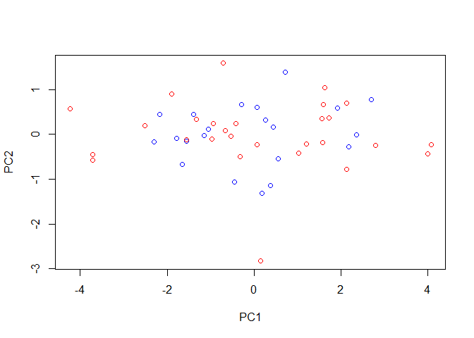

## Introduction

The survival of sparrows affected by a severe storm was investigated using a historic data set. Five morphological variables such as length and wingspan were measured and for each bird it is known if it died shortly after the storm or survived. Principal Component Analysis (PCA) was applied to these data to gain insight what distinguishes survivors and non-survivors.

A matrix plot of the data is shown below:

```r
females<-read.csv("sparrows_female.csv")
plot(subset(females, select=-survive), 
     col=ifelse(females$survive==0, "red", "blue"))
```

<!-- -->

## Methods

Principal Component Analysis (PCA) transforms a data set consisting of correlated variables to uncorrelated variables. The uncorrelated variables are linear combinations of the original correlated variables. In R, PCA is implemented via the prcomp command


```r
females.pca <- prcomp(subset(females, select=-survive), 
                    center = TRUE, scale = TRUE)
```

## Results

We obtain the following principal components along with their standard deviations:

```r
print(females.pca)
```

```
## Standard deviations (1, .., p=5):
## [1] 1.9015726 0.7290433 0.6216306 0.5491498 0.4056199
## 
## Rotation (n x k) = (5 x 5):
##              PC1         PC2        PC3         PC4        PC5
## length 0.4517989 -0.05072137  0.6904702 -0.42041399  0.3739091
## alar   0.4616809  0.29956355  0.3405484  0.54786307 -0.5300805
## lbh    0.4505416  0.32457242 -0.4544927 -0.60629605 -0.3427923
## lhum   0.4707389  0.18468403 -0.4109350  0.38827811  0.6516665
## lkeel  0.3976754 -0.87648935 -0.1784558  0.06887199 -0.1924341
```

We observe that the first two PCs already explain more than 80% of the total variance.

```r
summary(females.pca)
```

```
## Importance of components:
##                           PC1    PC2     PC3     PC4     PC5
## Standard deviation     1.9016 0.7290 0.62163 0.54915 0.40562
## Proportion of Variance 0.7232 0.1063 0.07728 0.06031 0.03291
## Cumulative Proportion  0.7232 0.8295 0.90678 0.96709 1.00000
```
We now plot the scores on the first two PCs:

```r
# plot(females.pca$x[,1], females.pca$x[,2],col=ifelse(females$survive==1,"blue","red"))
plot(females.pca$x[,1:2],col=ifelse(females$survive==1,"blue","red"))
```

<!-- -->

We cannot identify clear clusters. But the non-survivors seem to have a more wide-spread distribution, in particular on the first principal component. We will visualise this by adding a covariance ellipse. 


```r
females.pca.cov<-diag(females.pca$sdev[1:2]^2)
females.pca.cov
```

```
##          [,1]      [,2]
## [1,] 3.615978 0.0000000
## [2,] 0.000000 0.5315041
```
The covariance ellipse is now added to the scatter plot of the principal component scores.

```r
source("covEllipse.r")
plot(females.pca$x[,1:2],col=ifelse(females$survive==1,"blue","red"))
covEllipse<-calculateCovEllipse(S=females.pca.cov, scale=1.79)
lines(covEllipse)
```

<!-- -->

It clearly shows that the majority of samples outside the covariance ellipse are non-survivors. Non-survivors either seem to have high or low scores on the first PC.

## Discussion

The first PC gives approximately equal weight to all variables. This means that large birds with high values for all variables will score high whereas small birds with low values for all variables will score low on this PC. This shows that this PC measures overall body size.

```r
females.pca$rotation[,1]
```

```
##    length      alar       lbh      lhum     lkeel 
## 0.4517989 0.4616809 0.4505416 0.4707389 0.3976754
```
We have found that the non-survivors show a larger range on the first PC - among the birds that died are both very small and very large birds. This indicates that natural selection favours individuals that do not deviate too much from the mean.
