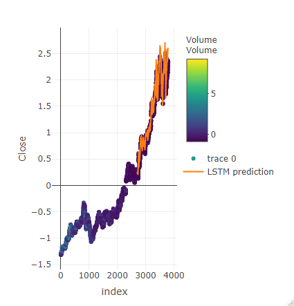
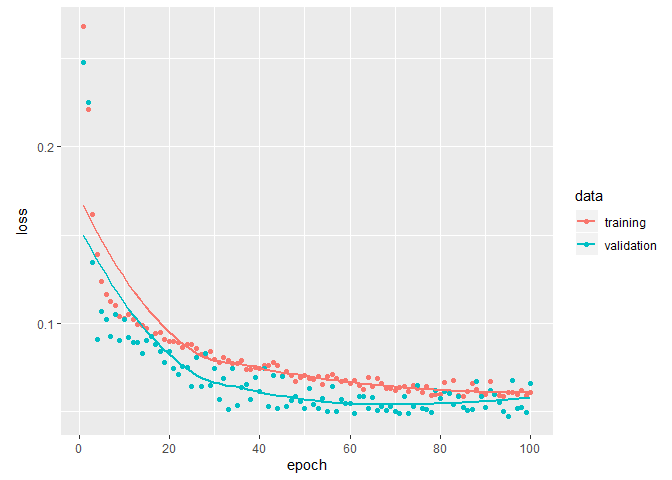

## Imports


```r
library(keras)
library(tensorflow)
library(tidyverse)
```

```
## Warning: package 'tidyverse' was built under R version 3.6.2
```

```
## -- Attaching packages -------------------------------------------------------------------- tidyverse 1.3.0 --
```

```
## v ggplot2 3.2.1     v purrr   0.3.3
## v tibble  2.1.3     v dplyr   0.8.3
## v tidyr   1.0.0     v stringr 1.4.0
## v readr   1.3.1     v forcats 0.4.0
```

```
## -- Conflicts ----------------------------------------------------------------------- tidyverse_conflicts() --
## x dplyr::filter() masks stats::filter()
## x dplyr::lag()    masks stats::lag()
```

```r
library(quantmod)
```

```
## Warning: package 'quantmod' was built under R version 3.6.2
```

```
## Loading required package: xts
```

```
## Loading required package: zoo
```

```
## 
## Attaching package: 'zoo'
```

```
## The following objects are masked from 'package:base':
## 
##     as.Date, as.Date.numeric
```

```
## Registered S3 method overwritten by 'xts':
##   method     from
##   as.zoo.xts zoo
```

```
## 
## Attaching package: 'xts'
```

```
## The following objects are masked from 'package:dplyr':
## 
##     first, last
```

```
## Loading required package: TTR
```

```
## Registered S3 method overwritten by 'quantmod':
##   method            from
##   as.zoo.data.frame zoo
```

```
## Version 0.4-0 included new data defaults. See ?getSymbols.
```

```r
library(plotly)
```

```
## 
## Attaching package: 'plotly'
```

```
## The following object is masked from 'package:ggplot2':
## 
##     last_plot
```

```
## The following object is masked from 'package:stats':
## 
##     filter
```

```
## The following object is masked from 'package:graphics':
## 
##     layout
```

```r
library(Metrics)
```

```
## Warning: package 'Metrics' was built under R version 3.6.2
```

```r
getSymbols("GOOG")
```

```
## 'getSymbols' currently uses auto.assign=TRUE by default, but will
## use auto.assign=FALSE in 0.5-0. You will still be able to use
## 'loadSymbols' to automatically load data. getOption("getSymbols.env")
## and getOption("getSymbols.auto.assign") will still be checked for
## alternate defaults.
## 
## This message is shown once per session and may be disabled by setting 
## options("getSymbols.warning4.0"=FALSE). See ?getSymbols for details.
```

```
## [1] "GOOG"
```

```r
head(GOOG)
```

```
##            GOOG.Open GOOG.High GOOG.Low GOOG.Close GOOG.Volume GOOG.Adjusted
## 2007-01-03  232.1299  237.4400 229.6940   232.9220    15470700      232.9220
## 2007-01-04  233.6243  241.0714 233.3005   240.7277    15834200      240.7277
## 2007-01-05  240.3491  242.8398 238.1623   242.6853    13795600      242.6853
## 2007-01-08  242.9344  244.0204 240.1997   240.8871     9544400      240.8871
## 2007-01-09  241.8186  243.2134 239.7015   241.8435    10803000      241.8435
## 2007-01-10  241.3105  245.8535 240.1200   243.8161    11981700      243.8161
```

```r
data<-read.csv("GOOG.csv")
```

## Plots


<!-- --><!-- -->
## Standardisation of the data

```r
msd.open = c(mean(myts$Open), sd(myts$Open))
msd.low = c(mean(myts$Low), sd(myts$Low))
msd.close = c(mean(myts$Close), sd(myts$Close))
msd.high = c(mean(myts$High), sd(myts$High))
msd.vol = c(mean(myts$Volume), sd(myts$Volume))

myts$Close = (myts$Close - msd.close[1])/msd.close[2]
myts$Volume = (myts$Volume - msd.vol[1])/msd.vol[2]
myts$High = (myts$High-msd.high[1])/msd.high[2]
myts$Open=(myts$Open-msd.open[1])/msd.open[2]
myts$Low=(myts$Low-msd.low[1])/msd.low[2]
```
# Data preparation

```r
datalags = 10
train = myts[seq(2700 + datalags), ]
test = myts[2700 + datalags + seq(1100 + datalags), ]
batch.size = 50

x.train = array(data = lag(cbind(train$Close, train$Volume,train$High,train$Open,train$Low), datalags)[-(1:datalags), ], dim = c(nrow(train) - datalags,
                                                                                                                                 datalags, 5))
y.train = array(data = train$Close[-(1:datalags)], dim = c(nrow(train)-datalags, 1))


x.test = array(data = lag(cbind(test$Volume, test$Close, test$High,test$Open,test$Low),datalags)[-(1:datalags), ], dim = c(nrow(test) - datalags, datalags, 5))

y.test = array(data = test$Close[-(1:datalags)], dim = c(nrow(test) - datalags, 1))
```
#Model 

```r
model <- keras_model_sequential()

model %>%
  layer_lstm(units = 100,
             input_shape = c(datalags, 5),
             batch_size = batch.size,
             return_sequences = TRUE) %>%
  layer_dropout(rate = 0.5) %>%
  layer_lstm(units = 50,
             return_sequences = FALSE) %>%
  layer_dropout(rate = 0.5) %>%
  layer_dense(units = 1)
model %>%
  compile(loss = 'mae', optimizer = 'adam', validation_split="0.1")

model
```

```
## Model
## Model: "sequential"
## ________________________________________________________________________________
## Layer (type)                        Output Shape                    Param #     
## ================================================================================
## lstm (LSTM)                         (50, 10, 100)                   42400       
## ________________________________________________________________________________
## dropout (Dropout)                   (50, 10, 100)                   0           
## ________________________________________________________________________________
## lstm_1 (LSTM)                       (50, 50)                        30200       
## ________________________________________________________________________________
## dropout_1 (Dropout)                 (50, 50)                        0           
## ________________________________________________________________________________
## dense (Dense)                       (50, 1)                         51          
## ================================================================================
## Total params: 72,651
## Trainable params: 72,651
## Non-trainable params: 0
## ________________________________________________________________________________
```

```r
{
 history<- model %>% fit(x = x.train,
                y = y.train,
                batch_size = batch.size,
                repeats = 10,
                epochs = 100,
                verbose = 1,
                validation_split = 0.1,
                shuffle = FALSE)
}
```


```r

```

<!-- -->

```r
pred_out <- model %>% predict(x.test, batch_size = batch.size) %>% .[,1]

myts$index <- 1:nrow(myts) 

tsactual<-data[c(2701:3790),c(5)]

#plot_ly(myts, x = ~index, y = ~Close, type = "scatter", mode = "markers", color = ~Volume) %>%
 # add_trace(y = c(rep(NA, 2700), pred_out), x = myts$index, name = "LSTM prediction", mode = "lines")
  
plot(history)
```

<!-- -->

```r
yhat<- pred_out[c(0:1090)]*msd.close[2]+msd.close[1]
Testerror<-rmse(tsactual,yhat)
Testerror
```

```
## [1] 65.87295
```
